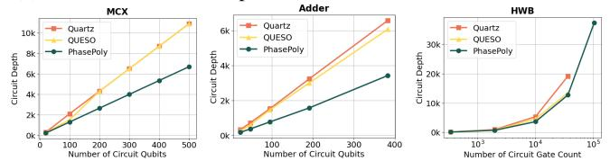
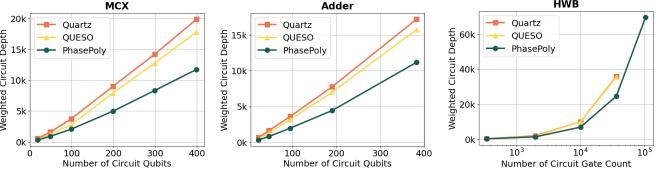

# *E. Q4: Hardware-Level Execution Improvements*

On near-term hardware, execution quality is often limited by (i) circuit depth (accumulated error) and (ii) constrained connectivity, where non-local two-qubit interactions introduce routing overhead (SWAPs). Therefore, gate-count reductions must be validated against depth and physical circuit metrics.

Logical depth. Fig. [15\(](#page-9-1)a) reports normalized logical circuit depth (excluding small-size circuits for readability). On average, Quartz reduces depth by 13.26%, QUESO by 19.64%, and *PhasePoly* achieves the largest reduction of 22.47%, corresponding to a 1.14–1.69× improvement. The gap widens on large circuit families in Fig. [15\(](#page-9-1)b), where Quartz reduces depth by 4.03%, QUESO by 14.45%, and *PhasePoly* by 40.91%, corresponding to a 2.83–10.15× improvement.

(a) Normalized circuit depth reductions across benchmark circuits.

(b) Normalized circuit depth reductions for MCX, Adder, and HWB circuit families. The HWB x-axis is shown in log scale.

Fig. 15: Normalized logical circuit depth reductions across benchmark circuits and three large circuit families.

Hardware mapping under limited connectivity. To test whether logical improvements persist after routing, we map optimized circuits to 2D planar coupling graphs (square grids) and perform routing using Qiskit SABRE [\[6\]](#page-13-5), [\[43\]](#page-14-0), [\[44\]](#page-14-1). We report (i) *weighted two-qubit* gate count and (ii) *physical circuit depth*, where each SWAP is weighted as three CNOTs.

Fig. [16\(](#page-10-0)a) shows that, across benchmark circuits, on average, Quartz reduces physical circuit depth by 15.23%, QUESO by 21.60%, while *PhasePoly* achieves the largest reductions of 28.35%, corresponding to a 1.31–1.86× improvement in physical circuit depth. On large circuit families (Fig. [16\(](#page-10-0)b)), the advantage becomes stronger: Quartz reduces physical depth by 2.7%, QUESO by 15.25%, and *PhasePoly* by 40.84%, corresponding to a 2.68–15.13× improvement.

Why hardware mapping can amplify circuit optimization gains (and when it does not). In many cases, *PhasePoly*'s logical reductions *amplify* after mapping (e.g., depth reductions of 22.47% become 28.35% in physical circuits), because fewer two-qubit interactions lead to fewer SWAPs. Crossblock optimization further helps by reusing parity structures across phase-polynomial blocks, reducing repeated reconstruc-

(a) Normalized weighted two-qubit gate count and physical circuit depth across benchmark circuits.

(b) Weighted physical circuit depth for MCX, Adder, and HWB circuit families. The HWB x-axis is shown in log scale.

Fig. 16: Reductions in weighted physical circuit 2-qubit gatecount and depth after hardware mapping.

tion of multi-qubit interactions. *PhasePoly* matches or outperforms Quartz and QUESO on most benchmarks. However, for qaoa\_n10\_p4, CNOT count decreases by ∼3% but depth increases by ∼20% due to gate-count optimization, potentially reducing parallelism. For QAOA-type circuits, domain-specific hardware mappers [\[45\]](#page-14-2), [\[46\]](#page-14-3) exist and exploit commuting flexibilities unique to QAOA circuits. We expect that the domain-specific hardware mappers may further reduce gate counts on top of already optimized logical circuits.

For circuits that are already topology-friendly (e.g., gf2ˆ4\_mult, gf2ˆ5\_mult), routing overhead can dominate and offset logical gate-count gains (all optimized circuits have worse physical performance than original circuits). Overall, for the majority of cases, as circuits scale, *PhasePoly*'s reductions translate reliably into better physical circuit depth and two-qubit gate cost.

Q4 Summary: *PhasePoly* reduces not only gate counts but also logical depth. Under constrained connectivity, these gains persist—and often amplify—after routing, yielding substantial reductions in depth and two-qubit gate cost, especially for large circuits.

