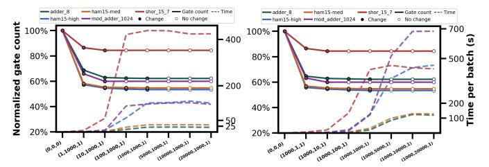

# H. Q7: Compilation Cost and Parameter Sensitivity

*PhasePoly* expands the optimization space beyond greedy phase-parity synthesis by jointly optimizing phase and output parities and enabling cross-block merging. We therefore evaluate two practical questions: how quickly it converges, and how sensitive it is to the search parameters.

**Compilation time.** Fig. 19 shows optimization progress under increasing runtime budgets using a deliberate overoptimization *Incremental Block Merging* strategy. *PhasePoly* reaches 32.37% average gate reduction within 1,200 s, and 86.21% of benchmarks stabilize by 1,562 s. Reductions further improve to 33.35% at 2,400 s and converge around 34.69% by 3,600 s. The slowest case, ham15-high, finishes in 5,025 s, still below the 7,200 s budget used for search-based subcircuit rewriting, while achieving substantially larger reductions.

Fig. 19: Optimization progress of *PhasePoly* over time. Average reduction reaches 32.37% at 1,200 s and converges near 34.7% by 3,600–4,800 s.

**Parameter sensitivity.** We evaluate the sensitivity of *Phase-Poly*'s search parameters to: (1) priority-queue bound Q, (2) solution-pool size P, and (3) cross-block group size G. We denote settings as (Q, P, G) and test the five largest circuits in our benchmark suite (12–28 qubits, 900–36,598 gates).

**Queue/pool sizes: diminishing returns.** With cross-block disabled (G=1), we vary Q and P from 1 to 20,000 separately.

Fig. 20: Sensitivity to Q and P with G=1 (no cross-block optimization). Each x-tick is (Q, P, G). Left y-axis: normalized gate count; right y-axis: time needed (seconds). Solid: normalized reduction; dashed: runtime. Filled markers: improved quality; hollow markers: no change. Quality improves initially, then quickly saturates, while runtime continues to increase, especially with larger P.

(i) When Q is fixed at 1000, increasing P improves quality only up to a moderate bound (P ∈ [100, 1000]), after which reductions plateau while runtime increases (Fig. [20](#page-12-0) right). Similarly, with P=1000, quality also saturates at Q ∈ [100, 1000] (Fig. [20](#page-12-0) left). After that, although we increase the queue size to 20,000, the runtime grows slowly, which indicates that moderate settings (Q ∈ [100, 1000]) are sufficient to reliably discover the top ∼ 1000 candidate solutions without requiring a larger search space.

Joint parameter scaling and feasibility under crossblock optimization. Jointly scaling (Q, P, G) confirms the same robustness trend. Fig. [21](#page-12-1) shows representative results for G ∈ {3, 7}; results for G ∈ {1, 5} follow the same pattern and are omitted for readability. Across all group sizes, reductions saturate near Q=P=1000, while larger bounds provide only marginal quality improvement at substantially higher runtime. For example, increasing the solution pool from 1,000 to 20,000 increases runtime by nearly 20× but yields only marginal additional reductions for ham15-high and mod\_adder\_1024 across different group-size settings. When the bounds are extremely tight (Q=P=1), the bounded search may discard states needed to satisfy the rank-based correctness constraints, causing rare optimization failures; we observed this for ham15-med with G ∈ {5, 7}.

Q7 Summary: *PhasePoly* converges under moderate runtime budgets even under a deliberate over-optimization incremental block merging strategy. It is also robust to search parameters: moderate bounds (Q=P=1000) consistently achieve near-optimal reductions, while larger search spaces mainly increase compilation time with diminishing returns.

