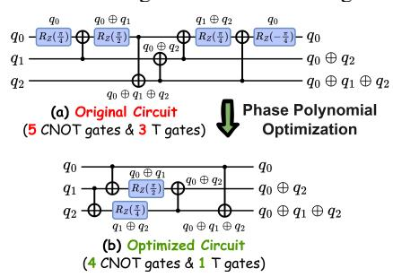

# Our contributions are summarized as follows:

- *Systematic revisiting of phase polynomials:* We provide the first systematic investigation of phase polynomials in general circuit optimization, establishing their necessity as a standalone optimization pass.
- *Holistic phase polynomial optimization:* We introduce a framework that jointly optimizes the phase rotation and output basis transformation. Combined with cross-block optimization, it overcomes single-block limitations and enables substantially stronger results.
- *Extensibility and scalability:* Unlike fixed-size subcircuit rewriting methods, our approach scales naturally to large circuits and demonstrates strong extensibility across diverse benchmarks. Our approach delivers significant reductions in total gate count (up to 50.00%, average 34.70%), CNOT gates (up to 48.57%, average 26.83%).
- *Orthogonality: PhasePoly* is orthogonal to subcircuit rewriting. While rewriting may perform comparably or better on small circuits, our approach scales more effectively and uncovers additional improvement (up to 13% for already highly optimized circuits). Together, they close both short- and long-range optimization gaps.

#### II. BACKGROUND AND KEY INSIGHTS

A quantum circuit is a sequence of quantum gates acting on an n-qubit system. The computational basis states are written as  $|x\rangle$  with  $x\in\mathbb{F}_2^n$ , which is a binary vector. A CNOT acting on control x and target y maps  $|x,y\rangle$  to  $|x,x\oplus y\rangle$ . An example in Fig. 2 illustrates how CNOTs update parities and how  $R_z$  gates must track the XOR sums to preserve the correct output basis. The transformed circuit is functionally equivalent to the original while eliminating 1 CNOT and 2 T gates.

Fig. 2: Phase polynomial optimization example: (a) and (b) are functionally equivalent; however, (a) uses 5 CNOTs and 3 T gates, whereas (b) uses 4 CNOTs and 1 T gate.

A phase-polynomial circuit is a circuit region composed solely of  $\{CNOT, R_z\}$  gates. Such regions are not universal for general quantum circuits. In a general circuit, the appearance of non-phase-polynomial gates (e.g., H gates) changes the computational basis and therefore terminates the region. We define a phase-polynomial block as a maximal contiguous subcircuit containing only  $\{CNOT, R_z\}$  gates in general circuits. Formally, one can represent a phase polynomial circuit in a sum-over-paths form [9]–[11] such that

$$U|x_1,\dots,x_n\rangle = e^{ip(x_1,\dots,x_n)}|g(x_1,\dots,x_n)\rangle \tag{1}$$

where p(x) is a Boolean polynomial over XOR parities with phase coefficients, and g(x) is an affine reversible transformation implemented by a CNOT network.

$$p(x_1, \dots, x_n) = \sum_{y \in \{0,1\}^n} \theta_i \left( x_1 y_1 \oplus \dots \oplus x_n y_n \right) \quad (2)$$

In Fig. 2(a), the phase function can be written as a weighted sum of parity terms:  $p(q_0,q_1,q_2)=\frac{\pi}{4}q_0+\frac{\pi}{2}(q_0\oplus q_1)+\frac{\pi}{4}(q_1\oplus q_2)+\frac{\pi\pi}{4}q_0=\frac{\pi}{2}(q_0\oplus q_1)+\frac{\pi}{4}(q_1\oplus q_2)$ . Each term corresponds to a phase rotation conditioned on a parity of input variables. In general, a **phase-parity** is the XOR of a subset of input qubits, and a **phase-parity function** p(x) is a linear combination of such parities with rotation angles. At the circuit level, these parities are constructed using CNOT gates and realized by applying  $R_z(\theta)$  rotations on the corresponding qubit lines; we refer to this structure as the **phase-parity network**.

The function g(x) represents the **output basis transformation**, a linear reversible mapping of computational basis states implemented by a CNOT network. For example, in Fig. 2(a),  $g(q_0,q_1,q_2)=(q_0,\ q_0\oplus q_2,\ q_0\oplus q_1\oplus q_2)$ . Each output is a parity of the input qubits. We call these parities **output parities**, and the corresponding CNOT circuit implementing this linear transformation the **output-parity network**.

Fig. 3: Two circuits that both implement the p function using the same minimal gate count, but result in different costs for the g function. (a) uses one fewer CNOT than (b).

#### A. Single-block Optimization: One Stone Two Birds

The phase function p—capturing phase parities—has been extensively studied in the context of phase polynomial optimization [9], [10], [15]. In contrast, the output transformation g—capturing output parities—is typically studied in a different context, namely linear reversible circuit synthesis [30], [31]. No prior work has come up with a way to unify these two problems into one model; they have addressed these two problems separately and solved them one after another.

However, such separate handling may miss co-optimization opportunities. This is because the CNOT network synthesis for the phase parity function affects the parity state of each qubit, which is subsequently used as input to the output parity component—the g function. Thus, implementations that achieve the minimal gate count for the phase parity function may not minimize the gate count for the output parity function.

We show such an example in Fig. 3 where two circuits implement the phase-parity (p) function with the same minimal cost—both using only 2 CNOTs in (a) and (b). However, they lead to different CNOT costs in the basis transformation (g) function—one using two and the other using three. Thus, even if the phase-parity network is individually minimal, ignoring its interaction with the output-parity network leads to nonminimal overall CNOT overhead. In this paper, we unify these two problems into one, in order to capture their correlation. For the example in Fig. 3, our framework is able to find the overall minimal transformation cost in (a). The details of the co-optimization are in Section III-A.

