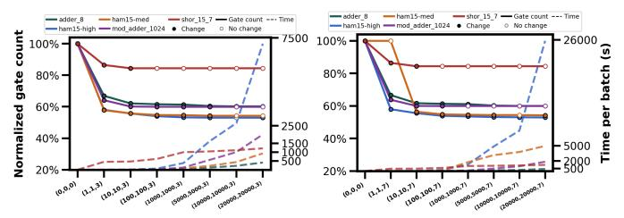

# V. RELATED WORK

*Manual Rule-based Optimization.* Many optimizers rely on manually written, equivalence-preserving rewrite rules [\[6\]](#page-13-5)– [\[8\]](#page-13-7), [\[58\]](#page-14-15). To ensure correctness, verification-oriented compilers and optimizers have been developed [\[12\]](#page-13-11), [\[39\]](#page-13-37), [\[57\]](#page-14-14), [\[59\]](#page-14-16)–[\[61\]](#page-14-17), guaranteeing each applied rule is equivalence-preserving. *Search-Based Subcircuit Rewriting.* Many optimizers rely on rule-based *subcircuit rewriting*, where small patterns are matched and replaced. Systems such as Quanto [\[62\]](#page-14-18),

Fig. 21: Joint scaling of (Q, P, G) for G ∈ {3, 7}. Reductions saturate at moderate bounds (e.g., Q=P=1000), while runtime grows rapidly for larger bounds. Extremely tight bounds can miss feasible cross-block solutions in rare cases. When G ∈ {1, 5}, the trend is also consistent.

Quartz [\[17\]](#page-13-15), and QUESO [\[18\]](#page-13-25) generate such rules automatically and apply them through global search, but their patterns are usually limited to small 3-qubit/6-gate regions, restricting long-range improvements. Reinforcement-learning approaches [\[42\]](#page-13-40), [\[63\]](#page-14-19), [\[64\]](#page-14-20) explore larger spaces but still depend on fixed rule sets and require costly pretraining.

*Phase Polynomial Optimization.* Prior work typically optimizes only the *phase-parity* network [\[10\]](#page-13-9), [\[14\]](#page-13-13), [\[15\]](#page-13-27), [\[65\]](#page-14-21), leaving the output-parity network to other passes. Nam *et al*. [\[11\]](#page-13-10) consider both but focus on random floating and merging of rotation gates. Other phase polynomial methods [\[9\]](#page-13-8), [\[19\]](#page-13-16), [\[66\]](#page-14-22)–[\[68\]](#page-14-23) mainly target T-count (often combined with higher-level techniques such as tensor-rank decomposition) rather than full CNOT/Rz optimization.

*Unitary Synthesis and Hamiltonian Decomposition.* Unitarysynthesis approaches [\[69\]](#page-14-24)–[\[77\]](#page-14-25) optimize programs by synthesizing circuits for target unitaries. However, they often rely on approximate equivalence, requiring explicit error budgeting, and their scalability is limited. Domain-specific decompositions, such as those for Hamiltonian simulation [\[78\]](#page-14-26)–[\[83\]](#page-15-0), achieve application- and hardware-driven improvements rather than general-purpose, exactly equivalent circuit optimization.

