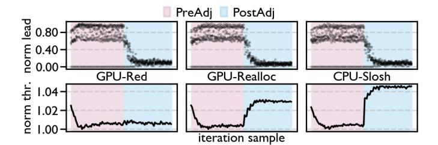
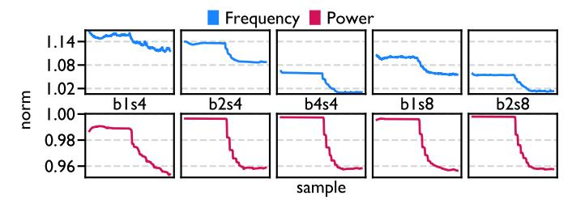

# 2 foreach GPU q do

-  $P'[g] \leftarrow P[g] + I[g];$
- 4 node power  $\leftarrow$  node power + P'[q];
- 5  $gpu\_delta\_max \leftarrow \lceil (node\_power - P_n)/G \rceil;$
- $6 gpu\_delta ← 0;$
- 7 foreach GPU g do
- 8  $P'[g] \leftarrow P'[g] - gpu\_delta\_max;$
- gpu\_delta  $\leftarrow \max(gpu\_delta, P'[g] TDP);$
- 10 foreach GPU g do
- 11  $P'[g] \leftarrow P'[g] - gpu\_delta;$
- 12 return P';

TABLE II: Evaluation knobs.

| Category                | Knob                        | Values                           | Default      |  |
|-------------------------|-----------------------------|----------------------------------|--------------|--|
| Hardware                | Node                        | 0, 1                             | 1            |  |
| Workload                | Model                       | Llama 3.1 8B, Mistral 7B v0.1 | Llama 3.1 8B |  |
| and framework        | FSDP                        | v1, v2                           | v2           |  |
|                         | Precision 3      | bf16, fp8                        | bf16         |  |
| Configuration           | Batch size, sequence length | b1s4, b2s4, b4s4 b1s8, b2s8   | b2s4         |  |
| Baseline calibration    | Iterations                  | 1000                             | 1000         |  |
|                         | Sampling period             | 4, 7, 10                         | 10           |  |
|                         | Warm-up                     | 3, 6, 12, 25, 50                 | 50           |  |
| Straggler detection  | Window size                 | 1, 2, 3, 5                       | 3            |  |
|                         | Aggregation                 | max, last, sum                   | sum          |  |
|                         | Max adjustment              | 5, 10, 15, 30                    | 15           |  |
| Straggler mitigation | Scale                       | global, local                    | global       |  |
|                         | Power caps 4     | 700, 650, 600, 550, 500       | 700          |  |
|                         | Power budget 5   | 10, 20, 30, 50                   | 20           |  |

&lt;sup>3 FSDPv1 is used for compatibility with Transformer Engine.

and sequence length 4k are selected as default, since it is representative in terms of performance and power response to our solution, and also allows collecting traces faster.

**Baseline calibration.** Obtaining an accurate baseline is crucial to accurately measure performance and power improvements. The iteration defines the length of an experiment, and needs to be long enough to reach convergence. The sampling period defines the interval between sampling an iteration. Finally, warm-up defines how many samples should be taken before

(a) Aggregated lead values and throughput of b2s4 for all use cases. The aggregated lead value uses summation per GPU. Throughput is calculated using the sum of kernel duration. The x-axes are sampled iterations. The y-axes are normalized to the maximum lead and minimum throughput per use case.

(b) Total power of b2s4 for all use cases. The x-axes are samples of frequency and power. The y-axes are the average frequency and power across GPUs, normalized to the min and max per use case. Tuning begins halfway.

Fig. 9: Visualization of the convergence process for all use cases using default settings from Table II.

making adjustments to power.

Straggler detection. The aggregation uses a "straggler wave" from Figure 6 to detect stragglers and leaders. Max takes the largest lead value, last takes the final lead value, and sum is the "area under the curve" or sum of lead values for each GPU. We choose sum as the default for Algorithm 1 because it still penalizes GPUs while they are in equilibrium. In theory, this helps to identify leaders in the presence of multiplicative C3 interference. In practice, max, last, or sum all converge to the expected outcome. The window size defines how many sample aggregations should be averaged together before adjusting power.

**Straggler mitigation.** Max adjustment is the user-defined max power increase value used in Algorithm 2. Using a large max adjustment speeds up convergence at the risk of overshooting stable power caps. Using a global scale adjusts power less as convergence is approached by tracking the largest lead seen. A local scale will always use the max adjustment which can speed up convergence at the cost of variation.

## VII. EVALUATION

In this section, we evaluate the benefits and behavior of our straggler detection and mitigation strategies.

#### A. Overall Comparison across Use Cases

Figure 9 visualizes each use case dynamically.

&lt;sup>4 Only for GPU-Realloc and CPU-Slosh.

&lt;sup>5 Only for CPU-Slosh.

**GPU-Red.** Reducing power on leaders results in almost no throughput change and reduces lead post adjustment in Figure 9a. Average power decreases by 4%, proportionally to average frequency as shown in Figure 9b.

**GPU-Realloc.** Reallocating power to stragglers results in a throughput improvement of 3%, and reduces lead in Figure 9a. This throughput increase is accomplished without raising average power as shown in Figure 9b. Additionally, the average frequency decreases as a result of allocating more power to thermally inefficient GPUs.

**CPU-Slosh.** Sloshing enables reallocating extra power to stragglers, which results in a throughput improvement of 4%, and minimizing lead in Figure 9a. However, this is a result of allocating 3% more power to the GPUs as shown in Figure 9b.

Comparison. Between the three use cases, GPU-Red provides the greatest benefit of a 4% power reduction. GPU-Realloc increases throughput by 3% without increasing power consumption. Finally, CPU-Slosh marginally improves throughput compared to GPU-Realloc by 4%, while consuming 3% more power. The trend is that allocating more power to stragglers has diminishing returns. However, considering the node level power is maintained, this approach also does not increase power consumption in datacenters.

Performance and Power Models. We compare measured results to predicted results in Table III using our performance and power models from Section IV-A and IV-B. For aligning GPUs with Equation 2, we use min, med, and max as our agg function for GPU-Red, GPU-Realloc, and CPU-Slosh respectively. The predicted power is accurate, with 1% error at most. While the predicted throughput is  $2\times$  larger than measured throughput, it captures the trend of diminishing returns of allocating more power to stragglers, going from GPU-Realloc to CPU-Slosh. Finer-grained modeling by removing some of our assumptions could potentially close the gap.

**Takeaway.** The *Lit Silicon* effect can be tackled by allocating more power to stragglers, but we see diminishing returns as the amount of power reallocated grows from GPU-Red to GPU-Realloc to CPU-Slosh.

| Scenario    | Power     |          | Throughput |          |
|-------------|-----------|----------|------------|----------|
|             | Predicted | Measured | Predicted  | Measured |
| GPU-Red     | 1.05      | 1.04     | 1.00       | 1.00     |
| GPU-Realloc | 1.00      | 1.00     | 1.06       | 1.03     |
| CPU-Slosh   | 0.97      | 0.97     | 1.10       | 1.04     |

TABLE III: Predicted benefit for different use cases using default settings in Table II.

## B. Sensitivity Study

In this section, we sweep values in Table II to determine their impact on power and throughput.

**GPU-Red.** Figure 10 shows a power reduction of 4% is achieved across all configurations. While the average fre-

Fig. 10: Measured frequency and power for different configurations of GPU-Red normalized to the minimum and maximum respectively of all configurations. A rolling window extracts the 5th and 95th quantile of 2000 samples for frequency and power respectively. Tuning begins halfway.

Fig. 11: Different warm-up periods swept. Baseline is the default settings for GPU-Realloc with no power capping.

Fig. 12: Final power caps set for different scenarios and initial power caps. Default settings from Table II are used.

quency varies across configurations, they all decrease proportionally with power. This demonstrates that *Lit Silicon* is present to the same degree across different configurations. Indeed, Figure 13 demonstrates consistent power savings with maintained throughput across nearly all knobs. However, there are a few exceptions. Node 0 has more stragglers than node 1, illustrated in Figure 7, and cannot reduce power on as many leaders as node 1. Additionally, some knobs with worse convergence (e.g., max adj. 5) achieved worse power reduction. In this case, power reduction was limited by the length of the experiment. Given more iterations, their power reduction would match other knobs.

**GPU-Realloc.** A throughput improvement between 2.5% and 3.5% is achieved across nearly all knobs in Figure 14. However, we observe lower throughput improvement on node 0 due to having fewer leaders to take power from, similar to worse power improvement in GPU-Red. Additionally, a power cap of 500W has lower throughput improvement. This power

cap has significantly worse variation than other configurations, indicating volatility when running at some power caps. Finally, Figure [11](#page-9-2) illustrates that throughput converges to similar values regardless of warm-up length, confirming that power adjustments should be made immediately.

CPU-Slosh. Figure [15](#page-11-2) shows a consistent throughput improvement of 4% across all knobs, up to 6% for a power cap of 550W. Additionally, we observe that after a power budget of 20W, no more power is consumed by the GPUs. This is the case where the system has reached peak throughput, and is reducing power to maintain it like GPU-Red.

Takeaway. We observed minor differences across different knobs in Figures [13,](#page-11-0) [14,](#page-11-1) and [15.](#page-11-2) The most influential variable was the initial power cap used. Despite this, the final powercaps set for different initial power caps have a very similar distribution as shown in Figure [12.](#page-9-3) This demonstrates that after a converged power distribution has been determined, it can be re-used for different frameworks, models, power-caps, and other knobs in Table [II.](#page-8-1) Re-usability is critical for a datacenter with dynamic node-level power caps, and diverse workloads.

