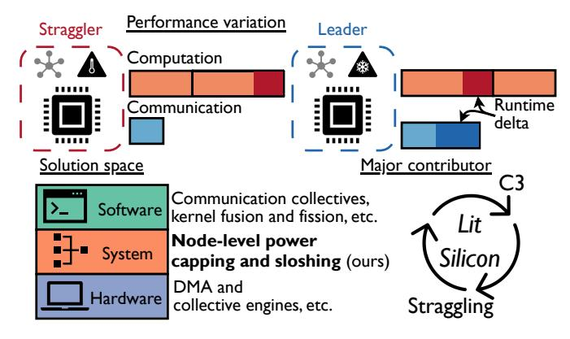
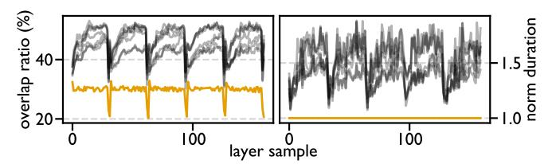
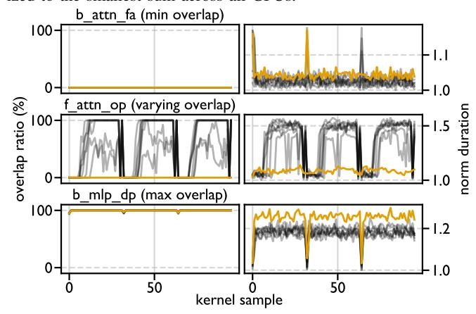
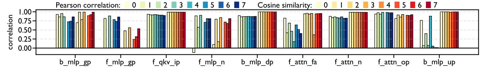
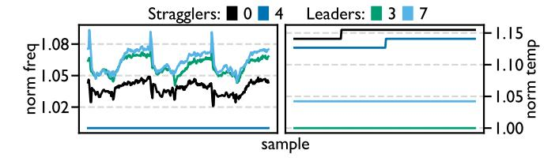
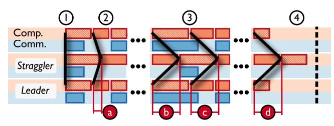

# *Lit Silicon*: A Case Where Thermal Imbalance Couples Concurrent Execution in Multiple GPUs

Marco Kurzynski *University of Central Florida* Orlando, Florida marco.kurzynski@ucf.edu

Shaizeen Aga *Advanced Micro Devices, Inc.* Santa Clara, California shaizeen.aga@amd.com

Di Wu *University of Central Florida* Orlando, Florida di.wu@ucf.edu

*Abstract*—GPU systems are increasingly powering modern datacenters at scale. Despite being highly performant, GPU systems can exhibit performance variation at the node and cluster levels. Such performance variation can significantly impact both highperformance computing and artificial intelligence workloads, such as cutting-edge large language models (LLMs). In this work, we analyze the performance of a single-node multi-GPU system running LLM training, and observe that the kernel-level performance variation is highly correlated with concurrent computation and communication (C3), a technique to overlap computation and communication across GPUs for performance gains. We then take a further step to reason that thermally induced straggling coupled with C3 impacts performance variation, which we coin the *Lit Silicon* effect. More specifically, *Lit Silicon* describes that in a multi-GPU node, thermal imbalance across GPUs can introduce node-level straggler GPUs (hotter and slower), which in turn slow down the leader GPUs (cooler and faster). *Lit Silicon* can lead to node-level performance variation and inefficiency, potentially impacting the entire datacenter.

We propose analytical performance and power models for *Lit Silicon*, to understand the potential system-level gains. We further design simple detection and mitigation techniques to effectively address the *Lit Silicon* problem, and evaluate three different power management solutions, including (1) power optimization under GPU thermal design power, (2) performance optimization under node-level GPU power capping, and (3) performance optimization under node-level CPU power sloshing. We conduct experiments on two workloads on two AMD Instinct™ MI300X GPU systems under two LLM training frameworks, and observe up to 6% performance and 4% power improvements, potentially saving several tens of millions of dollars in electricity costs in datacenters. Our solution consists of approximately 200 lines of PyTorch code, requires no GPU kernel modifications, and can be deployed in datacenters as a new node-level power management layer. Our code is available on GitHub: [https:](https://github.com/UnaryLab/lit_silicon_tuning_amd) [//github.com/UnaryLab/lit](https://github.com/UnaryLab/lit_silicon_tuning_amd) silicon tuning amd.

## I. INTRODUCTION

Due to massively parallel computing capability, GPU systems are gaining wider adoption in modern datacenters to handle compute intensive workloads, either traditional highperformance computing (HPC) workloads (database [\[4\]](#page-13-0), [\[6\]](#page-13-1), scientific computing [\[14\]](#page-13-2), [\[60\]](#page-15-0), etc.), or emerging artificial intelligence (AI) workloads (recommendation systems [\[65\]](#page-15-1), [\[69\]](#page-15-2), content generation [\[5\]](#page-13-3), [\[21\]](#page-13-4), etc.). For such workloads, data transfer easily becomes the system performance bottleneck, due to the large data volume. To maximize the performance, concurrent computation and communication (C3), a technique that overlaps the computation and communication to hide the

Fig. 1: Overview of this paper. We start from the performance variation in a multi-GPU training, identify the *Lit Silicon* effect as a major contributor, and propose solutions to address this effect.

communication latency, has been adopted pervasively [\[1\]](#page-12-0), [\[40\]](#page-14-0), [\[53\]](#page-15-3). C3 has become an indispensable technique to deliver high performance and efficiency in recent AI workloads, such as large language models (LLMs) with billions or trillions of weights [\[5\]](#page-13-3), [\[21\]](#page-13-4), [\[29\]](#page-14-1), with average speedup between 1.1× and 1.6× [\[2\]](#page-12-1), [\[33\]](#page-14-2). Such large sizes necessitate sharding models across multiple GPUs, introducing frequent GPU-GPU communication to synchronize model weights, activations, gradients and hyperparameters [\[2\]](#page-12-1), [\[8\]](#page-13-5), [\[63\]](#page-15-4). Despite end-toend speedup, it is reported that C3 could impact GPU kernel runtime by an average of 18.9% and up to 40.0% [\[33\]](#page-14-2).

Problem. There exist diverse parallel strategies to shard LLMs across GPUs, such as data parallel [\[35\]](#page-14-3), pipeline parallel [\[25\]](#page-14-4), [\[43\]](#page-14-5), tensor parallel [\[57\]](#page-15-5), context parallel [\[39\]](#page-14-6), and expert parallel [\[67\]](#page-15-6). At the node level, these parallel strategies usually split the full workloads *evenly* across GPUs, and GPU communication is done via collectives over high-bandwidth interconnects [\[2\]](#page-12-1), [\[24\]](#page-14-7), [\[34\]](#page-14-8), [\[55\]](#page-15-7). For example, during LLM training, fully sharded data parallel (FSDP) shards model weights, activations, and gradients evenly for each layer, and uses communication collectives to synchronize the data [\[72\]](#page-15-8). FSDP is an identical workload, since each GPU executes operators in the same order with the same dimensions. *However, even under identical workloads, GPUs in the same node still exhibit* *strong performance variation in terms of kernel runtime and C3*, as shown in Figure [1.](#page-0-0) Such variation separates GPUs in the same node into two groups, slower straggler GPUs and faster leader GPUs, lowering both performance and efficiency.

Challenge. Knowing the existence of such performance variation and straggling, diverse solutions have been proposed to improve the performance, as shown in Figure [1.](#page-0-0) Hardware solutions are usually transparent. Dedicated direct memory access (DMA) hardware has been extended to ensure better overlapping between computation and communication [\[28\]](#page-14-9), [\[48\]](#page-14-10). There also exists dedicated hardware accelerators for communication collectives [\[52\]](#page-15-9). Software solutions are more fine-grained. Optimized communication collectives are designed to better hide the latency [\[2\]](#page-12-1), [\[24\]](#page-14-7), [\[70\]](#page-15-10). Kernel fusion is used to overlap layer normalization with communication for latency reduction [\[19\]](#page-13-6). Kernel fission is also leveraged to minimize the idle time on straggler GPUs [\[12\]](#page-13-7), which assumes a single straggler GPU in the node.

We argue that *to solve the performance variation at the node level effectively, in the presence of C3 and identical workloads, it is critical to understand how it happens.* However, to the best of our knowledge, no prior work has observed an interplay between performance variation and C3. Identifying this interplay equips us to address this performance variation challenge in a holistic manner, without costly redesigning of GPU architecture and kernels.

Proposal. In this paper, we characterize the performance variation and C3 during LLM training, and observe the strong correlation between them. Then, we identify a major contributor of performance variation as *thermally induced straggling* coupled with *C3* to create an unexpected, often neglected negative feedback loop which we coin the *Lit Silicon* effect:

- 1) Thermal imbalance results in leader and straggler GPUs.
- 2) Leaders start communication early, but wait for stragglers to complete while the compute stream proceeds independently on all GPUs.
- 3) Waiting for stragglers extends communication of leaders and prolongs C3 which slows down leaders.

*Lit Silicon* is a dynamic process which repeats at each training iteration, forming a fundamental bottleneck for GPU workloads in the presence of C3 and identical workloads, without losing generality. To further understand the upperbound gain for both performance and power, we formulate analytical models for *Lit Silicon*. To solve the *Lit Silicon* problem, we craft simple detection and mitigation techniques by tweaking the power caps of individual GPUs within the node, as shown in Figure [1.](#page-0-0) We study three unique use cases at the node level, including (1) power optimization under GPU thermal design power (TDP), (2) performance optimization under node-level GPU power capping, and (3) performance optimization under node-level CPU power sloshing. Our solution essentially introduces a fine-grained node-level power management layer, orthogonal to GPU-level and cluster-level power management, offering datacenter-level performance and power gains.

The contributions of this paper are summarized below.

- To the best of our knowledge, we are the first to identify the *Lit Silicon* effect, a negative feedback loop in which thermal imbalance and C3 couple to amplify node-level performance variation under identical workloads.
- We formulate analytical models to quantify the potential performance and power gains from *Lit Silicon* and propose a solution with detection and mitigation techniques.
- We evaluate our solution across different workload, software, and hardware settings, and demonstrate consistent gains with low engineering effort required.

The rest of the paper is organized as follows. Section [II](#page-1-0) reviews the background. Then, Section [III,](#page-2-0) [IV,](#page-4-0) and [V](#page-6-0) describe our theory, model, and solution for *Lit Silicon*. Next, Section [VI](#page-7-0) and [VII](#page-8-0) evaluate our solution. Finally, Section [VIII](#page-10-0) and [IX](#page-12-2) discuss and conclude this paper.

## II. BACKGROUND

This section briefly reviews the two essential coupling factors of *Lit Silicon* (i.e., thermally induced straggling and C3) as well as datacenter-level power management, which outlines the solution space of this paper.

## *A. Thermally Induced Straggling*

Thermally induced straggling describes the performance inefficiency due to overheating. TDP defines the upper-bound power constraint for reliable execution. Under TDP, dynamic voltage and frequency scaling (DVFS) further manages the operating voltage and frequency to ensure reliable execution, boost performance and save energy [\[42\]](#page-14-11), [\[58\]](#page-15-11). If overheating, the performance is reported to be lowered by more than 50% in microbenchmarks due to lowered IO bus frequency and enabling advanced ECC, and between 3% and 4% in macrobenchmarks [\[13\]](#page-13-8). We term the cooler and faster GPUs as the *leaders*, and the hotter and slower GPUs as the *stragglers*. Thermally induced straggling exemplifies how device-level power management via DVFS impacts the node- and clusterlevel behaviors, regardless of the workloads [\[12\]](#page-13-7), [\[17\]](#page-13-9), [\[42\]](#page-14-11), [\[58\]](#page-15-11), [\[62\]](#page-15-12). In this paper, we are concerned with the node-level thermally induced straggling, which is primarily caused by hardware and software, rather than uneven pipeline stage partitioning and across-batch imbalance in sequence lengths [\[37\]](#page-14-12).

## *B. Concurrent Computation and Communication*

C3 originates from HPC research, where cluster-level performance can be improved by hiding the execution latency of data transfer with computation [\[11\]](#page-13-10). In GPU systems, it means to overlap the execution of computation kernels and communication kernels (i.e., concurrent execution). C3 is widely used in distributed LLM training to overlap communication kernels, such as AllReduce (AR), AllGather (AG) and ReduceScatter (RS), with computation kernels, especially general matrix multiply (GEMM) [\[7\]](#page-13-11), [\[27\]](#page-14-13), [\[51\]](#page-15-13), [\[57\]](#page-15-5), [\[72\]](#page-15-8), [\[73\]](#page-15-14). Recent research has predicted that C3's importance will grow in AI workloads, given increasingly larger model size [\[47\]](#page-14-14).

Fig. 2: Concurrent computation and communication in FSDP. vec: vector operations. f /b : forward/backward. qkv ip: input projection GEMM of Q/K/V tensors. attn: attention. fa: flash attention. op: output projection GEMM. mlp: multi-layer perceptron. gp/dp/up: gate/down/up projection GEMM.

We show an example of C3 in an FSDP framework in Figure [2,](#page-2-1) which is based on AG and RS. In both the forward and backward pass, AG collects shards for the next layer, and in the backward pass, RS reduces gradients for the previous layer. However, this overlap is not a free lunch, and increases runtime for overlapped kernels. In the forward phase, AG is at least overlapped with the input projection GEMM of Q/K/V tensors, and reaches as long as the output projection GEMM of the attention layer. In the backward phase, RS starts to overlap with the down projection GEMM in multi-layer perceptron, and reaches as far as the up projection GEMM. Then, AG starts to overlap immediately after RS completes.

Traditional manifestation of C3 on GPUs is execution of two concurrent kernels on GPUs (one for compute and one for communication). With finite GPU resources now divvied up among concurrent kernels, C3 suffers from interference from sharing compute and memory resources for concurrent kernels [\[2\]](#page-12-1), causing undetermined performance variation at the kernel level. Computation kernels are reported to be slowed down by up to 40% [\[33\]](#page-14-2). This fact makes it very difficult to find the optimal parallelism strategy for GPU systems running AI workloads [\[26\]](#page-14-15). For example, current analytical models to derive the optimal parallelism strategy assume perfect communication collectives with theoretical communication bandwidth and ignore C3 interference [\[43\]](#page-14-5), leading to suboptimal choices. To mitigate the performance variation from C3, there exist both hardware and software solutions [\[2\]](#page-12-1), [\[48\]](#page-14-10). As an example, communication can be offloaded to DMA engines available on GPUs to reduce compute interference completely and memory interference to some degree [\[2\]](#page-12-1). However, such solutions focus on C3 efficiency alone and not performance variation as we aim to tackle in this work.

## *C. Datacenter Power Oversubscription*

Datacenters are built with pre-defined power budget, but can leverage the fact that nodes are usually not fully utilized to add more nodes (i.e., power oversubscription [\[30\]](#page-14-16)). Given known workloads, power oversubscription can be done via power capping without significant performance loss [\[71\]](#page-15-15). Power oversubscription has been widely adopted in production

(a) Comparison across unique layers. Left: the overlap ratio is the weighted average overlap ratio for all kernels in a unique layer, weighted by the computation kernel duration. Right: the normalized duration is the sum of all communication kernels in a layer, normalized to the smallest sum across all GPUs.

(b) Comparison across unique kernels. Left: the overlap ratio is the actual overlap ratio of a unique kernel. Right: the normalized duration is the actual kernel duration, normalized to the smallest duration across all GPUs[1](#page-2-2) . b attn fa and f attn op are the backward flash attention and forward output projection in attention layer, while the b mlp dp is the backward down project in multi-layer perceptron.

Fig. 3: Comparison between the overlap ratio and the kernel duration for Llama 3.1 8B training over three training iterations. Each line represents a unique GPU across time (x-axis), and each sample in a line is for a unique layer or kernel. The yellow line marks the straggler GPU, and the gray lines denote the leader GPUs. Default settings from Table [II](#page-8-1) are used.

environments across industries [\[15\]](#page-13-12), [\[23\]](#page-14-17), [\[30\]](#page-14-16), [\[68\]](#page-15-16). For AI workloads, opportunities for power oversubscription are abundant for inference, and not as rich as for training, since training nearly fully utilizes provisioned power. However, LLM training suffers from large power swings. Power capping is an effective means of reducing peak power to limit power swings [\[46\]](#page-14-18). Therefore, power oversubscription techniques universally exist in datacenters, and we leverage this fact to define the solution space in this paper. Though we focus on LLM training in this paper, our solution is seamlessly applicable to AI inference.

## III. *Lit Silicon*: CHARACTERIZATION

In this section, we characterize *Lit Silicon* by showing the strong correlation between performance variation and C3.

1 If an operation includes multiple kernels, the duration counts in the bubbles between these relevant kernels.

Fig. 4: Correlation between overlap ratio and kernel duration of kernels across GPUs (numbered). f /b : forward/backward. qkv ip: input projection GEMM of Q/K/V tensors. attn: attention. fa: flash attention. op: output projection GEMM. n: normalization. mlp: multi-layer perceptron. gp: gate projection GEMM. dp: down projection GEMM. up: up projection GEMM. Default settings from Table [II](#page-8-1) are used.

Then, we describe the dynamic process of how straggling accumulates as a result of thermal imbalance across GPUs, and how it couples with C3 to impact performance variation. Finally, we quantify the potential gains of solving *Lit Silicon* by modeling the performance and power.

## *A. Correlation between Performance Variation and C3*

We profile Llama 3.1 8B training and visualize PyTorch traces with Chopper, a publicly available GPU characterization tool [\[31\]](#page-14-19) on a node with eight AMD Instinct™ MI300X GPUs under the default training setup from Table [II](#page-8-1) in Section [VI,](#page-7-0) where all GPUs have identical workloads. Note that this node has a single straggler GPU. We show the temporal evolution of the overlap ratio and kernel duration on all GPUs in Figure [3.](#page-2-3)

In Figure [3a,](#page-2-3) the overlap ratio and communication kernel duration of all kernels in a unique layer are aggregated and presented. Here we weight the overlap ratio by the computation kernel duration, to avoid the bias due to shorter but more overlapped kernels, such as vector kernels, as shown in Figure [2.](#page-2-1) Regarding the overlap ratio, there are four observations. First, within one iteration, the overlap ratio of all GPUs starts from similar levels, between 30% and 40%, and the leaders grow their overlap ratio. Second, within one iteration, the overlap ratio of some leaders reaches a plateau after a few layers, reaching as high as 52.7%; others consistently increase the overlap ratio, and do not reach the ratio of plateaued leaders. Third, the overlap ratio on the straggler GPU remains constant (29.6%) for most of the time and always exhibits the lowest overlap ratio among all GPUs. The largest overlap ratio of leaders is about 1.8× that of the straggler. Fourth, across iterations, the overlap ratio pattern almost stays constant for both leaders and straggler, indicating consistent C3 behavior during LLM training. More importantly, these observations also apply to the communication kernel duration, which intuitively correlates well with the overlap ratio.

 Insight 1: Within one training iteration, the straggler GPU has an almost constant C3 pattern. The leader GPUs show dynamic C3 patterns, which vary across time and GPUs. Across multiple iterations, this dynamic process repeats with a consistent pattern.

In Figure [3b,](#page-2-3) the overlap ratio and communication kernel duration of unique kernels are presented. We include three iterations of three unique C3 conditions, determined by the overlap ratio. The first condition is that all GPUs show consistently minimum overlap ratio (e.g., 0% for b attn fa in the top row). The second condition is that different GPUs show varying overlap ratio (e.g., between 0% and 100% for f attn op in the middle row). The third condition is that all GPUs show consistently maximum overlap ratio (e.g., almost 100% for b mlp dp in the bottom row). We define *constant overlap* as kernels with either 0% or 100% overlap on all GPUs, like the first and third condition. *Varying overlap* is when the overlap is different across GPUs. Typically, the straggler has the minimum overlap ratio, as shown in the second condition of Figure [3.](#page-2-3) Again, we observe dynamic and repeated patterns within and across iterations, similar to the findings in Figure [3a.](#page-2-3) And for each operation, there exists a strong correlation between the overlap ratio and kernel duration. Figure [4](#page-3-0) quantifies the degree of correlation between overlap ratio and kernel duration for a few performancedominant kernels (i.e., GEMM, flash attention, and RM-SNorm) using Pearson correlation and cosine similarity. Both metrics show strong correlation for most kernels and GPUs.

 Insight 2: The variation in overlap ratio highly correlates with the variation in kernel duration. Therefore, C3 has a major impact on across-GPU performance variation in LLM training. However, straggler versus leader performance shows contradicting trends under constant versus varying overlap ratio.

In addition, we see conflicting behaviors of the straggler versus leaders. For both the min and max overlap cases (top and bottom), the straggler has higher kernel duration, exhibiting between 5% and 10% lower performance. On the contrary, for the varying overlap case (middle), the straggler has lower kernel duration, showing 1.5× speedup. This fact streamlines the formulation of *Lit Silicon* as the coupling between thermally induced straggling and C3.

## *B. Coupling between Thermally Induced Straggling and C3*

*1) Profiling Thermally Induced Straggling:* Figure [5](#page-4-1) shows the profiled temperature and frequency of two straggler and two leader GPUs, measured with amd-smi [\[3\]](#page-13-13). If we take the median of each metric across the samples shown, the highest temperature and frequency are 1.155× and 1.062× those of

Fig. 5: Temperature and frequency over three training iterations. Both the temperature and frequency are normalized to the lowest value. Default settings from Table II are used.

Fig. 6: Dynamic coupling towards *Lit Silicon*. ①-④ represent four phases of *Lit Silicon* in one training iteration. The bold black lines, which connect the start time of identical kernels running on different GPUs, are called *straggler waves*. The difference in a kernel's start time on a leader and a straggler is defined as the *lead value*. ②-④ denote the lead values for four different kernels.

the lowest values. Based on the median metric values, if we rank the temperature from high to low for all GPUs, the order is [0,4,7,3], while the order of GPU frequency ranked from low to high is [4,0,7,3]. These two orders are roughly identical, strongly signaling the causality between temperature and frequency across GPUs (i.e., thermally induced straggling). Despite running the same workload, device-level DVFS is independent of each other, causing variation. Note that GPU4 in dark blue with the lowest running frequency is not the hottest among all GPUs but the second hottest. We conjecture that the DVFS management on GPU4 is excessively reducing the frequency when the temperature exceeds a certain level.

**V** Insight 3: Within a node, thermal imbalance can induce performance variation across GPUs. Higher-temperature, lower frequency stragglers exhibit better performance than leaders for computation kernels with varying overlap ratios (Figure 3b).

- 2) Dynamic Coupling towards Lit Silicon: Insight 2 and Insight 3 show that both thermally induced straggling and C3 introduce performance variation. To demonstrate how these factors couple towards Lit Silicon, we use an example training trace as shown in Figure 6.
  - ① All GPUs start the iteration together. Initially, performance variation is not significant.
  - ② The performance variation accumulates across layers. For computation kernels with *constant overlap* (either 0% or 100%), leaders run faster and lead values grow. For

Fig. 7: Lead values from two test nodes, with node 1 in the top row, and node 0 in the bottom row. Each alternating band is for one iteration. Default settings from Table II are used.

- example, lead value (b) is larger than lead value (a).
- ③ Since the straggler starts communication later, leaders must wait (indicated by the three blue blocks ending together) increasing their overlap. Due to the resource contention during overlap (Section II-B), leaders run slower than stragglers for these *varying overlap* kernels. This contention balances out the lead gained from *constant overlap* kernels and *equilibrium* is reached, indicated by identical lead values (b), (c), and (d).
- ④ At the end of the iteration, leaders complete all kernels earlier and wait for the straggler to finish. The next iteration will restart the process of ①-④, indicated by the dashed vertical line.

**V** Insight 4: The coupling between thermally induced straggling and C3 has a major impact on performance variation and inefficiency that dynamically accumulates across layers, since communication kernels serve as synchronization points across GPUs. The performance variation creates a negative feedback loop, and ultimately balances out to reach equilibrium. We coin this dynamic process as *Lit Silicon*.

#### C. Degree of Straggling Observed Across Nodes

Knowing the dynamics of *Lit Silicon*, we show the profiled lead values from two different training nodes with the same hardware and software configurations in Figure 7, and prove Lit Silicon manifests on both training nodes. We have a few observations. First, the patterns of lead values remain almost identical across iteration, indicating that Lit Silicon is a fundamental issue of such systems. Second, for the top node, one GPU is absolutely the straggler, since the lead values remain almost constantly at zero. No other GPUs except GPU4 will have lead values equal to zero, if not at the beginning of an iteration. Third, for the bottom node, GPUs can take turns being the straggler. For example, GPU1, GPU2 and GPU6 can now and then become the straggler, though GPU3 claims the straggler position most of the time. Fourth, the lead values increase on leaders and plateau at certain points, which corroborates the equilibrium.

#### IV. Lit Silicon: MODELING PERFORMANCE AND POWER

Lit Silicon leads to performance and efficiency loss, and we ask the question: how much loss does Lit Silicon introduce? Given the dynamic nature of Lit Silicon, measuring the final wait time at the end of each iteration fails to capture the impact

overlap has on leader runtime. To decompose the dynamics of *Lit Silicon* into intuitive core concepts, we build analytical models for performance and power. While these models are not directly used for detection or mitigation of *Lit Silicon*, the theoretical derivation into Insights [5](#page-5-0) and [6](#page-6-1) helps quantify the key contributor to *Lit Silicon*: frequency.

## *A. Performance Model*

The goal of the performance model is to understand the final performance if we take anti-*Lit Silicon* actions that make all GPUs equal (i.e., the same kernels on different GPUs all work identically). To achieve this, we model the runtime by separating the kernels into two sets based on the overlap ratio, the constant overlap versus varying overlap. The rationale is that these two kernel sets exhibit the opposite duration trend, as mentioned in Insight [4.](#page-4-5) More specifically, leaders are faster for constant overlap kernels, and stragglers are faster for varying overlap kernels.

We first define G as the set of all GPUs, K as the set of computation kernels executed on all GPUs.

$$\mathcal{G} = \{0, \dots, G-1\}, \quad \mathcal{K} = \{0, \dots, K-1\}$$
 (1)

The total runtime can be obtained by summing up the aggregated kernel duration, which are processed from actual profiled traces. Given tg,k as the kernel duration k executing on GPU g ∈ G, the total runtime of a set of kernels tagg(X ) is

$$t_{\text{agg}}(\mathcal{X}) = \sum_{k \in \mathcal{X}} \text{agg}(t_{\mathcal{G},k}), \quad \text{agg} = \begin{cases} \text{max} \\ \text{med} \\ \text{min} \end{cases}$$
 (2)

Here, X ∈ {C, V}, where C ∪ V = K, and C and V are the sets of kernels with constant and varying overlap on all GPUs. The aggregation means we choose the maximum, median, or minimum duration across all GPUs for that kernel.

Therefore, the baseline runtime, confined by the straggler, is given as

$$t_{\text{baseline}} = t_{\text{max}}(\mathcal{C}) + t_{\text{min}}(\mathcal{V})$$
 (3)

Here, tmax(C) is the total runtime of all constant overlap kernels, which have the longest duration on the straggler; tmin(V) is the total runtime of all varying overlap kernels, which have the shortest duration on the straggler.

Starting from the straggler baseline, we can either maintain the runtime or reduce it. Therefore, the speedup for C and V, SC and SV can be formulated as follows.

$$S_{\mathcal{C}} = \frac{t_{\text{max}}(\mathcal{C})}{t_{\text{agg}}(\mathcal{C})}, \quad S_{\mathcal{V}} = \frac{t_{\text{min}}(\mathcal{V})}{t_{\text{min}}(\mathcal{V})} * S_{\mathcal{C}} = S_{\mathcal{C}}$$
 (4)

SC indicates the impact of thermally induced straggling (i.e., frequency). It can have the new runtime (denominator) equal to or smaller than the baseline runtime (numerator), if the frequency is maintained or boosted. SV needs to consider the impact of both C3 (the first term) and frequency (the second term). Since the straggler with the least overlap shows the least runtime for k ∈ V, it is impossible to speed up these kernels by further reducing the overlap, leading to a constant 1 factor in the first term. The only opportunity is to boost the frequency via SC.

Next, we leverage Amdahl's law to calculate the speedup of all kernels. The runtime ratio of C and V is RC and RV .

$$R_{\mathcal{C}} = \frac{t_{\text{max}}(\mathcal{C})}{t_{\text{baseline}}}, \quad R_{\mathcal{V}} = \frac{t_{\text{min}}(\mathcal{V})}{t_{\text{baseline}}}$$
 (5)

Applying Amdahl's law, we finally have the iteration level speedup Siter as below. Essentially, the performance improvement is solely determined by boosting the frequency.

$$S_{\text{iter}} = 1/(\frac{R_{\mathcal{C}}}{S_{\mathcal{C}}} + \frac{R_{\mathcal{V}}}{S_{\mathcal{V}}}) = S_{\mathcal{C}}$$
 (6)

 Insight 5: Speeding up slower overlapped kernels on leaders does not address *Lit Silicon*, because the straggler is the fastest for varying overlap kernels. The performance is only affected by the difference in frequency across GPUs, and aligning GPU frequencies solves *Lit Silicon*.

## *B. Power Model*

The goal of the power model is to obtain the power change ratio under identical optimizations as in the performance model. We start from a comprehensive power model for AI accelerators [\[64\]](#page-15-17), where α, V , f, T means switching activity ratio, voltage, frequency, and temperature. For details about other parameters, please refer to the original paper.

$$P = P_{\text{active}} + P_{\text{idle}} \tag{7}$$

$$P_{\text{active}} = \alpha V^2 f \tag{8}$$

$$P_{\text{idle}} = \beta V^2 f + \gamma \Delta T V + \theta V \tag{9}$$

In this paper, we assume negligible changes in temperature and voltage and simplify the idle power model to the measured idle power. This assumption is reasonable, since each GPU exhibits very small temperature variation in the Figure [5.](#page-4-1) Then, we can fully control Pactive by changing the frequency via power capping, and rewrite it with M = αV 2 :

$$P_{\text{active}} = Mf \tag{10}$$

Furthermore, we assume the relationship between runtime and frequency is identical for all GPUs.

$$f = \frac{\rho}{t} \tag{11}$$

To isolate the impact of overlap on runtime, we only calculate power based on k ∈ C. Due to high variation in kernel duration, runtime is summed across "ranks" R = {0, ..., G−1} instead of GPUs, allowing us to minimize the noise of kernel execution on each GPU. Kernel durations are sorted and assigned to ranks r ∈ R, such that kernel duration increases monotonically from r = 0 to r = G − 1. Then, we have the runtime of rank r, tr, as the sum of all the rank's kernel durations for k ∈ C, tr,k.

$$t_r = \sum_{k \in \mathcal{C}} t_{r,k} \tag{12}$$

Then, we can have the rank power, Pr, and system power, Psys, being formulated as below.

$$P_r = M \frac{\rho}{t_r} + P_{\text{idle}}, \quad P_{\text{sys}} = \sum_{r \in \mathcal{R}} P_r$$
 (13)

Next, we can model the change in power consumption with Equation [13,](#page-6-2) given tagg(C) from Equation [2.](#page-5-1) For each rank, δ is the multiplicative change in runtime needed to align to tagg(C), and we have the new rank power P ′ r as follows.

$$t_{\text{agg}}(\mathcal{C}) = \delta t_r = \delta \frac{M\rho}{P_r - P_{\text{idle}}}$$
 (14)

$$P_r' = M \frac{\rho}{t_{\text{agg}}(\mathcal{C})} + P_{\text{idle}} = \frac{P_r - P_{\text{idle}}}{\delta} + P_{\text{idle}}$$
 (15)

For the baseline with all GPUs running at baseline power, we have Pr = Pbaseline, and get the new rank power and system power as in Equation [13.](#page-6-2) Finally, we can use Equation [13](#page-6-2) and [16](#page-6-3) to calculate the ratio of power change as P ′ sys/Psys.

$$P_r' = \frac{P_{\text{baseline}} - P_{\text{idle}}}{\delta} + P_{\text{idle}}, \quad P_{\text{sys}}' = \sum_{r \in \mathcal{G}} P_r'$$
 (16)

 Insight 6: When mitigating *Lit Silicon* by aligning the performance to the straggler/leader GPUs, the power decrease/increase is determined by the number of leader/straggler GPUs, as well as the total difference in frequency.

