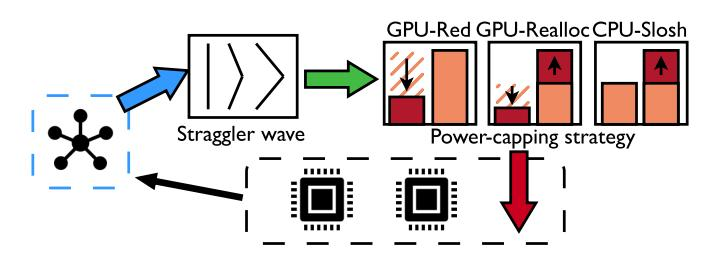

# V. TACKLING THE *Lit Silicon* EFFECT

<span id="page-6-0"></span>Addressing *Lit Silicon* requires a low-overhead and accurate mechanism to detect the straggling, and low-overhead strategies to leverage it, namely saving power, improving performance, or both. We propose to continuously measure and correct straggling via power capping to reach convergence where no *Lit Silicon* is present[2](#page-6-4) . The final distribution of GPU power caps after convergence shall hold constant for longrunning workloads, such as LLM training. This means our method only incurs a *one-time* profiling cost, after which it can optionally be disabled, or use a long sampling period, without impacting workload execution. Our solution is lightweight, with only about 200 lines of PyTorch code, and is applicable to different use cases, where both node-level and GPU-level power caps are considered. Notations will follow those in performance and power modeling in Section [IV.](#page-4-0)

## *A. Framework and Use Cases*

We show the framework of our solution in Figure [8.](#page-6-5) Table [I](#page-6-6) outlines three supported use cases, all originating from power oversubscription in datacenters (Section [II-C\)](#page-2-4).

GPU-Red. Leaders burn power only to be held back by stragglers during synchronization. As such, GPU-Red, short for GPU-Reduce, strategically power caps leaders in a dynamic and bespoke manner to realize power savings without losing throughput.

<span id="page-6-4"></span><sup>2</sup>Power capping is reported to be more predictable than frequency capping on GPUs, thus providing more precise control in performance tuning [\[49\]](#page-14-20).

<span id="page-6-5"></span>

Fig. 8: Our framework to solve *Lit Silicon* with three use cases. It only needs about 200 lines of PyTorch code.

TABLE I: Use cases of our solution.

<span id="page-6-6"></span>

| Use case    | Condition                                                                | Expected outcome                                                            |  |
|-------------|--------------------------------------------------------------------------|-----------------------------------------------------------------------------|--|
| GPU-Red     | No node-level power<br>cap; reduce power<br>on leaders only.             | Node power reduced,<br>avg. GPU power reduced,<br>throughput unchanged.     |  |
| GPU-Realloc | Node-level power cap;<br>reallocate power from<br>leaders to stragglers. | Node power unchanged,<br>avg. GPU power unchanged,<br>throughput increased. |  |
| CPU-Slosh   | Node-level power cap;<br>slosh power budget<br>from CPU to GPUs.         | Node power unchanged,<br>avg. GPU power increased,<br>throughput increased. |  |

GPU-Realloc. Stragglers could benefit from boosting power to increase frequency and catch up with leaders, instead of holding them back. Knowing that leaders burn more power than necessary, we can reallocate the power across GPUs and move the system equilibrium toward superior performance, which is denoted as GPU-Realloc. Moreover, exceeding TDP at the millisecond level has been standardized [\[66\]](#page-15-18), where GPU-Realloc can have more room to take effect.

CPU-Slosh. Finally, we also profile CPU behavior during LLM training, and our profiling results indicate that only 13.5% out of all CPU cores are utilized during training. This means about 86.5% of the core power, or hundreds of watts, is wasted and could be sloshed to the GPUs to improve performance, which we call CPU-Slosh. Similar heterogeneous power partitioning has been studied before [\[61\]](#page-15-19).

## *B. Detection of Lit Silicon*

*Lit Silicon* can be quantified by lead values and detected using a straggler wave in Figure [6,](#page-4-3) generated from a trace using Algorithm [1.](#page-7-1) This algorithm uses the starting timestamp of all kernels across GPUs to calculate the lead values (line [4\)](#page-7-2). For example, if GPU0 starts a kernel 10ms later than GPU1, then GPU1 has a lead of 10ms for that kernel. In line [6,](#page-7-3) we aggregate the lead values for each GPU by summing them up, giving a per GPU lead value vector. For example, if a GPU's lead increases linearly from 0 to 10ms over 100 kernels, its aggregate lead value would be 500ms. This per GPU aggregated lead is the output of Algorithm [1.](#page-7-1) Summing the lead values essentially retrieves the area under the lead value curve in Figure [2.](#page-5-1) Note that instead of summation, the maximum or the last value of the lead values can be used for aggregation, which will be evaluated later.

## **Algorithm 1:** LEADVALUEDETECT

```
Input: Timestamp vector T[g,k] for g \in \mathcal{G} and k \in \mathcal{K}
Output: Lead value vector L[g] for g \in \mathcal{G}

1 foreach Kernel k do

2 T_{max} \leftarrow \max{(T[\mathcal{G},k])};

3 foreach GPU g do

4 lead\_value[g,k] \leftarrow T_{max} - T[g,k];

5 foreach GPU g do

6 L[g] \leftarrow \sum_{k} lead\_value[g,k];

7 return L;
```

## <span id="page-7-3"></span>C. Mitigation of Lit Silicon

Lit Silicon is mitigated using the aggregate lead values from Algorithm 1 as input to Algorithm 2 which calculates ideal power-cap increases without TDP or node-level power considered. Finally, Algorithm 3 uses the ideal power-caps to uniformly adjust all GPUs to meet the node-level power cap and not exceed TDP. These algorithms are used for all use cases summarized in Table I, where the only variable that changes per use case is the node-level power cap. This power cap is decided by the datacenter in production, based on how oversubscribed the datacenter is, and if power-gating idle CPU cores is supported.

To explain how these algorithms apply to each use case, we will use an example of a node with a single straggler, and seven leaders using example values. Note that the actual parameters and values used are in Table II.

**GPU-Red.** The node-level power cap is equal to the maximum provisioned power where all GPUs are running at TDP for the baseline. Algorithm 1 detects a single straggler, and Algorithm 2 requests to increase the straggler's power cap by 15W (the default value for the max adjustment in Table II). To not exceed TDP, Algorithm 3 will instead lower the power cap of leaders by 15W and leave the straggler at TDP.

**GPU-Realloc.** If the node-level power cap is 120W below the maximum provisioned power, then all GPUs are 15W below the TDP for the baseline. Algorithm 2 requests to raise the straggler's power cap by 15W, which would not exceed TDP, but would exceed the node-level power cap. This time, Algorithm 3 will increase the straggler's power cap by 15W, then uniformly lower all GPUs by  $\frac{15W}{GPUs}$ .

**CPU-Slosh.** The baseline is the same as GPU-Realloc. The difference is we have a power budget available from the CPU. If our per GPU power budget is at least 2W, then the straggler's power cap can be increased by 15W without lowering caps on leaders since we have an additional 16W of total power available before reaching the node-level power cap.

The goal of straggler mitigation is to minimize the lead values by tuning the power caps of each GPU. Theoretically, we can align the distribution of the actual power caps across GPUs towards an expected distribution from the performance and power models. However, such precise alignment may require

## **Algorithm 2:** INCPOWERGPU

value to increase the power cap  $max\_inc$ , and the largest lead value observed across iterations  $global\_max$ Output: Power cap increase vector I[g] for  $g \in \mathcal{G}$  and updated  $global\_max$ 1  $max\_lead \leftarrow \max(L[\mathcal{G}]);$ 2  $min\_lead \leftarrow \min(L[\mathcal{G}]);$ 3  $global\_max \leftarrow \max(global\_max, max\_lead);$ 4 foreach GPU g do

5  $norm\_lead \leftarrow 1 - \frac{L[g] - min\_lead}{max\_lead - min\_lead};$ 6  $I[g] \leftarrow norm\_lead \times \frac{max\_lead}{global\_max} \times max\_inc;$ 7 return I, global max;

<span id="page-7-4"></span>**Input:** Lead value vector L[g] for  $g \in \mathcal{G}$ , maximum

<span id="page-7-6"></span><span id="page-7-5"></span>long latency to converge. Therefore, we design Algorithm 2 and Algorithm 3 for fast convergence with decent accuracy.

Algorithm 2 calculates the delta to increase the power cap on each GPU. It takes in the lead value vector from Algorithm 1, a user-defined max increase value of the power cap to avoid over tuning, and the largest lead value across iterations. The final power cap increase vector of a GPU is proportional to its relative lead values within the current sampled iteration (line 5) and across all past sampled iterations (line 6), which are meant to tune each GPU power separately and ensure the power cap increases are gradually lowered.

Algorithm 3 further tunes the GPU power caps by considering the node-level power cap. It first increases GPU power caps based on the returned GPU power caps from Algorithm 2 (line 3) and updates the total node power (line 4). Then, we assume the node-level power increase is uniformly allocated to each GPU and obtain the per-GPU maximum power cap delta (line 5), which is further adjusted by the GPU TDP to get the actual power cap delta (line 9). Finally, all GPUs will tune their power cap by the same delta (line 11). The output of Algorithm 2 is the final new power cap of each GPU, and the system sets the power caps accordingly.

#### VI. EVALUATION SETUP

<span id="page-7-0"></span>All evaluation knobs are listed in Table II.

**Hardware.** We use two AMD GPU nodes, each with eight AMD Instinct<sup>TM</sup> MI300X GPUs and two AMD EPYC<sup>TM</sup> 9684X CPUs.

Workload and framework. We evaluate LLM training with FSDP and FSDP2, using two different workloads: Llama 3.1 8B and Mistral 7B v0.1. FSDP2 improves over FSDP by introducing a new distributed tensor format to better handle the tensor metadata. Precision is explored by training with bf16 and fp8, where fp8 uses Transformer Engine kernels, with E4M3 for forward (higher precision) and E5M2 for backward (larger range), plus dynamic scaling for stability.

**Configuration.** The configurations of batch size and sequence length are chosen that fit in the GPU HBM. Batch size 2

## **Algorithm 3:** ADJPOWERNODE

<span id="page-8-2"></span>**Input:** Power cap increase vector I[g] for  $g \in \mathcal{G}$ , current power cap vector P[g] for  $g \in \mathcal{G}$ , maximum power of GPUs TDP, and node-level power cap  $P_n$ 

**Output:** Updated power cap vector P'[g] for  $g \in \mathcal{G}$  1  $node\_power = 0$ ;

