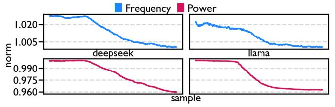

# VIII. DISCUSSION

## *A. Cost Savings*

Here we estimate the cost saving if our solution were deployed to the full datacenter. Llama3 405B was trained on 16K GPUs, with each node applying tensor parallelism, which lies well within our assumption of a uniform workload [\[21\]](#page-13-4) in a datacenter. While FSDP might not be running on every node of a cluster for small-scale workloads, any balanced workload, regardless of C3, can benefit from aligning frequencies. Even for imbalanced workloads like MoE, benefits have been shown in Section [VII-C.](#page-10-1) Therefore, we argue that *Lit Silicon* is applicable to a variety of datacenter scenarios.

Both OpenAI and Meta recently announced a partnership with AMD to deploy 6 gigawatts of AMD GPUs each [\[44\]](#page-14-24), [\[54\]](#page-15-21). Google reports a Power Usage Effectiveness (PUE), a ratio of total datacenter energy to computing equipment energy, of 1.09 across their own datacenters, with an industry average of 1.56 [\[20\]](#page-13-15). GPU power is approximately 50% of the provisioned power, and power usage for training and inference is reported to average 75% of TDP [\[46\]](#page-14-18). Given the average price of electricity as of August 2025 is \$0.14 [\[59\]](#page-15-22), a 4% power saving could translate to over \$70 million saved annually for one customer.

$$\begin{aligned} & 6\text{GW}/1.56 \times 50\% \times 75\% \\ & \times (24 \times 365)\text{h} \times 0.14 \, \text{\$/kWh} \times 4\% \approx \text{\$70M} \end{aligned}$$

## *B. Synergy with AI Trends*

Lower Precision. As AI training and inference in general move towards lower precision, it is important to know what the impact of *Lit Silicon* will be. Figure [13](#page-11-0) illustrates that *Lit Silicon* is almost equally present for training in bf16 and fp8. With more aggressive four-bit data, more studies are needed to understand how *Lit Silicon* impacts.

Inference Applicability Given the fundamental nature of *Lit Silicon*, we consider it as workload agnostic. GPUs used for AI training and inference are often the same, and will experience the same thermally induced straggling. AI inference also utilizes C3 [\[45\]](#page-14-25), meaning it can suffer from *Lit Silicon*.

Reliability Effects. Specifications exist which provide guidance on safely exceeding TDP, for certain magnitudes and certain timescales already [\[66\]](#page-15-18).

Fig. 13: Sensitivity study of knobs in Table II. A higher value is better (e.g., less variation has a larger bar value). The rolling average of power from Figure 10 is used for power reduction, and convergence as the number of samples between 99.5% of max power, and 100.5% of min power. Raw power samples as in Figure 9b after convergence are used to measure variation in power ( $CV = \sigma/\mu$ ). The mean of the last five values prior and post adjustment are used to calculate throughput improvement. Exceptions are warm-up and sampling period which are normalized to a baseline with no power-capping.

Fig. 14: Power and throughput metrics are the same as Figure 13. Convergence is measured as the samples needed for throughput to reach 99.5% of peak. Variation in throughput is measured after the convergence point  $(CV = \sigma/\mu)$ .

Fig. 15: Metrics are the same as Figure 14.

**Multi-tenancy.** *Lit Silicon* describes thermal imbalance and variation from C3 in a balanced workload like FSDP training, and is more difficult to address when there is imbalance across GPUs as in multi-tenancy. However, multi-tenancy often uses resource partitioning to allow for deterministic performance (e.g., split a GPU into training and inference partitions with CU masking [9], [41]). In such imbalanced cases, inter-GPU

synchronization still exists, causing *Lit Silicon*. If partitions on a GPU are using the same resources, this could introduce variation in addition to thermal imbalance. Even with such variation, stable and repetitive computation phases would be still observable in order to meet service level objectives.

Accelerators. Since accelerators can have more deterministic performance than GPUs, we expect thermal/frequency effects to dominate the remaining variation and correlate with straggling at least as strongly as on GPUs. However, accelerators typically use DMA for inter-device communication, whose behavior is more complex and warrants further study.

## C. Production Deployment

While our current solution relies on users having administrator privileges to tune power caps, multi-tenant clusters usually cannot grant users these privileges. However, there are other possible solutions to mitigate Lit Silicon in both multi-tenant and private clusters. For rapid, online frequency tuning, a firmware solution triggered by user-level application hints could synchronize frequencies between GPUs using GPU telemetry instead of user provided lead values; either through the CPU or between GPUs. This online solution may require additional hardware for telemetry and synchronization. For infrequent, offline tuning, a hook could run a stress test like our benchmark to calibrate GPUs intermittently (e.g., when a node is idle) since the ideal power caps remain relatively constant as shown in Figure 12. This offline solution could be deployed today without additional hardware, but may not be as efficient as online tuning. Section III-B and Figure 5 show that temperature and frequency, though correlated, are not perfectly matched, indicating potential GPU-inherent variation (e.g., induced by manufacture). That said, prior work shows that GPU placement within a node can also affect thermal imbalance [18], suggesting variations in manufacturing and cooling can jointly cause straggling.

(a) Lead values for DeepSeek (top row) and Llama (bottom row) pre-adjustment using the same metrics as Figure [7.](#page-4-4) Large lead spikes occur frequently for DeepSeek. Zooming into 2% and 10% of the maximum spike, we see stragglers are the same for DeepSeek and Llama (i.e., GPU4). Since all-to-all communication is not overlapped for DeepSeek, GPUs are synchronized every layer, resulting in very small lead values relative to Llama.

(b) Aggregated lead values and throughput using the same metrics as [9a.](#page-8-8) The large spikes in lead value from DeepSeek inflate the aggregate summed lead value, despite most lead values being small relative to Llama as shown in Figure [16a.](#page-12-3)

(c) Measured frequency for DeepSeek and Llama, using the same metrics as Figure [10.](#page-9-1) Tuning begins one third of the way. Dense and MoE training exhibit similar power and frequency characteristics despite different communication collectives and model architectures.

Fig. 16: Comparison of Llama 3 8B (b2s4) dense training and DeepSeek v3 16B (b8s4) MoE training using GPU-Red with defaults in Table [II.](#page-8-1)

## *D. Limitation*

Theoretically, *Lit Silicon* applies to all systems with multiple devices in a node, where per-device DVFS is equipped. We leave broader validation for future work, including AI accelerators, GPUs from other vendors, and beyond. Also, this work is limited to a single node, and it is worthy to expand our solution at the cluster level and understand the impact for large-scale AI training. Furthermore, given the prevalence of LLM inference with KV cache in industry frameworks such as vLLM [\[32\]](#page-14-27), it is extremely beneficial to incorporate our solutions into such frameworks as default optimizations.

## *E. Related Works*

Straggler handling. Both datacenter-level and node-level solutions exist. Datacenter-level solution identifies that the major source of stragglers is workload, such as uneven pipeline stage partitioning and imbalance in sequence lengths across batches, rather than hardware or software [\[37\]](#page-14-12). Node-level solutions propose optimized communication collectives to better hide the straggler idle time to improve resource utilization [\[12\]](#page-13-7).

Energy saving. A lot of prior works focus on reducing the energy consumption without impacting the performance significantly. Primary energy bottlenecks includes the uneven model pipelining and hardware straggling [\[10\]](#page-13-18). Example solutions are power oversubscription, frequency locking and power capping, and fine-grained DVFS [\[46\]](#page-14-18), [\[50\]](#page-15-23), [\[64\]](#page-15-17).

C3 mitigation Multiple techniques has been proposed to mitigate the slowdown due to C3. Knowing the potential of C3 to improve performance, architecture support has been extended to support more efficient and finer-grained overlap [\[48\]](#page-14-10). To further bridge the gap from theoretical performance, efforts have been made to design better communication collectives [\[2\]](#page-12-1).

DMA engines free compute resources from communication kernels, lowering the runtime variation of compute kernels during C3. Since DMA does not eliminate the coupling between thermal imbalance and C3, *Lit Silicon* can still exist. However, the quantitative impact on lead values is complicated, which are determined by both the overlap and runtime of all preceding kernels. That said, solving *Lit Silicon* still provides benefits, since frequency differences across GPUs determine power and performance, as stated in Insights [5](#page-5-0) and [6.](#page-6-1)

## IX. CONCLUSION

In this paper, we identify the *Lit Silicon* effect for a singlenode multi-GPU system, which reveals how thermally induced straggling couples with C3 to impact performance variation and inefficiency. We build performance and power models to understand the gains of solving *Lit Silicon*. We further propose a lightweight solution to detect and mitigate *Lit Silicon* in real hardware and software systems, using only about 200 lines of PyTorch code. Our solution can improve the performance and power by 6% and 4%, respectively.

## X. ACKNOWLEDGMENT

We thank all reviewers for their valuable feedback. This work was sponsored by the Funding for Academic Research Program (gift funding) under the AMD University Program. Access to GPUs was provided by the AMD University Program AI & HPC Cluster and the AMD Developer Cloud.

AMD, AMD Instinct, AMD EPYC, and combinations thereof are trademarks of Advanced Micro Devices, Inc. Other product names used in this publication are for identification purposes only and may be trademarks of their respective companies.

