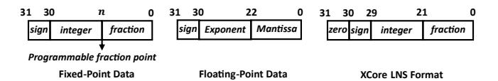

# B. Analysis

Within the inequality (6), the overall error includes two parts: ① **Model error:** This error arises from approximating the target function f(x) with a restricted function  $\tilde{f}(x)$ , depending on the segmentation strategy and polynomial degree. When this error equals zero, it means the software approximation result  $(\tilde{f}(x))$  is exact. ② **Implementation error:** This error results from using LNS to implement  $\tilde{f}(x)$ , influenced by the logarithmic and antilogarithmic transformations. When this error equals to zero, it means the hardware implementation  $(\tilde{f}_{HW}(x))$  perfectly matches the software result  $(\tilde{f}(x))$ . Then, the model error determines the final accuracy. Subsequently, we introduce the detailed analysis of the implementation error.

Definition 1. (hardware transformation) Given a variable x, specific hardware is required to transform it into  $log_2x$ . We define the hardware transformation as  $log_2x = log_2^{'}x + \delta$ , where  $log_2^{'}x$  is the accurate result and  $\delta$  is the transformation error. Similarly, the hardware-based antilogarithm transformation introduces an error, denoted as  $\beta$ .

Consequently, the transformation from expression (2) to (3) can be rewritten in equation (7). It's worth noting that  $c_i$  is a constant, so the accurate value of  $log_2'c_i$  can be precomputed.

$$c_i x^{k_i} = 2^{\log_2' c_i + k_i \times (\log_2' x + \delta)} + \beta = 2^{\log_2' c_i x^{k_i} + k_i \delta} + \beta$$
$$= c_i x^{k_i} 2^{k_i \delta} + \beta \approx c_i x^{k_i} (1 + \ln 2 \times k_i \delta) + \beta$$

$$(7)$$

Based on equation (7), the key factors for minimizing implementation error are the errors in the logarithmic and antilogarithm transformations. Fortunately, the architecture of the logarithmic converter has been well studied in other literature [41], [43], [82], and can be adopted by *LoRA*.

#### IV. XCORE ARCHITECTURE

#### A. Data Format

XCore employs a hybrid number system, combining ordinary arithmetic and LNS formats. This lets XCore leverage both advantages: simple addition/subtraction in ordinary arithmetic and more complex operations (e.g.,  $x^y$ ) in LNS. The data type in LoRA is 32-bit, supporting fixed-point, floating-point (FP32), and LNS formats, as in Fig. 1. For flexibility, the fixed-point data allows programmable precision by adjusting the fraction width. Since LNS is undefined for zero and negative values, the absolute value is used for logarithmic transformation, with zero and sign encoded in additional bits.

Fig. 1. The supported data formats by XCore.

## B. Architecture Overview

By leveraging the hybrid number system, *XCore* can support various operations based on the configuration, mainly including four modes: (1) Multiplication and division:  $x \times y$  and  $x \div y$ . (2) Power:  $x^y$ . (3) Logarithmic:  $log_b x$ . (4) Polynomial: *XCore* can support the polynomial with up to six terms, including five terms with variable (i.e., expression (3)) and one constant term (bias). Overall, as shown in Fig. 2(a), *XCore* has five stages, separated by registers. The following subsections outline these stages in the order of execution.

#### C. Pre-Process Stage

Since LoRA uses a piecewise approximation, each subinterval polynomial has its own parameters: the coefficient  $(log_2c_i)$ , degree  $(k_i)$ , and bias. As shown in expression (3), the coefficient  $log_2c_i$  is pre-computed and stored. Specifically, the bias is the polynomial term without the variable x. It can be a constant or the input y, which comes from another functional unit. During polynomial computation, the input variable x is compared with the breakpoints in this stage to address the LUT for the required parameters.

#### D. LOG Stage

In this stage, the input variable x is transformed into  $log_2x$  by the logarithmic converter. When computing  $x^y = 2^{y \times log_2x}$ , the input variable y in fixed or floating point should multiply  $log_2x$  in LNS. Hence, the y is transformed into the LNS format (i.e.,  $y_{Q10,22}$ ). We present the logarithmic converter below, as it directly affects the implementation error.

**Logarithmic Converter Architecture:** Following reference [46], the logarithm of a fixed-point format data  $x_1$  can be defined by equation (8). Here, m is the most significant bit detected by the leading-one detector (LOD). Subsequently, the fraction part f can be determined based on m.

$$|x_1| = 2^m (1+f) \to log_2(|x_1|) = m + log_2(1+f), 0 \le f < 1$$
(8)

Similarly, the logarithmic transformation for a single-precision floating-point data  $x_2$  can be defined by equation (9).

$$x_2 = (-1)^s \cdot 2^{E-127} \cdot (1+f) \to \log_2(|x_2|) = E - 127 + \log_2(1+f), 0 \le f < 1$$
(9)

Hence, the logarithmic transformation focuses on approximating  $log_2(1+f)$ , which has a small input range. The architecture of the logarithmic converter within XCore is shown in Fig. 2(b). For a fixed-point input x, the LOD unit detects the MSB and isolates f from the absolute value of x. For the floating-point input x, the f can be extracted directly. The APP unit then generates the approximation of  $log_2(1+f)$ , which is concatenated with other parts to form the LNS format. In this paper, we employ a state-of-the-art (SOTA) exploration framework to generate the APP unit [82] that achieves the desired accuracy while minimizing hardware overhead through an optimized piecewise-linear (PWL) approximation strategy.

