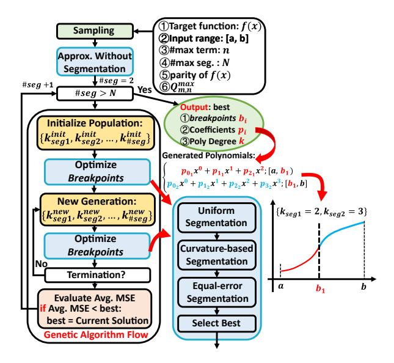
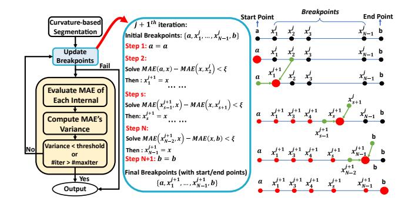
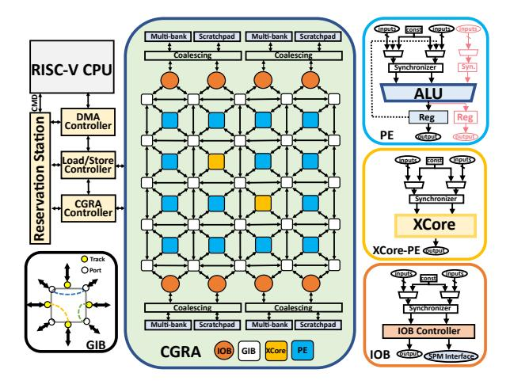
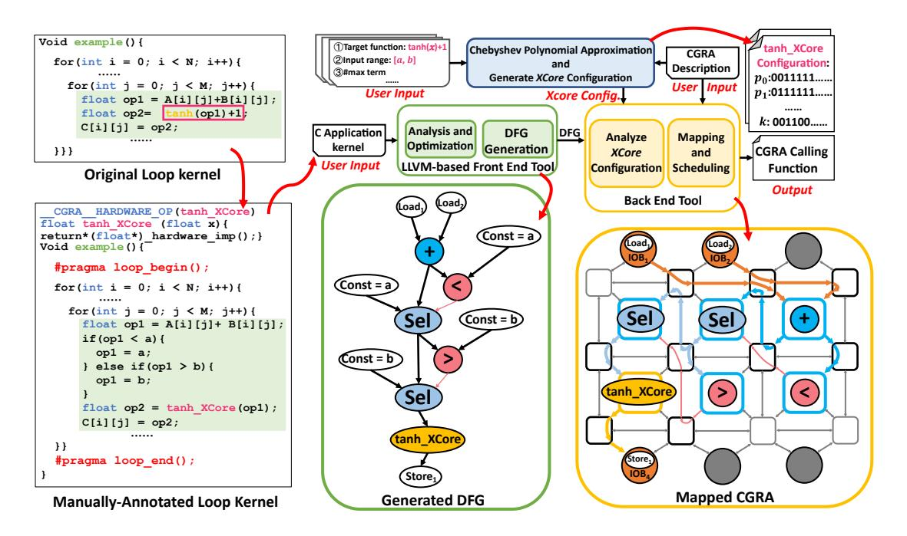
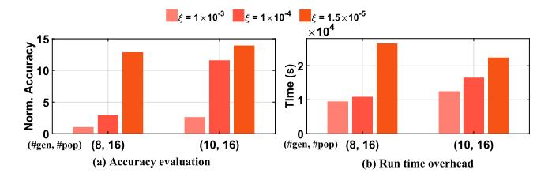
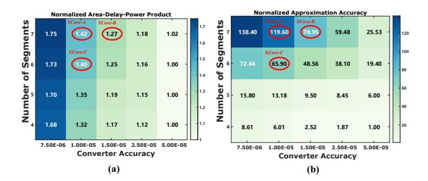
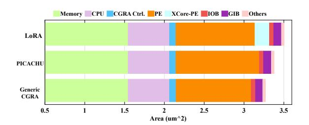
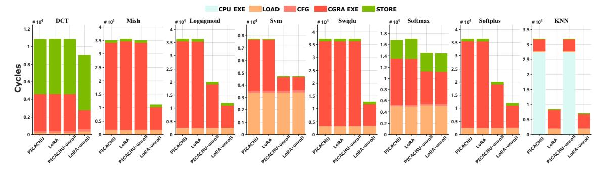
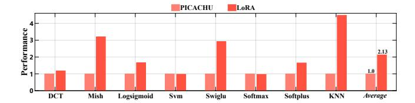
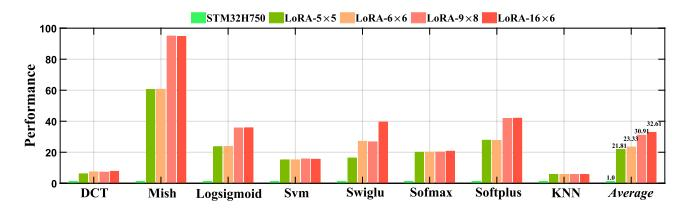

# B. Approximation Algorithm Flow

Fig. 3. The proposed Chebyshev-based approximation algorithm flow.

Fig. 3 shows the proposed Chebyshev-based approximation algorithm. Given a nonlinear function f(x) with a user-defined input range [a, b], the algorithm first performs sampling, then approximates the function without segmentation while considering the maximum number of polynomial terms, the parity of f(x), and the hardware constraint  $Q_{m,n}^{max}$  for fixed-point target. The maximum term count determines the allowed polynomial degree. For symmetric functions, a higher degree can be supported with the same number of terms. For instance, with six terms, an asymmetric function supports degree five  $(x^{0\sim 5})$ , whereas an odd function supports degree nine  $(x^{1,3,5,7,9})$ . It then starts from a two-interval approximation and gradually increases the number of sub-intervals until the maximum supported segmentation count (N) is reached.

However, a high-degree polynomial in every sub-interval may cause overfitting. To address this, we use a genetic algorithm to optimize degree allocation, as shown in Fig. 3. Each individual represents a candidate degree assignment for all sub-intervals (i.e.,  $k_{seg1}, ..., k_{\#seg}$ ), while the *breakpoints* are determined by three segmentation strategies. After the algorithm terminates, the individual with the minimum average Mean Squared Error (MSE) is selected as the solution; if it outperforms solutions with other sub-interval counts, it is chosen as the *best* solution. The final output includes (1) breakpoints, (2) polynomial coefficients, and degree of each sub-interval. As shown in Fig. 3, the parameters highlighted in red are stored in the LUT of *XCore*. The algorithm can also explore polynomials with more than six terms, which can be computed by more than one *XCore*.

#### C. Curvature-Based Sampling

The sampling strategy affects how well the polynomial  $\tilde{f}(x)$  approximates f(x). Uniform sampling often performs poorly because it allocates points uniformly, even in regions where the function is smooth, while undersampling regions with rapid variation. To address this, we use a curvature-based strategy: starting with uniform samples on [a, b], we estimate curvatures through numerical differentiation and insert additional sample points in regions with higher curvature.

#### D. Multiple Segmentation Strategies

Given a target number of intervals, we employ three segmentation strategies: uniform, curvature-based, and equalerror. For each potential segment solution, the algorithm first determines the polynomial per sub-interval, and evaluates the approximation via maximum absolute error (MAE) or MSE.

- 1) Uniform Segmentation: The given interval [a, b] is divided into equal-length sub-intervals, assigning the same width to each segment regardless of the function's behavior.
- 2) Curvature-based Segmentation: The given interval [a, b] is divided into sub-intervals based on the curvature, which is computed during uniform sampling. Regions with higher curvature are assigned denser segments, while flatter regions receive fewer. Here, we assume the target sub-intervals count is N, and there are m uniform sampling points (i.e.,  $\{x_i|i=1,...,m\}$ ), each of which has a curvature  $\kappa(x_i)$ . In addition,  $\Delta x$  is defined as the uniform spacing between adjacent points. Then, the discrete cumulative curvature can be defined as equation (20), where  $W_m$  is the cumulative value for [a, b].

$$W_k = \sum_{i=1}^{k} \kappa(x_i) \Delta x, k = 1, ..., m$$
 (20)

Subsequently, we can find the *breakpoints*  $\{x_{b1},...,x_{bN-1}\}$  such that each interval contains an equal amount of cumulative curvature, which is  $\frac{W_m}{N}$ .

3) Equal-error Segmentation: The core idea here is to partition the original interval into sub-intervals such that the MAE within each interval is approximately the same. By balancing the local errors, the error distribution is more uniform, thereby achieving a near-optimal overall approximation accuracy [68].

Fig. 4 illustrates our equal-error segment process. Starting with curvature-based segmentation, breakpoints are iteratively optimized to minimize the MAE across all sub-intervals. A new breakpoint  $x_e^{j+1}$  is searched within the range between

Fig. 4. The equal-error segmentation with the target sub-intervals count N.

its left point  $x_{s-1}^{j+1}$  (from the current iteration) and its right point  $x_{s+1}^{j}$  (from the previous iteration), ensuring the MAEs of the left and right sub-intervals are close. Then, the  $x_{s}^{j+1}$  can be determined by solving the inequality  $MAE(x_{s-1}^{j+1},x)-MAE(x,x_{s+1}^{j})<\xi$  using Brent's method [9], where  $\xi$  is the tolerance value. If the root can not be found, the process is terminated. After updating the breakpoints, the MAE variance across all sub-intervals is evaluated. If the variance is below the threshold, the final breakpoints are returned.

#### VI. LORA FRAMEWORK

#### A. End-to-End Framework: Hardware

Fig. 5. The architecture of LoRA SoC, which includes a RISC-V CPU and a heterogeneous CGRA.

Built upon Chipyard [3], the *LoRA* SoC includes a 5-stage in-order scalar RISC-V CPU (64-bit) *Rocket* [6], a heterogeneous CGRA, and other subsystems, as illustrated in Fig. 5. The CPU manages data, invokes the CGRA for acceleration, and handles code not executable on the CGRA. The reservation station caches the custom RoCC (Rocket custom coprocessor) instructions and dispatches them to each controller based on different dependencies. The load and store controller manages data transmission between the L2 cache and scratchpad memories (SPMs) via TileLink, implemented

Fig. 6. The software toolchain of LoRA, which can support the custom nonlinear function implementation.

by the DMA controller. In addition, the CGRA controller configures the CGRA and monitors its execution status.

The CGRA is a spatial architecture similar to [16], [27], [66], [71], where each functional unit loads one configuration and executes all iterations, then switches the configuration for the next kernel. Each unit has its own configuration memory. The key components are: (1) PE, which is responsible for normal computation. Since partial-prediction [29] is used for the branch, an additional fine-grained input and output (shown in light red) are required for the select operation. (2) XCore-PE, which is responsible for complex operations, such as polynomials and  $x^y$ . (3) IOB. The input/output block (IOB) is responsible for loading or storing data from/to SPMs. Loop meta-information (e.g., loop entry/exit) is implicitly encoded in memory accesses and managed by the IOB controller [16], [72], [73]. For affine accesses, the IOB controller generates SPM addresses from its configuration (automatically derived from front-end analysis). For the non-affine access (e.g., A[B[i]] or A[i \* i], addresses are computed at runtime by other units and fed via a second input. Hence, the IOB has two inputs, connecting to two GIBs for sufficient connectivity. (4) GIB. The general interconnection block (GIB) provides three types of flexible interconnect resources [62]: port-to-port, track-to-port, and track-to-track. The track-totrack connection follows the Wilton pattern [67], [75] and facilitates long-distance data communication. The back-end generates a configuration of the used GIB for the required connections. In addition, register-based synchronizers inside functional units ensure data synchronization, similar to [16], [71]. Our parameterized design allows configuring the CGRA size, PE type per position, and supported operations per PE.

#### B. End-to-End Framework: Software

Fig. 6 shows the software toolchain within LoRA. Loop kernels for CGRA execution are manually annotated with #pragma directives to identify the targeted kernel and custom nonlinear functions. The LLVM-based front-end tool then performs loop analysis, optimization, and DFG generation. Three additional steps support nonlinear functions: (1) Manual Analysis. Determine the type, input range, and data format of each nonlinear function. Since XCore can approximate compound nonlinear functions, it reduces the required computing resources. For example, the function tanh(x) + 1 in Fig. 6 or more complex ones like sin(x) + cos(x) and ln(sin(x))can all be approximated by a single XCore. (2) Add Custom Function. Nonlinear functions are defined as custom functions with the \_\_CGRA\_\_HARDWARE\_OP annotation, ensuring special handling during DFG generation. As shown in Fig. 6, the original nonlinear function is replaced by the custom tanh\_XCore function, which becomes a DFG node. In addition, to handle cases where the input may exceed the analyzed input range at runtime, the user can add corresponding computational constraints or range transformation (e.g., transform the input range to  $[-\pi,\pi]$  for the trigonometric function) in the loop kernel. When such range transformations are not supported, the original function can be decomposed into combinations of primary functions (e.g.,  $x^y$ ,  $loq_b x$ ), with XCore supporting the entire input range. (3) Generate Polyno**mials.** The Chebyshev-based algorithm generates polynomials for each nonlinear function, given the maximum supported sub-interval count (i.e., N in Fig. 3) of the CGRA. After that, the configuration of each nonlinear function is generated based

on the approximating polynomials, and the configuration will control the *XCore* to perform the corresponding computation.

Subsequently, the back-end tool collects the configuration of *XCores* and maps the DFG to the CGRA. A simulated annealing-based spatial mapping algorithm, similar to [16], [71], is used. Additionally, the back-end tool utilizes a memory partition algorithm [15], [17], [74] to allocate data to the multi-bank SPM and schedule bank-conflicting accesses into different time slots to prevent memory contention. Finally, the CGRA calling function is generated for the CPU to invoke the CGRA; it includes instructions to load configuration and data into the SPM, configure the CGRA, activate it for execution, and write results back to main memory. These custom instructions are sent to the reservation station via the RoCC interface. The original loop kernel is replaced with this function and compiled into an executable bare-metal file.

#### VII. EVALUATION SETUP

## A. Comparison Methodology

The comparison is conducted in three levels, including: (1) Algorithm level. We study how different geneticalgorithm settings affect approximation runtime and final accuracy. (2) Unit level. We evaluate XCore by analyzing the trade-offs among converter accuracy, the maximum supported number of intervals and polynomial terms, and the resulting approximation error. We then compare XCore with prior nonlinear computation units, and further perform end-to-end accuracy evaluation to compare LoRA with PICACHU [56]. (3) System level. We first quantify the SoC overhead of integrating XCore into the CGRA. We then compare performance and energy efficiency between LoRA and PICACHU, and evaluate scalability by varying CGRA sizes and comparing against the STM32H750 MCU [2] (ARM Cortex-M7). It's worth noting that the approximation result of each nonlinear function involved in the evaluation is generated by a single *XCore*, which is configured by the software results.

TABLE III
THE BENCHMARKS USED AT SYSTEM-LEVEL EVALUATION

| Benchmark  | Application                       | Nonlinear Function                                                                     |
|------------|-----------------------------------|----------------------------------------------------------------------------------------|
| Mish       |                                   | $Mish(x) = x \times tanh(ln(1 + e^x))$                                                 |
| Logsigmoid |                                   | $Logsigmoid(x) = ln(\frac{1}{1+e^{-x}})$                                               |
| Softmax    | Activation Function [55], [56] | $\overline{Softmax(x_i)} = \frac{\exp(x_i)}{\sum_{j=1}^K \exp(x_j)},  i = 1, \dots, K$ |
| Softplus   |                                   | $Softplus(x) = ln(1 + e^x)$                                                            |
| Swiglu     |                                   | $Swiglu(x) = SiLU(xW + B) \odot (xV + c)$ $SiLU(x) = \frac{x}{1 + e^{-x}}$             |
| Svm        | Support Vector Machine         | $e^x$                                                                                  |
| DCT        | Discrete Cosine Transform [40] | cos(x)                                                                                 |
| KNN        | K-Nearest Neighbors [60]       | $\sqrt{x}$                                                                             |

#### B. Benchmarks

Eight nonlinear functions are used to evaluate *LoRA* at the unit level. At the system level, we select eight benchmarks

with eleven loop kernels from diverse domains for comparison, as shown in Table III. The activation function benchmarks are derived from [55], [56], with matrix multiplication performed first to generate inputs for the nonlinear functions. These activation functions are commonly used in workloads like *Swiglu* in DeepSeek [20] and *Softmax* in most LLMs.

#### C. System-level Implementations

1) Hardware Implementation: We model three types of SoCs with different CGRAs for comparison: ① Generic CGRA. This baseline CGRA, similar to existing spatial CGRAs [16], [26], [27], [71], supports both fixed-point and floating-point formats but cannot handle nonlinear functions. It is used solely to evaluate the hardware overhead of adding nonlinear operation support. @ PICACHU. It includes two key technologies for efficient nonlinear function support: (1) Floating-point to Fixed-point (FP2FX) Conversion Module for exponential computations via Taylor expansions. (2) Operator fusion: Since Taylor expansions introduce a certain amount of MAD operations, supporting this common pattern through a specialized module in a single PE can reduce the required number of PEs. We re-implement these two modules and integrate them into the PE of Generic CGRA, thereby computing nonlinear functions as described in [56]. 3 LoRA. Enhances the Generic CGRA by integrating *XCore*-PE and adding MAD operations in PE to improve compute density.

TABLE IV
BENCHMARK CHARACTERISTICS

| Kernel    | PIC   | CA | CHU   |   | Lol               | RA | <b>L</b> |    | Kernel             | Π | PICA  | C | HU    | Ī | LoR               | A |       |
|-----------|-------|----|-------|---|-------------------|----|----------|----|--------------------|---|-------|---|-------|---|-------------------|---|-------|
|           | #Node | e  | #Edge |   | #Node (#XCore) |    | #Edge    |    |                    |   | #Node |   | #Edge |   | #Node (#XCore) |   | #Edge |
| Mish      | 36    | ı  | 45    | ī | 11 (1)            | Ī  | 13       | II | Logsigmoid         | Ι | 34    | l | 43    | Ī | 13 (1)            | Π | 15    |
| Softmax_1 | 5     | ı  | 5     | ī | 5 (0)             | Ī  | 5        | II | Softmax_2          | Τ | 18    | l | 22    | Ī | 8 (1)             | Π | 7     |
| Softmax_3 | 4     | ı  | 4     | ī | 4 (0)             | Ī  | 4        | II | Softplus           | ī | 34    | l | 43    | Ī | 14 (1)            | Π | 16    |
| Swiglu    | 37    |    | 47    | Ī | 15 (1)            | Ī  | 17       | II | Svm                | Τ | 21    | l | 25    | Ī | 11 (1)            | Ι | 11    |
| DCT       | 33    |    | 46    | Ī | 21 (1)            | Ī  | 24       |    | KNN_1 † | Π | -     | l | -     | Ī | 6 (1)             | Π | 5     |
| KNN_2     | 15    | Π  | 18    | ī | 15 (0)            | ī  | 18       | II |                    | ī |       | Ι |       | ī |                   | Τ |       |

† PICACHU cannot support  $\sqrt{x}$ , leaving it executed by CPU.

Subsequently, the CGRA size is set based on: (1) The maximum memory and computing node counts, since spatial CGRA is required to provide sufficient resources to accommodate the DFG. (2) The back-end tool's ability to find mapping solutions. Table IV shows the node count of the used kernels without loop unrolling. Consequently, to ensure a fair comparison, the size of each CGRA is  $6\times6$ , comprising 36 PEs and 12 IOBs with 12 SPM banks, each providing 4 KB of storage. Meanwhile, the size of L2 cache is 128KB. PICACHU and LoRA are heterogeneous designs, with only part of the PEs added to support the MAD operation. In this evaluation, the 36 PEs of LoRA include two XCore-PEs, a number determined by the XCore nodes in the DFG and the potential for further loop unrolling. Using custom XCore nodes for composite functions significantly reduces the DFG size in LoRA.

All the SoCs except *XCore* are modeled using Chisel [8], while the *XCore* is modeled by Verilog. The generated Verilog can be used for ASIC implementation or FPGA prototyping. We use the Synopsys Design Compiler to synthesize all the SoCs with the TSMC 40nm process library and compiled memory to estimate area and power consumption.

- 2) Software: The full-stack CGRA toolchain is implemented in C++, while the Chebyshev-based approximation algorithm is implemented in Python.
- 3) Simulation: We employ the Synopsys VCS-based simulator to verify correctness and measure performance.

#### VIII. EVALUATION RESULT

#### A. Algorithm-Level Evaluation

Fig. 7. The exploration of different algorithm settings.

Based on a set of nonlinear functions, we evaluate the impact of genetic algorithm settings, including: (1) the number of generations (#gen) and population size (#pop); (2) the tolerance value  $\xi$  for equal-error segmentation. Fig. 7 shows the normalized accuracy and average run time for one function. Our observations are: (1) A smaller  $\xi$  means the error distribution is more uniform, bringing results closer to the near-optimal accuracy, but increases computational overhead and run time. (2) More iterations improve results, but yield diminishing returns once the solution is near optimal. We also tried an exhaustive search, but with 6 segments and 6 terms, each segment has 6 possible degrees ( $k = 0 \sim 5$ ), resulting in 66 possible degree allocations, making it infeasible to complete the exploration in a week. Therefore, despite its randomness, we find the genetic algorithm more suitable once the iteration count is sufficient. Based on our experience, we typically set  $\xi = 1.5 \times 10^{-5}$ , #gen = 10, and #pop = 16.

## B. Unit-Level Evaluation

1) Trade-offs in XCore Design: As shown in inequality (6), approximation accuracy is affected by two factors: ① Model error, reducible by increasing segments or polynomial terms, and ② implementation error, determined by the accuracy of logarithmic/antilogarithmic converters. To study these trade-offs, we implement twenty XCores with different converter accuracy (quantified by the maximum absolute error) and segment counts. Using a set of nonlinear functions, Fig. 8(a)–(b) report their normalized area-delay-power products (ADPP) and average approximation accuracies (quantified by MSE). We observe that as converter accuracy and segment count increase, accuracy improves, but hardware cost also increases. We

Fig. 8. The design space exploration of *XCore*, where the designs highlighted with a red circle are selected for evaluation.

therefore select three representative designs for the following unit-level evaluation (*XCore*-A~C in Fig. 8), based on the following considerations: (1) When the number of segments exceeds 6, the accuracy improves significantly. Therefore, among the designs with six segments, *XCore*-C is selected for its superior area efficiency. (2) Among the designs with 7 segments, *XCore*-B is chosen because it achieves better accuracy than *XCore*-C while incurring a smaller area overhead. In addition, compared with *XCore*-C, *XCore*-A offers a significant accuracy improvement with only a modest area increase, leading to its selection. Subsequently, with 7 segments, we evaluate the impact of the number of polynomial terms.

 $\label{thm:table v} TABLE\ V$  The Evaluation on different numbers of polynomial terms

|                                   | X     | Core: 4 ter | ms     | X        | Core: 5 ter | XCore: 6 terms     |                              |                          |
|-----------------------------------|-------|-------------|--------|----------|-------------|--------------------|------------------------------|--------------------------|
| Converter Accuracy             | 0.004 | 0.00125     | 0.0005 | 0.000175 | 0.00006     | $2 \times 10^{-5}$ | $\frac{A}{1 \times 10^{-5}}$ | B 1.5 × 10 -5 |
| Norm. ADPP†                       | 1.0   | 1.29        | 1.48   | 2.43     | 3.46        | 4.87               | 6.95                         | 6.40                     |
| Norm. Accuracy_HW † | 1.0   | 17.3        | 79.4   | 771.9    | 6112.6      | 34961.4            | 93789.1                      | 51629.2                  |
| Norm. Accuracy_SW † |       | 1.0         |        |          | 58.4        |                    | 23                           | 7.1                      |

 $^\dagger$  Each metric is normalized to the respective result of the first 4-term XCore.

Table V shows the following observations: (1) Software (SW) results indicate that higher-degree polynomials with more terms improve accuracy. (2) As discussed in Section IV-E, when the number of terms is six, a 30-bit operand is decomposed into five 6-bit operands to store each  $k_i$ . Therefore, when the number of terms is reduced to five or four, the operand width should be reduced to 24-bit and 18-bit, respectively, to avoid wasting resources, thus reducing the LNS format width. As a result, achieving high converter accuracy in the reduced LNS width is challenging. For four and five terms, we evaluate six XCores. Despite the increased hardware overhead as the number of terms and converter accuracy rise, the gains in approximation accuracy are significant. Specifically, compared to the best result with five terms, XCore-A achieves a 2.68× accuracy improvement at the cost of 1.43× ADPP, making the six-term configuration a good design choice.

2) Function Approximation Analysis: In Table VI, we compare XCore with prior works using evaluation metrics such

TABLE VI
THE COMPARISON OF NONLINEAR COMPUTATION UNITS

| Work                 | Func.      | Range                             | AAE                                            | sq-AAE                                           | MSE                                              | Domain           |
|----------------------|------------|-----------------------------------|------------------------------------------------|--------------------------------------------------|--------------------------------------------------|------------------|
| [76]                 |            | [-8, 8]                           | $1.70 \times 10^{-3}$                          | $2.89 \times 10^{-6}$                            | -                                                |                  |
| [32]                 |            | [-8, 8]                           | $3.40 \times 10^{-4}$                          | $1.16 \times 10^{-7}$                            | $2.55 \times 10^{-8}$                            |                  |
| [4]                  |            | [-8, 8]                           | -                                              | $6.50 \times 10^{-9}$                            | -                                                |                  |
| XCore-A              | Sigmoid    | [-8, 8]                           | $3.73 \times 10^{-6}$                          | $1.39 \times 10^{-11}$                           | $2.36 \times 10^{-11}$                           | AI               |
| XCore-B              | o ignioiu  | [-8, 8]                           | $5.54 \times 10^{-6}$                          | $3.07 \times 10^{-11}$                           | $5.87 \times 10^{-11}$                           |                  |
| LoRA-SW-7-seg        |            | [-8, 8]                           | $1.95 \times 10^{-6}$                          | $3.80\times10^{-12}$                             | $1.06 \times 10^{-11}$                           |                  |
| XCore-C              |            | [-8, 8]                           | $8.34 \times 10^{-6}$                          | $6.95 \times 10^{-11}$                           | $1.42 \times 10^{-10}$                           |                  |
| LoRA-SW-6-seg        |            | [-8, 8]                           | $7.02 \times 10^{-6}$                          | 4.92×10 -11                           | $1.31 \times 10^{-10}$                           |                  |
| [25]                 |            | [-8, 8]                           | $3.74 \times 10^{-4}$                          | $1.40 \times 10^{-7}$                            | $5.55 \times 10^{-7}$                            |                  |
| [4]                  |            | [-8, 8]                           |                                                | $1.02 \times 10^{-8}$                            |                                                  |                  |
| XCore-A              |            | [-8, 8]                           | 6.48×10 -6                          | 4.20×10 -11                           | 1.41×10 -10                           |                  |
| XCore-B              |            | [-8, 8]                           | $9.34 \times 10^{-6}$                          | 8.73×10 -11                           | $3.12\times10^{-10}$                             |                  |
| LoRA-SW-7-seg        |            | [-8, 8]                           | $4.98 \times 10^{-6}$                          | $2.48 \times 10^{-11}$                           | $7.94 \times 10^{-11}$                           |                  |
| XCore-C              |            | [-8, 8]                           | $3.63 \times 10^{-5}$                          | $1.32 \times 10^{-9}$                            | $2.01 \times 10^{-9}$                            |                  |
| LoRA-SW-6-seg        | Tanh       | [-8, 8]                           | $3.62 \times 10^{-5}$                          | $1.31 \times 10^{-9}$                            | $2.02 \times 10^{-9}$                            | AI               |
| [79]                 |            | [-4, 4]                           | -                                              | -                                                | $1.28 \times 10^{-7}$                            |                  |
| [4]                  |            | [-4, 4]                           | -                                              | -                                                | 7.10×10 -11                           |                  |
| XCore-A              |            | [-4, 4]                           | $7.61 \times 10^{-6}$                          | $5.78 \times 10^{-11}$                           | $9.42 \times 10^{-11}$                           |                  |
| XCore-B              |            | [-4, 4]                           | $1.06 \times 10^{-5}$                          | $1.12\times10^{-10}$                             | $2.04 \times 10^{-10}$                           |                  |
| LoRA-SW-7-seg        |            | [-4, 4]                           | $4.88 \times 10^{-6}$                          | $2.38 \times 10^{-11}$                           | $5.31 \times 10^{-11}$                           |                  |
| XCore-C              |            | [-4, 4]                           | $1.05 \times 10^{-5}$                          | $1.10\times10^{-10}$                             | $1.41 \times 10^{-10}$                           |                  |
| LoRA-SW-6-seg        |            | [-4, 4]                           | $1.01 \times 10^{-5}$                          | $1.01 \times 10^{-10}$                           | $1.58 \times 10^{-10}$                           |                  |
| [79]                 |            | [-8, 8]                           | -                                              | -                                                | $1.76 \times 10^{-8}$                            |                  |
| [4]                  |            | [-8, 8]                           | -                                              | $9.09 \times 10^{-9}$                            | -                                                |                  |
| XCore-A              |            | [-8, 8]                           | $2.20 \times 10^{-5}$                          | $4.82 \times 10^{-10}$                           | $8.64 \times 10^{-10}$                           |                  |
| XCore-B              | GELU       | [-8, 8]                           | $2.27 \times 10^{-5}$                          | $5.15 \times 10^{-10}$                           | $9.26 \times 10^{-10}$                           | AI               |
| LoRA-SW-7-seg        |            | [-8, 8]                           | $2.13 \times 10^{-5}$                          | $4.54 \times 10^{-10}$                           | $8.24 \times 10^{-10}$                           |                  |
| XCore-C              |            | [-8, 8]                           | $3.03\times10^{-5}$                            | $9.16 \times 10^{-10}$                           | $1.69 \times 10^{-9}$                            |                  |
| LoRA-SW-6-seg        |            | [-8, 8]                           | $2.97 \times 10^{-5}$                          | $8.84 \times 10^{-10}$                           | $1.60 \times 10^{-9}$                            |                  |
| [25]                 |            | [-8, 8]                           | $4.90 \times 10^{-4}$                          | $2.40 \times 10^{-7}$                            | $4.51 \times 10^{-7}$                            |                  |
| XCore-A/C            | Swish      | [-8, 8]                           | $1.25 \times 10^{-5}$                          | $1.56 \times 10^{-10}$                           | $2.37 \times 10^{-10}$                           | AI               |
| XCore-B              | 5511       | [-8, 8]                           | $1.49 \times 10^{-5}$                          | $2.22 \times 10^{-10}$                           | $3.83 \times 10^{-10}$                           |                  |
| LoRA-SW † |            | [-8, 8]                           | $1.08 \times 10^{-5}$                          | 1.17×10 -10                           | $1.63 \times 10^{-10}$                           |                  |
| [80]                 |            | [-8, 8]                           | -                                              | -                                                | $1.26 \times 10^{-6}$                            |                  |
| [32]                 |            | [-8, 8]                           | $9.33 \times 10^{-4}$                          | $8.70 \times 10^{-7}$                            | $1.81 \times 10^{-7}$                            |                  |
| XCore-A              |            | [-8, 8]                           | $6.46 \times 10^{-6}$                          | $4.17 \times 10^{-11}$                           | $7.95 \times 10^{-11}$                           |                  |
| XCore-B              | Softplus   | [-8, 8]                           | $8.81 \times 10^{-6}$                          | $7.77 \times 10^{-11}$                           | $1.53 \times 10^{-10}$                           | AI               |
| LoRA-SW-7-seg        |            | [-8, 8]                           | $2.90 \times 10^{-6}$                          | $8.42 \times 10^{-12}$                           | $2.75 \times 10^{-11}$                           |                  |
| XCore-C              |            | [-8, 8]                           | $7.77 \times 10^{-6}$                          | $6.04 \times 10^{-11}$                           | $1.08 \times 10^{-10}$                           |                  |
| LoRA-SW-6-seg        |            | [-8, 8]                           | $4.22 \times 10^{-6}$                          | $1.78 \times 10^{-11}$                           | $5.33 \times 10^{-11}$                           |                  |
| [10]                 | ·          | [-19.4, 19.4]                     | 8.91×10 -6                          | 7.94×10 -11                           | -                                                |                  |
| XCore-A              |            | [-19.4, 19.4]                     | $1.67 \times 10^{-5}$                          | $2.78 \times 10^{-10}$                           | $4.14 \times 10^{-10}$                           |                  |
| XCore-B              | arcsinh    | [-19.4, 19.4]                     | $1.82 \times 10^{-5}$                          | $3.30\times10^{-10}$                             | $5.00 \times 10^{-10}$                           | Target tracking, |
| LoRA-SW-7-seg        | arcsimi    | [-19.4, 19.4]                     | $1.60 \times 10^{-5}$                          | $2.55 \times 10^{-10}$                           | $3.82\times10^{-10}$                             | DSP              |
| XCore-C              |            | [-19.4, 19.4]                     | $3.79 \times 10^{-5}$                          | $1.43 \times 10^{-9}$                            | $1.99 \times 10^{-9}$                            |                  |
| LoRA-SW-6-seg        |            | [-19.4, 19.4]                     | $3.73 \times 10^{-5}$                          | $1.39 \times 10^{-9}$                            | $1.96 \times 10^{-9}$                            |                  |
| [44]                 |            | [0, 1]                            | 1.20×10 -3                          | 1.44×10 -6                            | _                                                |                  |
| [32]                 |            | $[-\pi, \pi]$                     | $2.09 \times 10^{-3}$                          | $4.37 \times 10^{-6}$                            | $9.82 \times 10^{-7}$                            |                  |
| [10]                 | Sin        | $[-\pi, \pi]$                     | $3.24 \times 10^{-7}$                          | $1.05 \times 10^{-13}$                           | -                                                | Image processing |
| XCore-A/C            | Sin        | $[-\frac{\pi}{2}, \frac{\pi}{2}]$ | $1.03 \times 10^{-6}$                          | $1.07 \times 10^{-12}$                           | $2.18 \times 10^{-12}$                           | DSP              |
| XCore-B              |            | $[-\frac{\pi}{2}, \frac{\pi}{2}]$ | $1.81 \times 10^{-6}$                          | $3.28 \times 10^{-12}$                           | $7.05 \times 10^{-12}$                           |                  |
| LoRA-SW † |            | $[-\frac{2}{2}, \frac{2}{2}]$     | $1.86 \times 10^{-9}$                          | $3.47 \times 10^{-18}$                           | $4.58 \times 10^{-18}$                           |                  |
| [10]                 |            | [0, 63.75]                        | $9.59 \times 10^{-6}$                          | 9.20×10 -11                           | _                                                | Image processing |
|                      |            |                                   |                                                |                                                  |                                                  |                  |
| XCore-A/C            | $\sqrt{x}$ | [0, 63.75]                        | $6.41 \times 10^{-6}$ $1.11 \times 10^{-5}$ | 4.11×10 -11 1.24×10 -10 | $7.39 \times 10^{-11}$ $2.22 \times 10^{-10}$ | DSP              |

&lt;sup>† The software accuracies for 6 and 7 segments are identical, as the number of segments in the approximation result does not reach the hardware limit.

as average absolute error (AAE), squared AAE (sq-AAE), and MSE, with blue highlights indicating superior performance. While many prior methods are limited to fixed-point or low-precision formats, XCore offers distinct advantages: (1) It provides high-quality approximations across a range of complex nonlinear functions, even when compared to the CORDIC-based method [10] that aims to provide accurate results. (2) It is a general-purpose solution, supporting diverse nonlinear functions. Additionally, the software approximations (i.e.,  $\tilde{f}(x)$ ) from our Chebyshev-based algorithm, LoRA-SW, show that XCore's approximations closely match software results, with minimal implementation error, as defined in inequality (6). However, an exception is the sin function, where XCore lags behind the software MSE due to the logarithmic converter's accuracy limitation, with an error bound around

 $1\times10^{-5}$ . Thus, the *XCore* approximation reaches its error bound within the order of magnitude compared to the software's double-precision result.

TABLE VII
THE COMPARISON OF APPROXIMATION UNITS

| Design              | Huicore                          | Flex-SFU                |         | XCore                                    |         | II | Design              | PACE [53]       | XCore                          |
|---------------------|----------------------------------|-------------------------|---------|------------------------------------------|---------|----|---------------------|-----------------|--------------------------------|
| 6                   | [10]                             | [4]                     | A       | B                                        | C       |    | #term, #seg         | 3,16            | 3,16                           |
| Tech.               | 28nm                             | 28nm                    |         | 40nm                                     |         | П  | Tech.               | 12nm            | 40nm                           |
| Area (µm²)       | 153000                           | 22915.6▲                | 78362.8 | 71728.7                                  | 77373.3 |    | Area (#gate)     | ~32000          | 28740                          |
| Power (mW)       | 78.083                           | 1.6                     | 17.37   | 16.12                                    | 17.16   |    | Power (mW)       | No Available | 11.7                           |
| Freq.               | 2GHz                             | 500MHz                  | 510MHz  | 485MHz                                   | 510MHz  | П  | Freq.               | 1GHz            | 600MHz                         |
| latency (cycles) | $\geq 20^{\dagger}$              | 11                      |         | mode <b>0-0</b> : 4 mode <b>0</b> : 7 | 1       |    | latency (cycles) | 3               | 4/6*                           |
| Format              | Fixed: Q 6,26 FP32 | INT8/16/32 FP8/16/32 | Fixed   | :Q Program FP32            | mable   |    | Format              | FP32/16 BF16 | Fixed:Q any FP32 |
| $x^y$               | support                          | ×                       |         | support                                  |         |    | $x^y$               | ×               | support                        |

Excludes the MAD units

Among the previous works listed in Table VI, only Flex-SFU [4] and huicore [10] aim to support versatile nonlinear functions like XCore. We further compare XCore with these designs in Table VII, with the following key observations: (1) Compared to huicore, XCore achieves lower latency and hardware overhead, while supporting a programmable fixed-point format. Additionally, XCore can approximate composite functions in one step, unlike the cascading approach used by CORDIC-based methods. (2) Flex-SFU uses a piecewise quadratic approximation, requiring two MAD operations. As a result, its area will be comparable to XCore once the MAD units are added. Moreover, XCore offers better approximation and supports binary operations (e.g.,  $x^y$ ).

In addition, we compare XCore with the latest work PACE [52], [53] from both algorithm and hardware perspectives: (1) Algorithm. Both *XCore* and PACE use Chebyshev polynomials for piecewise approximation, but XCore fully utilizes the target function's algebraic properties, offering superior approximation. For example, when approximating cos(x), considering parity reduces the MAE by 148× compared to not considering parity. Moreover, the equal-error segmentation in LoRA provides more stable results. (2) Hardware. PACE simplifies floating-point multiplication by scaling data to integers. In contrast, XCore employs logarithmic arithmetic, simplifying complex operations and supporting both fixed and floating-point formats, as well as operations like  $x^y$ . Table VII compares *XCore* and PACE with the same supported segments (#seq) and polynomial terms (#term). While both support 3-term polynomials, PACE only handles  $ax^3 + bx^2 + cx + d$ , whereas *XCore* allows more complex form  $(ax^{k_1} + bx^{k_2} + cx^{k_3} + d)$ . Additionally, we evaluate 3term XCore approximation results on the same DNN models as in the PACE paper. The results show that XCore's errors in EfficientNet and MobileNetV3 are 0.002% and 0.006%, lower than the smallest error (0.01%) reported in [53].

† It only reports the number of required iterations.

\* Latency is reduced due to fewer adders in the output stage.

3) End-to-End Accuracy Analysis: LoRA-A/B/C are compared with the PICACHU algorithm [56] in three applications.

TABLE VIII
THE ACCURACY EVALUATION ON DCT APPLICATION

|                 | l Q     | uantization = | 0.1                 | Qu      | antization = | 0.75                | Quantization = 1.5 |         |                     |
|-----------------|---------|---------------|---------------------|---------|--------------|---------------------|--------------------|---------|---------------------|
|                 | MSE(↓)  | PSNR(†)       | Compress Rate(†) | MSE(↓)  | PSNR(†)      | Compress Rate(†) | MSE(↓)             | PSNR(†) | Compress Rate(†) |
| Baseline (FP32) | 3.231   | 43.065        | 2.979               | 35.629  | 32.755       | 10.795              | 68.010             | 30.009  | 17.073              |
| LoRA-A/C        | 0.0     | + 0.001       | 0.0                 | - 0.001 | 0.0          | + 0.001             | 0.0                | 0.0     | + 0.128             |
| LoRA-B          | 0.0     | + 0.001       | 0.0                 | - 0.001 | 0.0          | + 0.001             | - 0.001            | 0.0     | + 0.128             |
| PICACHU-3rd     | + 0.072 | - 0.098       | - 0.005             | + 0.116 | - 0.014      | - 0.012             | + 0.128            | - 0.009 | + 0.111             |
| PICACHU-4th     | 0.0     | + 0.001       | 0.0                 | 0.0     | 0.0          | + 0.001             | - 0.001            | 0.0     | + 0.128             |
| PICACHU-5th     | + 0.001 | 0.0           | 0.0                 | 0.0     | 0.0          | - 0.002             | 0.0                | 0.0     | + 0.127             |

(1) Discrete Cosine Transform (DCT). The nonlinear function in DCT is cos(x). We apply the approximation methods of LoRA and PICACHU to compute it and evaluate the DCT transformation in terms of MSE, Peak Signal-to-Noise Ratio (PSNR), and compression ratio after Huffman encoding, using the FP32 format. The baseline is the results generated by the AMD Ryzen 9 7945HX CPU. The evaluation results are shown in Table VIII, where the suffix of PICACHU denotes the order of its Taylor expansion. Results highlighted in blue indicate better performance, while those in red indicate worse performance compared to the baseline. We observe that a fourth-order or higher Taylor expansion is needed to match LoRA's performance. Therefore, we set the Taylor expansion order to at least four for subsequent evaluations.

TABLE IX
THE ACCURACY EVALUATION ON DNNs

| DNN▲              | Data        | Activation     | Baseline | l       | LoRA    | PICACHU |                                                                |         |
|-------------------|-------------|----------------|----------|---------|---------|---------|----------------------------------------------------------------|---------|
| 2                 | Format      | Function       | (FP32)   | A       | В       | С       | PICA   4th   -0.012%   -0.008%   0.0%   -0.010% | 5th     |
|                   | FP32        |                | 78.668%  | -0.002% | -0.004% | -0.002% | -0.012%                                                        | -0.018% |
| SE-ResNet [36]    | ı —— I      | Sigmoid        | 78.668%  | +0.002% | 0.0%    | +0.004% | -0.008%                                                        | -0.004% |
| EfficientNet [65] | $Q_{16,16}$ | Sigmoid, Swish | 84.042%  | -0.002% | 0.0%    | +0.008% | 0.0%                                                           | -0.006% |
| MobileNetV3 [34]  | 1 1         | HardSwish      | 75.642%  | +0.002% | -0.008% | +0.002% | -0.010%                                                        | -0.010% |

Based on ImageNet dataset.

Fig. 9. The area breakdown for the SoCs.

(2) **Deep Neural Network (DNN).** All DNN experiments are conducted on an NVIDIA GeForce RTX 4090 GPU. The models are used in their original form without any finetuning, and the resulting outputs (in FP32 format) serve as the baseline. We then applied the approximation techniques *LoRA* 

TABLE X
THE ACCURACY EVALUATION ON LLMS

| Model                | Activation Function | Approach    | ARC-e (†) | HS(↑)  | CQ (†) | <b>CP</b> (†) |
|----------------------|------------------------|-------------|-----------|--------|--------|---------------|
|                      | 1                      | Baseline    | 51.05%    | 50.89% | 19.57% | 76.00%        |
| CDT2 VI [57]         | GELU                   | LoRA-A/B/C  | -0.04%    | 0.0%   | 0.0%   | 0.0%          |
| GPT2-XL [57]         | Softmax                | PICACHU-4th | -0.08%    | 0.0%   | 0.0%   | -1.0%         |
|                      |                        | PICACHU-5th | -0.04%    | 0.0%   | 0.0%   | 0.0%          |
|                      | 1                      | Baseline    | 79.59%    | 81.07% | 56.51% | 92.00%        |
| M: . 1.7D (27)       |                        | LoRA-A/B/C  | +0.59%    | -0.07% | -1.39% | +1.0%         |
| Mistral-7B [37]      |                        | PICACHU-4th | +0.59%    | -0.08% | -1.47% | +1.0%         |
|                      |                        | PICACHU-5th | +0.59%    | -0.07% | -1.39% | +1.0%         |
|                      | Swish                  | Baseline    | 82.61%    | 82.93% | 69.29% | 93.00%        |
| M:1 7D0 2 [27]       | Softmax                | LoRA-A/C    | +0.04%    | +0.01% | +0.08% | 0.0%          |
| Mistral-7B-v0.3 [37] | Soluliax               | LoRA-B      | +0.05%    | +0.01% | +0.08% | 0.0%          |
|                      |                        | PICACHU-4th | +0.04%    | -0.02% | 0.0%   | 0.0%          |
|                      |                        | PICACHU-5th | 0.0%      | 0.0%   | 0.0%   | 0.0%          |
|                      | I                      | Baseline    | 71.13%    | 76.15% | 36.61% | 84.00%        |
| DeepSeek-7B [20]     |                        | LoRA-A/B/C  | 0.0%      | 0.0%   | -0.08% | 0.0%          |
| Deepseeк-/В [20]     |                        | PICACHU-4th | 0.0%      | -0.01% | -0.16% | 0.0%          |
|                      |                        | PICACHU-5th | 0.0%      | 0.0%   | -0.08% | 0.0%          |

and PICACHU to compute the activation functions, thereby replacing the original nonlinear functions, and evaluated the accuracy of these approximations, as shown in Table IX. The hardware data format is the target format during approximation for both *LoRA* and PICACHU. Based on the results, we observe that *LoRA* achieves better accuracy than PICACHU and even outperforms the baseline. While the *Hardswish* function does not involve nonlinear operations, it includes a polynomial that can be directly computed by *XCore*.

(3) Large Language Model (LLM). All LLM experiments are conducted on an NVIDIA A100 GPU. As with DNN evaluation, the GPU-generated results serve as the baseline. Then, we apply the approximation approaches of LoRA and PICACHU to compute the activation function (in fixed-point format  $Q_{16,16}$ ) and evaluate the accuracy on several natural language processing tasks, including ARC-Easy [12], HellaSwag [81], CommonsenseQA [63], and COPA [58]. As shown in Table X, LoRA provides efficient approximation and even outperforms the baseline in some tasks.

**Discussion:** Accuracy improvement through approximation. Since the baseline model achieves less than 100% accuracy, its predictions inherently contain errors. Thus, approximations can act as corrective perturbations that partially offset these errors, rather than merely degrading precision. Our goal is a low-overhead hardware solution for complex nonlinear functions without sacrificing precision. As the evaluation shows, this goal is met: precision remains acceptable, and the need for highly accurate nonlinear computation is simplified.

Finally, *XCore-C* is selected for CGRA integration in the subsequent evaluations because it provides sufficient accuracy, moderate area and power consumption, and a higher frequency.

#### C. System-Level Evaluation

1) Hardware Overhead: We break down the area for each SoC in Fig. 9. Compared to the baseline Generic CGRA, PICACHU increases SoC and CGRA fabric area by 3.3% and 9.8%, respectively, due to the MAD operations and FP2FX module. Replacing two normal PEs with XCore-PEs, LoRA

Fig. 10. The breakdown of the cycle count for each benchmark, where the cycle count includes: (1) the CPU executes the computation (CPU EXE); (2) loading data from external memory to SPM (LOAD); (3) configuring the CGRA (CFG); (4) the CGRA executes the computation (CGRA EXE); (5) storing the results back to the external memory (STORE). The -Unroll means that the loop is unrolled as many times as possible under hardware constraints.

Fig. 11. Normalized energy efficiency over PICACHU, where the energy efficiency is computed based on the performance with loop unrolling.

Fig. 12. Normalized performance over an STM32H750 MCU.

results in 3.7% and 10.1% area increases in SoC and CGRA fabric compared to PICACHU.

2) Performance and Efficiency: Since Generic CGRA cannot support nonlinear functions, the performance comparison is made between PICACHU and LoRA. Both PICACHU and LoRA operate at a maximum frequency of nearly 475 MHz, with the critical path in the floating-point adder of the normal PE. Hence, the metric used is the #cycle, which represents the total cycles to execute each benchmark. Fig. 10 breaks down the cycle count per benchmark, revealing three observations: (1) PICACHU lacks general support for nonlinear operations, offloading  $\sqrt{x}$  to the CPU and causing prolonged CPU execution. This result shows that it's beneficial to add a general nonlinear operations support in the CGRA. (2) PICACHU requires multiple PEs to perform MAD operations in the Taylor polynomials, thereby limiting the potential for loop unrolling. (3) In DCT, loop unrolling increases data loading and configuration time due to higher resource demand, but this overhead is negligible compared to execution time reduction. Overall, LoRA achieves an average performance improvement of 2.18× over PICACHU. Additionally, Fig. 11 shows that LoRA improves energy efficiency by 2.13× on average.

3) Scalability: We model several LoRAs with different sizes to study scalability and compare their performance against the STM32H750 MCU, which operates at 480 MHz (40nm) and utilizes the CMSIS-DSP library [5] for optimized performance. This MCU serves as a baseline because, as shown in the KNN benchmark, nonlinear operations unsupported by the CGRA are offloaded to the CPU. Comparing against a high-performance MCU thus highlights the potential gains of accel-

erating such operations on specialized hardware, quantifying the benefits of LoRA when nonlinear tasks are CPU-bound. In addition, both the MCU and our synthesized CGRA are based on similar process nodes (40nm), allowing for a fair hardware efficiency comparison. The operating frequencies of  $LoRA-5\times5$  (with 2 XCores) and  $LoRA-9\times8/16\times6$  (with 3 and 4 XCores) are near 475 MHz and 470 MHz, respectively, demonstrating the timing scalability of our design. The performance metric here is runtime, which is defined as #cycle/frequency. As shown in Fig. 12, LoRA-6×6 achieves a 23.33× average performance over the STM32H750. However, performance gains with increased hardware resources saturate due to two factors: (1) some loop kernels cannot be further unrolled, and (2) after full unrolling, execution time becomes dominated by data transmission (the memory wall). For example, in DCT and Softmax (Fig. 10), data transfer time dominates after unrolling. However, solving this problem is outside the scope of this work.

#### IX. CONCLUSION

To improve the applicability of reconfigurable architecture for versatile nonlinear functions, we propose *LoRA*, a comprehensive CGRA SoC framework. By leveraging the proposed Chebyshev-based approximation algorithm and logarithmic number system, *LoRA* can implement various nonlinear functions while maintaining high accuracy. In addition, the end-to-end framework with architectural and compiler support makes *LoRA* an efficient solution for accelerating a broad spectrum of applications. Therefore, we believe our design is future-proof and can significantly benefit computation-intensive systems.

## REFERENCES

- [1] "Discrete cosine transform," https://en.wikipedia.org/wiki/Discrete cosine transform.
- [2] "STM32H750 Microcontroller Overview," https://www.st.com/en/ microcontrollers-microprocessors/stm32h750vb.html.
- [3] A. Amid, D. Biancolin, A. Gonzalez, D. Grubb, S. Karandikar, H. Liew, A. Magyar, H. Mao, A. Ou, N. Pemberton, P. Rigge, C. Schmidt, J. Wright, J. Zhao, Y. S. Shao, K. Asanovic, and B. Nikoli ´ c, "Chip- ´ yard: Integrated Design, Simulation, and Implementation Framework for Custom SoCs," *IEEE Micro*, vol. 40, no. 4, pp. 10–21, 2020.
- [4] R. Andri, E. Reggiani, and L. Cavigelli, "Flex-SFU: Activation Function Acceleration With Nonuniform Piecewise Approximation," *IEEE Transactions on Computer-Aided Design of Integrated Circuits and Systems*, vol. 44, no. 11, pp. 4236–4248, 2025.
- [5] ARM Inc., "CMSIS-DSP Library," https://github.com/ARM-software/ CMSIS-DSP.
- [6] K. Asanovic, R. Avizienis, J. Bachrach, S. Beamer, D. Biancolin, ´ C. Celio, H. Cook, D. Dabbelt, J. Hauser, A. Izraelevitz, S. Karandikar, B. Keller, D. Kim, J. Koenig, Y. Lee, E. Love, M. Maas, A. Magyar, H. Mao, M. Moreto, A. Ou, D. A. Patterson, B. Richards, C. Schmidt, S. Twigg, H. Vo, and A. Waterman, "The Rocket Chip Generator," EECS Department, University of California, Berkeley, Tech. Rep. UCB/EECS-2016-17, Apr 2016.
- [7] G. Baccelli, D. Stathis, A. Hemani, and M. Martina, "NACU: A Non-Linear Arithmetic Unit for Neural Networks," in *2020 57th ACM/IEEE Design Automation Conference (DAC)*, 2020, pp. 1–6.
- [8] J. Bachrach, H. Vo, B. Richards, Y. Lee, A. Waterman, R. Avizienis, ˇ J. Wawrzynek, and K. Asanovic, "Chisel: Constructing hardware in ´ a Scala embedded language," in *DAC Design Automation Conference 2012*, 2012, pp. 1212–1221.
- [9] R. P. Brent, "An algorithm with guaranteed convergence for finding a zero of a function," *The Computer Journal*, vol. 14, no. 4, pp. 422–425, 01 1971. [Online]. Available: https://doi.org/10.1093/comjnl/14.4.422
- [10] H. Chen, Z. Yu, J. Xu, L. Jiang, Z. Lu, Y. Fu, and L. Li, "Huicore: A Generalized Hardware Accelerator for Complicated Functions," *IEEE Transactions on Circuits and Systems I: Regular Papers*, vol. 69, no. 6, pp. 2463–2476, 2022.
- [11] Y.-H. Chen, J. Emer, and V. Sze, "Eyeriss: A spatial architecture for energy-efficient dataflow for convolutional neural networks," in *2016 ACM/IEEE 43rd Annual International Symposium on Computer Architecture (ISCA)*, 2016, pp. 367–379.
- [12] P. Clark, I. Cowhey, O. Etzioni, T. Khot, A. Sabharwal, C. Schoenick, and O. Tafjord, "Think you have Solved Question Answering? Try ARC, the AI2 Reasoning Challenge," 2018. [Online]. Available: https://arxiv.org/abs/1803.05457
- [13] H. Cruz, P. Flores, M. Vestias, J. Monteiro, H. Neto, and R. P. Duarte, "Algorithm-specific Optimizations for On-Board Real-Time Backprojection on FPGA," in *EUSAR 2024; 15th European Conference on Synthetic Aperture Radar*, 2024, pp. 54–59.
- [14] V. Dadu, J. Weng, S. Liu, and T. Nowatzki, "Towards General Purpose Acceleration by Exploiting Common Data-Dependence Forms," in *Proceedings of the 52nd Annual IEEE/ACM International Symposium on Microarchitecture*, ser. MICRO '52. New York, NY, USA: Association for Computing Machinery, 2019, p. 924–939.
- [15] Y. Dai, X. Gao, H. Lin, W. Yin, W.-S. Luk, and L. Wang, "Dependency-Aware Data Parallelism on Spatial CGRA via Constraint Satisfaction and Graph Coloring," *IEEE Transactions on Computer-Aided Design of Integrated Circuits and Systems*, pp. 1–1, 2025.
- [16] Y. Dai, X. Gao, Y. Qiu, J. Li, Y. Cao, Y. Mao, S. Chen, W. Yin, W.-S. Luk, and L. Wang, "Coffa: A co-design framework for fused-grained reconfigurable architecture towards efficient irregular loop handling," *IEEE Transactions on Computers*, vol. 74, no. 9, pp. 3099–3113, 2025.
- [17] Y. Dai, X. Gao, C. Shen, B. Peng, W. Yin, W.-S. Luk, and L. Wang, "Towards Efficient Data Parallelism on Spatial CGRA via Constraint Satisfaction and Graph Coloring," in *Proceedings of the 30th Asia and South Pacific Design Automation Conference*, ser. ASPDAC '25, 2025, p. 1023–1030.
- [18] E. Darulova and A. Volkova, "Sound Approximation of Programs with Elementary Functions," in *Computer Aided Verification*, I. Dillig and S. Tasiran, Eds. Cham: Springer International Publishing, 2019, pp. 174–183.

- [19] F. de Dinechin and B. Pasca, "Designing Custom Arithmetic Data Paths with FloPoCo," *IEEE Design & Test of Computers*, vol. 28, no. 4, pp. 18–27, 2011.
- [20] DeepSeek-AI, :, X. Bi, D. Chen, G. Chen, S. Chen, D. Dai, C. Deng, H. Ding, K. Dong, Q. Du, Z. Fu, H. Gao, K. Gao, W. Gao, R. Ge, K. Guan, D. Guo, J. Guo, G. Hao, Z. Hao, Y. He, W. Hu, P. Huang, E. Li, G. Li, J. Li, Y. Li, Y. K. Li, W. Liang, F. Lin, A. X. Liu, B. Liu, W. Liu, X. Liu, X. Liu, Y. Liu, H. Lu, S. Lu, F. Luo, S. Ma, X. Nie, T. Pei, Y. Piao, J. Qiu, H. Qu, T. Ren, Z. Ren, C. Ruan, Z. Sha, Z. Shao, J. Song, X. Su, J. Sun, Y. Sun, M. Tang, B. Wang, P. Wang, S. Wang, Y. Wang, Y. Wang, T. Wu, Y. Wu, X. Xie, Z. Xie, Z. Xie, Y. Xiong, H. Xu, R. X. Xu, Y. Xu, D. Yang, Y. You, S. Yu, X. Yu, B. Zhang, H. Zhang, L. Zhang, L. Zhang, M. Zhang, M. Zhang, W. Zhang, Y. Zhang, C. Zhao, Y. Zhao, S. Zhou, S. Zhou, Q. Zhu, and Y. Zou, "DeepSeek LLM: Scaling Open-Source Language Models with Longtermism," 2024. [Online]. Available: https://arxiv.org/abs/2401.02954
- [21] E. Del Sozzo, X. Wang, B. Adhi, C. Cortes, J. Anderson, and K. Sano, "Exploration of Trade-offs Between General-Purpose and Specialized Processing Elements in HPC-Oriented CGRA," in *2024 IEEE International Parallel and Distributed Processing Symposium (IPDPS)*, 2024, pp. 668–680.
- [22] J. Deng, X. Tang, J. Zhang, Y. Li, L. Zhang, B. Han, H. He, F. Tu, L. Liu, S. Wei, Y. Hu, and S. Yin, "Towards Efficient Control Flow Handling in Spatial Architecture via Architecting the Control Flow Plane," in *Proceedings of the 56th Annual IEEE/ACM International Symposium on Microarchitecture*, ser. MICRO '23. New York, NY, USA: Association for Computing Machinery, 2023, p. 1395–1408.
- [23] H. Du, C. Wen, Z. Chen, L. Zhang, Q. Sun, Z. Yan, and C. Zhuo, "Algorithm-Hardware Co-Design of a Unified Accelerator for Non-Linear Functions in Transformers," in *2025 Design, Automation & Test in Europe Conference (DATE)*, 2025, pp. 1–7.
- [24] Efficient Computer., https://www.efficient.computer.
- [25] X. Feng, Y. Li, Y. Qian, J. Gao, W. Cao, and L. Wang, "A High-Precision Flexible Symmetry-Aware Architecture for Element-Wise Activation Functions," in *2021 International Conference on Field-Programmable Technology (ICFPT)*, 2021, pp. 1–4.
- [26] G. Gobieski, A. O. Atli, K. Mai, B. Lucia, and N. Beckmann, "Snafu: An Ultra-Low-Power, Energy-Minimal CGRA-Generation Framework and Architecture," in *2021 ACM/IEEE 48th Annual International Symposium on Computer Architecture (ISCA)*, 2021, pp. 1027–1040.
- [27] G. Gobieski, S. Ghosh, M. Heule, T. Mowry, T. Nowatzki, N. Beckmann, and B. Lucia, "RipTide: A Programmable, Energy-Minimal Dataflow Compiler and Architecture," in *2022 55th IEEE/ACM International Symposium on Microarchitecture (MICRO)*, 2022, pp. 546–564.
- [28] T. J. Ham, L. Wu, N. Sundaram, N. Satish, and M. Martonosi, "Graphicionado: A high-performance and energy-efficient accelerator for graph analytics," in *2016 49th Annual IEEE/ACM International Symposium on Microarchitecture (MICRO)*, 2016, pp. 1–13.
- [29] K. Han, J. Ahn, and K. Choi, "Power-Efficient Predication Techniques for Acceleration of Control Flow Execution on CGRA," *ACM Trans. Archit. Code Optim.*, vol. 10, no. 2, may 2013.
- [30] S. Han, X. Liu, H. Mao, J. Pu, A. Pedram, M. A. Horowitz, and W. J. Dally, "EIE: Efficient Inference Engine on Compressed Deep Neural Network," in *2016 ACM/IEEE 43rd Annual International Symposium on Computer Architecture (ISCA)*, 2016, pp. 243–254.
- [31] J. F. Hart, *Computer Approximations*. USA: Krieger Publishing Co., Inc., 1978.
- [32] Q. Hong, Z. Liu, Q. Long, H. Tong, T. Zhang, X. Zhu, Y. Zhao, H. Ru, Y. Zha, Z. Zhou, J. Wu, H. Tan, W. Hong, Y. Xu, and X. Guo, "A reconfigurable multi-precision quantizationaware nonlinear activation function hardware module for DNNs," *Microelectronics Journal*, vol. 151, p. 106346, 2024. [Online]. Available: https://www.sciencedirect.com/science/article/pii/S187923912400050X
- [33] W. G. Horner, "XXI. A new method of solving numerical equations of all orders, by continuous approximation," *Philosophical Transactions of the Royal Society of London*, pp. 308 – 335, 1819. [Online]. Available: https://api.semanticscholar.org/CorpusID:186210512
- [34] A. Howard, M. Sandler, B. Chen, W. Wang, L.-C. Chen, M. Tan, G. Chu, V. Vasudevan, Y. Zhu, R. Pang, H. Adam, and Q. Le, "Searching for MobileNetV3," in *2019 IEEE/CVF International Conference on Computer Vision (ICCV)*, 2019, pp. 1314–1324.
- [35] S.-F. Hsiao, C.-S. Wen, Y.-H. Chen, and K.-C. Huang, "Hierarchical

- Multipartite Function Evaluation," *IEEE Transactions on Computers*, vol. 66, no. 1, pp. 89–99, 2017.
- [36] J. Hu, L. Shen, and G. Sun, "Squeeze-and-Excitation Networks," in *2018 IEEE/CVF Conference on Computer Vision and Pattern Recognition*, 2018, pp. 7132–7141.
- [37] A. Q. Jiang, A. Sablayrolles, A. Mensch, C. Bamford, D. S. Chaplot, D. de las Casas, F. Bressand, G. Lengyel, G. Lample, L. Saulnier, L. R. Lavaud, M.-A. Lachaux, P. Stock, T. L. Scao, T. Lavril, T. Wang, T. Lacroix, and W. E. Sayed, "Mistral 7B," 2023. [Online]. Available: https://arxiv.org/abs/2310.06825
- [38] M. Karunaratne, A. K. Mohite, T. Mitra, and L.-S. Peh, "HyCUBE: A CGRA with reconfigurable single-cycle multi-hop interconnect," in *2017 54th ACM/EDAC/IEEE Design Automation Conference (DAC)*, 2017, pp. 1–6.
- [39] S. Y. Kim, C. H. Kim, W. J. Lee, I. Park, and S. W. Kim, "Low-overhead inverted LUT design for bounded DNN activation functions on floatingpoint vector ALUs," *Microprocess. Microsyst.*, vol. 93, no. C, Sep. 2022. [Online]. Available: https://doi.org/10.1016/j.micpro.2022.104592
- [40] C. G. Lee, "UTDSP Benchmark Suite," https://www.eecg.toronto.edu/ ∼corinna/DSP/infrastructure/.
- [41] C.-W. Liu, S.-H. Ou, K.-C. Chang, T.-C. Lin, and S.-K. Chen, "A Low-Error, Cost-Efficient Design Procedure for Evaluating Logarithms to Be Used in a Logarithmic Arithmetic Processor," *IEEE Transactions on Computers*, vol. 65, no. 4, pp. 1158–1164, 2016.
- [42] S. Liu, J. Weng, D. Kupsh, A. Sohrabizadeh, Z. Wang, L. Guo, J. Liu, M. Zhulin, R. Mani, L. Zhang, J. Cong, and T. Nowatzki, "OverGen: Improving FPGA Usability through Domain-specific Overlay Generation," in *2022 55th IEEE/ACM International Symposium on Microarchitecture (MICRO)*, 2022, pp. 35–56.
- [43] M. Loukrakpam and M. Choudhury, "Error-Aware Design Procedure to Implement Hardware-Efficient Logarithmic Circuits," *IEEE Transactions on Circuits and Systems II: Express Briefs*, vol. 67, no. 5, pp. 851–855, 2020.
- [44] T.-K. Luong, V.-T. Nguyen, A.-T. Nguyen, and E. Popovici, "Efficient Architectures and Implementation of Arithmetic Functions Approximation Based Stochastic Computing," in *2019 IEEE 30th International Conference on Application-specific Systems, Architectures and Processors (ASAP)*, vol. 2160-052X, 2019, pp. 281–287.
- [45] Y. Mao, X. Gao, J. Lou, Y. Qiu, W. Yin, W.-S. Luk, and L. Wang, "CFE-ACT: A CGRA-based Framework Enabling Agile CNN and Transformer Accelerator Design," in *2024 34th International Conference on Field-Programmable Logic and Applications (FPL)*, 2024, pp. 213–219.
- [46] J. N. Mitchell, "Computer Multiplication and Division Using Binary Logarithms," *IRE Transactions on Electronic Computers*, vol. EC-11, no. 4, pp. 512–517, 1962.
- [47] S. M. Mohamed, W. S. Sayed, A. G. Radwan, and L. A. Said, "FPGA Implementation of Reconfigurable CORDIC Algorithm and a Memristive Chaotic System With Transcendental Nonlinearities," *IEEE Transactions on Circuits and Systems I: Regular Papers*, vol. 69, no. 7, pp. 2885–2892, 2022.
- [48] B.-G. Nam, H. Kim, and H.-J. Yoo, "A Low-Power Unified Arithmetic Unit for Programmable Handheld 3-D Graphics Systems," *IEEE Journal of Solid-State Circuits*, vol. 42, no. 8, pp. 1767–1778, 2007.
- [49] A. Niktash, H. T. Parizi, A. H. Kamalizad, and N. Bagherzadeh, "Recfec: A reconfigurable fec processor for viterbi, turbo, reed-solomon and ldpc coding," in *2008 IEEE Wireless Communications and Networking Conference*, 2008, pp. 605–610.
- [50] P. Nilsson, A. U. R. Shaik, R. Gangarajaiah, and E. Hertz, "Hardware implementation of the exponential function using Taylor series," in *2014 NORCHIP*, 2014, pp. 1–4.
- [51] R. Prabhakar, Y. Zhang, D. Koeplinger, M. Feldman, T. Zhao, S. Hadjis, A. Pedram, C. Kozyrakis, and K. Olukotun, "Plasticine: A reconfigurable architecture for parallel patterns," in *2017 ACM/IEEE 44th Annual International Symposium on Computer Architecture (ISCA)*, 2017, pp. 389–402.
- [52] A. S. Prasad, G. ˙Islamoglu, L. Bertaccini, D. Rossi, F. Conti, and ˘ L. Benini, "Pace: An optimal piecewise polynomial approximation unit for flexible and efficient transformer non-linearity acceleration," in *2025 IEEE Computer Society Annual Symposium on VLSI (ISVLSI)*, vol. 1, 2025, pp. 1–6.
- [53] ——, "PACE-Lite: Compact and Efficient Piecewise Polynomial Approximation for Transformer Nonlinearity Acceleration," in *2025 IEEE 43rd International Conference on Computer Design (ICCD)*, 2025, pp. 111–118.

- [54] R. Prasad, "Nx-cgra: A programmable hardware accelerator for core transformer algorithms on edge devices," 2025. [Online]. Available: https://arxiv.org/abs/2511.17235
- [55] J. Qin, "CGRA-Nonlinear-Benchmark," https://github.com/HobbitQia/ cgra-nonlinear-benchmark.
- [56] J. Qin, T. Xia, C. Tan, J. Zhang, and S. Q. Zhang, "PICACHU: Plug-In CGRA Handling Upcoming Nonlinear Operations in LLMs," in *Proceedings of the 30th ACM International Conference on Architectural Support for Programming Languages and Operating Systems, Volume 2*, ser. ASPLOS '25. New York, NY, USA: Association for Computing Machinery, 2025, p. 845–861. [Online]. Available: https://doi.org/10.1145/3676641.3716013
- [57] A. Radford, J. Wu, R. Child, D. Luan, D. Amodei, and I. Sutskever, "Language Models are Unsupervised Multitask Learners," 2019. [Online]. Available: https://api.semanticscholar.org/CorpusID:160025533
- [58] M. Roemmele, C. Bejan, and A. Gordon, "Choice of Plausible Alternatives: An Evaluation of Commonsense Causal Reasoning." in *AAAI Spring Symposium - Technical Report*, 01 2011.
- [59] SambaNova System., https://sambanova.ai.
- [60] T. Santos, "HLS Projects," https://github.com/tiagolascasas/HLS-Projects.
- [61] N. Serafin, S. Ghosh, H. Desai, N. Beckmann, and B. Lucia, "Pipestitch: An energy-minimal dataflow architecture with lightweight threads," in *Proceedings of the 56th Annual IEEE/ACM International Symposium on Microarchitecture*, ser. MICRO '23. New York, NY, USA: Association for Computing Machinery, 2023, p. 1409–1422. [Online]. Available: https://doi.org/10.1145/3613424.3614283
- [62] K. Shi, X. Zhou, H. Zhou, and L. Wang, "An optimized gib routing architecture with bent wires for fpga," *ACM Trans. Reconfigurable Technol. Syst.*, vol. 16, no. 1, dec 2022.
- [63] A. Talmor, J. Herzig, N. Lourie, and J. Berant, "CommonsenseQA: A question answering challenge targeting commonsense knowledge," in *Proceedings of the 2019 Conference of the North American Chapter of the Association for Computational Linguistics: Human Language Technologies, Volume 1 (Long and Short Papers)*, J. Burstein, C. Doran, and T. Solorio, Eds. Minneapolis, Minnesota: Association for Computational Linguistics, Jun. 2019, pp. 4149–4158. [Online]. Available: https://aclanthology.org/N19-1421/
- [64] C. Tan, M. Jiang, D. Patil, Y. Ou, Z. Li, L. Ju, T. Mitra, H. Park, A. Tumeo, and J. Zhang, "ICED: An Integrated CGRA Framework Enabling DVFS-Aware Acceleration," in *2024 57th IEEE/ACM International Symposium on Microarchitecture (MICRO)*, 2024, pp. 1338–1352.
- [65] M. Tan and Q. Le, "EfficientNet: Rethinking model scaling for convolutional neural networks," in *Proceedings of the 36th International Conference on Machine Learning*, ser. Proceedings of Machine Learning Research, K. Chaudhuri and R. Salakhutdinov, Eds., vol. 97. PMLR, 09–15 Jun 2019, pp. 6105–6114. [Online]. Available: https://proceedings.mlr.press/v97/tan19a.html
- [66] C. Torng, P. Pan, Y. Ou, C. Tan, and C. Batten, "Ultra-Elastic CGRAs for Irregular Loop Specialization," in *2021 IEEE International Symposium on High-Performance Computer Architecture (HPCA)*, 2021, pp. 412– 425.
- [67] A. Vasilyev, N. Bhagdikar, A. Pedram, S. Richardson, S. Kvatinsky, and M. Horowitz, "Evaluating programmable architectures for imaging and vision applications," in *The 49th Annual IEEE/ACM International Symposium on Microarchitecture*, ser. MICRO-49. IEEE Press, 2016.
- [68] M. Vershik, A. N. Malozemov, V. and B. Pevnyi, A. "Best Piecewise Polynomial Approximation," *Siberian Mathematical Journal*, vol. 16, no. 5, pp. 706–717, 1975.
- [69] L. S. N. Vulchi, P. Valipireddy, M. Basavaraju, and M. Rao, *HyPPO: Hybrid Piece-wise Polynomial Approximation and Optimization for Hardware Efficient Designs*. New York, NY, USA: Association for Computing Machinery, 2025, p. 230–236. [Online]. Available: https://doi.org/10.1145/3658617.3697713
- [70] B. Wang, M. Karunarathne, A. Kulkarni, T. Mitra, and L.-S. Peh, "HyCUBE: A 0.9V 26.4 MOPS/mW, 290 pJ/op, Power Efficient Accelerator for IoT Applications," in *2019 IEEE Asian Solid-State Circuits Conference (A-SSCC)*, 2019, pp. 133–136.
- [71] J. Weng, S. Liu, V. Dadu, Z. Wang, P. Shah, and T. Nowatzki, "DSAGEN: Synthesizing Programmable Spatial Accelerators," in *ACM/IEEE 47th Annual International Symposium on Computer Architecture (ISCA)*, 2020, pp. 268–281.

- [72] J. Weng, S. Liu, D. Kupsh, and T. Nowatzki, "Unifying Spatial Accelerator Compilation With Idiomatic and Modular Transformations," *IEEE Micro*, vol. 42, no. 5, pp. 59–69, 2022.
- [73] J. Weng, S. Liu, Z. Wang, V. Dadu, and T. Nowatzki, "A Hybrid Systolic-Dataflow Architecture for Inductive Matrix Algorithms," in *2020 IEEE International Symposium on High Performance Computer Architecture (HPCA)*, 2020, pp. 703–716.
- [74] D. Wijerathne, Z. Li, M. Karunarathne, A. Pathania, and T. Mitra, "CASCADE: High Throughput Data Streaming via Decoupled Access-Execute CGRA," *ACM Trans. Embed. Comput. Syst.*, vol. 18, no. 5s, oct 2019.
- [75] S. J. E. Wilton, "Architectures and Algorithms for Field-Programmable Gate Arrays with Embedded Memory," *Ph.D. Dissertation, University of Toronto*, 1997.
- [76] X. Wu, S. Liang, M. Wang, and Z. Wang, "ReAFM: A Reconfigurable Nonlinear Activation Function Module for Neural Networks," *IEEE Transactions on Circuits and Systems II: Express Briefs*, vol. 70, no. 7, pp. 2660–2664, 2023.
- [77] Y. Xie, A. N. Joseph Raj, Z. Hu, S. Huang, Z. Fan, and M. Joler, "A Twofold Lookup Table Architecture for Efficient Approximation of Activation Functions," *IEEE Transactions on Very Large Scale Integration (VLSI) Systems*, vol. 28, no. 12, pp. 2540–2550, 2020.
- [78] S. Yoo, H. Kim, J. Kim, S. Park, J.-Y. Kim, and J. Oh, "LightTrader: A Standalone High-Frequency Trading System with Deep Learning Inference Accelerators and Proactive Scheduler," in *2023 IEEE International Symposium on High-Performance Computer Architecture (HPCA)*, 2023, pp. 1017–1030.
- [79] Z. Yuan, S. Yuan, P. Liu, C. Yin, L. Xu, W. Sheng, and N. Jing, "A Flexible and High-Precision Activation Function Unit Based on Equi-Error Partitioning Algorithm," in *2024 IEEE International Symposium on Circuits and Systems (ISCAS)*, 2024, pp. 1–5.
- [80] B. Zamanlooy and M. Mirhassani, "Efficient VLSI Implementation of Neural Networks With Hyperbolic Tangent Activation Function," *IEEE Transactions on Very Large Scale Integration (VLSI) Systems*, vol. 22, no. 1, pp. 39–48, 2014.
- [81] R. Zellers, A. Holtzman, Y. Bisk, A. Farhadi, and Y. Choi, "HellaSwag: Can a Machine Really Finish Your Sentence?" 2019. [Online]. Available: https://arxiv.org/abs/1905.07830
- [82] G. Zou, Y. Dai, W. Yin, and L. Wang, "Towards Efficient Logarithmic Converter Circuit Design via Constraint-driven Parameter Exploration," *IEEE Transactions on Circuits and Systems II: Express Briefs*, pp. 1–5, 2025.

## ARTIFACT APPENDIX

## *A. Abstract*

The artifact contains the artifact evaluation for this work. First, we provide the checklist for this artifact. Next, we describe the directory structure for the code. Finally, we illustrate how to use the artifact to reproduce results and extend the implementation. Since the experiments involve multiple platforms, it is difficult to run all of them within a single Docker. Therefore, while all source codes are provided, the provided Docker is intended to reproduce part of the results, which highlight the advantages of *LoRA* over state-of-the-art approaches.

## *B. Artifact check-list (meta-information)*

- Algorithm: Chebyshev-based Approximation
- Data set: https://github.com/Dai-dirk/COFFA/tree/LoRA-ISCA-AE/System level benchmarks
- Run-time environment: Ubuntu 20.04 or an Ubuntu Docker image with root access.
- Hardware: Any machine that can run a Docker environment. For the evaluations on Section VIII-B-3, different hardware is required, such as an NVIDIA 4090 GPU or an NVIDIA A100 GPU.
- Metrics: MAE, MSE, end-to-end accuracy, number of cycles for SoC execution.

- Output: The approximation result for the non-linear function, the end-to-end accuracy for three applications (i.e., DCT, DNN, LLM), and the number of cycles for SoC execution.
- Experiments: See the README or Manual within the opensource repository for details.
- How much disk space is required (approximately)?: 23GB.
- How much time is needed to prepare workflow (approximately)?: 2 days (depends on the Internet speed and whether the Chipyard can be installed successfully).
- How much time is needed to complete experiments (approximately)?: 14 days (including the proposed three-level evaluations).
- Publicly available?: Yes
- Code licenses (if publicly available)?: Open Source Initiative BSD 3-Clause License.
- Archived (provide DOI)?: https://doi.org/10.5281/zenodo. 19447155

