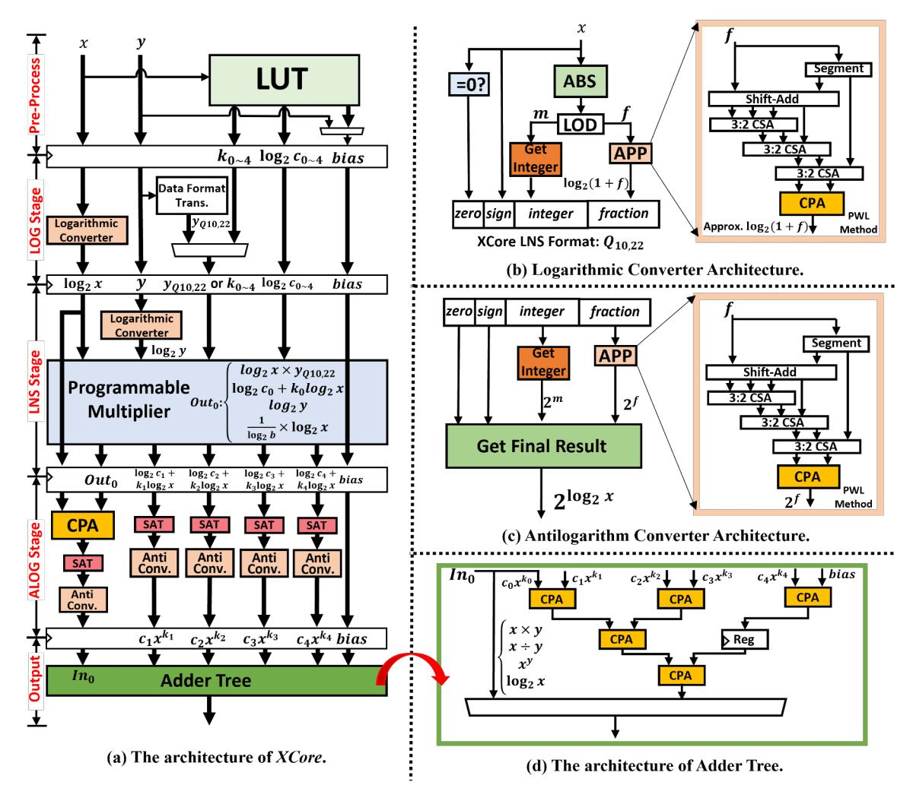

# E. LNS Stage

At this stage, a programmable 30b×30b multiplier can be configured to perform various operations. It uses five Booth encoders to generate partial products (30b×6b each), which are then summed by adders. Based on the operation modes, the different operations include: (1) Multiplication and division: In this mode, the input variable y is transformed into  $log_2y$  for the next stage by the logarithmic converter, without multiplication. Hence, the design choice of transforming y in this stage is that the APP unit in the logarithmic converter can reuse the idle adders in the multiplier, thereby reducing overhead. (2) Power and Logarithmic: With a 32-bit LNS format (2-bit sign and zero flags), the multiplier performs 30b×30b multiplication to compute  $y \times log_2 x$  or  $\frac{1}{log_2 b} \times log_2 x$ . (3) Polynomial: For 32bit data, only 6 bits are needed for  $k_i$  to cover the exponent range. Consequently, the multiplier is configured to perform five 30b×6b multiplications and five additions to generate each  $log_2c_i + k_ilog_2x$ . In Multiplication, Division, Power, and Logarithmic modes, the output is at  $out_0$ , while the outputs are across all the output ports in the Polynomial mode.

**Discussion:** Why maximum six terms? Considering both  $30b\times30b$  and  $30b\times6b$  multiplications are required by  $x^y$ ,  $log_bx$ , and polynomials in different modes, it's area-efficient to decompose the one 30-bit operand into five 6-bit operands by reusing most of the hardware resources. As a result, there are five polynomial terms with the variable x input, along with one constant term (i.e., bias) added in the output stage.

## F. ALOG Stage

When performing multiplication or division, the CPA in this stage is used to compute  $log_2x \pm log_2y$ . Subsequently, the saturation units (SATs) detect saturation/overflow and align the data format. Finally, each generated result is transformed into the ordinary arithmetic system by the antilogarithm converter, whose architecture is demonstrated below.

Fig. 2. The architecture of XCore, which employs a hybrid number system to handle different operations.

Antilogarithm Converter Architecture: Equation (10) defines the antilogarithm transformation, where m is the floor of  $log_2x$ . Consequently, as shown in Fig. 2(c), the antilogarithm transformation focuses on the  $2^f$  term. We use a similar PWL approach and a custom fine-tuning process to produce the optimized antilogarithm converter.

$$2^{\log_2 x} = 2^{m+f} = 2^m \cdot 2^f, 0 \le f < 1 \tag{10}$$

## G. Output Stage

When the target operations are Multiplication, Division, Power, and Logarithmic modes, the results are output directly in this stage. The adder tree shown in Fig. 2(d) is used in Polynomial mode to sum each polynomial term in the ordinary arithmetic system. Each Carry-propagate Adder (CPA) can be configured to perform fixed-point or floating-point addition, and one register is added at the output to improve timing performance. Overall, the latency of Multiplication, Division,

Power, and Logarithmic modes is four cycles, and the latency of Polynomial mode is seven cycles.

#### V. CHEBYSHEV-BASED APPROXIMATION ALGORITHM

