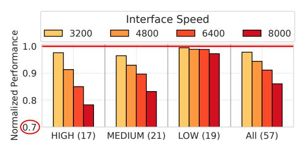
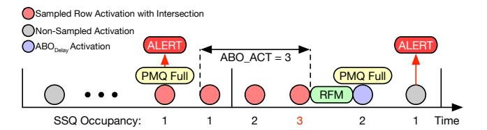
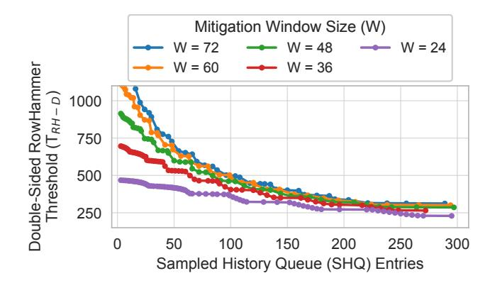
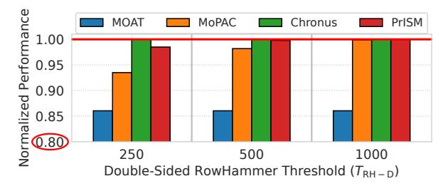

# *B. The RowHammer Vulnerability*

RowHammer is a read-disturbance phenomenon in which repeated activations of aggressor rows disturb charge in nearby victim rows and can induce bit flips [45], [48], [83], [85], [96]. The RowHammer threshold ( $T_{RH}$ ), the minimum number of activations needed to induce a bit flip, has decreased significantly across DRAM generations [42]. We use the double-sided threshold ( $T_{RH-D}$ ), where two aggressors adjacent to a victim are alternately hammered, as our primary metric.

RowHammer is both a security and a reliability concern. It has enabled attacks across CPUs and GPUs [28], [53], [97], including privilege escalation [54], [86], ML model degradation [26], [109], and other exploits [12], [13], [21], [22], [32], [74], [75]. Recent work also shows that RowHammer mitigations can introduce denial-of-service and timing-channel attack surfaces [7], [102], [104]. Bit flips have even been observed under benign workloads [55], further underscoring the need for secure and low-overhead RowHammer defenses.

#### C. Target Row Refresh and Refresh Management

Commodity DRAM has relied primarily on two in-DRAM RowHammer mitigation methods:

**Target Row Refresh** (**TRR**): TRR tracks potential aggressor rows using small per-bank trackers, typically with 4–28 entries, or probabilistic sampling [25], [33], [37]. It then refreshes nearby victim rows within a fixed blast radius (e.g., BR = 2) during periodic refreshes by borrowing time from the refresh cycle (tRFC)1 [25], [66]. However, TRR's limited tracking capacity makes it vulnerable to crafted access patterns, and prior works have bypassed TRR on DDR4 [19], [33], [50] and DDR5 devices [34], [60].

**Refresh Management (RFM)**: To address TRR's limitations, DDR5 introduced RFM [36]. The memory controller monitors per-bank activations and issues an RFM once a threshold is reached, allowing DRAM to perform RowHammer mitigations. DDR5 defines two RFM types: All-Bank RFM (RFMab), which applies mitigations across all banks, and Same-Bank RFM (RFMsb), which applies mitigations to the same bank ID across all bank groups (e.g., Bank 0 in every bank group).

## D. Per Row Activation Counting (PRAC)

To address the worsening RowHammer vulnerability, JEDEC standardized *Per Row Activation Counting (PRAC)* in the DDR5 specification [36]. PRAC enables precise aggressor tracking through two primary mechanisms.

**Per-Row Activation Counters**: Each DRAM row is equipped with counter cells [6]. On every activation, the corresponding counter is incremented via a read-modify-write during precharge, increasing core timings such as tRP and tRC.

**Alert Back-Off (ABO) Protocol:** PRAC also defines the Alert Back-Off (ABO) Protocol, which lets DRAM request mitigation time from the memory controller. When a counter or mitigation queue reaches the Back-Off threshold (NBO), DRAM asserts Alert; after up to 180ns during which the controller may continue issuing regular DRAM commands, the controller issues a configured number of RFMab commands

 $(N_{mit} \in \{1,2,4\})$ . Each RFMab stalls the entire channel for 350 ns, giving DRAM time to perform targeted refreshes. The current specification also requires an ABODelay of  $N_{mit}$  activations before a subsequent Alert.

Recent studies, including QPRAC [101] and MOAT [71], propose secure PRAC implementations that demonstrate robust RowHammer protection even at sub-100 TRH [10]. In this paper, we use QPRAC as our baseline PRAC design.

#### E. Pitfall of PRAC: Performance and Area Overhead

Secure PRAC designs can provide strong protection even at sub-100  $T_{RH}$ , but they suffer from two key drawbacks.

**Performance Overhead:** PRAC updates a per-row activation counter on every activation through a read–modify–write operation during precharge [36]. This increases key timing parameters: tRP rises from 16ns to 36ns  $(2.25\times)$ , and tRC rises from 48ns to 52ns [98]. As a result, row-buffer-conflict latency increases by 42%, while the longer tRC reduces the per-bank activation rate by 8%. Prior work reports an average slowdown of ~10% due to PRAC timing overheads [10], [98].

We further show that PRAC's performance overhead grows sharply with interface speed. Figure 2 shows PRAC performance across DDR5 data rates. PRAC incurs a 2.2% average slowdown at 3200 MT/s, but this rises to 14% at 8000 MT/s, where shorter tRRD and tFAW allow the controller to issue activations across banks more rapidly, exposing PRAC's fixed timing penalties more often2. As DRAM data rates continue to scale (e.g., up to 17.6Gb/s in DDR6 [93]), these timing penalties may become more significant.

Fig. 2. Normalized performance of PRAC [101] across DDR5 interface speeds. At 3200 MT/s, PRAC incurs a 2.2% slowdown, which rises to 14% at 8000 MT/s due to amplified timing penalties at higher data rates.

**Area Overhead**: PRAC also incurs notable area overhead because each row requires additional counter cells and update logic. An early Samsung DSAC work [27] estimates that these additions increase overall DRAM core area by roughly 9%, which is significant for the price-sensitive DRAM market.

PRAC is currently defined as an *optional* feature in the DDR5 specification [36]. DDR5 is expected to remain the dominant DRAM technology for several years before DDR6, where PRAC is expected to see broader adoption and may become mandatory, as discussed at DRAMSec'24 [93]. Developing practical, low-overhead RowHammer mitigations for current and near-term DDR5 systems is therefore critical.

&lt;sup>1We assume one TRR opportunity per two tREFI intervals, based on prior studies [25], [37]. Section VI-B evaluates sensitivity to this rate.

&lt;sup>2Appendix A provides a detailed comparison with recent real-system PRAC performance measurements [43].

#### *F. Scalability Limits of Probabilistic Mitigations*

Prior work has proposed lightweight probabilistic defenses such as PrIDE [\[31\]](#page-13-6) and MINT [\[72\]](#page-14-5), which require only a small in-DRAM state. MINT randomly selects one activation slot per *mitigation window*, defined as the maximum number of activations between mitigations, and mitigates the corresponding row at the window's end. At TRH-D≥1000, this design provides strong protection with negligible slowdown.

At lower TRH-D, however, probabilistic defenses face a fundamental *non-selection problem*: random sampling can miss an aggressively hammered row across multiple windows, allowing it to remain unmitigated long enough to induce bit flips. MINT maintains security at lower thresholds by statically increasing its mitigation rate and issuing RFMs more frequently, even when aggressive behavior is absent. Each RFM temporarily blocks memory requests during mitigation, reducing effective DRAM bandwidth. For example, MINT issues an RFM every 24 activations at TRH-D of 500 and every 11 activations at TRH-D of 250, reducing available bandwidth by nearly 23% and 40%. On high-memory-intensity workloads, this causes 7.1% and 17.5% slowdown, respectively. Thus, while MINT remains highly storage-efficient, its fixed-rate scaling becomes increasingly costly at low TRH-D. Our goal is to design a scalable probabilistic mitigation that preserves high performance even at low thresholds.

## III. PRISM: A SCALABLE PROBABILISTIC MITIGATION

We propose PrISM, Probabilistic Intersection-based Sampling Mitigation, a scalable probabilistic RowHammer mitigation that solves the *non-selection problem*. Fixed-rate probabilistic defenses such as MINT [\[72\]](#page-14-5) provide strong protection and require extremely small in-DRAM state, but at low thresholds (TRH-D ≤ 500), they must issue RFMs frequently even when the system is not under attack, reducing effective memory bandwidth and degrading performance.

To solve this, PrISM correlates sampled row addresses across mitigation windows and requests *additional* mitigations through the Alert Back-Off (ABO) protocol only when repeated sampled activity is observed. In each mitigation window, PrISM samples multiple activation slots and compares the sampled rows against a bounded history of previously sampled rows. We define an *intersection* as a match between a newly sampled row and a row in this history. A heavily activated row is more likely to reappear across windows and create intersections, making it eligible for additional mitigations. In contrast, benign rows accessed irregularly are less likely to create intersections, avoiding unnecessary mitigations.

This allows PrISM to use a larger default window W than MINT, reducing the default RFM rate while preserving strong RowHammer protection. As a result, PrISM scales to lower TRH-D without uniformly increasing mitigation frequency, preserving performance relative to fixed-rate probabilistic defenses. Compared to PRAC, PrISM avoids DRAM array changes, per-row counters, and counter updates on every activation, reducing both performance and area overhead.

#### *A. Design of PrISM*

PrISM enables intersection-based additional mitigations using three per-bank structures, as shown in Figure [3.](#page-3-0) The Sampled Slot Queue (SSQ) buffers row addresses of sampled and activated slots, from which PrISM selects the default mitigation candidate at the end of each window. The Sampled History Queue (SHQ) retains sampled-but-unselected rows from the previous L windows, called the lookback window, and serves as the history for intersection checks. When a newly sampled row matches an SHQ entry, PrISM enqueues the intersecting row into the Pending Mitigation Queue (PMQ) for additional mitigation. PrISM also enqueues one randomly selected non-intersecting sample as the default mitigation candidate, so each window still contributes one default probabilistic mitigation. The remaining sampled-but-unselected rows are inserted into the SHQ for future intersection checks.

The PMQ buffers rows selected for mitigation but not yet serviced. Each entry contains a row address and an activation counter that tracks activations while the row resides in the PMQ. At each mitigation opportunity, PrISM mitigates the highest-count entry and dequeues it; if the PMQ becomes full or any entry's counter exceeds the *tardiness threshold* (TPMQ), PrISM requests additional mitigation through the existing ABO protocol. Unless otherwise stated, we use a 16-entry PMQ and set TPMQ to 4.

By decoupling mitigation selection from mitigation service, the PMQ provides three benefits. First, it makes PrISM compatible with refresh and RFM postponement [\[36\]](#page-13-2), since selected rows can wait until a mitigation opportunity becomes available. Second, because Alert is observed at the channel level while banks complete windows at different times, perbank PMQs let other banks retain useful pending entries when any bank raises Alert; an ABO-triggered RFM can then service pending rows across banks, reducing future Alerts.

Fig. 3. Design and operation of PrISM. In each mitigation window, PrISM samples a few activation slots into the Sampled Slot Queue (SSQ) and checks them against the Sampled History Queue (SHQ), which stores sampled-butunselected rows from recent windows. Rows that intersect with the SHQ are enqueued into the Pending Mitigation Queue (PMQ) for additional mitigation. PrISM also randomly selects one non-intersecting sampled row for the PMQ as the default mitigation candidate, while inserting the remaining sampledbut-unselected rows into the SHQ. For each default mitigation opportunity (TRR or RFM), PrISM mitigates and removes the highest-count PMQ entry. If the PMQ becomes full or any entry's count exceeds TPMQ, PrISM asserts Alert to request an additional mitigation.

Third, intersecting rows may be serviced by default TRR/RFM opportunities before Alert becomes necessary, further reducing the Alert frequency and improving performance.

#### B. Operation of PrISM

Like MINT, PrISM operates on fixed-size mitigation windows. However, PrISM can use a longer default window W because it requests additional mitigations when repeated sampled activity creates intersections. Figure 3 illustrates the operation of PrISM. 1 At the beginning of each mitigation window, PrISM randomly samples R activation slots out of the W slots and records each sampled-and-activated row in the SSQ. 2 When a sampled activation occurs, PrISM checks whether the activated row matches any SHQ entry. 3 If the row produces an intersection, PrISM enqueues it into the PMQ for additional mitigation. 4 At the end of the window, PrISM randomly selects one non-intersecting sampled row from the SSQ and enqueues it into the PMQ as the default mitigation candidate. This ensures that each window contributes one default probabilistic mitigation, regardless of whether intersections occur. **5** PrISM then updates the SHQ in FIFO order. Up to R-1 sampled-but-unselected rows from the current window are enqueued, while the oldest entries are evicted. If fewer than R-1 such rows exist because some sampled slots were never activated, PrISM inserts invalid placeholders to keep the lookback window L deterministic. 6 At each default mitigation opportunity, such as a TRR during a refresh or an RFM, PrISM mitigates and removes the PMQ entry with the highest activation count. If the PMQ becomes full or any entry's counter exceeds TPMO, PrISM requests an additional mitigation via the Alert Back-Off (ABO) protocol, again servicing the entry with the highest counter.

Under benign workloads, intersections are infrequent because most rows are accessed sparsely and irregularly [78], [81], [101], [102]. In these common cases, the PMQ is mainly populated by default mitigation candidates, which are drained by upcoming default mitigations. PrISM therefore issues few Alerts and incurs negligible performance overhead.

## C. JEDEC-Compatible Operation of PrISM

PrISM uses the existing JEDEC ABO protocol to request additional mitigations with *one* RFM per Alert. The key challenge is that Alert does not immediately drain a pending mitigation: after Alert, up to three activations (ABOACT) can occur before the corresponding RFM, and one ABODelay activation is required before Alert can be reasserted. Thus, under one RFM per Alert, ABO can drain only one pending entry every four activations, while the worst case can produce one intersection per activation. PrISM handles this by sizing the Sampled Slot Queue (SSQ) to temporarily buffer intersecting samples until PMQ entries are freed.

Figure 4 illustrates this worst case for R=2. Since PrISM samples R slots uniformly at random per window, all R slots can cluster near the boundary of two adjacent windows, and all may intersect with the SHQ, producing up to 2R intersections in 2R consecutive activations. The first intersection enters the

PMQ and triggers Alert; the remaining intersections wait in the SSQ until ABO frees PMQ slots. Because ABO drains one pending entry every four activations, the SSQ must cover the peak number of waiting intersections during the burst. Of the 2R-1 intersections after the first,  $\lfloor (2R-1)/4 \rfloor$  can be drained before the burst completes. Thus, the required SSQ size is:

$$S_{\rm SSQ} \ge (2R - 1) - \left| \frac{2R - 1}{4} \right|$$
 (1)

For our largest evaluated R=9, this bound requires 13 SSQ entries. Beyond a single boundary burst, repeated bursts remain bounded as long as the long-run intersection rate does not exceed the ABO drain rate. Since at most R samples can intersect per W-activation window,  $W \geq 4R$  is sufficient.

Fig. 4. Sampled slots can cluster near adjacent-window boundaries, and all intersect with the SHQ, producing intersections faster than ABO can drain. The SSQ buffers intersecting samples that cannot yet enter the PMQ.

#### D. Address Mapping for Ultra-Low TRH-D

At ultra-low  $T_{RH-D}$  ( $\leq 250$ ), even benign workloads can create frequent intersections because conventional mappings preserve spatial locality. For example, Minimalist Open-Page (MOP) mapping [38] places nearby cache lines in the same DRAM row, improving row-buffer locality but also causing the same row to be sampled across multiple windows, reappear in the SHQ, and trigger unnecessary Alerts.

To reduce this overhead, PrISM uses randomized address mapping only for ultra-low  $T_{RH\text{-}D}$  configurations. Randomized mapping spreads nearby cache lines across many DRAM rows, reducing persistent row-level locality. We use Rubix-style randomization [81], following prior work [70]. Table I shows the average per-channel Alert rate under both mappings. Randomization reduces benign Alerts across all thresholds, with the largest absolute reduction at  $T_{RH\text{-}D}=250$ , where it cuts the Alert rate from 312.3 to 50.3 per 1K tREFI (6.2×). Thus, PrISM enables randomized mapping only at ultra-low  $T_{RH\text{-}D}~(\le 250)$ , while retaining conventional mapping at higher thresholds, where Alert rates are already low and preserving row-buffer locality is preferable.

TABLE I
AVERAGE PER-CHANNEL ALERT RATE OF PRISM

| Target T RH-D | MOP Alerts / 1K tREFI | Random Alerts / 1K tREFI | Reduction |
|--------------------------|--------------------------|-----------------------------|-----------|
| 1000                     | 2.4                      | 0.04                        | 60×       |
| 500                      | 32.2                     | 3.5                         | 9.2×      |
| 250                      | 312.3                    | 50.3                        | 6.2×      |

#### IV. SECURITY ANALYSIS OF PRISM

We analyze the security of PrISM against an attack pattern that maximizes the number of unmitigated activations to any aggressor row within a 32ms refresh window (tREFW). We quantify security using the *Mean-Time-to-Failure (MTTF)* metric. Unless otherwise stated, we target a per-bank MTTF of 10,000 years, comparable to the intrinsic DRAM soft-error rate [5], consistent with prior work [31], [70], [72], [98].

#### A. Worst-Case Attack: Circular-X-Rows Attack

The attacker must balance two competing goals. First, it wants to maximize the number of activations delivered to aggressor rows within tREFW. Second, it wants each aggressor to avoid PrISM's mitigations, including the default mitigation applied in every window and the additional intersection-based mitigations provided by SHQ. Repeated sampling increases the chance that a row is mitigated by the default mitigation or creates intersections that make the row eligible for additional mitigation. The worst-case pattern for PrISM is therefore the pattern that uses the full activation budget within tREFW while spreading activations across enough rows to minimize avoidable default selections and intersections.

We model this worst case using a Circular-X-rows attack. The attacker chooses X aggressor rows and repeatedly activates them in a round-robin manner, one row per activation slot. For a mitigation window of W activation slots, the row activated at slot s of window t is:

$$row(t, s) = (tW + s) \bmod X \tag{2}$$

The single parameter X controls the entire attack spectrum, exposing a fundamental trade-off between hammering rate per aggressor and evasion of SHQ intersections. Sweeping X over [W, (L+1)W] captures all meaningful attacker strategies:

- X = W: Every window contains W distinct rows hammered once each. This maximizes the activation rate per aggressor, but it also maximizes exposure to PrISM because the same rows repeatedly appear within the SHQ lookback window. This corresponds to the multi-row, single-copy pattern analyzed by MINT [72].
- 2) W < X < (L+1)W: The attacker spreads activations across more aggressor rows. This reduces the chance that a row reappears within the L-window SHQ history and therefore lowers the probability of intersections. However, it also reduces the number of activations delivered to each aggressor within tREFW. Thus, intermediate X values capture the fundamental tradeoff between hammering rate and mitigation exposure.
- 3) X=(L+1)W: The target row reappears exactly at the edge of the lookback window, completely evading SHQ intersections. Any larger X also evades intersections but reduces per-aggressor hammering rate by a factor of  $\frac{X}{(L+1)W}$ , weakening the attack. We therefore do not sweep beyond X=(L+1)W.

Three properties establish why the circular-X-rows pattern captures the worst case for PrISM.

- 1. Intra-window ordering is irrelevant: Because PrISM samples R slots uniformly at random from the W slots of a window, a row's sampling probability depends only on how many times it appears in the window, not on where those appearances fall [72]. Reordering activations within a window cannot change the probability of default selection, SHQ insertion, or intersection.
- **2.** Using one copy per row per window is worst-case: If a row appears *c* times within a single window, its probability of being sampled at least once is:

$$P_{\text{sample}}(c) = 1 - \frac{\binom{W-c}{R}}{\binom{W}{R}} \tag{3}$$

 $P_{\rm sample}(c)$  increases with c, making the row more likely to be selected by the default mitigation, inserted into the SHQ, or causing additional mitigations through intersections. Additional copies of the same row also consume activation slots that could instead be used to attack other rows. Thus, to maximize the number of independent aggressors while minimizing avoidable sampling exposure, the attacker should activate each aggressor at most once per window.

**3. Round-robin spacing is the strongest single-copy schedule:** Under the single-copy constraint, the attacker's only remaining choice is how frequently to activate each row across windows. Clustering repeated activations of the same row increases the chance that the row remains within the *L*-window SHQ history, creating more intersections. Spreading activations avoids intersections, but reduces the per-aggressor hammering rate. Neither direction beats the optimal stationary spacing, so a periodic round-robin is optimal in the worst case.

## B. Determining Minimum Supported TRH-D of PrISM

The security of PrISM is determined by *three* design parameters: the window size (W), the number of per-window sampled slots (R), and the lookback window (L). For each (W, R, L), we sweep  $X \in [W, (L+1)W]$  and take the maximum required  $T_{RH-D}$  as the security bound.

**Per-window mitigation probability:** For a circular-X-rows attack, let K denote the number of prior appearances of the same aggressor that fall within the SHQ's L lookback window (approximately  $L \cdot W/X$ ). We model this SHQ residency probability with the following steady-state fixed point3:

$$P_{\text{SHQ}} = \frac{K\left(R - 1 + (P_{\text{SHQ}})^R\right)}{W + K \cdot R} \tag{4}$$

Furthermore, PrISM prioritizes rows *not* already present in the SHQ for default mitigation. Thus, the default mitigation contributes a new mitigation only when at least one of the R sampled rows is absent from the SHQ. The probability that all R sampled rows are already present in the SHQ is approximately  $(P_{\text{SHQ}})^R$ . Combining the effective default

&lt;sup>3Appendix B provides the complete derivation for this occupancy model.

mitigation with the intersection-based mitigation, the perwindow mitigation probability is:

$$P_{m} = \underbrace{\frac{1 - (P_{\text{SHQ}})^{R}}{W}}_{\text{default mitigation}} + \underbrace{\frac{R}{W} \cdot P_{\text{SHQ}}}_{\text{intersection-based eligibility}} \tag{5}$$

We then apply the Saroiu-Wolman model [79] to convert  $P_m$  into the minimum  $T_{RH-D}$  that meets our target MTTF (10,000 years), and sweep  $X \in [W, (L+1)W]$  to find the worst-case  $X^*$  for each (W, R, L).

Impact of R and L at fixed W: Figure 5 shows the supported  $T_{RH-D}$  as we vary the number of sampled activation slots (R) and the SHQ lookback window (L), at a window size of W=72. Increasing either R or L improves security. A larger R increases the probability of sampling an aggressor in each window, increasing the chance that any hammered row is mitigated by the default mitigation or SHQ intersection. Larger L expands the history window, increasing the chance that an aggressor reappearing across windows produces an intersection. For example, PrISM can support  $T_{RH-D}$  of 954 with R=3 and L=25, while raising R to 8 at the same L brings the supported  $T_{RH-D}$  down to 494. We validate our analytical model using a 5-million-epoch Monte Carlo simulation that closely matches it.

Fig. 5. Minimum supported  $T_{RH-D}$  of PrISM under the worst-case circular-X-rows attack at W=72, across sampled activation slots (R) and lookback windows (L). Larger R and L jointly increase the per-window mitigation probability, sharply lowering the supported  $T_{RH-D}$ .

Impact of W: Figure 6 shows the supported  $T_{RH-D}$  as we vary the Sampled History Queue (SHQ) size and window size (W), with R swept subject to  $W \geq 4R$  (Section III-C). Smaller W lowers the supported  $T_{RH-D}$  at low SHQ capacities by raising both the default mitigation rate (1/W) and the probability that an aggressor is sampled into the SHQ. For example, at  $\sim 40$  SHQ entries, W=24 supports  $T_{RH-D}$  of 425, while W=72 remains above 700. However, this benefit diminishes at larger SHQ sizes ( $\geq 150$  entries), where the SHQ already provides enough history for persistent aggressors to intersect with high probability. Smaller W is therefore most useful for ultra-low  $T_{RH-D}$  under a constrained SHQ budget.

**Impact of T\_{PMQ}:** The analysis so far has assumed that a row selected for mitigation is mitigated immediately, yielding the

Fig. 6. Minimum Supported  $T_{RH-D}$  of PrISM under the worst-case circular-X-rows attack with varying SHQ size and W. Smaller W lowers the supported  $T_{RH-D}$  at low SHQ capacities, but its benefit diminishes once the SHQ provides enough history for repeated samples to intersect with high probability.

base threshold  $\widehat{T}_{RH\text{-}D}$ . In PrISM, however, a selected row may remain in the Pending Mitigation Queue (PMQ) until it is serviced by a default mitigation (TRR or RFM) or through Alert Back-Off (ABO) protocol. While the row resides in the PMQ, it can accumulate further activations up to the *tardiness threshold* ( $T_{PMQ}$ ) before Alert is asserted. Thus, the PMQ-aware supported threshold becomes  $T_{RH\text{-}D} = \widehat{T}_{RH\text{-}D} + T_{PMQ}$ . We use  $T_{PMO} = 4$  as the default.

Impact of activations during Alert Back-Off (ABOACT): PrISM uses the existing JEDEC ABO protocol with one RFM per ABO. The protocol allows up to 3 activations (ABOACT) before the corresponding RFM is issued. Moreover, a subsequent Alert can only be raised once the controller receives the activations that match the number of RFMs during ABO. With a PMQ size of Q, an attacker can exploit these slack activations by preparing Q-1 entries near  $T_{PMQ}$ , then forcing a sequence of chained Alerts, analogous to the *Feinting* [58] and *Wave* [111] attacks against PRAC [71], [101]. This chain accumulates up to ABOACT(Q) additional activations on a targeted row before it is mitigated. The supported threshold of PrISM therefore becomes  $T_{RH-D} = \hat{T}_{RH-D} + T_{PMQ} + ABO_{ACT}(Q)$ . For our default PMQ size of 16, ABOACT(Q) is 12, which combined with  $T_{PMQ}$  of 4 gives  $T_{RH-D} = \hat{T}_{RH-D} + 16$ .

#### C. Determining PrISM Configurations

PrISM can support a target  $T_{RH-D}$  through different combinations of (W,R,L). These parameters trade off performance and storage in different ways. Increasing R sharply lowers  $T_{RH-D}$  by raising both per-window sampling and the probability of intersections, allowing PrISM to support lower  $T_{RH-D}$  with fewer SHQ entries. However, larger R also increases the maximum number of possible intersections per window (R-1), which can raise Alert frequency and degrade performance. It can also make PrISM more vulnerable to potential  $Denial-of-Service\ (DoS)$  attacks, in which an adversary intentionally causes frequent intersections to trigger repeated Alerts (see Section VII for a detailed DoS analysis). Smaller W similarly reduces the required SHQ storage, particularly when the SHQ budget is tight, as shown in Figure 6. However,

a smaller W also leads to more frequent proactive RFMs, causing higher slowdown. We therefore choose the default configuration that balances performance and storage.

Table II shows the selected PrISM configurations. We use W=72 whenever the target threshold can be met without an overly large R, preserving the lowest proactive RFM rate for  $T_{RH-D} \geq 500$ . For ultra-low  $T_{RH-D}$  of 250, we reduce W to 48 to keep the SHQ size practical without relying on a large R. Overall, PrISM maintains practical hardware overhead. For  $T_{RH-D}$  of 1000, it requires only a 36-entry SHQ, comparable to the TRR tracker already deployed in commercial DRAM [33]. Even at a  $T_{RH-D}$  of 250, PrISM requires 632 entries, which remain  $10-100\times$  smaller than prior secure in-DRAM mitigations such as Mithril [46] and ProTRR [58] at the same threshold.

TABLE II
PRISM CONFIGURATIONS FOR TARGET ROWHAMMER THRESHOLDS

| Target T RH-D | Supported T RH-D | Window Size (W) | Sampled Slots (R) | Lookback Window (L) | SHQ Entries $((R-1) \times L)$ |
|-----------------------------|--------------------------------|--------------------|----------------------|------------------------|--------------------------------|
| 1000                        | 975                            | 72                 | 4                    | 12                     | 36                             |
| 750                         | 731                            | 72                 | 7                    | 11                     | 66                             |
| 500                         | 499                            | 72                 | 7                    | 41                     | 246                            |
| 250                         | 249                            | 48                 | 9                    | 79                     | 632                            |

## D. Sensitivity to Mean-Time-to-Failure (MTTF)

We next evaluate how the supported  $T_{RH-D}$  of our chosen PrISM configurations changes under different MTTF targets. Table III reports the supported TRH-D for each configuration across a range of per-bank MTTF values, along with the corresponding system-level MTTF. We derive the system-level MTTF assuming an attacker targets up to 24 banks in parallel out of our 32-bank system, thereby maximizing the per-bank activation rate under the tFAW constraint. Targeting more banks would throttle the per-bank hammer rate and weaken the attack. PrISM provides strong protection across a wide MTTF range with practical SHQ sizes. For example, raising the per-bank MTTF target from 10K to 1M years (system MTTF from 417 to 41.7K years) shifts the supported TRH-D of the 66-entry configuration from 731 to 786, and the 36entry configuration from 975 to 1069, a small relaxation in the supported threshold for a 100× improvement in MTTF.

 $TABLE \; III \\ SUPPORTED \; T_{RH-D} \; OF \; PRISM \; with \; Varying \; Mean-Time-To-Failure \\$ 

|             |                  | Selected PrISM Configuration |            |            |            |
|-------------|------------------|------------------------------|------------|------------|------------|
| Target MTTF | Target MTTF      | 1K cfg.                      | 750 cfg.   | 500 cfg.   | 250 cfg.   |
| (Bank)      | (System)         | 36 SHQ                       | 66 SHQ     | 246 SHQ    | 632 SHQ    |
| 1K years    | 41.7 years       | 944                          | 720        | 478        | 247        |
| 10K years   | <b>417 years</b> | <b>975</b>                   | <b>731</b> | <b>499</b> | <b>249</b> |
| 100K years  | 4.17K years      | 1017                         | 747        | 507        | 262        |
| 1M years    | 41.7K years      | 1069                         | 786        | 525        | 274        |

#### V. EVALUATION METHODOLOGY

**Simulation Framework:** We evaluate PrISM using Ramulator2 [49], [57], a cycle-accurate, trace-based DRAM simulator. Following prior work [68], [101], [102], [107], we

TABLE IV SYSTEM CONFIGURATION

| Out-Of-Order Cores                                                                                                                        | 8 Cores, 4GHz, 4-wide, 512-entry ROB                                                                                                                   |
|-------------------------------------------------------------------------------------------------------------------------------------------|--------------------------------------------------------------------------------------------------------------------------------------------------------|
| Last Level Cache (Shared)                                                                                                                 | 16MB, 8-way, 32 MSHRs per core                                                                                                                         |
| Address Mapping                                                                                                                           | Minimalist Open-Page (MOP) [38]                                                                                                                        |
| Scheduling Policy                                                                                                                         | FR-FCFS [76], [115] with a cap of 1 [63]                                                                                                               |
| Memory Type DRAM Organization Rows Per Bank, Size tRCD, tCL, tRAS tRP, tRTP, tWR, tRC tRFC, tREFI tRFM ab , tRFM sb | 32Gb DDR5-8000B 4 Bank × 8 Groups × 1 Rank × 1 Channel 128K, 8KB 16ns, 16ns, 32ns 16ns, 7.5ns, 30ns, 48ns 410 ns, 3.9µs 350ns, 190ns |

TABLE V
WORKLOAD CATEGORIZATION BASED ON RBMPKI

| RBMPKI                | Workloads                                                                                                                                                                                                                                       |
|-----------------------|-------------------------------------------------------------------------------------------------------------------------------------------------------------------------------------------------------------------------------------------------|
| High (17) [10+) | 429.mcf, 470.lbm, 434.zeusmp, 519.lbm, 549.fotonik3d, 459.GemsFDTD, 450.soplex, 462.libquantum, 433.milc, 437.leslie3d, 510.parest, 520.omnetpp, 483.xalancbmk, wc_8443, wc_map0, 482.sphinx3, tpch2                                            |
| Medium (21) [1, 10)   | 471.omnetpp, grep_map0, 473.astar, 505.mcf, tpch17, 436.cactusADM, jp2_decode, 507.cactuBSSN, 557.xz, tpcc64, jp2_encode, ycsb_aserver, ycsb_eserver, ycsb_beserver, ycsb_dserver, 500.perlbench, 523.xalancbmk, tpch6, ycsb_abgsave, 456.hmmer |
| Low (19) [0, 1)       | 401.bzip2, 502.gcc, 435.gromacs, 458.sjeng, 445.gobmk, 525.x264, 508.namd, 531.deepsjeng, 544.nab, 526.blender, 403.gcc, 464.h264ref, h264_encode, 447.dealII, 444.namd, 481.wrf, 541.leela, 538.imagick, 511.povray                            |

employ Ramulator2's internal out-of-order (OoO) core model4. Our baseline system consists of an 8-core OoO processor, a 16MB shared LLC, and a single-channel, single-rank DDR5 configuration with 32GB of DRAM. The memory controller uses the Minimalist Open-Page address mapping [38] and a First-Ready First-Come First-Served scheduler [76], [115]. The DRAM is modeled as a 32Gb DDR5-8000B device with timing parameters from the JEDEC DDR5 specification [36]. Table IV shows the detailed system configuration.

**Evaluated Design:** We compare PrISM against two in-DRAM RowHammer mitigations: (1) Per Row Activation Counting (PRAC) [36] and (2) the state-of-the-art probabilistic scheme MINT [72]. For PRAC, we adopt QPRAC [101] as a secure baseline: each Alert triggers one RFM, and a 5-entry priority service queue tracks aggressor candidates for mitigation. We tune the Back-Off threshold for each target TRH-D following QPRAC's publicly available security model. For MINT, we follow its design with a delayed mitigation queue to support refresh and RFM postponement. The mitigation window size is set following the original work [72]: for TRH-D of 250, 500, and 1000, the window is 11, 24, and 48 activations, respectively.

For PrISM, we configure the mitigation window (W), the number of sampled slots (R), and lookback window (L) according to Table II for each target  $T_{\rm RH-D}$ . We use a 16-entry Pending Mitigation Queue (PMQ) by default.

4We validated the internal core model by reproducing the PRAC interface-speed experiment in Figure 2 using the open-source ChampSim–Ramulator2 integration from prior work [103], [104]. Performance from the two setups agreed within 1.2% across 3200–8000MT/s DDR5 speeds and showed matching trends, so we report results using Ramulator2's internal core model.

Fig. 7. Performance of PrISM at  $T_{RH-D}$  of 250, 500, and 1000, compared to MINT [72] and PRAC [101]. MINT incurs low slowdown at higher  $T_{RH-D}$ , but its slowdown increases as  $T_{RH-D}$  drops because lower thresholds require more frequent fixed-rate RFMs to address the non-selection problem. PRAC incurs roughly 14% average slowdown across thresholds because its overhead is dominated by inflated timing parameters. In contrast, PrISM incurs negligible slowdown ( $\leq 0.2\%$ ) at  $T_{RH-D} \geq 500$  and only 1.5% at ultra-low  $T_{RH-D}$  of 250, since intersections are infrequent on benign workloads.

Fig. 8. RFM frequency per tREFI per channel for PrISM, MINT, and PRAC. MINT requires more frequent fixed-rate RFMs as  $T_{RH-D}$  drops, explaining its higher slowdown at low  $T_{RH-D}$ . PrISM issues fewer RFMs by keeping the default mitigation rate low and requesting additional RFMs through Alert Back-Off only on intersections. PRAC's precise per-row tracking yields negligible RFMs but still incurs overhead from inflated timing parameters.

Workloads: We evaluate 57 open-source workloads in Ramulator2 [77], drawn from SPEC2006/2017 [15], [89], TPC [95], Hadoop [18], MediaBench [20], and YCSB [14], classified by row-buffer misses per kilo-instruction (RBMPKI) as summarized in Table V. We run 8-core homogeneous mixes, with each core executing 250 million instructions for 2 billion instructions per run. By default, we issue one Target Row Refresh (TRR) every two refresh intervals and use Same-Bank RFM (RFMsb) for proactive RFM. We also evaluate sensitivity to TRR frequency and PMQ size. Performance is reported as weighted speedup over a non-secure DDR5 baseline.

#### VI. RESULTS AND ANALYSIS

#### A. Performance Overhead

Figure 7 compares the performance of PrISM, MINT, and PRAC across  $T_{RH\text{-}D}$  values of 250, 500, and 1000. PrISM achieves the lowest slowdown among the evaluated designs. For  $T_{RH\text{-}D} \geq 500$ , PrISM incurs negligible slowdown (under 1%), and only 1.5% even at the ultra-low  $T_{RH\text{-}D}$  of 250. The

modest increase at low  $T_{RH-D}$  comes mainly from the shorter mitigation window, which increases the proactive RFM rate. As shown in Figure 8, PrISM issues only 0.03 RFMs per tREFI at  $T_{RH-D}$  of 500, and 0.45 at  $T_{RH-D}$  of 250.

MINT has low overhead at higher thresholds, but its overhead grows as TRH-D drops because it raises its fixed mitigation rate to maintain security, reducing effective memory bandwidth. As Figure 8 shows, MINT issues only 0.2 RFMs per tREFI at TRH-D of 1000, but 4 at TRH-D of 250, leading to 3.8% and 10.7% average slowdown at TRH-D of 500 and 250, respectively. The impact is most pronounced on high-memory-intensity workloads. For example, on 429.mcf, MINT issues nearly 4 and 10 RFMs per tREFI at TRH-D of 500 and 250, causing about 10% and 21.9% slowdown, respectively, while PrISM stays under 3.2% on the same workload across all thresholds. At TRH-D of 250, MINT's slowdown even exceeds PRAC's on several workloads (e.g., 470.lbm, 434.zeusmp, 520.omnetpp). In contrast, PrISM's worst-case per-workload slowdown stays at 9.4% (510.parest) even at TRH-D of 250.

PRAC issues virtually no RFMs thanks to its precise perrow tracking. However, its inflated timing parameters (tRP and tRC) from counter updates on every activation cause roughly 14% average slowdown across thresholds, exceeding 20% on several workloads such as 510.parest and  $wc_8443$ . Overall, PrISM avoids the frequent fixed-rate RFMs required by MINT at low  $T_{RH-D}$  and the timing overhead of PRAC, providing the lowest slowdown among the evaluated designs, especially for high-memory-intensity workloads at low  $T_{RH-D}$ .

#### B. Sensitivity to Target Row Refresh Ratio

Figure 9 compares the performance of PrISM, MINT, and PRAC as the Target Row Refresh (TRR) rate varies at TRH-D of 500. Lower TRR rates degrade both MINT and PrISM because they require more proactive RFMs rather than piggybacking mitigations onto TRR. With one TRR per tREFI, PrISM incurs negligible slowdown (<0.1%). Without TRR, PrISM issues an RFM roughly every 72 activations, increasing slowdown to 3.2%. Similarly, MINT's slowdown increases from 1.2% with one TRR per tREFI to 7.2% without TRR. In contrast, PRAC remains near 14% slowdown across TRR settings because its overhead is dominated by increased timing parameters rather than mitigation frequency. Overall, PrISM achieves the lowest slowdown across all TRR rates.

Fig. 9. Performance impact of TRR rate for PrISM, PRAC, and MINT at  $T_{RH-D}$  of 500. Lower TRR rates increase reliance on proactive RFMs, degrading MINT and PrISM performance, while PRAC remains nearly constant because its slowdown stems primarily from increased timing parameters. Overall, PrISM achieves the lowest slowdown across all TRR settings.

#### C. Sensitivity to Pending Mitigation Queue Size

Table VI evaluates the impact of PrISM's Pending Mitigation Queue (PMQ) size at  $T_{RH-D}$  of 500. A larger PMQ improves performance because rows selected through intersections can wait longer for default TRR or RFM opportunities, reducing the number of Alerts. However, it also increases storage and the worst-case activations an adversary can accumulate via delayed chained-Alert behavior (Section IV-B). Since performance saturates at a 16-entry PMQ (matching the 32-entry case at 0.2%), we use 16 entries by default.

TABLE VI IMPACT OF PMQ SIZE ON  $ABO_{ACT}(\boldsymbol{Q})$  and Performance

| PMQ Size | $ABO_{ACT}(Q)$ | Performance Overhead |
|----------|----------------|----------------------|
| 4        | 7              | 0.6%                 |
| 8        | 10             | 0.3%                 |
| 16       | 12             | 0.2%                 |
| 32       | 14             | 0.2%                 |

#### D. Storage and Power Overhead

**Storage:** PrISM uses three per-bank structures: a Sampled History Queue (SHQ), a 13-entry Sampled Slot Queue (SSQ), and a 16-entry Pending Mitigation Queue (PMQ). Each SHQ and SSQ entry stores a 17-bit row address and a valid bit (18 bits total), and each PMQ entry additionally stores a 3-bit saturating activation counter. At TRH-D of 1000, PrISM requires a 36-entry SHQ, resulting in 152B of SRAM per bank; at TRH-D of 500, it requires 625B per bank.

This storage is substantially smaller than secure counterbased in-DRAM mitigations across all evaluated thresholds. At  $T_{RH-D}$  of 1000, Mithril [46] requires 1082 27-bit entries even when issuing an RFM every 16 activations, the highest RFM rate defined in the DDR5 specification [36]; this is roughly 24× more storage than PrISM. ProTRR [88] requires more than 16K entries per bank at the same threshold, or roughly 363× more storage than PrISM. The gap narrows at lower thresholds but remains substantial: Mithril requires 20× ( $T_{RH-D}$  of 500) and 13× ( $T_{RH-D}$  of 250) more storage than PrISM, while ProTRR requires 170× and 154×, respectively. Thus, PrISM provides secure RowHammer protection with low slowdown while requiring one to two orders of magnitude less storage than secure counter-based in-DRAM mitigations.

**Power:** PrISM refreshes up to 4 victim rows per selected aggressor. Using the Micron power calculator [61], we estimate that these refreshes would account for 2.8% of DRAM power if issued every tREFI. However, even at TRH-D of 250, PrISM triggers Alert-induced mitigations only once every 20 tREFI on average, keeping refresh-related power overhead at 0.14%.

PrISM also requires random sampling, which can be implemented using an in-DRAM pseudo-random number generator (PRNG) or true random number generator (TRNG), as in prior in-DRAM probabilistic schemes [27], [31], [72]. Following MINT [72], we assume a 7-bit TRNG [39], [113] that consumes 90  $\mu$ W of static and 200  $\mu$ W of dynamic power (290  $\mu$ W total), three orders of magnitude lower than DRAM chip power. We also estimate the dynamic power of PrISM's SRAM structures using CACTI-7.0 [4]: 1.5 mW at TRH-D of 500 and 2.4 mW at TRH-D of 250, corresponding to 0.6% and 1.0% of the 245 mW DRAM chip power estimated by the Micron power calculator [61]. Overall, PrISM incurs low power overhead. PrISM can also leverage recent in-DRAM TRNG designs [41], [65], [67], [94], which generate high-entropy bits from stochastic DRAM phenomena such as reduced-latency activation failures. PrISM's per-activation logic fits within tRC and incurs no DRAM timing overhead.

## VII. ANALYZING DOS VULNERABILITY OF PRISM

PrISM uses the existing Alert Back-Off (ABO) protocol to request additional mitigations when repeated sampled activity creates SHQ intersections. Since ABO stalls an entire DRAM channel while RFMs are serviced, frequent Alerts can reduce bandwidth available to co-running applications. PrISM also performs default mitigations through periodic proactive RFMs, which consume additional bandwidth. An adversary can therefore exploit both sources of mitigation traffic to mount a

*denial-of-service (DoS)* attack, similar to prior performance attacks on RowHammer defenses [\[9\]](#page-13-26), [\[64\]](#page-14-26), [\[92\]](#page-15-22), [\[102\]](#page-15-10). We now analyze PrISM's worst-case DoS exposure.

## *A. Attack Model and Assumptions*

PrISM has low overhead on benign workloads because SHQ intersections are infrequent, so additional mitigations are requested only occasionally. Instead, a DoS adversary tries to maximize the number of intersections. We model this adversary using the Circular-X-Rows pattern from Section [IV:](#page-5-2) the attacker repeatedly activates X rows in round-robin order so that sampled rows reappear in the SHQ and create frequent intersections. In the worst case, each mitigation window triggers one default RFM and up to R−1 additional RFMs from intersections, totaling at most R RFMs per W activations.

We assume proactive RFMab for default mitigation and disable Target Row Refresh (TRR), which is the worst case for PrISM because mitigations cannot be hidden within refresh time. Following prior work [\[71\]](#page-14-4), [\[98\]](#page-15-1), [\[101\]](#page-15-0), we use activation throughput as the DoS metric. Let CRFM denote the cost of one RFMab in activation-slot units:

$$C_{\rm RFM} = \frac{t_{\rm RFMab}}{t_{\rm RC}} \tag{6}$$

With tRFMab = 350ns and tRC = 48ns, one RFMab stalls roughly seven activations. Thus, if PrISM issues at most R RFMs per W activations, the worst-case throughput loss is:

Throughput Loss = 
$$\frac{C_{\text{RFM}} \cdot R}{W + C_{\text{RFM}} \cdot R} \approx \frac{7R}{W + 7R}$$
 (7)

This bounds the worst-case throughput loss from default and intersection-induced mitigations under sustained attacks.

#### *B. Worst-Case Slowdown under Performance Attacks*

Table [VII](#page-10-0) reports the worst-case slowdown of the selected PrISM configurations under the Circular-X DoS pattern. The default configurations incur worst-case slowdown factors of 1.39×, 1.68×, and 2.31× for TRH-D targets of 1000, 500, and 250, respectively. These slowdowns are comparable to existing memory performance attacks, such as conventional row-buffer conflict attacks [\[62\]](#page-14-27), [\[63\]](#page-14-21). Thus, exploiting PrISM does not create a fundamentally more severe DoS vector than those already present in multi-core systems with shared memory.

TABLE VII WORST-CASE DOS SLOWDOWN OF SELECTED PRISM CONFIGURATIONS

| Target TRH-D | W  | R | Worst-Case Slowdown |
|--------------|----|---|---------------------|
| 1000         | 72 | 4 | 1.39×               |
| 500          | 72 | 7 | 1.68×               |
| 250          | 48 | 9 | 2.31×               |

This bound also exposes a performance-storage trade-off. Reducing R limits the maximum number of intersectioninduced RFMs per window, improving DoS robustness. However, a smaller R also lowers the probability that persistent aggressors create SHQ intersections, so the system must increase the lookback window L to maintain the same security guarantee, increasing SHQ storage. Systems that prioritize stricter Quality-of-Service (QoS) guarantees can therefore use smaller-R, larger-L configurations, trading additional storage for lower worst-case slowdown.

#### VIII. RELATED WORK

#### *A. Alert-Based RowHammer Mitigations*

Several prior works use Alert for RowHammer mitigations. TWiCe [\[52\]](#page-14-28) adds counters in the register clock driver and uses Alert to request mitigations from the memory controller, but incurs substantial area overhead even at a TRH-D of 5K. Self-Managing DRAM [\[23\]](#page-13-27) and AutoRFM [\[70\]](#page-14-9) leverage internal subarray structures to perform mitigations inside DRAM and redefine Alert to block activations to subarrays under mitigation. These approaches require significant changes to the DRAM core, limiting commercial adoption. In contrast, PrISM reuses the existing Alert Back-Off (ABO) protocol [\[36\]](#page-13-2) and operates without DRAM array or interface modifications.

Concurrent work, MIRZA [\[90\]](#page-15-23), also uses ABO to reduce the overhead of static-rate probabilistic mitigation. MIRZA uses per-subarray counters as a coarse-grained activity filter and enables probabilistic mitigation only when a subarray exceeds a predefined activation threshold. This reduces unnecessary mitigations, but its effectiveness depends on how rows are distributed across subarrays; MIRZA therefore proposes a strided row-to-subarray mapping to improve this distribution. In contrast, PrISM does not depend on a specific row-tosubarray mapping, since it correlates sampled row addresses directly across mitigation windows.

#### *B. Comparison with Other PRAC Designs*

Figure [10](#page-11-0) compares PrISM with recent secure PRAC-based mitigations: MOAT [\[71\]](#page-14-4), Chronus [\[10\]](#page-13-3), and MoPAC [\[98\]](#page-15-1). We configure each design following its paper for each target TRH-D. We assume one TRR opportunity per two tREFI intervals, and use two drains per tREFI for MoPAC.

The key difference is that all three prior designs remain fundamentally PRAC-based, relying on per-row activation counters. As a result, they inherit PRAC's area and power costs [\[27\]](#page-13-4), [\[36\]](#page-13-2), while requiring mechanisms to either perform or hide counter updates. MOAT deterministically updates counters on every activation and therefore inherits PRAC's timing bottleneck, causing a 14% average slowdown. Chronus avoids this bottleneck by updating counters concurrently with row accesses via a heterogeneous subarray architecture, resulting in negligible slowdown. However, Chronus requires DRAM core changes and can significantly tighten power constraints, potentially requiring a doubled tFAW budget [\[98\]](#page-15-1).

MoPAC reduces counter update overhead by probabilistically updating counters. It samples a subset of activations, buffers the selected rows in a queue, and drains the pending counter updates through TRR opportunities or Alerts. However, as TRH-D drops, MoPAC must sample more frequently: roughly every 8 activations at TRH-D of 500 and every 4 activations at TRH-D of 250. This increases Alert frequency because the update queue fills more often, and drained updates cause PRAC counters to reach the Alert threshold sooner. Consequently, MoPAC incurs 1.8% average slowdown at  $T_{RH-D}$  of 500 and 6.5% at  $T_{RH-D}$  of 250. In contrast, PrISM incurs only 1.5% average slowdown even at an ultra-low  $T_{RH-D}$  of 250, while avoiding costly per-row activation counters entirely.

Fig. 10. Performance comparison of PrISM, MOAT [71], MoPAC [98], and Chronus [10]. MOAT incurs 14% slowdown from PRAC's per-activation counter updates, while MoPAC's slowdown grows at lower  $T_{RH-D}$  due to more frequent sampled updates. PrISM incurs negligible slowdown ( $\leq 0.2\%$ ) at  $T_{RH-D} \geq 500$  and only 1.5% at  $T_{RH-D}$  of 250, comparable to Chronus without requiring per-row counters or DRAM core changes.

### C. Performance-Degradation Attacks and Mitigations

Recent work has shown that RowHammer mitigations can be exploited for performance-degradation attacks [64], [92]. DAPPER [102] employs secure hashing-based randomization, BreakHammer [9] throttles hardware threads that trigger excessive mitigation activity, and QPRAC [101] proposes to reduce interference from Alerts using finer-grained RFMs. Because PrISM primarily focuses on designing a secure, scalable probabilistic mitigation, its operation is orthogonal to these dedicated DoS defenses. These techniques are complementary to PrISM: access throttling can limit the triggers for adversarial mitigation, while finer-grained RFMs can reduce PrISM's mitigation cost caused by Alerts.

#### D. Host-Side RowHammer Mitigations

Host-side mitigations rely on the memory controller to select rows for mitigation and issue targeted refreshes, such as Directed RFM [36]. They either trigger mitigations probabilistically [40], [44], [48], [88], [91], [112] or use activation trackers to identify aggressor rows [8], [68], [69], [73], [82], [87]. Probabilistic schemes must increase mitigation frequency as RowHammer thresholds decrease, while tracker-based schemes require substantial storage to track many aggressors. In addition, host-side schemes may require additional support for transitive attacks, such as Half-Double [50], since the controller lacks proprietary internal DRAM mapping information. In contrast, PrISM performs mitigation selection inside DRAM using sampled history, enabling scalable protection at low thresholds without host-side row tracking.

#### E. Alternative Mitigation Mechanisms

Row-migration techniques [24], [78], [84], [99], such as SRS [105] and AQUA [84], mitigate RowHammer by relocating frequently activated rows. Access-throttling mechanisms [9], [107], such as BlockHammer [107], instead limit the activation rate of aggressive rows. However, these approaches can incur significant area or performance overhead as TRH-D

drops below 1000. In contrast, PrISM preserves low slowdown at low thresholds by using in-DRAM sampled history to request additional mitigations only for repeated sampled activity.

#### F. ECC-Based RowHammer Defenses

ECC-based defenses [17], [47], [100] can tolerate some RowHammer-induced bit flips by correcting corrupted data after errors occur. However, modern DRAM devices can exhibit multiple bit flips within a single ECC codeword [33], [42], [108], exceeding the correction capability of conventional ECC. Prior work has also demonstrated successful RowHammer attacks on ECC-protected DRAMs [13], [37], including recent DDR5 devices [60]. In contrast, PrISM prevents RowHammer by mitigating aggressor rows before faults occur, providing protection even at ultra-low TRH-D.

#### G. DRAM Architecture and Interface Redesigns

Other approaches propose fundamental redesigns of the DRAM architecture and memory interface to allow mitigations or refreshes to execute concurrently with DRAM activations [59], [110]. However, these schemes require modifications to the DRAM core and interface, hindering their commercial adoption. In contrast, PrISM achieves low-TRH-D protection by reusing the existing ABO protocol [36], avoiding DRAM array and interface changes.

#### H. Timing Channel Attacks on RowHammer Defenses

Recent work has shown that PRAC and RFM-based mitigations can introduce timing side channels because their RFM timing can depend on memory activity [7], [64], [104]. TPRAC [104] addresses this problem by making externally visible RFM timing independent of aggressor activity. Timing-channel protection is orthogonal to our goal, and PrISM can be composed with TPRAC-style techniques by decoupling mitigation selection from externally visible mitigation timing: intersections can still determine which rows enter the PMQ, while RFMs are released at fixed, activity-independent times.

#### IX. CONCLUSION

We presented PrISM, a scalable in-DRAM probabilistic mitigation that resolves the non-selection problem in prior probabilistic RowHammer defenses. PrISM correlates sampled rows across mitigation windows using a Sampled History Queue (SHQ), requesting additional mitigations only when repeated sampled activity creates intersections. This increases mitigation for persistent aggressors without uniformly increasing the default RFM rate. PrISM is compatible with the existing JEDEC Alert Back-Off protocol, requires no DRAM array changes, and avoids PRAC's per-row activation counters that must be updated on every activation. Our evaluations show that PrISM securely supports TRH-D of 500 with a negligible 0.2% average slowdown and 625B of SRAM per bank, and scales to an ultra-low TRH-D of 250 with 1.5% average slowdown. Overall, PrISM improves low-threshold scalability over fixedrate probabilistic defenses while providing lower performance overhead than PRAC and one-to-two orders of magnitude less storage than secure counter-based in-DRAM mitigations.

#### ACKNOWLEDGMENT

We thank the anonymous ISCA 2026 reviewers for their valuable comments. We are especially grateful to Moinuddin Qureshi and Reviewer-F for their detailed feedback, which significantly strengthened the final version of this paper. We also thank the Advanced Research Computing (ARC) team at the University of British Columbia (UBC) for their computing support [\[1\]](#page-12-7). This work was supported by the Natural Sciences and Engineering Research Council of Canada (NSERC) under funding number RGPIN-2019-05059. The views expressed are those of the authors and do not necessarily reflect those of NSERC, NVIDIA, UBC, or the Government of Canada.

