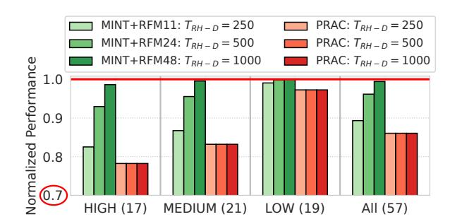

# Loaded Dice: Solving the Non-Selection Problem for Scalable Probabilistic RowHammer Defense

Jeonghyun Woo\* ©
University of British Columbia
jhwoo36@ece.ubc.ca

Junsu Kim\* ©
University of British Columbia
junsukim@ece.ubc.ca

Aamer Jaleel 
NVIDIA
ajaleel@nvidia.com

Prashant J. Nair • University of British Columbia prashantnair@ece.ubc.ca

Abstract—DRAM scaling has exacerbated the RowHammer vulnerability. To counter this, JEDEC recently introduced Per Row Activation Counting (PRAC) with the Alert Back-Off protocol as an optional DDR5 feature. While promising, PRAC requires per-row counter cells that incur area overhead, and updating them on every activation lengthens DRAM timing parameters, degrading performance. Probabilistic mitigations such as MINT offer a lower-cost alternative by randomly selecting and mitigating rows within periodic mitigation windows. MINT is effective at higher thresholds ( $\geq 1000$ ), but at lower thresholds, it must raise its mitigation rate to overcome the non-selection problem, where heavily hammered rows can repeatedly escape sampling. This fixed-rate scaling reduces effective memory bandwidth even when no attack is present.

To overcome this limitation, we propose PrISM, an intersection-based probabilistic mitigation that correlates sampled rows across windows using a Sampled History Queue (SHQ). PrISM samples a few activation slots per window, stores sampledbut-unmitigated rows in the SHQ, and requests an additional mitigation through the existing Alert Back-Off protocol when a sampled row reappears in this history. This allows PrISM to increase mitigation only when persistent row activity is observed, without globally increasing the fixed mitigation rate. At the threshold of 500, PrISM incurs a negligible 0.2% average slowdown compared to 14% for PRAC, with no DRAM array changes or per-row counters and only 625B of SRAM per bank, one to two orders of magnitude less than prior secure counter-based in-DRAM defenses. Compared to MINT, PrISM provides better scalability at low thresholds, reducing average slowdown from 10.7% to 1.5% at a threshold of 250, a 7.1× reduction. PrISM is open-sourced at https://github.com/STAR-Laboratory/prism.

## I. Introduction

DRAM technology scaling has enabled large main memory capacities for data-intensive workloads. At the same time, smaller cells and tighter noise margins have made DRAM more vulnerable to disturbance effects. The most prominent example is the RowHammer vulnerability: a read-disturb phenomenon where repeatedly activating a DRAM row induces bit flips in physically adjacent rows [40], [48]. Over the past decade, RowHammer has become a serious security problem, with several attacks compromising real systems [12], [16], [51], [54]. Meanwhile, aggressive scaling has sharply reduced the RowHammer threshold (TRH), the minimum number of activations needed to induce bit flips. In this work, we focus on the double-sided RowHammer threshold (TRH-D), where two aggressor rows adjacent to a victim are alternately hammered.

To counter RowHammer, JEDEC standardized Per Row Activation Counting (PRAC) for DDR5 [36]. PRAC maintains a per-row activation counter and uses the Alert Back-Off (ABO) protocol. When a counter reaches the Back-Off threshold, DRAM asserts Alert and the controller issues a Refresh Management (RFM) command while pausing regular requests for a fixed interval (e.g., 350ns). Recent designs such as QPRAC [101] and MOAT [71] show that PRAC can provide strong protection even at sub-100 TRH, but at high cost [10], [98]. Because PRAC updates a per-row counter on every activation through a read-modify-write operation, it increases the tRP and tRC timing parameters, resulting in significant performance degradation. As Figure 1 shows, PRAC, implemented using QPRAC, incurs 14% average slowdown across all workloads and 21.8% slowdown on highmemory-intensity workloads (≥10 row-buffer misses per kiloinstruction), largely independent of TRH-D (see Section V for methodology). PRAC also incurs notable area overhead due to its per-row counters [27], [72]. Since PRAC is an optional DDR5 feature [36] and its commercial adoption is uncertain given these costs, there is a clear need for practical lowoverhead mitigations for near-term DDR5 systems [93].

Probabilistic in-DRAM mitigations offer a much lower-cost alternative to PRAC [30], [31], [72], [106]. These schemes avoid per-row counters by randomly mitigating a subset of recently activated rows using either Target Row Refresh (TRR), which borrows time from periodic refreshes [25], [35], or RFM, which temporarily blocks normal memory service while

Fig. 1. Performance overhead of PRAC [101] and MINT [72] under varying double-sided RowHammer thresholds ( $T_{RH-D}$ ). On high-memory-intensity workloads, PRAC incurs an average 21.8% slowdown due to updates to the activation counter on every activation. In contrast, MINT incurs only 1.4% overhead at  $T_{RH-D}$  of 1000, but its slowdown increases to 17.5% at  $T_{RH-D}$  of 250 as lower thresholds require more frequent mitigations.

\*Both authors contributed equally to this work.

DRAM performs the required mitigation. Unless otherwise stated, we assume one TRR mitigation opportunity every two tREFI intervals. Because each RFM consumes memory bandwidth and delays regular requests, probabilistic schemes are most effective when RFMs are issued only occasionally. This works well at higher thresholds (TRH-D ≥ 1000), where infrequent mitigations are enough to provide security. For example, MINT [\[72\]](#page-14-5) requires mitigations only every 48 activations at TRH-D of 1000, resulting in only a 1.4% slowdown on high-memory-intensity workloads. This makes MINT highly attractive at sufficiently high thresholds, especially given its extremely small in-DRAM storage cost.

At lower thresholds, however, probabilistic schemes face a statistical barrier: the non-selection problem. Each mitigation window mitigates at most one randomly chosen row, so a heavily hammered aggressor may be skipped across many windows and remain unmitigated long enough to induce bit flips. To maintain security, MINT *statically* increases its mitigation rate, issuing RFMs more frequently even when no aggressor is present. This raises overhead as TRH-D drops, especially for high-memory-intensity workloads. As Figure [1](#page-0-0) shows, MINT performs mitigations every 24 activations at TRH-D of 500, increasing slowdown to 7.1%, and every 11 activations at TRH-D of 250, increasing slowdown to 17.5%. These results motivate a probabilistic defense that scales to lower thresholds without uniformly increasing mitigation frequency.

To this end, we propose PrISM, Probabilistic Intersectionbased Sampling Mitigation. The key insight is that rows that are repeatedly activated are more likely to reappear across mitigation windows, whereas benign rows rarely reappear in the sampled history. PrISM exploits this temporal correlation to address the *non-selection problem*. Instead of statically raising the mitigation rate, PrISM samples a small set of activation slots in each window and tracks their row addresses across a recent *lookback window*. When a newly sampled row matches a row already in this history, PrISM requests an *additional* mitigation through the existing ABO protocol.

This mechanism allows PrISM to increase mitigation only when persistent row activity is observed, without scaling the default mitigation rate. In MINT, a mitigation window with W activation slots selects only one row, so a persistent aggressor is selected with probability 1/W, about 1.4% when W = 72. PrISM instead samples R slots per window and remembers sampled-but-unmitigated rows for L windows using the Sampled History Queue (SHQ). Thus, a row that appears in every window has probability R/W of being sampled in each window, and its chance of appearing at least once in the lookback history is roughly 1 − (1 − R/W) L. With W = 72, R = 7, and L = 41, this probability exceeds 98%, making a persistent aggressor highly likely to create an SHQ intersection while keeping the default mitigation rate low.

Crucially, PrISM requests few additional Alert-induced RFMs for benign applications. A benign row accessed only occasionally is unlikely to be sampled repeatedly within the SHQ lookback window, so it seldom creates intersections and therefore rarely triggers additional mitigations. Thus, PrISM preserves the counter-free nature of probabilistic mitigations while requesting additional mitigations only for repeated sampled activity. In contrast, MINT maintains security at low TRH-D by increasing the mitigation rate for all workloads, reducing effective memory bandwidth.

PrISM is fully compatible with the existing JEDEC ABO protocol and requires no DRAM array or interface changes. Compared to PRAC, PrISM avoids per-row counters and counter updates on every activation, which lengthen DRAM timing parameters and cause 14% average slowdown. Compared to MINT, PrISM improves scalability at low TRH-D by keeping the default mitigation rate low and requesting additional mitigations only when SHQ intersections indicate repeated sampled activity. At TRH-D of 500, PrISM achieves a negligible 0.2% average slowdown while requiring only 625B of SRAM per bank, which is about 20× and 170× smaller than prior secure counter-based in-DRAM mitigations such as Mithril [\[46\]](#page-14-6) and ProTRR [\[58\]](#page-14-7), respectively. Even at an ultra-low TRH-D of 250, where MINT incurs 10.7% average slowdown due to frequent fixed-rate mitigations, PrISM incurs only 1.5% average slowdown, a 7.1× reduction.

#### Summary of Contributions:

- We identify the non-selection problem as the key barrier for fixed-rate probabilistic RowHammer defenses at low TRH-D, and propose PrISM, which addresses it by correlating sampled row addresses across windows.
- PrISM uses SHQ intersections to request additional mitigations only for repeated sampled activity, keeping the default RFM rate low. It reuses the existing ABO protocol and requires no changes to the DRAM array or interface.
- PrISM avoids PRAC's costly per-row counters and counter updates on each activation. At TRH-D of 500, PrISM achieves a negligible 0.2% average slowdown, compared to 14% for PRAC, while requiring only 625B of per-bank SRAM.
- We show that PrISM improves low-threshold scalability over MINT by avoiding the need to uniformly increase RFM frequency. On high-memory-intensity workloads, PrISM reduces slowdown from 7.1% to 0.5% at TRH-D of 500 and from 17.5% to 2.5% at TRH-D of 250.

## II. BACKGROUND AND MOTIVATION

#### *A. Threat Model*

We consider a DRAM-based system vulnerable to RowHammer. The adversary is unprivileged, knows the deployed in-DRAM defenses, and can craft tailored access patterns to bypass them [\[3\]](#page-12-0), [\[33\]](#page-13-9), [\[60\]](#page-14-8). In our evaluation, all probabilistic mitigations, including MINT and PrISM, use fractal mitigation [\[70\]](#page-14-9) to defend against transitive attacks [\[50\]](#page-14-10).

We focus on activation-driven RowHammer. RowPress [\[56\]](#page-14-11) and ColumnDisturb [\[114\]](#page-16-1) are outside our primary threat model; Appendix [C](#page-12-1) discusses possible extensions.

