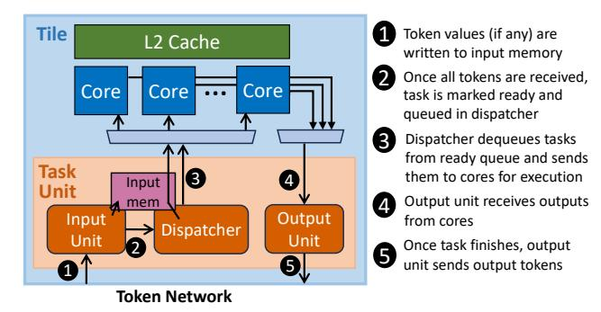
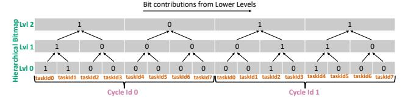
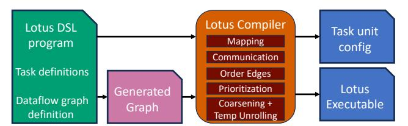

# *A. Execution Model and ISA*

Lotus programs are expressed as synchronous dataflow graphs (Sec. II-A) where dataflow nodes are *tasks*. Tasks are implemented as functions that execute in cores; Fig. 3 shows the code and corresponding assembly for the two tasks in

```
void add(int v0 , int v1) {
  int res = v0 + v1;
  lotus :: stream_outputs (res);
  lotus :: finish_task ();
void mult(int v0 , int v1) {
  int res = v0 * v1;
  lotus :: stream_outputs (res);
  lotus :: finish_task ();
                                      add:
                                        add a2 , a0 , a1
                                        stream_outputs a2 , zero
                                        finish_task
                                      mult:
                                        mul a2 , a0 , a1
                                        stream_outputs a2 , zero
                                        finish_task
```

(a) C++ task code.

(b) Assembly code.

Fig. 3: Code for Lotus implementations of tasks in Fig. 1b.

Fig. 1b. Tasks have one or more input values, and can produce output values for other tasks. For example, each of the tasks in Fig. 3 takes two inputs and produces one output; inputs and outputs are passed through registers. We add two instructions to the ISA to support task execution. First, stream\_outputs reads up to two register values and streams them as outputs. Second, finish\_task finishes the execution of the current task, making the core available to execute other tasks. Tasks can run arbitrary code, including memory accesses (described below) and other side effects (e.g., stopping the simulation).

The dataflow graph is executed repeatedly, once per simulated cycle. Tasks are connected through directed edges in the dataflow graph, which represent communication between tasks; as discussed in Sec. II-A, edges can be same- or cross-cycle, denoting communication from the producer at cycle N to the consumer at cycles N or N+1, respectively. Each invocation of a task produces an output *token* through each of its outgoing edges; a task becomes ready for execution only once it has received a token through all of its incoming edges. Each token may carry data values (up to two in our implementation), but can also be valueless, in which case it serves to order the execution of dependent tasks. Task may have dependences that require order tokens, e.g., to prevent a producer from overwriting values that have not been consumed yet (Sec. V).

Lotus maps the graph statically across tiles: each task is mapped to a single tile, and always runs in that tile. Unlike prior task-dataflow architectures [15, 18], Lotus does not dynamically unfold the dataflow graph. Instead, task units collectively store all the information about the dataflow graph, including the function pointer and output token destinations for each task, and provide enough storage to store inputs for a fixed number of invocations per task (two versions in our implementation, which allows overlapping successive cycles).

Task units handle all aspects of dataflow execution: they buffer received inputs for each task, mark tasks ready once they have received all input tokens, dispatch ready tasks to cores, and produce output tokens after the task has finished execution. This approach minimizes the work done by general-purpose cores. In particular, note that task code produces output values, not tokens. For example, the *add* task code in Fig. 3 produces a single output value, but the *add* task in Fig. 1b has two output edges. The task unit produces a token for each edge, forwarding the output value to the two consumers.

Lotus supports coherent shared memory *within a tile*, but not across tiles; the only way to communicate across tiles is



Fig. 4: Lotus task unit organization.

by passing values through tokens. Shared memory is useful to, e.g., communicate large values among tasks that do not fit in registers, or maintain data in the simulated models that is only partially accessed, like large memories. Lotus implements a simple task-oriented memory model: a task's stores are guaranteed to happen before loads of later tasks (and in particular, loads of dependent tasks), but accesses by concurrent tasks have no ordering guarantees. This enables a simple coherence implementation based on self-invalidations, as advocated by DeNovo [13].

#### B. Task Unit Microarchitecture

**Task unit organization:** Fig. 4 shows the internal organization of each task unit, including its main components and how they implement dataflow execution.

The task unit consists of an *input unit*, a *dispatcher*, and an *output unit*. The input unit receives tokens from the *token network*, which connects all tiles in the system. The token's values (if any) are written to the input memory, and the input unit counts the number of remaining tokens for the task. Once all tokens have been received, the task is marked ready by enqueuing it into the *ready queue*.

The dispatcher dequeues tasks from the ready queue and sends them to cores for execution. The dispatcher stores metadata needed for task execution, such as the task pointer, and also streams the task's inputs from the input memory.

Finally, the output unit receives outputs from running tasks; once the task finishes, the output unit produces tokens for the task's output edges, sending them through the token network. **Storage structures:** Each Lotus task unit features dedicated storage to hold a fixed number of tasks, exploiting the abundant distributed memory available on FPGAs. Each task in the dataflow graph is given a unique *taskId*, and most memories in the task unit are indexed by *taskId*, avoiding associative lookups. For example, when a token is received from the network, it carries a (*cycleId*, *taskId*) tuple that enables the input unit to directly access the metadata for the invocation of the task at the specified cycle.

We observe that tasks have a highly variable number of inputs and outgoing edges. Therefore, we provide a variable amount of storage per task for both inputs and output token metadata. This enables supporting generous limits (e.g., up to 15 input


Fig. 5: Lotus task unit memories, configured with the dataflow graph from Fig. 1b.

values and 63 output tokens per task in our implementation) while provisioning storage for smaller average values (e.g., 4 input values and 8 output tokens per task).

Fig. 5 shows the memories in the task unit, as well as an example dataflow graph and the contents of these memories when the graph is mapped to a single tile. Most memories are indexed by *taskId*, and variable-storage memories (for inputs and output tokens) are indexed by ranges stored in a different memory, requiring a level of indirection. All memories are loaded with task and dataflow graph information at configuration time, after which execution can begin.

**Versioning:** To enable overlapping the execution of successive cycles, task units store multiple versions of invocation-specific data, specifically input values and count of received tokens. Our implementation manages two versions, for even and odd cycles, which allows overlapping consecutive cycles.

#### C. Prioritized execution

Lotus task units implement prioritized execution: each task is given a priority, and ready tasks are dispatched in priority order. ASH [15] showed that prioritized execution is useful for simulation workloads, as it enables focusing hardware resources on critical-path work. Simulated systems often have intervals of plentiful parallelism, and unordered execution (as is typical in dataflow machines) can defer critical-path tasks until late in the cycle, becoming the long-pole and hurting performance.

The challenge is that prior systems have implemented prioritized execution using complex priority queues, like pipelined heaps [1, 14, 15, 21], that are expensive on FPGAs.

Lotus leverages the static nature of the dataflow graph to implement prioritized execution much more cheaply: since each task is given a *taskId*, we use this as the priority order: tasks with lower ids have higher priority. And since *taskId* is a dense and relatively narrow identifier, we implement a priority queue based on *hierarchical bitmaps*.

Fig. 6 shows the structure of the priority queue. At the lowest level, each bit corresponds to the ready bit of a task invocation; the number of bits in this bitmap is the number of tasks per tile multiplied by the number of versions per task (e.g., 1024-2 in our implementation). Enqueuing a ready task invocation



Fig. 6: Priority queue implemented as a hierachical bitmap.

requires setting its corresponding bit, and dequeueing tasks is done by traversing and clearing the bitmap in order.

Because the lowest-level bitmap is sparse, traversing it in order would be slow. The higher-level bitmaps accelerate this process by summarizing readiness information: each bit at those levels corresponds to a region in its lower level (e.g., 32 elements), and indicates whether any task in the region is ready. Enqueuing a ready task requires setting its corresponding region bits in upper-level bitmaps, and dequeuing tasks is done by using region bits to find the earliest set bit.

We build a fully pipelined implementation of this structure, which enables enqueuing and dequeuing a task every cycle, regardless of the sparsity pattern.

#### D. Selective execution

Many hardware designs have limited activity factors, which manifest as tasks whose inputs (and outputs) do not change from those of the previous cycle. Repeatedly executing a task with the same inputs is wasteful. Selective execution avoids this ineffectual work by skipping these tasks.

Lotus implements selective execution with *conservative synchronization*, using the Chandy-Misra-Bryant algorithm [11]: task units detect when inputs have not changed, skip executing the task, and send *null* output tokens that tell consumers to reuse their old input values instead. ASH [15] also implemented selective execution, but did so with speculative synchronization, using the Time Warp algorithm [20]: instead of sending null messages, consumers assume that missing input tokens stem from skipped tasks, and run anyway; a late-arriving token causes the task to roll back and reexecute. While optimistic synchronization elides the cost of sending null messages, it is costly to implement in FPGAs, incurring about a  $2\times$  overhead [1]. Our selective execution implementation is much simpler, adding 1% of logic to each tile (Sec. IV).

Selective execution requires minor modifications to the task unit. The input unit must check input values in non-null tokens against old values to detect when they match and the task can be skipped, and for null tokens, it must copy old input values to the current version. We do this by using separate memories to store odd- and even-cycle inputs, and using a 4-stage pipeline that performs these operations at full throughput. If the task is skipped, the dispatcher sends it to the output unit instead of to a core, and the output unit sends null messages.

Selective execution cannot be used in all cases: some tasks can have side effects (Sec. V) and cannot be skipped even if their inputs do not change; and some tokens encode read-after-write data dependences through memory, so if the producer task runs, the consumer must run. We extend task and token


Fig. 7: Lotus 8-FPGA prototype system.

metadata to support these cases, and if an invocation has sideeffects or receives a *non-null* order token, it is not skipped even if all inputs match.

#### IV. LOTUS PROTOTYPE

We have built a Lotus prototype using 8 interconnected FPGAs. This prototype is important to demonstrate that Lotus can compete with emulators, because constant factors matter, and prior multicore FPGA platforms are substantially less efficient than our prototype. For example, the Chronos prototype [1] supports up to 48 simple RISC-V cores on an FPGA of the same size as the ones we use, and runs at 125 MHz. By contrast, Lotus implements 272 cores per FPGA and runs at 400 MHz, providing 18× higher throughput per FPGA than Chronos. Moreover, Chronos is not a multi-FPGA system; at 8 FPGAs, Lotus has 145× higher instruction throughput.

In this section we detail the implementation of the prototype, focusing on the design choices that make Lotus efficient.

**Prototype system:** We build a system with 8 AMD Alveo U55C FPGAs spread across two servers. Fig. 7 shows this system. Each server has 4 FPGAs, as well as 2 64-core, 128-thread AMD Zen 3 CPUs (EPYC 7763) and 1 TB of memory; we use one of the servers as the CPU baseline in our evaluation.

FPGAs are directly connected through optical links. Each FPGA has only two QSFP28 interfaces, so prior multi-FPGA system using Alveo or similar FPGAs have connected them in a ring [3, 42]. Instead, we leverage that QSFP28 internally uses four independent lanes to connect all FPGAs in a dancehall (all-to-all) topology: we use 1:4 optical breakout cables to connect 7 of these lanes to the other FPGAs (we use a patch panel atop the servers to keep the system manageable). This network has a 350GB/s bisection bandwidth.

We adopted an all-to-all topology to provide direct communication among FPGAs without incurring the cost of a high-performance network switch. This setup has the added benefit of yielding low latency, 200ns FPGA-to-FPGA, similar to the inter-socket latency in modern CPU servers. However, commercial Ethernet switches provide sub-microsecond latency, and would enable larger Lotus systems (e.g., 128 FPGAs connected through a top-of-rack-switch).

This system has a cost of \$86K. The cost of the FPGAs is \$37K, the inter-FPGA interconnect is \$1,200, and the cost of both servers is \$48 K.

**FPGA-level organization:** Fig. 8 shows the logical organization of each FPGA: tiles are directly connected to HBM


Fig. 8: Lotus FPGA organization and floorplan.

| Tiles<br>Memory<br>Token<br>network | 68 tiles, 272 cores (4 cores/tile), 400 MHz<br>HBM2, 16 GB, 17 ports used (1 port per 4 tiles)<br>25x25 2-stage butterfly switch (1 port per 4 tiles,<br>plus 8 ports for inter-FPGA communication) |
|-------------------------------------|-----------------------------------------------------------------------------------------------------------------------------------------------------------------------------------------------------|
| Cores                               | RV32IM, 4-stage pipeline, 1-cycle DM I/D caches                                                                                                                                                     |
| L2 cache                            | 128 KB, 4-way, LRU, 512-bit lines, up to 16 concurrent requests, serves 128 bits/cycle                                                                                                              |
| Task unit                           | 1024 tasks/tile, 8K-element input value and output token memories; up to 15 input values, 63 output tokens, and 255 input tokens per task                                                           |

TABLE I: Configuration parameters of Lotus FPGA.

| Component     | LUTs | Regs | BRAMs | URAMs | DSPs |
|---------------|------|------|-------|-------|------|
| FPGA          | 860K | 956K | 1236  | 544   | 1092 |
| Tile          | 9.3K | 9.3K | 24    | 15    | 16   |
| Core (4/tile) | 1474 | 1027 | 2     | _     | 4    |
| L2 cache      | 688  | 1268 | 1.5   | 4     | -    |
| Task unit     | 1914 | 2249 | 5.5   | 4     | -    |
| Other tile    | 801  | 1626 | -     | -     | -    |

TABLE II: FPGA resource utilization of entire design, tile, and components within the tile.

memory channels, and communicate tokens through a token network. Tiles also have a control interface that the host uses to load Lotus programs, control their execution, and observe outputs and performance counters. Table I details the configuration of the FPGA for the system we evaluate.

The token network is implemented as a butterfly switch in each FPGA, which connects the tiles and provides connectivity to the inter-FPGA links. We implement an inter-FPGA communication shim that uses AMD's low-level Aurora protocol and IP. Our Aurora shim serializes tokens to each 64-bit lane, buffers them for transmission, and performs error detection (links experience occasional bitflips). We implement a sliding-window algorithm similar to TCP's, which serves to both retransmit tokens on an error and to implement flow control.

To reduce token switch and memory interconnect costs, we use concentration: we form groups of four tiles, and each group uses a single memory channel and switch port. In practice, this provides plentiful token and memory bandwidth, while enabling us to fit 68 tiles per FPGA.

**Tile microarchitecture:** Each tile has 4 custom RISC-V cores, a 128 KB L2 cache, and a task unit that supports 1024 tasks. Table I details the tile's configuration, and Table II shows the

resource utilization of different components.

We develop a highly optimized core that implements the RV32IM ISA plus Lotus's instructions. The core is a 4-stage pipeline (fetch/decode/execute+memory/writeback) with direct-mapped, 4KB instruction and data caches, full data bypassing, PC bypassing, a pipelined multiplier, and a sequential divider. Data and PC bypassing enable the core to pay at most 1 stall for each load-to-use hazard and taken branch, enabling high IPC with control-intensive code despite not using dynamic branch prediction. The core also implements an instruction prefetcher and an input task buffer, so the task unit can dispatch a task to the core while the current task is executing. The core takes 1474 LUTs. This core provides substantially higher performance per LUT than prior open-source or available RISC-V softcores [19], including Taiga [27], VexRiscv [35], PicoRV32 [43], and AMD's MicroBlaze V [2].

We implement a pipelined and banked L2 that enables many concurrent requests cheaply while preserving Lotus's memory model. To implement Lotus's memory model, we use write-through data L1 caches, and the core self-invalidates shared L1 data at the end of each task.

We implement task units as described in Sec. III. All task unit components are fully pipelined.

Physical design and frequency optimizations: Fig. 8 shows the physical layout of the FPGA: tiles take most area; the Aurora shim is located at the bottom center, next to the transceivers; and the token switch is located next to the Aurora shim. The shell (on top) provides connectivity to the host. Table II reports the resource utilization of each FPGA: LUTs are the critical resource (66% utilization), followed by BRAMs (61%) and URAMs (57%), which are larger and denser memories (36KB). DSPs are less used (12%).

We implement Lotus in Bluespec SystemVerilog with a 400 MHz target frequency. While configurations with a few tiles close timing at 400 MHz, larger configurations require careful physical design: with the standard Vivado flow, frequency tops out at 270 MHz and the FPGA cannot pack more than 64 tiles. We floorplan the design manually and leverage RapidWright [25] to achieve high performance, implementing each tile shape separately and then replicating it. Even with this approach, the 68-tile design closes timing at 340 MHz, as the final Vivado implementation run worsens a small number of critical paths. Nonetheless, we observe that timing analysis is conservative, and the resulting bitstream runs correctly up to 470 MHz. We leave a 15% timing margin and run the final design at 400 MHz.

## V. LOTUS COMPILER

While it is possible to write Lotus tasks and dataflow graphs directly, doing so would be tedious. Instead, we implement a simple, C++-embedded Domain-Specific Language (DSL) to write Synchronous Dataflow Graphs. Then, we implement a compiler that produces efficient Lotus programs from these specifications. The compiler maps tasks to tiles, decides what data is passed through dataflow tokens or memory, and performs

```
// Task definitions
void mult(In <int> v0 , In <int> v1 , Out <int> res) {
    res = v0 * v1;
}
void add (In <int> v0 , In <int> v1 , Out <int> res) {
    res = v0 + v1;
}
using Mem = array <int, NumIters >;
void Xn_feeder (InOut <Word > cycle , PartialIn <Mem > xns ,
                Out <int> xn) {
    xn = xns[cycle ++];
}
void Yn_checker (InOut <Word > cycle , PartialIn <Mem > refYns ,
                 In <int> yn) {
    if (yn != refYns[cycle ++]) lotus :: simFail ();
}
// Dataflow graph definition
void genDfg () {
  Reg <int> xn_a (0); Reg <int> yn_b (0);
  Wire <int> xn; Wire <int> yn;
  // Compute tasks
  Reg <int> a(A_VAL); // constant
  task(mult , xn , a, xn_a);
  Reg <int> b(B_VAL); // constant
  task(mult , yn , b, yn_b);
  task(adder , xn_a , yn_b , yn);
  // Test harness: Feeder and checker tasks
  Reg <Word > xn_cycle (0);
  Reg <Mem > xns(/* values of X*/);
  task(Xn_feeder , xn_cycle , xns , xn);
  Reg <Word > yn_cycle (0);
  Reg <Mem > refYns(/* reference values of Y*/);
  task(Yn_checker , yn_cycle , refYns , yn);
}
```

Fig. 9: Lotus DSL code for the dataflow graph in Fig. 1b.

optimizations like coarsening to improve efficiency. We also implement an efficient CPU backend for this compiler.

## *A. Lotus language*

Lotus DSL programs contain two types of code: *task function definitions*, and a *dataflow graph definition* that builds a dataflow graph of these task functions. Fig. 9 shows an example Lotus DSL program.

Tasks are defined with functions, which specify its inputs and outputs through arguments. Each argument must be of one of six types: In/Out/InOut<T> denote an input, output, or input and output value (which is both produced and consumed by this task) of type T; and PartialIn/PartialOut/PartialInOut<T> denote a value that is *partially* read, written, or read and written. Conveying that values are partially accessed is useful, because they help the compiler decide whether the value should be in memory or passed through dataflow tokens—specifically, this biases the compiler to place large, partially accessed values in memory. For example, in Fig. 9, the feeder and checker tasks use arrays to hold input and reference output values, but they access only a single element per invocation; simulated memories or objects like caches are also naturally partially accessed.

The dataflow graph is also specified using code. The library provides two types of edges and a function to create



Fig. 10: Lotus compilation flow.

task nodes. Edges are either Reg<T>, a cross-cycle edge with an initial value, or Wire<T>, a same-cycle edge. Task nodes are created through the task(taskFunction, edge0, edge1,...) syntax. An edge must have at most one producer, and can have multiple consumers (a Reg<T> edge with no producer is a constant value).

Note that this dataflow graph is not directly a Lotus program e.g., task functions have an unbounded number of arguments, and the dataflow graph does not map tasks to tiles. The compiler lowers this to an executable Lotus program.

## *B. Compilation flow*

Fig. 10 shows the compilation flow. The compiler takes a Lotus DSL program as input. It first produces the dataflow graph by compiling and executing the dataflow graph definition code (we implement a C++ library that makes the dataflow graph definition code emit a textual representation of the graph; this leverages the C++ compiler to simplify our compiler, e.g., by using it for typechecking). Then, a series of compiler passes, described in Sec. V-C, produce a Lotus program, which consists of *task unit configuration data* and an *executable* with task code and data for each tile.

## *C. Compiler passes*

Fig. 10 lists all the compiler passes.

Mapping: Mapping tasks to tiles is a complex problem. An efficient mapping needs to achieve several conflicting goals: *(1)* minimize inter-tile communication volume, *(2)* balance work across tiles, and *(3)* avoid placing communication latencies on the critical path.

A key challenge is that the inter-tile network is not uniform: inter-FPGA communication has significantly higher latency and lower bandwidth than intra-FPGA communication. To address this, we use a hierarchical partitioning algorithm to minimize inter-FPGA traffic: tasks are first mapped to FPGAs, and then to tiles within each FPGA. We perform hypergraph partitioning with PaToH [10] for both mapping steps to balance work while reducing communication.

We introduce two restrictions to the mapping algorithm. First, we enforce any two tasks that communicate with a same-cycle edge must be placed on the same FPGA, ensuring that high inter-FPGA latencies do not increase critical path. Second, we enforce that tasks communicate through memory must be placed in the same tile, as the architecture does not support inter-tile coherence.

Communication: Lotus supports two kinds of communication between tasks: direct dataflow communication and memorybased communication. Memory communication is needed for


Fig. 11: *Coarsening* and *temporal unrolling* of dataflow graph.

two reasons. First, large memories (like caches or SRAM modules), which are partially accessed, are better stored in memory than passed around through dataflow tokens every cycle. Second, each Lotus task can only receive a limited number of input values through tokens. If a task function exceeds this limit, some values must be passed through memory; we call this *overflow memory*. The compiler prioritizes dataflow communication for inter-tile and non-constant inputs. Furthermore, the compiler seeks to produce task code that can be reused across many tasks. To this end, the compiler does not fold constants or pointers to in-memory objects into each function, and passes them as arguments instead.

Order Edges: Lotus adds order edges across tasks to enforce data and structural dependences among tasks that communicate values. Order edges enforce that one task invocation must execute before another, and are implemented as tokens with no data. For example, if task A@N communicates a value to B@N through single-buffered memory, then B@N must run before A@N + 1 overwrites the value. Thus, the compiler adds an order edge from B@N to A@N + 1.

Coarsening and Temporal Unrolling: When tasks are very short, it is helpful to *coarsen* the dataflow graph, i.e., build larger tasks, each of which performs the work of multiple original tasks. Our running example from Fig. 3 shows this well: the mult and add tasks perform a single instruction of useful work, and combining them into a larger task would be more efficient. Specifically, it would reduce task initiation overheads and improve the computation to communication ratio, as dataflow edges would become task-internal values.

The challenge is that it is often useful to coarsen tasks connected by cross-cycle edges. Fig. 11 shows this with an example dataflow graph that describes a 4-stage pipeline. We can coarsen tasks with cross-cycle edges by having higher-delay outgoing edges—this is the reverse transformation as retiming, pushing registers out of the task. But since the architecture does not support higher-delay outgoing edges (e.g., two cycles in Fig. 11), this would require extra tasks and add overhead.

To avoid this, the compiler temporally unrolls the dataflow graph, replicating it multiple times to fill the task units. This has the effect of enabling higher-delay edges. For example,

| Benchmark  | Description            | Tasks | Edges  | Instructions |
|------------|------------------------|-------|--------|--------------|
| NTT        | 2048-point NTT pipe    | 11264 | 51200  | 381955       |
| MatMult    | 256x256 systolic array | 33664 | 345856 | 1042365      |
| Cores      | 4096 indep. cores      | 24576 | 143360 | 374720       |
| Multicore  | 4096 cores with 2-D    | 43008 | 382924 | 1131892      |
|            | mesh network           |       |        |              |
| Vl-NTT     | 2048-point NTT pipe    | 37234 | 126004 | 918596       |
| Vl-Chronos | 512 cores              | 42499 | 250389 | 2803555      |

TABLE III: Benchmark characteristics. *Instrs* is the average number of dynamic instructions per simulated cycle.

Fig. 11 shows unrolling by a factor of two, which improves computation/communication ratio by 3×.

While coarsening small tasks is beneficial, coarsened tasks often have a larger number of inputs and outputs. When this occurs, the coarsened task may exceed the limit of input values receivable through tokens, forcing some values to be communicated through overflow memory, which is less efficient. Thus, the compiler prioritizes coarsening tasks that minimize the increase of input values, specifically inputs produced by tasks mapped on non-local tiles. The compiler also stops performing temporal unrolling and coarsening if doing so increases overall instructions per simulated cycle.

