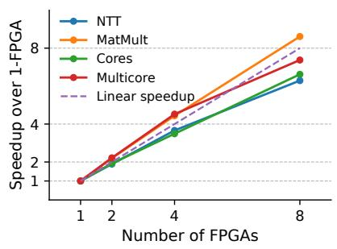
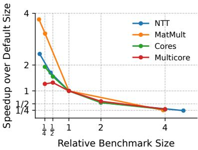
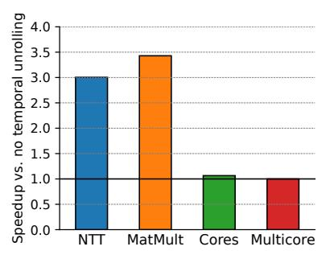

# *A. Lotus performance and resource efficiency*

Table IV reports the performance, in KHz, of Lotus, the CPU baseline, and the emulator baseline, as well as the number of FPGAs needed for emulation. Each column reports results for a different benchmark; Lotus DSL benchmarks are on the left, and Verilog benchmarks on the right. We also report gmean figures for each class of benchmarks. Based on these figures, the table reports the speedups of Lotus over the CPU and emulator baselines, the reduction in FPGAs of Lotus over the emulator, and the *speedup per FPGA* of Lotus over the emulator (this is the product of speedup and FPGA reduction, and seeks to reflect how iso-scale systems would perform).

On Lotus DSL benchmarks, Lotus outperforms emulators by gmean 42% while using gmean 2.85× fewer FPGAs. Lotus is the first accelerator that outperforms emulation on cyclelevel simulations for such large designs. Furthermore, Lotus outperforms the CPU baseline by gmean 8×. On Verilator benchmarks, Lotus is even faster over the CPU, by gmean

Fig. 13: Lotus performance across number of FPGAs.

Fig. 14: Lotus performance on benchmarks of different sizes.

Fig. 15: Impact of coarsening and temporal unrolling in Lotus.

 $39.4\times$ , but it is substantially slower than the emulator, owing to efficiency and scalability limitations in Verilator.

Fig. 12 provides insight into these results. Each bar shows a breakdown of how Lotus cores spend cycles: issuing (and completing) instructions, stalled on instruction cache misses, data cache misses, pipeline stalls (due to control and data hazards), or idle, i.e., without a task to run. Each group of two bars shows results for one benchmark, both when selective execution is disabled (left bar) and enabled (right bar). Finally, each bar group reports the speedup that selective execution achieves over non-selective execution, and its reduction of work (measured as the ratio of instructions executed).

Overall, Fig. 12 shows that most benchmarks achieve high core utilizaton: except for Multicore with selective execution, cores are idle a small fraction of the time (20-30%). Moreover, selective execution achieves a major speedup only in Multicore, where activity factors are lower. We now analyze each benchmark.

NTT and MatMult achieve excellent utilization on Lotus, with 52% and 45% of cycles spent committing instructions. MatMult has about 20% of idle cycles; these are due to the time that each core takes to complete the current task and load arguments for the next task. NTT's idle cycles are higher, 32%, because frequent inter-tile communication drives the per-FPGA switches near saturation. Selective execution has no effect on these pipelines, as inputs to each task change every cycle. The CPU also does well on these benchmarks, because they are regular and arithmetic-heavy, and our CPU backend achieves high IPC and can leverage vector instructions. On these benchmarks, Lotus is both substantially faster and more efficient than emulators, e.g., on NTT, it is 3.1× faster with 7.5× fewer FPGAs.

Cores is less regular, yet Lotus achieves good efficiency, with 42% of cycles spent committing instructions. Instruction cache stalls take 11% of core cycles, and are due to L2 bandwidth pressure: although cores use instruction prefetchers, misses are frequent enough that they drive the L2 cache near saturation, and prefetchers cannot access instructions far ahead enough of use. Selective execution achieves a modest speedup because this benchmark simulates cores with fast local memories, so pipelines rarely have long stalls.

Multicore shows a substantial difference between selective

and non-selective execution. With non-selective execution, utilization is similarly high to the other benchmarks, though instruction cache stalls take 25% of cycles due to the benchmark's larger code footprint. With selective execution, work is substantially reduced, with  $3.3\times$  fewer instructions, as the simulated cores incur longer stalls due to cache misses, and the components of the simulated memory system (e.g., caches and network routers) have lower activity factors. However, idle cycles grow to 60%, primarily due to load imbalance caused by selective execution. Overall, selective execution results in a  $2.3\times$  speedup.

The CPU is also slower on the Cores and Multicore benchmarks, especially on Cores, due to frequent data-dependent branches that limit the IPC of the CPU's OOO cores. Lotus is still slightly faster (19% speedup) than the emulator on Cores; it is slower on Multicore, but the emulator needs almost twice the FPGAs, and Lotus achieves higher speedup per FPGA.

Finally, the Verilog benchmarks show different trends. Comparing *NTT* and *Vl-NTT* is especially illustrative, since they are different implementations of the same benchmark. Lotus and the CPU are 21× and 114× slower on *Vl-NTT*, even though *Vl-NTT* only has 2.4× more instructions than *NTT* (Table III). A key factor is *lack of instruction reuse*: Verilator produces separate code for each replicated unit in the design, which places significant pressure on the instruction cache. Lotus is less affected by instruction cache pressure because it can keep most code in nearby L2s, but Verilator also produces parallelism bottlenecks and load imbalance. Overall, Lotus cores spend about 10% of cycles committing instructions. *Vl-Chronos* shows similar bottlenecks, with worse load imbalance, because Verilator often produces larger tasks than needed on this design, limiting parallelism in Lotus.

Overall, the Verilog results highlight performance pitfalls in Verilator; while we believe these issues are addressable, they would require substantial engineering, and the results for Lotus DSL programs demonstrate that Lotus can compete with emulators at RTL-level simulation.

