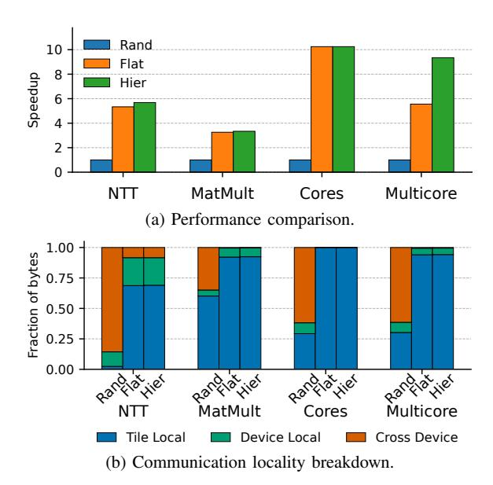

# B. Lotus scales well to multiple FPGAs

Fig. 13 shows how Lotus's performance changes as we scale from 1 to 8 FPGAs. Each line shows performance for a single benchmark, relative to 1-FPGA performance. *NTT* scales slightly sublinearly due to growing inter-tile communication;

MatMult scales slightly superlinearly because increased task queue capacity reduces communication through memory on larger systems; Cores scales slightly sublinearly due to memory effects: each task fits in Lotus core L1s, and smaller systems reuse each task across more invocations; and Multicore scales slightly superlinearly up to 4 FPGAs due to increased L2 memory, then drops somewhat at 8 FPGAs due to increased load imbalance.

These results show that Lotus uses multiple FPGAs effectively, thanks to its partitioning and decoupling strategies.

#### C. Lotus gracefully handles designs of different sizes

A key advantage of Lotus over emulators is that the same system can simulate designs of a wide range of sizes—larger designs just take longer to simulate. Fig. 14 shows this by reporting how performance changes as we sweep that size of these designs. Each line reports performance for one benchmark, relative to the default size. The x-axis shows relative design size, measured in *work* (this is because not all benchmarks scale linearly as we change parameters, e.g., NTT scales with NlogN). We sweep parameters to cover designs from  $1/4 \times$  to  $4 \times$  larger than the default size.

On larger designs, Lotus scales down perfectly, being about  $4\times$  slower when benchmarks at  $4\times$  larger. On smaller designs, Lotus is always faster; with  $4\times$  smaller designs, Lotus is  $1.3\times-3.8\times$  faster, not reaching  $4\times$  because smaller benchmarks have more limited parallelism.

#### D. Lotus configuration can be tuned to the workload

Our default Lotus configuration seeks to achieve good overall performance across diverse benchmarks, but it is possible to build alternative configurations that improve performance on specific applications. For example, we have seen that NTT is limited by inter-tile communication. To remove this limitation, we implement an alternative configuration with fewer, larger tiles: we can fit 36 8-core tiles, for a total of 288 cores per FPGA, at 400 MHz; we use smaller concentration factors (2:1), which keeps inter-tile bandwdith per core constant.

NTT achieves 3.2 MHz in this configuration, 28% faster than with our default configuration. Most of this speedup comes from reducing inter-tile communication (by having fewer tiles, more communicating tasks run in the same tile), which reduces idle time; the remaining speedup stems from having 6% more cores. This configuration has more modest benefits on MatMult (6% faster), but hurts performance on Cores and Multicore, which become bottlenecked on the lower task unit throughput.

#### E. Impact of Lotus features

Coarsening and temporal unrolling: Fig. 15 shows the impact of coarsening and temporal unrolling in Lotus. NTT and MatMult use  $2\times$  and  $4\times$  unrolling and achieve  $3.0\times$  and  $3.4\times$  speedups, respectively. These benchmarks have small tasks that have low computation-to-communication ratio. Unrolling allows coarsening multiple of these tasks (e.g., a  $4\times4$  grid of PEs), improving performance substantially.

Cores uses  $2 \times$  unrolling, which allows merging tasks that simulate successive pipeline stages. This reduces instructions

Fig. 16: Impact of mapping techniques.

by 12%, but results in a smaller 5% speedup because coarsened tasks cause more misses and reduce selective execution. Finally, the compiler does not use unrolling on Multicore, because coarsening across cycles creates large tasks that increase instruction counts (e.g., by needing to use overflow memory).

Task mapping: Fig. 16 shows the impact of task mapping. We compare three mapping algorithms: (1) Hier is the hierarchical mapping algorithm we have used so far, which uses two rounds of hypergraph partitioning, first to partition tasks across FPGAs, and then to partition tasks across tiles in each FPGA (as described in Sec. V-C); (2) Flat is a simpler variant of our algorithm that uses a single round of hypergraph partitioning to partition tasks among tiles; and (3) Rand assigns each task to a random tile. Fig. 16a reports the performance of these mapping algorithms on each benchmark, normalized to Rand. Both Flat and Hier outperform Rand substantially, with Hier achieving significant speedups over Flat on two benchmarks, NTT and Multicore. Overall, Hier is  $3.3 \times -10.3 \times$  faster than Rand, showing that good partitioning is important for scalability.

Fig. 16b gives more insight into these results by showing a breakdown of values communicated through dataflow edges, by whether the edges are tile-local (i.e., producer and consumer tasks are on the same tile), device-local (i.e., producer and consumer tasks are on different tiles of the same FPGA), or cross-device (i.e., producer and consumer tasks are on different FPGAs). The difference in locality between random mapping and the other techniques is clear; note how most edges are cross-device with random mapping, and the fraction of local edges is only higher than pure random assignment due to same-tile constraints (recall that tasks that share memory must be on the same tile). Flat and hierarchical mapping have small differences, showing that performance is very sensitive to even small changes in cross-device communication. For example,

Fig. 17: Impact of task prioritization.

going from flat to hierarchical on Multicore reduces fraction of cross-device edges from 0.57% to 0.49%. This minor change leads to a  $1.7\times$  speedup, because cross-device communication is very expensive.

Task prioritization: Fig. 17 shows the impact of task prioritization on performance. Due to the design of the dispatcher, each task must be assigned *some* priority. Thus, we compare assigning random priorities with our prioritization. The results show the impact of prioritization is variable. Prioritization is most beneficial for Verilator-based benchmarks, as they have limited parallelism and are dominated by a limited number of long tasks. Lack of proper priorities makes some of these tasks run late, hurting performance by up to almost  $1.9\times$ . However, for benchmarks like NTT that have no same-cycle dependencies and relatively uniform task sizes, prioritization has a minor benefit. The speedups in these benchmarks are attributed to prioritizing tasks with longer communication latencies.

#### F. Lotus power consumption

We profile power consumption of the Lotus prototype using the power sensors in the servers' power supplies and FPGAs. We report power consumption for the NTT benchmark, but observe power is nearly constant across benchmarks. The entire system (two servers with four FPGAs each) consumes 1,050 W, and the eight FPGAs consume 420 W (i.e., 55 W per FPGA). Server CPUs are mostly idle during simulation.

While commercial emulators do not publish power consumption on specific benchmarks, they are large platforms with much higher TDPs. For example, ZeBu Server 5 advertises a power consumption of <6kW per billion gates emulated [37] (our benchmarks have over a billion ASIC gates).

#### VIII. CONCLUSION

Lotus shows that task-level dataflow execution can effectively accelerate cycle-level simulation. Thanks to novel implementations of dataflow execution, task prioritization, and selective execution that are particularly well suited to FPGAs, Lotus scales to thousands of simple cores, and achieves similar performance to emulators while improving hardware utilization. By exploiting fine-grained parallelism in software, these techniques open the door to a new wave of software simulators that can replace cumbersome emulators.

Lotus is the first simulation accelerator to offer competitive performance with emulators—in our evaluation, it outperforms emulation on three out of four benchmarks. Beyond performance, Lotus offers several advantages. First, Lotus uses FPGA resources more efficiently, requiring fewer FPGAs than emulation across all benchmarks. Second, Lotus compiles benchmarks in seconds, whereas emulators take days to weeks for large designs. Third, with a fixed number of FPGAs, Lotus can trade performance for scale and simulate much larger designs, whereas in emulators, the number of FPGAs limits the size of the simulated systems. Finally, Lotus supports simulation of mixed RTL and cycle-level models, unlike emulators.

Lotus also opens up exciting research avenues. For example, it may be possible to achieve higher speedups by tailoring the ISA more deeply, by combining general-purpose cores with small specialized cores that run common parts of a design more efficiently, and by developing more advanced synchronization techniques that better leverage low activity factors. Compiler optimizations can also help reduce overheads, e.g., by better packing narrow data values into words to use fewer instructions. We believe these approaches can substantially improve performance and utilization, especially on less-regular designs like Multicore, where the utilization of Lotus is lower. Another open question is to what degree Lotus can scale, and what latencies it can tolerate efficiently; for example, cloud providers give access to hundreds of FPGAs, but these FPGAs are not directly interconnected. Lotus could motivate cloud providers to offer large sets of tightly interconnected FPGAs, much like they do for e.g., ML training accelerators. Finally, since Lotus is a programmable platform, it can be extended to perform simulation at different levels of abstraction (e.g., event-driven microarchitectural simulation or transaction-level modeling with SystemC), and could seamlessly combine these simulations, e.g., using RTL simulation for a specific part of the design, and microarchitectural simulation for the rest of the system. We leave these endeavors to future work.

#### ACKNOWLEDGMENTS

We dedicate this paper to Arvind, our late colleague, mentor, and friend. Arvind's pionieering work in dataflow architectures and hardware design has been inspirational and foundational to this eponymous project.

We are grateful to all who have supported and given feedback on this work. Serge Leef, Sung-Kyu Lim, Dinesh Gaitonde, and Trevor Bauer have championed this project and provided invaluable technical guidance. Chris Lavin helped us with RapidWright and modified it to enable our use case. This work's infrastructure and ideas build on ASH, to which Shabnam Sheikhha, Victor Ying, Quan Nguyen, Vedantha Venkatapathy, and Ferran Hermida Rivera have contributed. Courtney Golden, Alex Krastev, Maggie Du, Viansa Schmulbach, Stella Lau, and our anonymous reviewers provided helpful feedback on earlier versions of this manuscript.

This work was supported in part by the National Science Foundation under grant CCF-2217099, DARPA under contract N00014-21-1-2960, and the Semiconductor Research Corporation under contract 2024-AH-3282. The views and conclusions in this document are those of the authors and should not be interpreted as representing the official policies, either expressed or implied, of the U.S. Government.

#### REFERENCES

- [1] M. Abeydeera and D. Sanchez, "Chronos: Efficient speculative parallelism for accelerators," in *Proc. of the 25th intl. conf. on Architectural Support for Programming Languages and Operating Systems*, 2020.
- [2] AMD, *MicroBlaze V Processor Reference Guide (UG1629)*, AMD, 2024, https://docs.amd.com/r/en-US/ug1629-microblaze-v-user-guide.
- [3] AWS, "FPGA Hardware and Software Development Kit," https://github. com/aws/aws-fpga, 2017.
- [4] J. Babb, R. Tessier, M. Dahl, S. Z. Hanono, D. M. Hoki, and A. Agarwal, "Logic emulation with virtual wires," *IEEE Transactions on Computer-Aided Design of Integrated Circuits and Systems*, vol. 16, no. 6, 1997.
- [5] S. Beamer and D. Donofrio, "Efficiently exploiting low activity factors to accelerate RTL simulation," in *Proc. of the 57th Design Automation Conf.*, 2020.
- [6] D. K. Beece, G. Deiberg, G. Papp, and F. Villante, "The IBM Engineering Verification Engine," in *Proc. of the 25th Design Automation Conf.*, 1988.
- [7] D. Biancolin, A. Magyar, S. Karandikar, A. Amid, B. Nikolic, J. Bachrach, ´ and K. Asanovic, "Accessible, FPGA resource-optimized simulation of ´ multiclock systems in firesim," *IEEE Micro*, vol. 41, no. 4, 2021.
- [8] Cadence, "Palladium Z1 enterprise emulation platform," https://www.cadence.com/content/dam/cadence-www/global/en\_ US/documents/tools/system-design-verification/palladium-z1-ds.pdf, archived at https://perma.cc/MD6F-EYGQ, 2015.
- [9] ——, "Protium X1 enterprise prototyping platform," https://www.cadence.com/en\_US/home/tools/system-design-andverification/emulation-and-prototyping/protium.html, 2019.
- [10] U. V. Catalyurek and C. Aykanat, "PaToH: A multilevel hypergraph partitioning tool," in *Proc. of the 10th SIAM Conf. on Parallel Processing for Scientific Computing*, 2001.
- [11] K. M. Chandy and J. Misra, "Asynchronous distributed simulation via a sequence of parallel computations," *Comm. ACM*, vol. 24, no. 4, 1981.
- [12] G. Chirkov and D. Wentzlaff, "SMAPPIC: Scalable multi-FPGA architecture prototype platform in the cloud," in *Proc. of the 28th intl. conf. on Architectural Support for Programming Languages and Operating Systems*, 2023.
- [13] B. Choi, R. Komuravelli, H. Sung, R. Smolinski, N. Honarmand, S. V. Adve, V. S. Adve, N. P. Carter, and C.-T. Chou, "DeNovo: Rethinking the memory hierarchy for disciplined parallelism," in *Proc. of the 20th Intl. Conf. on Parallel Architectures and Compilation Techniques*, 2011.
- [14] V. Dadu, S. Liu, and T. Nowatzki, "PolyGraph: Exposing the value of flexibility for graph processing accelerators," in *Proc. of the 48th annual Intl. Symp. on Computer Architecture*, 2021.
- [15] F. Elsabbagh, S. Sheikhha, V. A. Ying, Q. M. Nguyen, J. S. Emer, and D. Sanchez, "Accelerating RTL simulation with hardware-software co-design," in *Proc. of the 56th annual IEEE/ACM intl. symp. on Microarchitecture*, 2023.
- [16] M. Emami, T. Bourgeat, and J. R. Larus, "Parendi: Thousand-way parallel RTL simulation," in *Proc. of the 30th intl. conf. on Architectural Support for Programming Languages and Operating Systems*, 2025.
- [17] M. Emami, S. Kashani, K. Kamahori, M. S. Pourghannad, R. Raj, and J. R. Larus, "Manticore: Hardware-accelerated RTL simulation with static bulk-synchronous parallelism," in *Proc. of the 29th intl. conf. on Architectural Support for Programming Languages and Operating Systems*, 2024.
- [18] Y. Etsion, F. Cabarcas, A. Rico, A. Ramirez, R. M. Badia, E. Ayguade, J. Labarta, and M. Valero, "Task Superscalar: An out-of-order task pipeline," in *Proc. of the 43rd annual IEEE/ACM intl. symp. on Microarchitecture*, 2010.
- [19] C. Heinz, Y. Lavan, J. Hofmann, and A. Koch, "A catalog and inhardware evaluation of open-source drop-in compatible RISC-V softcore processors," in *Proc. of the 2019 Intl. Conf. on ReConFigurable Computing and FPGAs (ReConFig)*, 2019.
- [20] D. Jefferson, B. Beckman, F. Wieland, L. Blume, M. DiLoreto, P. Hontalas, P. Laroche, K. Sturdevant, J. Tupman, V. Warren, J. Wedel, H. Younger, and S. Bellenot, "Distributed simulation and the Time Warp Operating System," in *Proc. of the 11th Symp. on Operating System Principles*, 1987.
- [21] M. C. Jeffrey, S. Subramanian, C. Yan, J. Emer, and D. Sanchez, "A scalable architecture for ordered parallelism," in *Proc. of the 48th annual IEEE/ACM intl. symp. on Microarchitecture*, 2015.
- [22] N. P. Jouppi, C. Young, N. Patil, D. Patterson, G. Agrawal, R. Bajwa, S. Bates, S. Bhatia, N. Boden, A. Borchers *et al.*, "In-datacenter

- performance analysis of a Tensor Processing Unit," in *Proc. of the 44th annual Intl. Symp. on Computer Architecture*, 2017.
- [23] S. Karandikar, H. Mao, D. Kim, D. Biancolin, A. Amid, D. Lee, N. Pemberton, E. Amaro, C. Schmidt, A. Chopra, Q. Huang, K. Kovacs, B. Nikolic, R. Katz, J. Bachrach, and K. Asanovic, "FireSim: FPGAaccelerated cycle-exact scale-out system simulation in the public cloud," in *Proc. of the 45th annual Intl. Symp. on Computer Architecture*, 2018.
- [24] S. Kim, J. Kim, M. J. Kim, W. Jung, J. Kim, M. Rhu, and J. H. Ahn, "BTS: An accelerator for bootstrappable fully homomorphic encryption," in *Proc. of the 49th annual Intl. Symp. on Computer Architecture*, 2022.
- [25] C. Lavin and A. Kaviani, "RapidWright: Enabling custom crafted implementations for FPGAs," in *Proc. of the 26th IEEE Annual Intl. Symp. on Field-Programmable Custom Computing Machines*, 2018.
- [26] E. A. Lee and D. G. Messerschmitt, "Synchronous data flow," *Proc. of the IEEE*, vol. 75, no. 9, 2005.
- [27] E. Matthews and L. Shannon, "TAIGA: A new RISC-V soft-processor framework enabling high performance CPU architectural features," in *Proc. of the 27th Intl. Conf. on Field Programmable Logic and Applications (FPL)*, 2017.
- [28] C. J. Mauer, M. D. Hill, and D. A. Wood, "Full-system timing-first simulation," in *Proc. of the 2002 ACM SIGMETRICS intl. conf. on Measurement and modeling of computer systems*, 2002.
- [29] M. Pellauer, M. Adler, M. Kinsy, A. Parashar, and J. Emer, "HAsim: FPGA-based high-detail multicore simulation using time-division multiplexing," in *Proc. of the 17th IEEE intl. symp. on High Performance Computer Architecture*, 2011.
- [30] C. Pit-Claudel, T. Bourgeat, S. Lau, Arvind, and A. Chlipala, "Effective simulation and debugging for a high-level hardware language using software compilers," in *Proc. of the 26th intl. conf. on Architectural Support for Programming Languages and Operating Systems*, 2021.
- [31] N. Samardzic, A. Feldmann, A. Krastev, S. Devadas, R. Dreslinski, C. Peikert, and D. Sanchez, "F1: A fast and programmable accelerator for fully homomorphic encryption," in *Proc. of the 54th annual IEEE/ACM intl. symp. on Microarchitecture*, 2021.
- [32] N. Samardzic, A. Feldmann, A. Krastev, N. Manohar, N. Genise, S. Devadas, K. Eldefrawy, C. Peikert, and D. Sanchez, "CraterLake: a hardware accelerator for efficient unbounded computation on encrypted data." in *Proc. of the 49th annual Intl. Symp. on Computer Architecture*, 2022.
- [33] R. Sharma, "Hardware Emulation System Market Research Report 2033," https://growthmarketreports.com/report/hardware-emulationsystem-market, 2024.
- [34] W. Snyder, "Verilator," https://www.veripool.org/verilator/, 2003.
- [35] SpinalHDL, "A FPGA friendly 32 bit RISC-V CPU implementation," https://github.com/SpinalHDL/VexRiscv, 2018.
- [36] Synopsys Inc., "ZeBu Server 4," https://www.synopsys.com/verification/ emulation/zebu-server.html, 2018.
- [37] ——, "ZeBu Server 5 Datasheet," https://www.synopsys.com/verification/ emulation/zebu-server.html, 2023.
- [38] Z. Tan, Z. Qian, X. Chen, K. Asanovic, and D. Patterson, "DIABLO: A warehouse-scale computer network simulator using FPGAs," in *Proc. of the 20th intl. conf. on Architectural Support for Programming Languages and Operating Systems*, 2015.
- [39] Z. Tan, A. Waterman, R. Avizienis, Y. Lee, H. Cook, D. Patterson, and K. Asanovic, "RAMP Gold: an FPGA-based architecture simulator for ´ multiprocessors," in *Proc. of the 47th Design Automation Conf.*, 2010.
- [40] Z. Tan, A. Waterman, H. Cook, S. Bird, K. Asanovic, and D. Patterson, ´ "A case for FAME: FPGA architecture model execution," in *Proc. of the 37th annual Intl. Symp. on Computer Architecture*, 2010.
- [41] H. Wang and S. Beamer, "RepCut: Superlinear Parallel RTL Simulation with Replication-Aided Partitioning," in *Proc. of the 28th intl. conf. on Architectural Support for Programming Languages and Operating Systems*, 2023.
- [42] J. Whangbo, E. Lim, C. L. Zhang, K. Anderson, A. Gonzalez, R. Gupta, N. Krishnakumar, S. Karandikar, B. Nikolic, Y. S. Shao ´ *et al.*, "FireAxe: Partitioned FPGA-Accelerated Simulation of Large-Scale RTL Designs," in *Proc. of the 51st annual Intl. Symp. on Computer Architecture*, 2024.
- [43] C. Wolf, "PicoRV32: A size-optimized RISC-V CPU," in *RISC-V Workshop*, 2016.
- [44] Y. Zhu, B. Chen, C. W. Fletcher, and N. Nayak, "RTeAAL Sim: Using tensor algebra to represent and accelerate RTL simulation," in *Proc. of the 31st intl. conf. on Architectural Support for Programming Languages and Operating Systems*, 2026.