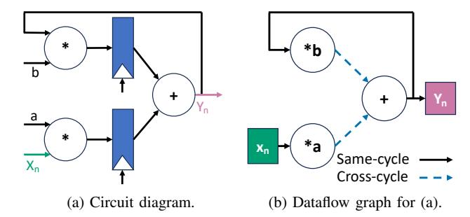
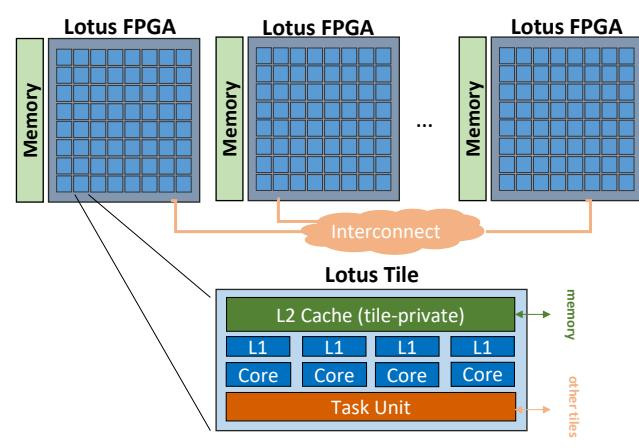

# Lotus: A Multi-FPGA Task Dataflow Architecture to Accelerate Cycle-Level Simulation

Fares Elsabbagh MIT CSAIL Cambridge, MA, USA farese@csail.mit.edu Joel S. Emer MIT CSAIL Cambridge, MA, USA emer@csail.mit.edu Daniel Sanchez MIT CSAIL Cambridge, MA, USA sanchez@csail.mit.edu

Abstract—Simulation is crucial to design and build hardware. But simulating large and complex digital designs is slow. Hardware emulators are the standard accelerator for cycle-level RTL simulation, but these systems are expensive, inefficient, slow to compile for, and limited to simulating RTL. Emulators consist of many chips, typically FPGAs, to which the design is compiled. Emulators are bottlenecked by communication, and use FPGAs at a fraction of their speed.

We present Lotus, a large-scale architecture that accelerates cycle-level simulation. Lotus uses multiple FPGAs like emulators, but takes a different approach: rather than mapping logic directly to FPGAs, Lotus implements thousands of simple cores, along with hardware support that enables software simulation to scale. Lotus simulates digital systems by encoding them as large dataflow graphs of tiny tasks that run on these cores. Lotus uses dataflow execution to extract abundant parallelism; task priorities to focus work on the critical path; and selective execution to avoid ineffectual work. We contribute new implementations of these techniques that scale to multiple chips and require simple hardware. We also develop a compiler to use Lotus efficiently from high-level dataflow graphs.

We build an implementation of Lotus using 8 FPGAs, featuring over two thousand cores. On several large designs, this Lotus prototype achieves speeds comparable to emulators, while reducing the number of FPGAs needed by up to  $7.5\times$  and improving performance per FPGA by up to  $23\times$ . Lotus is also  $8\times$  faster than a 128-core server. Overall, Lotus is the first system to show that software simulation can outperform emulators by leveraging large-scale parallelism.

#### I. Introduction

Simulation is crucial to design and verify hardware. But as processors and SoCs integrate more components like CPU cores, domain-specific accelerators, and increasingly complex memory hierarchies, fast simulation becomes more challenging.

In this work, we focus on accelerating *cycle-level* simulation, where the full design is simulated cycle by cycle. Cycle-level simulation is commonly used in Register-Transfer-Level (RTL) simulation [5, 34, 41] of hardware written in a Hardware Description Language (HDL), like SystemVerilog. But cycle-level simulation has applications beyond RTL, e.g., to build cycle-accurate simulators [28].

Cycle-level simulation is slow in CPUs, which has prompted substantial work to accelerate it. *Hardware emulators* are the state-of-the-art accelerators for cycle-level simulation, and specifically focus on RTL simulation. An emulator consists of tens to thousands of reconfigurable chips, typically FPGAs. To simulate a design, the emulator synthesizes it to gates,

maps these gates across FPGAs, and runs them in lockstep, communicating values across FPGAs each simulated cycle [4, 6, 8, 9, 36]. Emulators have significant limitations: they are large, expensive platforms; they suffer from long compile times (days to weeks for large designs); the size of the system limits the size of circuit they can simulate; and they are limited to RTL, so they cannot support models written in software.

Despite these limitations, emulators are widely used by chip designers. Their market size is about \$2 billion, and is growing rapidly due to the increasing complexity of commercial chips [33]. Moreover, the high cost and limited applicability of emulators hinders chip design and restricts it to the few large companies who can afford them.

Cycle-level simulation can also be done in software. However, simulation is slow in current multicore CPUs because parallelizing the simulated model introduces frequent communication and synchronization, limiting scalability even with state-of-the-art parallelization techniques [41]. Prior work has observed this challenge and proposed single-chip systems, ASH [15] and Manticore [17], that provide hardware support for fine-grained parallelism. These systems scale simulation workloads to hundreds of cores, but they are limited to a single chip, so they do not reach the speeds of emulators and do not scale to very large designs.

We present Lotus, a large-scale parallel architecture tailored to cycle-level simulation. Lotus scales software simulation to reach emulator-level performance, but retains the flexibility and compilation speed of software simulators. Lotus consists of multiple FPGAs, each with hundreds of general-purpose cores, combined with hardware support for fine-grained parallelism.

Our approach builds on a key insight: multi-FPGA emulators are inefficient because they are bottlenecked by communication. When a hardware design fits on a single FPGA, it can run at high speed (e.g., over  $100\,\mathrm{MHz}$ ). But large designs require multiple FPGAs, and logic mapped to different FPGAs communicates every simulated cycle. Because inter-FPGA communication takes hundreds of nanoseconds, this limits simulation performance to a few MHz, and each FPGA runs about  $100\times$  slower than its achievable speed.

Since communication latency dominates multi-FPGA emulators, we argue there is little point in mapping hardware spatially (i.e., directly) to FPGAs. Instead, Lotus expresses programs as a collection of tasks, maps these tasks across the

system, and executes them *over time* using thousands of cores. As a result of this temporal execution, multiple tasks reuse the same FPGA resources. This improves efficiency and enables Lotus to simulate much larger systems than would fit spatially in its FPGAs. Temporal execution also enables decoupling communication and computation, hiding long communication latencies between FPGAs.

While Lotus builds on a simple insight, making it practical requires several novel techniques and a substantial amount of hardware-software co-design and engineering.

To make Lotus possible, we contribute hardware and software techniques along with a carefully engineered implementation: 1. Lotus architecture: Lotus is a massively parallel, distributedmemory architecture. Lotus consists of multiple chips (FPGAs in our implementation), each with its own memory. Each Lotus chip integrates multiple tiles, and each tile has several cores and a task unit that provides hardware support for fine-grained parallelism. Lotus adopts a task dataflow execution model, where the program is encoded as a dataflow graph of small tasks that is executed each simulated cycle. Task units receive and buffer task inputs, dispatch ready tasks to cores, and send task outputs to consumer tasks. Lotus implements two techniques that improve simulation performance: prioritized execution gives priorities to tasks, and runs higher-priority ready tasks first, focusing the system on the critical path; and selective execution skips executing a task if its inputs do not change across cycles, avoiding ineffectual work.

Prior work ASH [15] also proposed a task dataflow execution model with prioritized and selective execution. But ASH uses implementations that are inefficient, especially on an FPGA, and hard to scale: tasks generate the dataflow graph dynamically as they execute, which complicates the implementation of dataflow and prioritization hardware; and selective execution is achieved through speculation, which adds overheads and would require a large and growing amount of speculative state as the system scales to many chips. Instead, Lotus leverages the static nature of the dataflow graph to simplify task units and prioritization mechanisms, and Lotus implements selective execution with non-speculative synchronization (CMB-style [11]); this causes more communication but requires less logic than speculation, a good tradeoff for FPGAs.

- 2. Lotus multi-FPGA prototype: We develop a highly optimized Lotus prototype with 8 interconnected Alveo U55C FPGAs. This prototype implements 2,176 RISC-V cores in 544 tiles, running at 400 MHz. It has a peak throughput of about 900 giga-instructions/s, similar to high-end servers of similar cost to the FPGAs we use, and dispatches over 200 billion tasks/s, enabling 10-instruction tasks to run efficiently. We contribute highly optimized RISC-V cores, task units, caches, and interconnects to enable this level of performance.
- **3. Lotus compiler:** Software RTL simulators compile programs to an intermediate software language, typically C/C++. We develop a C++-based domain-specific language (DSL) that serves as this intermediate language, and enables writing Lotus programs using high-level dataflow graphs. We then build a compiler that produces efficient implementations for both Lotus

Fig. 1: Example 2-stage pipeline that computes  $y[n] = a \cdot x[n-1] + b \cdot y[n-1]$ .

and multicore CPUs. The compiler uses several techniques to use many cores well, including hierarchical partitioning to minimize cross-chip communication, and novel task coarsening techniques to increase throughput and utilization. The compiler also reuses code across tasks to minimize icache pressure.

We have also adapted Verilator, the state-of-the-art opensource RTL simulator, to produce Lotus programs from Verilog. We show that benchmarks written directly in our C++-based DSL are much faster, due to limitations in Verilator that make it very hard to scale to thousands of cores. While our Lotus Verilator compiler also outperforms CPUs substantially, the resulting programs do not reach emulation-level speeds. We leave optimized Verilog-to-Lotus compilation to future work.

We evaluate Lotus running on 8 FPGAs and compare it with hardware emulation and multi-threaded shared-memory CPU baselines. We simulate six benchmarks that represent both large functional units (like systolic arrays) and multicore systems. We show that Lotus achieves similar speeds to emulation platforms (gmean 42% faster) while using  $3\times$  fewer chips. We also show that Lotus is gmean  $8\times$  faster than the multi-threaded CPU baseline running on a 128-core server.

Overall, Lotus achieves several technical firsts. Lotus is the first multi-chip simulation accelerator that uses temporal mapping, where general-purpose cores execute simulation tasks over time. Lotus is also the first simulation accelerator to demonstrate speeds rivaling emulators, challenging the conventional wisdom that cores are too slow for this purpose.

Our Lotus implementation is open-source and available at http://lotus.csail.mit.edu.

## II. BACKGROUND AND MOTIVATION

In this section, we describe synchronous dataflow graphs, a common representation used by Lotus and prior work, and we present prior work on simulation acceleration.

#### A. Synchronous dataflow graphs

Cycle-level simulation requires evaluating how signals and state (registers and memory) evolve over clock cycles. *Dataflow graphs*, specifically synchronous dataflow (SDF) graphs [26], are a common method to perform a cycle-level evaluation of hardware designs. In an SDF graph, nodes represent computation and edges represent communication between nodes. Fig. 1a shows an example 2-stage pipeline that computes

y[n] = a · x[n − 1] + b · y[n − 1], and Fig. 1b shows how this circuit can be represented as a dataflow graph. Combinational logic is represented using nodes, which consume one or more input values. Each node can fire when all its inputs are available, producing output values that are communicated to other nodes through edges. Edges have a delay in cycles: wires turn into 0-cycle or same-cycle edges, and registers turn into 1-cycle or cross-cycle edges. The dataflow graph is evaluated repeatedly, consuming a set of inputs and producing a set of outputs on each simulated cycle.

## *B. Software RTL simulators and accelerators*

Software simulators [5, 16, 30, 34, 41, 44] compile RTL designs to programs that run in serial or parallel processors.

Verilator [34], the current state-of-the-art open-source RTL simulator, compiles the target circuit into a multi-threaded C++ program. Verilator extracts the dataflow graph and maps each graph node to run on a thread. Nodes are scheduled statically within the thread, and Verilator adds the necessary inter-thread synchronization to enforce data dependences among communicating nodes placed on different threads.

Software simulators are hard to parallelize in current multicores, because communication and synchronization through shared memory add large overheads. Verilator rarely scales beyond a few threads, because same-cycle edges (wires) induce frequent communication. The RepCut [41] simulator alleviates this problem by replicating nodes and restricting communication to happen between simulated cycles. But even state-of-the-art RepCut scales to only tens of threads.

Prior work has observed this problem, and has proposed specialized architectures for simulation. ASH [15] provides hardware support for small dataflow tasks with priorities and implements selective execution using speculation. ASH is a single-chip ASIC with 256 simple cores, and was evaluated in simulation. Manticore [17] is a multicore that exploits bulk-synchronous parallelism and static scheduling to avoid synchronization overheads; Manticore handles dynamic-latency events (such as memory accesses, needed to, e.g., simulate large memories in the design) by globally pausing execution (e.g., through clock gating). Manticore was prototyped using a single FPGA, using a 225-core implementation.

Lotus is an architecture specialized for software simulation, like ASH and Manticore, but has substantial differences. First, Lotus is a multi-FPGA, distributed-memory architecture, whereas ASH and Manticore are limited to a single chip, as they use techniques that would be hard to scale to multiple chips (e.g., speculative execution in ASH, and a single, gateable global clock in Manticore). Second, Lotus has a multi-FPGA implementation that enables emulator-level performance and improved efficiency when simulating large designs.

Lotus is closer to ASH and adopts its techniques: dataflow tasks, prioritized execution, and selective execution. But ASH's techniques would be overly expensive, especially on FPGAs. Specifically, ASH dynamically unfolds the dataflow graph: when tasks produce output values, they enqueue them to other tasks, and include the necessary metadata for the task (e.g., a

function pointer and priority). Task management hardware uses small buffers to coalesce task arguments, and spills non-fitting arguments to (cache) memory. This design is sensible for an ASIC, because it enables sharing limited on-chip memory to store the dataflow graph. But it introduces undue complexity, causes extra communication (as task metadata is sent from producer tasks), and is a poor fit to FPGAs.

Instead, Lotus leverages that the dataflow graph is static to adopt a much simpler design: task units support a fixed number of tasks, these tasks are statically mapped to tiles, and task units have sufficient memory to hold the inputs and metadata for all tasks, never spilling to memory. Lotus limits the size of the dataflow graph, but if a larger graph is needed, one just needs to produce a different Lotus configuration that allocates more memory to task units and less to caches. As a result, Lotus task units have 17× less logic (the dominant resource) than the equivalent ASH task management hardware. Moreover, ASH uses speculative execution to implement selective execution, which would add substantial overheads on FPGAs [1]; Lotus opts for simpler non-speculative selective execution, which results in more messages but takes a trivial amount of logic, about 1% of the design.

## *C. Hardware emulation and emulator-style accelerators*

Hardware emulators consist of multiple reconfigurable chips, either FPGAs [9, 36] or ASIC gate processors [6, 8]. They perform RTL-level simulation by synthesizing the circuit to gates, and mapping the circuit spatially across its reconfigurable chips. Currently, the fastest commercial emulators use FPGAs (e.g., ZeBu, Protium [9, 36]), so we focus on them; ASIC-based emulators (e.g., Palladium [8]) are slower but more flexible (e.g., compilation times are faster).

Although emulators are widely used, they come with severe drawbacks. Compiling a large design can take days to weeks, as it requires partitioning the netlist across emulator chips, and placing and routing each partition. And because the circuit is directly mapped to emulator hardware, the size of the emulator limits the size of the simulated circuit. Simulating leading-edge chips with billions of gates requires emulators with thousands of chips, which are large and expensive.

Moreover, emulators are inefficient because they are bottlenecked by communication: despite careful partitioning and time-multiplexing of I/O pins [4], gates mapped to different emulator chips communicate every cycle, and the latency and sometimes bandwidth of cross-chip communication limits performance. While a single FPGA can run at hundreds of MHz, communication limits speed to a few MHz at most.

By contrast, Lotus clocks its FPGAs at a high speed and leverages asynchronous communication to overlap communication and computation. This higher frequency makes up for the overheads of using cores rather than mapping the circuit directly to FPGA resources, and enables many tasks to reuse each core, reducing the amount of FPGAs needed over emulators.

Prior work has proposed multi-FPGA systems that work on the same principle as emulators (mapping logic directly to FPGAs), but use techniques to ameliorate their bottlenecks:

Fig. 2: Lotus system overview.

DIABLO [38], FireSim [7, 23], and SMAPPIC [12] are multi-FPGA simulation and prototyping platforms that achieve higher speeds than emulators but target a restricted class of designs: those consisting of small components connected through highlatency channels, like small servers that communicate through a network. These systems fit each component within an FPGA, and leverage the high-latency communication across components to clock FPGAs faster. However, large monolithic designs require cycle-by-cycle communication, which these systems do not support.

RAMP Gold [39], FAME [40], and HASim [29] simulate multicore processors using FPGAs, and leverage time-division multiplexing to simulate multiple cores with the same set of FPGA resources. Time-multiplexing enables mapping more cores per FPGA, but these platforms require manual changes to implement time-multiplexing and are limited to cores.

Finally, FireAxe [42] is an open-source multi-FPGA emulator that uses commodity FPGAs. FireAxe supports user-guided partitioning of large designs, time-multiplexes I/O in the style of Virtual Wires [4], and can be combined with FAME to reduce resource utilization. Lotus uses commodity FPGAs like FireAxe, so we use FireAxe's achieved performance to compare with emulators in Sec. VII.

## III. LOTUS ARCHITECTURE

Fig. 2 shows an overview of Lotus hardware. Lotus is a parallel system consisting of multiple FPGAs, each with its own memory. Each FPGA contains multiple tiles; each tile has several cores, a tile-private cache, and a *task unit* that buffers task inputs, dispatches ready tasks to cores, and sends task outputs to consumer tasks located at the same or other tiles.

In this section, we explain Lotus's execution model and the design of its task units, which enable Lotus's three key features: dataflow tasks, prioritized execution, and selective execution.

