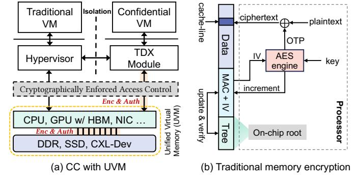

# I. INTRODUCTION

GPU-based Confidential Computing (CC) [\[1\]](#page-13-0)–[\[9\]](#page-13-1) is an emerging paradigm that combines a CPU trusted execution environment (TEE, e.g., Intel TDX [\[10\]](#page-13-2), [\[11\]](#page-13-3)) with a confidential computing-capable GPU (e.g., NVIDIA H100 [\[12\]](#page-13-4)) to protect data in use. This approach has gained traction for workloads that handle sensitive information in cloud environments or AI pipelines [\[4\]](#page-13-5), [\[9\]](#page-13-1). However, GPU-based CC introduces two major challenges. First, it relies on encryption schemes such

1

Fig. 1: (a) Confidential Computing system with unified virtual memory and (b) Counter-mode memory encryption.

as AES-XTS [\[13\]](#page-13-6) and AES-GCM [\[14\]](#page-13-7), which incur significant performance overheads in current systems [\[5\]](#page-13-8), [\[6\]](#page-13-9). Second, GPUs suffer from the memory wall problem [\[15\]](#page-13-10): although high-bandwidth memory (HBM) provides fast access, it is both costly and limited in capacity compared to CPU memory or external storage devices such as SSDs.

Unified Virtual Memory (UVM) [\[16\]](#page-13-11)–[\[44\]](#page-14-0) addresses the problem of memory wall by allowing the GPU, CPU, and other devices to share a unified address space (Section [II-A\)](#page-1-0), enabling transparent access to different memory devices. As shown in Figure [1\(](#page-0-0)a), UVM allows transparent page migration between CPU DRAM, GPU HBM and even external devices such as CXL-attached memory or SSDs. This capability further enables oversubscription, allowing applications to use more memory than the GPU physically provides via on-demand page migration and eviction. However, UVM's fault-driven page migration and eviction introduce significant overhead even without CC [\[18\]](#page-13-12), [\[20\]](#page-13-13), [\[28\]](#page-13-14). When combined with CC, the performance cost increases significantly. Each page migration across trust boundaries (i.e., between the CPU and GPU packages) triggers counter-mode encryption (Section [II-B\)](#page-2-0), which adds latency on the critical path [\[5\]](#page-13-8), [\[6\]](#page-13-9). During encryption, both the CPU and GPU must agree on an initialization vector (IV) to correctly perform encryption and decryption. In current CC implementations, IV correctness relies on access order. Each memory access increments the IV, and because accesses are symmetric between the CPU and GPU, both sides can stay synchronized. Such a design also helps in defending replay attacks [\[6\]](#page-13-9). However, this design

Copyright © 2026 IEEE. This paper will appear in the Proceedings of International Symposium on Computer Architecture (ISCA), Raleigh, NC, June 2026. Personal use of this material is permitted. Permission from IEEE must be obtained for all other uses, in any current or future media, including reprinting/republishing this material for advertising or promotional purposes, creating new collective works, for resale or redistribution to servers or lists, or reuse of any copyrighted component of this work in other works by sending a request to pubs-permissions@ieee.org.

tightly couples encryption with the data transfer order. As a result, encryption remains on the critical path and cannot be easily overlapped with computation [6].

When it comes to encryption: TEE-based memory encryption across CPUs [45]-[53], GPUs [54]-[57], and NVMs [58]-[63] typically relies on counter-mode encryption with explicit IV and message authentication code (MAC) storage (see Figure 1(b)). Each cache line (CL) maintains its own IV and MAC, both protected by integrity trees, enabling encryption via one-time pad (OTP), i.e., OTP =  $AES(IV_{CL}, key)$ . Because IVs are decoupled from access, OTPs can be generated ahead of time or out-of-order. However, this flexibility incurs high cost: Intel SGX, for instance, reserves 25% of enclave memory for metadata [46]. In contrast, we observed that UVM page migration under CC adopts a synchronous encryption model where IVs are derived implicitly from an access-ordered counter:  $IV_t \leftarrow increment(IV_{t-1})$ . The IV is determined only when the data is accessed. This design avoids IV management, but it also makes encryption depend directly on the runtime access order. As a result, encryption must be performed synchronously on the critical path. We therefore propose to bring flexible IV management back to GPU-based CC. However, the encryption scheme required for UVM under GPU CC differs from prior solutions as summarize in Table I. It highlights few mismatches between prior counter-mode schemes and UVM under CC. Prior schemes assume an integrity tree, per-CL counters, and encrypted memory. These assumptions are unnecessary here: GPU-based CC deprecates the integrity tree, UVM migrates data at page granularity, and HBM is already trusted (Section II-C). Meanwhile, prior schemes provide decoupled OTP, which remain desirable because it removes tight runtime synchronization. The challenge is therefore to recover this flexibility without inheriting the mismatched granularity and memory encryption assumptions.

To address this challenge, we first analyze UVM faultservice implementation and performance under CC by instrumenting the NVIDIA Linux Open GPU Kernel Module [64] (Section III). Our analysis reveals three key inefficiencies in the current design: (i) current UVM under CC requires tight CPU-GPU synchronization to negotiate initialization vectors (IVs) for AES-GCM encryption for each 4 KB page, which places CPU-side encryption on the critical path; (ii) the driver thread frequently sits idle while waiting for new fault batches to arrive, wasting CPU resources that could otherwise be spent on encryption; (iii) CPU software encryption throughput is itself low (1.3 GB/s) because UVM uses Linux Kernel Crypto APIs that are currently not parallelized, which further degrades performance. These characteristics for UVM under CC have not been exploited in prior work. Even in state-of-the-art designs such as PipeLLM [6], which rely on prediction, IVs remain tied to memory access order, as mispredictions can result in stale ciphertext (Section IV-B).

Based on these observations, we propose LÆGIS (Sec-

TABLE I: Encryption Schemes Comparison

| Consideration  | <b>Prior Counter Mode</b> | GPU-based CC (UVM)         |
|----------------|---------------------------|----------------------------|
| IV / MAC       | ✓ Explicit per-CL         | × Implicit, access-based   |
| Integrity Tree | × Required                | √ Deprecated               |
| OTP Timing     | √ Decoupled               | × On-access only           |
| Granularity    | × Cache-line (64B/128B)   | ✓ Page-level (64KB, 2MB)   |
| Memory         | × Encrypted DRAM          | ✓ Plaintext HBM [65], [66] |

tion IV).2. Under the widely adopted assumption that HBM is secure (Section II-C), LÆGIS co-designs HBM-resident explicit IV management with UVM behavior (e.g., driver thread idleness) to improve the performance of general UVM workloads under GPU-based CC via opportunistic pre-encryption. At a high level, LÆGIS makes three key contributions: (i) it reintroduces explicit IV management in GPU-based CC while decoupling encryption from CPU–GPU synchronization, without requiring integrity trees; (ii) it introduces the IV Bank, an HBM-resident GPU structure that maintains perpage3 IVs for secure and flexible IV tracking (Section V), thereby fully decoupling encryption from access ordering; and (iii) it leverages opportunities at the CPU to pre-encrypt pages, improving UVM performance under CC (Section VII).

To the best of our knowledge, this is the first work that makes the following contributions:

- We conduct an in-depth performance dissection of UVM under CC by instrumenting the GPU driver, examining how page migration and encryption work in practice.
- On CC-enabled real GPU hardware, we identify three major inefficiencies in CC UVM fault servicing: namely, synchronized encryption, driver thread idleness, and low CPU software encryption throughput.
- We propose LÆGIS, a design that opportunistically performs page pre-encryption and leverages secure HBM for flexible IV management.
- Grounded in the results from real GPU hardware, we implement LÆGIS on top of GPGPU-Sim [67], [68]. Our evaluation shows that LÆGIS significantly reduces CC overhead, achieving up to 3.13× (2.22× on average) and 5.05× (2.74× on average) speedup over the CC baseline under default and aggressive prefetching, respectively.

#### II. BACKGROUND

In this section, we present an overview of GPU-based confidential computing. Next, we describe how unified virtual memory works in conjunction with confidential computing. This is followed by a description of the cryptographic mechanisms employed in such systems. Finally, we describe the threat model considered in this work.

