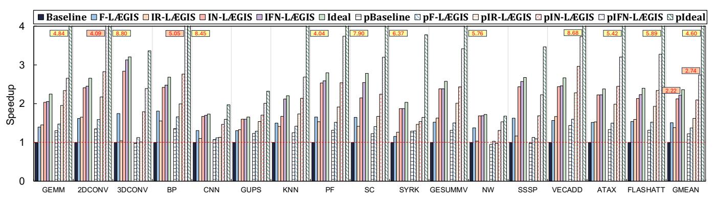
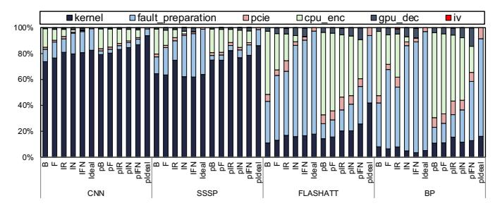

# VII. EVALUATION

Overall Performance. Figure [12](#page-10-0) reports speedups across 16 applications (geometric mean included). We begin by examining Baseline and pBaseline to understand how encryption overhead undermines the effectiveness of aggressive prefetching. Ideal outperforms Baseline by 2.36× on average, confirming that encryption is the primary performance limiter. Unless otherwise noted, all reported speedups are normalized

Fig. 12: Performance comparison among baseline configurations and LÆGIS settings. All values are normalized to baseline.

to Baseline. Aggressive prefetching alone (pBaseline) recovers only 22% over Baseline, consistent with prior non-CC results [\[27\]](#page-13-18). However, when prefetching is paired with no encryption overhead (pIdeal), the gain jumps to 4.60×, which reveals the substantial performance headroom that encryption overhead currently suppresses. For 3DCONV, NW, and SSSP, aggressive prefetching degrades performance by 2 to 5% over Baseline, which is contrary to prior findings [\[27\]](#page-13-18). This stems from a fundamental trade-off: while prefetching reduces fault frequency, each fault batch now serves more base pages, increasing the volume of data that must be encrypted and outweighing the benefit of fewer faults. CNN illustrates this starkly where where the prefetching benefit drops from 1.97× with pIdeal to just 1.08× with pBaseline.

Next, we examine F-LÆGIS and pF-LÆGIS. Unlike the baseline configurations, these schemes leverage false idle time (i.e., fault preparation time) to offload a portion of the encryption cost from the critical path. As a result, F-LÆGIS achieves a 1.51× speedup on average over Baseline. However, false idle intervals alone are insufficient under aggressive prefetching. pF-LÆGIS reaches a 1.37× speedup, which is lower than F-LÆGIS because aggressive prefetching increases per-batch encryption demand. However, pF-LÆGIS still benefits consistently from prefetching. None of the applications exhibit performance degradation, indicating that preencryption successfully mitigates the additional encryption pressure introduced by aggressive prefetching.

We now examine the impact of utilizing true idle time through IN-LÆGIS and pIN-LÆGIS. Since true idle periods are longer than false idle ones, more pages can be preencrypted during these intervals. On average, IN-LÆGIS achieves a 2.17× speedup over Baseline, narrowing the performance gap with Ideal to just 9%. This demonstrates that leveraging true idle time allows LÆGIS to approach the performance of an ideal GPU-based CC system. However, even after leveraging true idle time, benefits with aggressive prefetching are still limited. pIN-LÆGIS achieves a 2.10× speedup, comparing to pIdeal (4.60×) this is a 54.4% gap. To further understand the impact of page candidate selection, we evaluate a simple random candidate page selection strategy (IR-LÆGIS and pIR-LÆGIS). On average, IR-LÆGIS and pIR-LÆGIS achieve speedups of 1.38× and 1.62×, respectively. While these gains are smaller than those of IN-LÆGIS

and pIN-LÆGIS, they still provide notable improvements over the baselines. These methods show that LÆGIS can work with any page encryption order and are compatible with prior efforts [\[20\]](#page-13-13), [\[21\]](#page-13-17), [\[25\]](#page-13-21)–[\[27\]](#page-13-18) in UVM access prediction and prefetching.

Lastly, we examine the full version of LÆGIS, namely IFN-LÆGIS and pIFN-LÆGIS, which pre-encrypts fault-buffer candidate pages during both types of idle types (false and true) and then sequentially pre-encrypt any remaining CPU-resident pages. These two variants deliver the highest performance among all evaluated designs. On average, IFN-LÆGIS achieves a 2.22× speedup, with a maximum of 3.13×, narrowing the gap with Ideal to only 5.8%. Meanwhile, pIFN-LÆGIS further improves performance under aggressive prefetching. It achieves a maximum speedup of 5.05× and an average of 2.74×, narrowing the gap with pIdeal to 40.34%. Together, these results show that leveraging both idle intervals is essential for approaching ideal CC performance.

Fig. 13: Effect of LÆGIS on various execution time components for selected applications

Performance Breakdown. To gain deeper insight, Figure [13](#page-10-1) breaks down the execution time of four representative applications into six components: kernel (GPU SM execution and memory operations), fault batch handling, PCIe transfer, CPU encryption, GPU decryption, and IV access. We observe that LÆGIS effectively reduces CPU-side encryption overhead. Since pre-encryption can prepare pages in batches, PCIe can transmit data in larger bursts, thereby improving link utilization. However, offloading encryption from the critical path allows GPU decryption latency to surface, indicating that even specialized decryption hardware does not eliminate crypto overhead entirely [\[133\]](#page-16-18). Despite the improvements, fault preparation still dominates a significant portion of execution time. However, because LÆGIS leverages this time for pre-encryption, reducing fault preparation latency could diminish the benefit from encryption offloading. This highlights a trade-off that must be considered carefully in future UVM design under CC. Finally, we note that IV access incurs minimal overhead. As discussed in Section [I,](#page-0-1) GPU-based CC uses per-page IVs rather than per-CL counters. This coarser granularity leads to infrequent IV accesses to IV Bank with high locality, mitigating the typical IV access bottlenecks observed in traditional schemes.

Fig. 14: Effect of LÆGIS on fraction of CPU time during which the driver thread is active versus (true) idle.

Idle to Active Ratio. We examine how idle periods are used for active computation. Figure [14](#page-11-2) shows the fraction of time during which the driver thread is active versus (true) idle across four applications. We observe that applying LÆGIS increases the active ratio, indicating more efficient resource utilization. For example, in SSSP and FLASHATT with pIFN-LÆGIS, the active ratios reach 99.4% and 96.8%, respectively. On average, IFN-LÆGIS achieves a 53.2% active ratio, while pIFN-LÆGIS improves this to 88.3%.

Fig. 15: Throughput of AES implementations. Collected on real hardware. The x-axis shows size of data to be encrypted.

