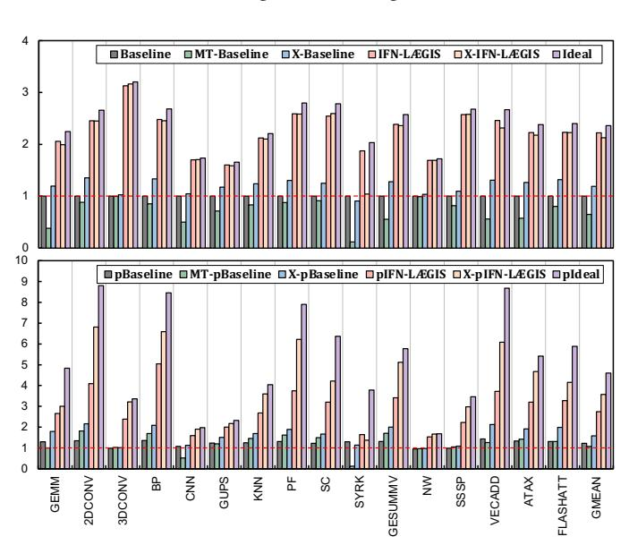

# VIII. SENSITIVITY STUDY

## *A. Performance of AES Implementation*

As discussed in Section [III,](#page-3-1) current GPU-based CC stacks use different AES implementations. A key divide is between non-UVM and UVM applications, which also separates userspace and kernel-space paths. However, the performance impact of these choices remains unclear. To this end, we implemented and measured both user-space and kernel-space AES performance with two different OpenSSL versions (as suggested by [\[134\]](#page-16-19)) and threading settings. The results are shown in Figure [15.](#page-11-3) Besides LCA and UVM, the other implementations are user-space-based. LCA sustains about 2.5 GB/s on a 2 MB buffer, whereas the UVM driver includes additional costs that reduce effective throughput to about 1.3 GB/s. We evaluate user-space AES with four threads (4T) and chunk sizes of 1 KB, 4 KB, and 512 KB. As expected from Section [III,](#page-3-1) the OpenSSL version does not affect LCA and thus does not benefit UVM; we also validate this with end-toend UVM application profiling. In contrast, newer OpenSSL versions improve peak user-space throughput from 3.03 GB/s to 8.61 GB/s, yielding similar gains for cudaMemcpy. Multithreading helps only for sufficiently large data: it adds overheads (setup/dispatch, IV management, lock, synchronization, etc.) and does not help at 4 KB granularity, but can yield substantial speedups for larger sizes with an appropriate chunk size. These results show that user-space optimizations do not translate to UVM. LÆGIS does not rely on OpenSSL, so it can accommodate varying encryption throughput configurations while still delivering substantial gains (Section [VIII-B\)](#page-11-1).

Fig. 16: Speedup of LÆGIS with multi-threading and hardware-acceleration support. Higher is better.

