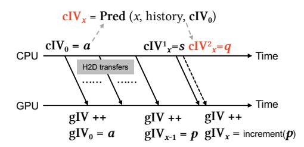

# *B. Synchronized Encryption: How to Encrypt?*

As discussed in previous sections, although idle periods can be used for pre-encryption, the question of *how to encrypt* remains challenging. This arises from the synchronous nature of current encryption, where the IV is tightly coupled with access order. A possible solution is to rely on prediction, as in PipeLLM [\[6\]](#page-13-9), which speculatively decouples encryption. However, misprediction risks both performance and security by breaking IV consistency.

Fig. 7: Demonstration of IV prediction adopted from [\[6\]](#page-13-9).

In speculative encryption, PipeLLM predicts future CPUside IV (cIV) values, as shown in Figure [7.](#page-6-3) The GPUside IV (gIV) is incremented when encrypted data from the CPU arrives. This protocol creates an implicit synchronization channel between the CPU and GPU. Thus, a future value cIVx can be viewed as the output of a predictor (Pred), which takes the past history and the current cIV as inputs and predicts the cIV value that will be used at time x. From an oracle's perspective, suppose that at time x the actual cIV is s and the predicted cIV is q. If the prediction is correct, then s = q and increment(p) = s, so the pre-encrypted ciphertext remains valid. However, this correctness can only be confirmed at runtime, when the actual cIV is assigned. If the prediction is wrong, e.g., s > q, then the pre-encrypted ciphertext ctx = AES-GCM(q, pagex ) is invalid. In this case, the predicted cIV q is stale and may collide with a prior encryption using the same cIV, violating AES-GCM's IV-uniqueness requirement. More generally, any incorrect prediction that uses a stale or uncommitted IV can create a security vulnerability. To avoid this, PipeLLM writes predicted ciphertexts to TDX-encrypted memory, which adds more complexity. We identify the root cause as the lack of explicit IV visibility on both the CPU and GPU sides. To address this limitation, we propose decoupling encryption through explicit IV management (Section [V-A\)](#page-7-0).

Observation 4: Synchronous encryption degrades both performance and security when applying prediction. It also limits the benefits that rely on flexible timing and ordering. We identify the root cause of this limitation as the absence of explicit IV management.

