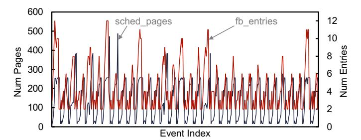
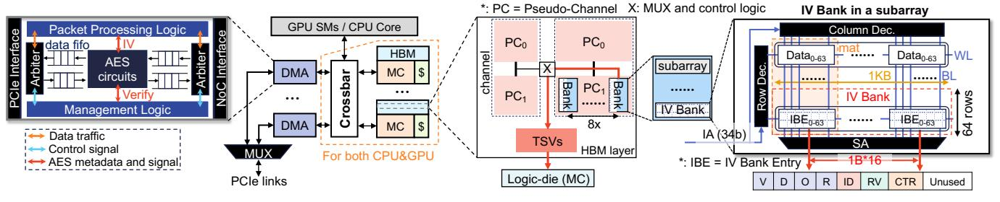

# *C. Closer Look of Fault Behaviors: What to Encrypt?*

Finally, to determine *what to encrypt*, we next explore how to leverage Opportunity 1 for pre-encryption candidate selection. As illustrated in Figure [8,](#page-6-4) we examine the fault buffer activity of 2DCONV under the default prefetching threshold as an example. This is conducted on a simulated platform (see Section [VI](#page-9-1) for more details) to obtain fine-grained activity traces that are typically unavailable on real hardware.

Fig. 8: Fault buffer events for 2DCONV. The left y-axis shows the number of base pages scheduled for service (sched\_pages), and the right y-axis shows the number of entries recorded in the fault buffer (fb\_entries).

First, we observe that pages scheduled when a page-fault event occurs may not be served within a single fault batch. This reflects that the fault buffer maintains multiple entries, rather than just one. This behavior is expected due to the high degree of parallelism in GPUs: warps across many SMs may fault on different virtual addresses simultaneously. These requests are forwarded to the GMMU, which coalesces them into page fault requests. Given diverse access patterns, threads may fault on different VABlocks. Consequently, while the GMMU schedules a fault batch at a given cycle, not all pending faults are served immediately; they are instead split across multiple batches. As already shown in Figure [6,](#page-5-2) due to internal hardware mechanisms and runtime behavior, idle time naturally arises between these batches. As long as the driver can access the fault buffer contents [\[21\]](#page-13-17), [\[112\]](#page-16-0), it can prefetch additional fault buffer entries as candidates for encryption during this idle period.

Opportunity 2: The UVM driver can anticipate future accesses using information already in the fault buffer, or through any existing predictive model.

## V. DESIGN AND IMPLEMENTATION OF LÆGIS

LÆGIS addresses two major research questions: *RQ1*: *How to design an encryption scheme tailored for GPU-based CC that can support out-of-order encryption*; *RQ2*: *With this scheme, how to perform efficient batch handling*. To this end, LÆGIS introduces the following key mechanisms:

- (*i*) Leverages HBM in GPU for metadata (e.g., IV) storage.
- (*ii*) Decouples encryption from access ordering by introducing explicit IV management between CPU and GPU thereby enabling arbitrary encryption orderings.
- (*iii*) Proposes an out-of-order pre-encryption scheme. Combined with (*i*) and (*ii*), this design leverages false and true idle intervals to reduce encryption overhead.

Fig. 9: IV Bank stored across HBM hierarchy.

