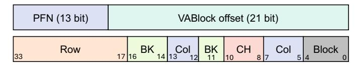

# A. HBM-Assisted Encryption

To enable flexible cryptographic operations and further optimizations, the first step is to decouple IV management from the actual data transfer.

**Insights.** As discussed in Section IV-B, current CC designs rely on implicit IV synchronization, where each encryption step causes the IV on both ends to increment. This synchronization introduces significant overhead, as it lies on the critical path. However, since HBM is considered secure [66], LÆGIS decouples encryption by explicitly storing metadata (e.g., IV) in HBM rather than relying on CPU-GPU synchronization. Also, under this threat model, once data arrives at the GPU, it can be stored in plaintext. Thus, MACs are no longer needed after verification, integrity tree protection can be deprecated, and on-chip GPU memory accesses also do not require encryption, decryption, or verification.

IV Bank Concepts. To the best of our knowledge, this is the first work to leverage the secure nature of HBM and introduce explicit IV storage within it. As shown in Figure 9 (right), we reserve a logical region, termed the IV Bank, in each HBM stack (see Table II for configuration details). IVs are interleaved across all channels and banks. The IV Bank stores per-VABlock IV Bank Entries (IBEs). IBEs are accessible to the memory controller and can be transferred over HBM's TSVs to the on-chip network for routing to other engines, such as CE. GPU IV Bank uses HBM, however, for CPU-side IV Bank, it can be implemented in both TDX-protected memory or HBM. We only require GPU to be HBM-integrated.

Organize IV Bank. LÆGIS reserves space (512 K lines) per HBM stack on GPU to store IV bank entries. Each line holds a 128-bit entry for one VABlock, resulting in 8 MB overhead per stack (i.e., 4 big pages). These lines are mapped to reserved physical addresses during page allocation. Figure 10 shows the address mapping. For an 8-channel HBM stack with 16 banks per channel, interleaving 4 big pages maps VABlock offsets from 0x0 to 0x1FFFFF. The higher address bits span 0x0 to 0x3, using physical address bits 17-22 as the row index. This requires 64 rows per bank, which fit within a single sub-array (Figure 9, right). Each 1 KB row stores 64 IVs, and each access gathers one entry from 16 columns. This layout balances load across banks and avoids hotspots. IVs and data can share subarrays, though more advanced mappings could enable parallel access, which we leave for future work. The design scales to multiple HBM stacks via stack-specific mappings [34].

**IV** Construction. We do not store the 96-bit IV directly. We

also avoid address-dependent IVs, as page swapping caused by prefetching or eviction may change physical address mappings. This makes address-derived IVs unreliable. A natural alternative is to initialize IVs sequentially or randomly. Sequential initialization can lead to duplicate IVs due to varying page fault order. With random initialization, the probability that two entries collide is bounded by well-known birthday bound [46], [113]:  $q^2 \cdot 2^{-95.26}$ , where q is the number of initialized entries. This probability is non-negligible given the size of our IV Bank.

Fig. 10: HBM address mapping of a single stack.

IV Bank Entry. To avoid IV collisions, we divide the 96-bit IV into two parts: a 19-bit identifier (ID) and a 77-bit random value (RV). The RV is generated using a secure pseudorandom function (PRF) with a shared key for initialization. Since the CPU and GPU can negotiate keys securely [7], both sides initialize their IV Bank with matching values. Each IV Bank entry is 128 bits (see Figure 9, right-bottom) and includes the IV and control flags. The V-bit marks whether the entry is valid. The D-bit indicates if the entry has been modified. The O-bit signals overflow of the IV, and the R-bit triggers key rotation and re-encryption on RV overflow (Section V-C). A 9-bit CTR tracks access to base pages within a VABlock. Remaining bits are currently unused but reserved for future extensions. Although the figure shows the GPU-side layout, the CPU maintains a similar structure.

Indexing the IV Bank. Since IV Bank entries are allocated per 2 MB VABlock, we use the page table walk to extract the indexing information. Specifically, we repurpose 19 unused bits in the page directory level 0 entries (PDE0) [114] to store the ID, as shown in Figure 11. The ID is then used to index the actual IBE stored in IV Bank, which are mapped to specific HBM channels via the address layout in Figure 10. As illustrated in Figure 9(left), once an IBE is fetched by the memory controller (MC) in GPU, it is sent to the CE (DMA engine [115]–[118]) via a shared crossbar [77], [116]. It will also be cached into a small on-chip IV cache. Then the CE will construct a 128-bit input to an AES engine using the 96-bit IV, a 17-bit block index within the 2 MB page, and padding. This AES engine will then generate an OTP to perform decryption. With IV Bank support, the CPU and GPU can encrypt and

decrypt independently, enabling out-of-order and decoupled encryption/decryption.

Support for Different Page Sizes. Our design also supports 4 KB and 64 KB pages without modifying the IV Bank structure or increasing page table size. Prior work [119] and public documentation [114] show that the PDEO can handle 2 MB, 64 KB, and 4 KB pages. PDEO contains separate fields—PAS for small-page tables and PAB for big-page tables. Each 16 B PDEO has at least 29 unused bits, which we reuse. For 4 KB pages, we keep the same IV Bank granularity. Since pages are decrypted when they arrive at the GPU, all 4 KB pages within a 2 MB VABlock share the same ID and RV (as shown in Figure 11), differing only by offset. The RV is incremented only after all 512 pages in the block are migrated. To support partial migration, each IBE includes a 9-bit counter to track how many 4 KB pages have been migrated. The same mechanism applies to 64 KB pages.

Fig. 11: IV Bank Entry with small page size.

Eviction Support. LÆGIS naturally supports eviction. For example, under a VABlock-LRU policy [20], an entire VABlock will be evicted. Hence, the RV of the corresponding IBE is incremented, and all pages in the block are refreshed using the new RV. Eviction is orthogonal to our mechanism, and LÆGIS can be integrated with existing eviction policies. Therefore, IV Bank coherence can also be ensured similarly to how UVM page-fault driven coherence works.

