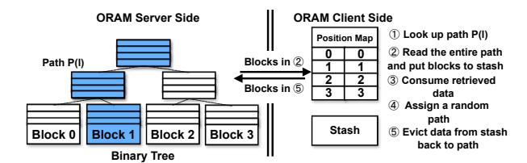
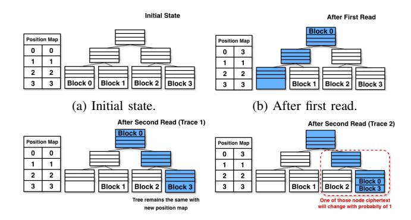
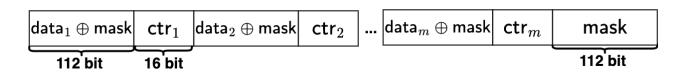
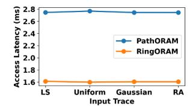
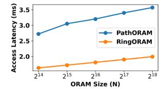
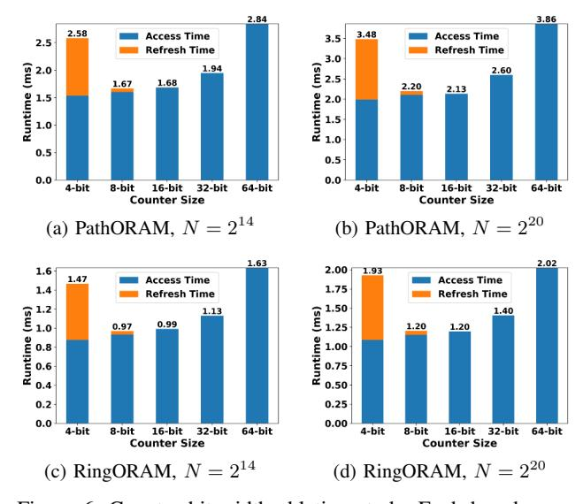

# MC-ORAM: A Mask-Assisted and Counter-Based Non-Deterministic ORAM inside VM-Based TEEs

Yongqin Wang\* *University of Southern California* Los Angeles, CA, USA yongqin@usc.edu

Rachit Rajat\* *University of Southern California* Los Angeles, CA, USA rrajat@usc.edu

Jonghyun Lee *University of Southern California* Los Angeles, CA, USA leejongh@usc.edu

Mengyuan Li *University of Southern California* Los Angeles, CA, USA mli49061@usc.edu

Murali Annavaram *University of Southern California* Los Angeles, CA, USA annavara@usc.edu

*Abstract*—Protecting memory access patterns is crucial for secure computation in environments where sensitive data is processed. Oblivious RAM (ORAM) offers a promising solution to safeguard against such leaks by hiding memory access patterns. However, integrating ORAM with modern Trusted Execution Environments (TEEs) introduces challenges due to the TEE's deterministic encryption, which undermines ORAM's oblivious guarantees. In this work, we present MC-ORAM, a novel mechanism to introduce non-determinism into ORAM systems running in VM-based TEEs. Traditional counter-based designs, such as those using 64-bit counters for every 64-bit data, introduce non-determinism but incur significant overheads due to increased memory traffic. In contrast, MC-ORAM employs a shorter, masking-assisted and counter-based design that ensures ciphertext freshness with minimal overhead. Our method minimizes memory traffic, achieving only a 1.125× increase in bandwidth, compared to the baseline, a substantial improvement over previous approaches that incur a 2× bandwidth overhead. Through experiments on PathORAM and RingORAM, we demonstrate that MC-ORAM delivers notable performance improvements, achieving end-to-end speedup of 1.82× over existing non-deterministic ORAM solutions.

## I. INTRODUCTION

Oblivious RAM (ORAM) protects against memory-access leakage by concealing which locations are accessed. Without such protection, access patterns can reveal sensitive information: prior work [5] recovers AES keys by correlating lookup behavior in key schedules; accesses to embedding tables in recommendation models leak user inputs [12], [21], [24]; and LLM embedding-table accesses can reveal prompts or token sequences. These attacks highlight the need for access-pattern protection, and ORAM [6], [11], [20], [21], [24], [31], [38] has become a foundational primitive for achieving it.

An ORAM design usually involves two parties: a *Trusted Client* and an *Untrusted Server*. The server's sole duty is to hold ciphertext blocks in a structured storage (e.g., a binary tree in PathORAM [36]) and to return or store whole rootto-leaf paths exactly as requested by the client. All privacycritical logic lives on the client side. The client initially shuffles the data layout and assigns a memory block (di) to a randomized physical address location on the server. For example, in PathORAM, the client randomly assigns a leaf node for a given memory block d<sup>i</sup> within the binary tree storage. The client maintains a structure called *position map* which stores the mapping between the logical block address of d<sup>i</sup> and its current location within the tree. Before every logical read or write to the address of d<sup>i</sup> , the client consults the position map to find the leaf label. It then sends a request to the server to fetch the entire tree path from the root to the leaf node. Since the server is untrusted the data on the server is always encrypted. Hence, the client has to decrypt the entire path of data received from the server into a small trusted buffer (the stash). The client then performs its desired computation on block d<sup>i</sup> . The client then has to push the data back to the server. The client first assigns a fresh random leaf label to block d<sup>i</sup> and then re-encrypts every block in the di's old path, greedily refills the tree nodes along the old path under ORAM's eviction rule, and sends the rewritten ciphertext path back to the server. Because every operation moves an entire path of seemingly random ciphertexts, an attacker on the server side learns nothing about true access patterns, though the protocol inflates bandwidth per logical access (e.g., log(N) in PathORAM with N total memory blocks). More detailed background is provided in Section IV-A.

Despite its strong security guarantees, traditional ORAM designs face two major barriers to practical deployment. *Firstly*, ORAM impose substantial bandwidth overheads, especially in a WAN setting where large paths must be transferred for every logical access. For instance, log(N) data blocks are moved between client and server over WAN per each block access. *Secondly*, the trusted client must maintains significant amount of sensitive metadata (e.g., the stash and position map). Hence, traditionally the client does not reside in the same cloud environment. Instead, it must run on a local machine or a secure third-party host.

<sup>\*</sup> Equal contribution.

TEE+ORAM. To address these limitations, recent efforts have turned to Trusted Execution Environments (TEEs) to securely host the ORAM client within the cloud itself, thereby reducing both trust and bandwidth burdens [1], [2], [22], [30], [34], [43]. TEEs allow computations to occur within a CPU hardware-isolated environment (e.g., an enclave or a confidential VM) protected against even privileged software adversaries. In this setting, there are three parties. First is the end user who owns and computes with the data. The end user could be any edge device outside of the cloud. The end user instantiates an ORAM client within a TEE enclave. By relying on TEEs to host the ORAM client, the entire client-side sensitive data (position map, the stash), and all security-critical operations (e.g., decrypting and re-encrypting blocks, updating stash contents) are secured. Whenever the end user needs to read a data block, they send that block address to their trusted enclave ORAM client. The enclave ORAM client issues oblivious requests to the ORAM server. The ORAM server itself need not run inside a TEE. The server stores ciphertext blocks in an encrypted, structured layout and responds to ORAM client access requests by fetching or storing the entire path of an ORAM tree. The key advantage of TEEs is that by placing the enclave and the server process on the same physical machine, the enclave-based ORAM client receives the data locally from the ORAM server. The client can securely decrypt the received data within the enclave, isolate the target block that is requested by the end user, and forward only that block to the user, slashing WAN traffic in bandwidthconstrained settings.

Note that embedding the ORAM client in a TEE inevitably narrows the security margin, because today's enclaves are not yet provably resilient to micro-architectural attacks. For example, they do not prevent access-pattern leakage from the client's logic. Hence, prior works, such as [22], [34], [43], scan the entire stash on every lookup, ensuring that each enclave access touches an identical footprint. Because the stash is tiny relative to the full ORAM, this linear scan costs far less than shipping full paths across the network, preserving obliviousness with minimal overhead. Meanwhile, CPU vendors now treat micro-architectural exploits as firstclass bugs: microcode and firmware hot-patches have already closed several high-impact channels. In other words, although side channel attacks in TEEs remain a threat, their effective window is steadily shrinking, leaving an ORAM-in-TEE design strategically valuable.

Redundant encryption under modern TEEs. TEE-based enclaves protect both data and computations from even a privileged user. Such a protection requires that any enclave must encrypt data that is in DRAM. Modern TEEs (AMD SEV-SNP, Intel TDX, ARM CCA) now offer effectively unbounded encrypted DRAM via a hardware-based Total Memory Encryption (TME) engine. The goal of hardware support for TME is to reduce the overhead of enclave-based memory access. In an ORAM design, the entire server memory needs to be encrypted since the ORAM server is considered untrusted. Hence, there is a coincidental match between the ORAM memory encryption needs and the enclave's TMEbased encryption. We leverage TME to eliminate the need for the ORAM client to perform an additional encryption of data before storing the data. Instead, we allow the entire ORAM tree to reside inside the enclave. Since TME already encrypts all enclave memory, the usual ORAM step of reencrypting blocks before writing them to external storage becomes redundant once the storage is also inside the TEE.

Our insight and approach. We take advantage of this redundancy by eliminating the extra layer of block encryption and redesigning the ORAM client to treat the enclave's TME as the sole encryption mechanism, effectively concealing access patterns while boosting efficiency. However, this design choice uncovers a subtle vulnerability: modern TEEs encrypt DRAM using deterministic schemes (e.g., AES-XTS using a memory address as the nonce). AES-XTS is highly efficient since it does not require storing any nonce related metadata. However, when using AES-XTS for the purposes of implementing ORAM storage there is one significant hurdle. Writing identical plaintexts to the same physical address line yields identical ciphertexts, enabling an adversary to detect value repetitions or changes, known as ciphertext side channel [17], [18], [35], [45]. As shown in Section V-A, this ciphertext side channel can violate ORAM's access-pattern guarantees, revealing stash occupancy, dummy-block locations through ciphertext repetition. This leakage fundamentally compromises ORAM's obliviousness and must be removed.

A natural way to restore ciphertext non-determinism is to attach per-access metadata such as counters. Prior work has explored this direction for mitigating ciphertext sidechannel leakage, mostly from a general secure-compilation or software-hardening perspective rather than from the perspective of ORAM design [15], [42], [43]. The closest prior system is Obelix [43], which employs ORAM-backed storage as part of a compiler-level protection pipeline and uses freshness counters to avoid deterministic ciphertext reuse. However, Obelix is not designed as an efficient ORAM-specific mechanism. Instead, it treats side-channel mitigation as a general compile-time hardening problem, aiming to protect arbitrary code and data accesses by slicing binaries into size-bounded blocks and enforcing non-determinism through a generic software mechanism that pairs each 64-bit data word with a 64 bit counter incremented on every access. While this method also introduces non-determinism in ORAM mechanism, it incurs non-trivial overheads. Most notably, it doubles both the ORAM storage footprint and the memory traffic between the CPU TEE and DRAM. ORAM already requires 6–8× more storage than a non-oblivious baseline, and adding 64 bit counters to every block further inflates the memory usage. Additionally, each 64-bit data access now carries an extra 64 bit counter read–update–write, doubling DRAM traffic and throttling performance. Our result shows that this approach can slow down end-to-end ORAM performance of PathORAM and RingORAM by almost 1.99×, compared to TME-backed designs without counters.

In this work, we propose MC-ORAM, an efficient mechanism for introducing non-determinism in ORAM inside modern TEEs. MC-ORAM leverages random masking with compact 16-bit per-block counters to ensure ciphertext nondeterminism but at a significantly lower cost. Specifically, MC-ORAM divides a 128-bit memory block into a 112-bit data block, which is paired with a 16-bit counter. The 112 bit data is masked with a random 112-bit value. When the counter overflows, the mask is refreshed to maintain nondeterminism, using a lightweight refreshing algorithm. Our approach can operate efficiently within TDX- and SNP-style TEEs and integrate seamlessly with standard ORAM protocols such as PathORAM and RingORAM. Our key contributions are:

- We introduce a *masking-assisted and counter-based nondeterminism* scheme that maintains non-determinism of encrypted memory contents with minimal overhead.
- Our design reduces bandwidth requirements to only 1.12× over baseline, a significant improvement over prior work that incurs 2× bandwidth overhead.
- We propose an *efficient and amortized refresh algorithm* that handles counter overflows by selectively re-randomizing affected regions without disrupting the overall structure.
- We prove that our MC-ORAM results in access patterns that are computationally indistinguishable from baseline ORAM with ciphertext non-determinism.
- We implement MC-ORAM in both PathORAM and RingO-RAM, and our experiments show end-to-end performance improvements up to 1.82× compared to prior non-determinism schemes.

## II. THREAT MODEL

We adopt a similar threat model of other TEE-based ORAM works [22], [34]. In this threat model, the code and data residing within the TEE are considered trusted and are protected by hardware-enforced isolation from the host system. Additionally, the TEE environment supports remote attestation (more in Section IV), allowing a remote party to verify the integrity of the software and configuration inside the enclave prior to provisioning secrets or sensitive data. We assume that the CPU package, including its internal caches and specialized TEE security features, is trusted. This implies that the adversary cannot directly access plaintext data stored inside the CPU or observe the internal execution of code running within the TEE.

However, the adversary is capable of performing software and physical attacks on the memory subsystem external to the CPU. In particular, we assume the adversary can observe memory access patterns to DRAM, including which physical locations are being read or written, as in [16]. Furthermore, the adversary can monitor the encrypted contents of DRAM through techniques such as memory bus snooping. *Specifically, in the TEE-integrated ORAM setting, adversaries can observe access patterns to the stash, position map, and ORAM tree.* *They will also be able to observe encrypted stash, position map, and ORAM tree data stored in the DRAM.* Although DRAM contents are encrypted using hardware mechanisms like AES-XTS, writes to the same physical location with the same plaintext can result in identical ciphertexts. Thus the adversary may be able to detect the the identical ciphertext values if they appear in the access streams enabling information leakage. Effectively preventing such leakage due to deterministic encryption under this threat model is the focus of our work. Importantly, MC-ORAM achieves ciphertext nondeterminism, while benefiting from TEE integration.

## III. RELATED WORKS

Traditional ORAM. ORAM works like [4], [6]–[9], [11], [13], [20], [23], [26]–[28], [31], [32], [37], [38], [40], [46] are classic ORAM constructions designed under the traditional client-server model. Our work is orthogonal to these efforts, as we focus on ORAM inside TEEs. To evaluate the efficiency of our proposed non-determinism mechanism, we implement both PathORAM and RingORAM inside TEEs.

TEE-based ORAM. Raccoon [25] and ZeroTrace [34] are among the first works to integrate ORAM within Intel SGX. Raccoon focuses on obfuscating program execution to close digital side channels, whereas ZeroTrace concentrates on protecting data access. Oblix [22] introduces efficient oblivious search structures and improved read/eviction logic that reduce stash usage, an optimization we adopt in our evaluation. These works (and many others [1], [24], [44], [47]) are all based on earlier generations of TEEs, such as Intel SGX, which offer limited memory capacity and performance scalability compared to more recent VM-based architectures. Importantly, they did not consider how to exploit TME capabilities while addressing its limitations.

Menhir [30] focuses on volume pattern leakage, which is orthogonal to our work. In contrast, we focus on traditional access pattern leakage. Menhir is also the first to leverage Intel TDX's memory encryption to protect the ORAM tree and stash directly in hardware. However, TDX uses deterministic AES-XTS encryption, which can leak access patterns in the absence of additional non-determinism. Obelix [43] also uses ORAM to store stack, heap, and variable within a VM-based TEE but introduces non-determinism using 64-bit interleaved counters, which, incur significant bandwidth and storage overhead. IncognitOS [10] is a recent work using an ORAM to fully obfuscate access patterns in unikernel memory allocations.

MC-ORAM differs from all of these works by introducing a more efficient method to enforce non-determinism under VMbased TEEs with encrypted DRAM, using lightweight perblock counters combined with masking to achieve security and performance. Table I shows this key distinction: MC-ORAM is the only work that introduces non-determinism in VM-based TEEs using a mask-assisted, 16-bit counter-based approach.

Table I: Comparison of ciphertext non-determinism mechanisms in ORAM-related TEE systems. Bandwidth cost denotes the multiplicative overhead per ORAM path read to enforce non-determinism.

| System    | VM-based TEE? | Mechanism                      | Bandwidth cost |  |  |
|-----------|---------------|--------------------------------|----------------|--|--|
| ZeroTrace | Х             | Software re-encryption         | 1×             |  |  |
| OBLIVIATE | Х             | Software re-encryption         | $1 \times$     |  |  |
| Oblix     | X             | Software re-encryption         | $1 \times$     |  |  |
| OBFUSCURO | Х             | Software re-encryption         | $1 \times$     |  |  |
| LAORAM    | X             | Software re-encryption         | $1 \times$     |  |  |
| Menhir    | /             | None                           | -              |  |  |
| Obelix    | ✓             | 64-bit interleaved counters    | $2\times$      |  |  |
| MC-ORAM   | 1             | 16-bit counters + mask refresh | 1.125×         |  |  |

#### IV. BACKGROUND

#### A. Oblivious RAM

Oblivious RAM (ORAM) [11] hides memory access patterns by ensuring an adversary cannot distinguish between any two access sequences of the same length by fetching dummy ORAM blocks and remapping accessed blocks to a new location on every access, making any access traces computationally indistinguishable. Most ORAM use a client–server model, with the trusted client holding metadata and the untrusted server storing encrypted data. In the next two subsections, we briefly review two state-of-the-art designs, PathORAM and RingORAM; their notations are listed in Table II.

PathORAM. PathORAM [38] is a widely used tree-based ORAM construction. It organizes N data blocks (each data block size of B) into a binary tree of height log(N) on the server, where each node is a bucket that can store up to ZORAM blocks. To prevent leakage through bucket occupancy, every bucket is padded with dummy ORAM blocks so that it always contains exactly Z blocks. The client maintains a position map, which records the leaf (i.e., path) assigned to each data block, and a small buffer called the stash. During each access, all ORAM blocks along the designated path are fetched into the stash. Any blocks that cannot be placed back into the tree due to bucket capacity constraints remain in the stash for later eviction. Figure 1 illustrates the steps for accessing a data block in PathORAM: 1) look up the  $\mathcal{P}(l)$  of the target ORAM block in the position map, 2) read entire  $\mathcal{P}(l)$ to client, and put read ORAM blocks to stash, 3) operates on the retrieved data, 4) assign the block a new random path and update position map, and 5) evict data in stash back to  $\mathcal{P}(l)$ . For more detailed description, we refer interested readers to [36]. We can see the bandwidth requirement between the client and the server is high because the server needs to transmit an entire path to the client on every access.

**RingORAM.** RingORAM [31] follows the same tree-based structure as PathORAM, but each bucket stores Z real ORAM blocks plus an additional S dummy ORAM blocks, each block size B, resulting in bigger memory spaces. This extra padding and associated metadata allow RingORAM to read only one block per bucket instead of all Z, reducing bandwidth. Unlike PathORAM's per-access eviction, RingORAM performs eviction only once every A accesses. This periodic eviction keeps the stash bounded while avoiding the full-path reads.

Table II: ORAM parameter notations used in the paper.

| Notation         | Meaning                                         |
|------------------|-------------------------------------------------|
| $\overline{N}$   | Number of real data blocks in ORAM              |
| L                | Depth of the ORAM tree                          |
| Z                | Maximum number of real blocks per bucket        |
| B                | Data block size                                 |
| $\mathcal{P}(l)$ | Path l                                          |
| stash            | Stash                                           |
| RingORAN         | 1-specific notation                             |
| $\overline{S}$   | Number of slots reserved for dummies per bucket |
| A                | Eviction rate (larger means less frequent)      |

#### B. ORAM's Client-Server Model

Traditional ORAM systems such as PathORAM and RingO-RAM use a client-server model where the untrusted server stores encrypted data, while a trusted client manages metadata like the stash and position map. Because the client is separate from the server, its accesses are hidden from the adversary. With the rise of TEEs enabling remote attestation and verifiable cloud execution, recent designs move ORAM client logic, including stash and position map management and even the ORAM tree, into a server-side TEE. Running ORAM inside a TEE reduces communication overhead by allowing the enclave to fetch and process entire paths internally, returning only the requested block to the client. Although TEEs do not prevent address pattern leakage, prior work mitigates stash leakage by scanning the entire stash on each access, which remains efficient due to its small size. This approach also reduces client-side computation by leveraging stronger server hardware, improving practicality for cloud deployment.

#### C. Memory Encryption in Trusted Execution Environment

TEEs are hardware-backed architectures that provide isolated execution without trusting the OS or hypervisor. We focus on Intel TDX and AMD SEV-SNP, both VM-based TEEs. Their hardware-enforced isolation allows ORAM client logic to be offloaded into the TEE, as in prior work [22], [29], [30], [34]. They also provide full memory encryption with minimal overhead. For example, [29] places the ORAM tree directly inside the VM without additional software protection, a design we show leaks information (V).

**AES-XTS** AES-XTS is implemented in TEEs such as Intel TDX [14] and AMD SEV-SNP [3] as a deterministic memory block encryption function that takes only the physical address and the data as inputs, written as  $C = \text{AES\_XTS} \left( \text{addr}_{128}, \, D_{128} \right)$ , where addr is the physical address and D is the 128-bit plaintext block. Because AES-XTS is deterministic, the same data stored at the same physical address always produces the same ciphertext. Thus, whenever both addr and D remain unchanged, the ciphertext is unchanged.

**Jargon Disambiguity.** Both AES and ORAM use the term "block" but unfortunately they refer to their respective internal units of data. To reduce the confusion, we will use 128-bit or AES block to refer to the block in the AES block cipher, and we will use the phrase ORAM block to refer to the data unit



Figure 1: A 3-level PathORAM example (access path 1).

in ORAM with size B as mentioned in the PathORAM and RingORAM descriptions .

#### V. How Determinism Breaks ORAM

#### A. Security Leaks in ORAM+TEEs

TEE's use of AES-XTS breaks ORAM oblivious guarantees when the ORAM tree is placed naively in TDX-protected memory. Standard ORAM designs insert dummy ORAM blocks to hide access patterns, but many dummy (and real) ORAM blocks remain unchanged during reads and writes. Because AES-XTS is deterministic for a given physical location and AES-block data, an adversary can correlate unchanged ciphertexts at specific ORAM locations to gain information about access patterns. Moreover, leakage also arises in the client-side logic: when the TEE scans the ORAM stash on each access, stash entries whose AES-block contents remain unchanged produce unchanged ciphertext, revealing information about stash usage, which correlates to access patterns. In the following sections, we show how an adversary can distinguish access patterns by observing whether the encrypted stash or ORAM tree change over time.

#### B. Leakage from the ORAM Tree

**Leakage from the PathORAM tree.** Figure 2a shows a valid initial state of a PathORAM with N=4, L=3, Z=4. Without non-determinism of TEE memory encryption, adversaries can observe the changes in ciphertexts in the ORAM tree and differentiate below accesses with non-negligible probability.

- 1)  $\langle \mathsf{Read} \ 0 \rangle$ ,  $\langle \mathsf{Read} \ 0 \rangle$ .
- 2)  $\langle \text{Read } 0 \rangle$ ,  $\langle \text{Read } 3 \rangle$ .

In the first trace, two consecutive reads are performed on data block 0. On the first read, with probability  $\frac{1}{2}$ , the adversary observes modifications to both the root node and the leaf node of  $\mathcal{P}(0)$ . In this case, data block 0 is remapped to either  $\mathcal{P}(2)$  or  $\mathcal{P}(3)$ , and subsequently written back to the root (both root node and the leaf node are modified in Figure 2b). On the second read, with probability  $\frac{1}{2}$ , no modification is observed, since data block 0 can be remapped to  $\mathcal{P}(0)$  or  $\mathcal{P}(1)$  with probability of  $\frac{1}{2}$ , allowing it to remain in the root and leaving the ORAM tree content unchanged, as shown in Figure 2c. Since TEEs employ deterministic encryption, the ciphertext of the ORAM tree remains unchanged when its content is unmodified. Therefore, with probability at least  $\frac{1}{4}$ , the adversary observes no change in the ciphertext during the second read.

For the second trace, the first read again targets data block 0. As before, with probability  $\frac{1}{2}$ , the adversary observes changes to the root and leaf node of  $\mathcal{P}(0)$ , and the data block 0 is remapped to  $\mathcal{P}(2)$  or  $\mathcal{P}(3)$ . However, during the second read to data block 3, modifications to  $\mathcal{P}(2)$  or  $\mathcal{P}(3)$  will be observed with a probability of 1, nodes highlighted in Figure 2d. This is because during the eviction process while reading  $\mathcal{P}(2)$  or  $\mathcal{P}(3)$ , data block 0, which was previously mapped to path #2 or #3, will also be written to either the leaf of  $\mathcal{P}(3)$  or the parent node to the leaf node of  $\mathcal{P}(3)$ , those nodes either belongs to  $\mathcal{P}(2)$  or  $\mathcal{P}(3)$ .

Based on these observations, the adversary has a distinguishing advantage of  $\frac{1}{4} = \frac{1}{2} \cdot 1 - \frac{1}{2} \cdot \frac{1}{2}$ , allowing them to differentiate between the two access patterns by observing changes in the ORAM tree's ciphertext. This breaks ORAM when deterministic encryption is used in the underlying TEE.

Leakage from the RingORAM Tree. The key difference in RingORAM is that each read operation retrieves only one block from each node along the path. That block is either the data block of interest or a randomly selected dummy block. Unlike PathORAM, RingORAM performs eviction at fixed intervals, specifically after every A memory accesses. The eviction algorithm resembles that of PathORAM. However, each bucket in RingORAM contains Z + S blocks. These include at most Z real blocks and S dummy blocks, and the bucket is reshuffled during eviction. Some might argue that the shuffling step mitigates the determinism introduced by encryption. While this is partially true, the effect is not strong enough to prevent leakage, as each node only has Z+S blocks for each block to retain its original content with 1/(Z+S) probability. Thus, adversaries can still distinguish between certain access patterns with non-zero probability.

#### C. Leakage from the Stash

It is well known that stash usage is highly dependent on the access pattern [22]–[24], [31], [38]. In general, repeated accesses to the same address result in minimal stash usage, while non-repeating ones leads to higher stash usage. This behavior arises from differences in the number of blocks that change their location during access. An adversary observing the ciphertext layout can infer whether a previously accessed block has been overwritten with a dummy value or replaced with a new block. This leakage can reveal information about stash usage, allowing the adversary to distinguish between different access patterns.

#### VI. MC-ORAM

## A. Overview

To add non-determinism in ORAM TEEs, random masking and interleaved counters are two major methods. Both approaches provide a different ciphertext on each access. However, they both come with their respective overheads. **Masking**, which randomizes each 128-bit block with a one-time pad every time the 128-bit block is accessed, becomes prohibitively expensive in practice because generating random masks requires expensive AES operations. Applying it



(c) After second read (Trace 1). (d) After second read (Trace 2).

Figure 2: An example PathORAM with 4 data blocks.

to the ORAM tree and stash requires a continuous stream of high-entropy randomness and is prohibitively expensive. **Interleaved data and counters**, on the other hand, attach a monotonically increasing counter to data, storing every 64-bit real data alongside a 64-bit counter. Compared with masking, interleaved counters are often preferred by prior works, as they avoid the need to compute random masks and are generally faster. However, this approach doubles the memory requirement for storing the ORAM tree and stash, and it doubles the amount of memory accessed and transferred for every operation, resulting in nearly 2× slowdown in ORAM access latency and bandwidth usage.

MC-ORAM. We combine counters and masking to achieve non-determinism with low overhead. Instead of 64-bit counters per 64-bit word, we use 16-bit counters per 112-bit data block, significantly reducing memory overhead. When counters overflow, a lightweight refresh updates the 112-bit mask. Since overflows are rare, the cost is amortized over many accesses. This hybrid design preserves non-determinism while remaining space and bandwidth efficient. We next describe the memory layout of the ORAM tree and stash.

#### B. MC-ORAM Memory Organization

Figure 3 shows the memory layout of an ORAM node and the stash. Each AES block stores 112 bits of masked data and a 16-bit counter. The number of AES blocks is  $B \cdot |{\sf stash}|/112$  for the stash and  $B \cdot Z/112$  for a node, where B is the ORAM block size and Z is the bucket size. Data is split into 112-bit blocks, each with its own counter. Within an ORAM node or the stash, all m 112-bit AES blocks share the same 112-bit mask. This is sufficient because we only need the same data at the same physical location to produce different ciphertexts. If the data is stored at different locations, AES-XTS with a physical-address—based tweak already ensures different ciphertexts. Thus, a shared mask per node or stash provides non-determinism with minimal overhead.



Figure 3: Memory layout for an ORAM tree node and stash.

**Notations.** node and stash denote a ORAM tree node and stash, respectively. Each node and stash follows the memory layout illustrated in Figure 3. |node| and |stash| represents the number of ORAM blocks contained in a given node or stash. Similarly, |node|\_bits| and |stash|\_bits| denote the number of 128-bit AES blocks within the corresponding node or stash. The expressions node[i] and stash[i] index the i-th ORAM data block in the node or stash, while node[i]\_bits| and stash[i]\_bits| refer to the i-th 128-bit AES block in the node or stash. Furthermore, node[i][j]\_bits| and stash[i][j]\_bits| denote the j-th AES block within the i-th ORAM block. node.mask and stash.mask will denote their masks shown in Figure 3.

#### Algorithm 1 MC-ORAM ORAM initialization process.

**Require:** Database D, position map PosM, and the stash. **Require:** Each ORAM data block in D consists of m 112-bit blocks.

- 1: for each node node in the ORAM tree do
- 2: node.mask = Rand().
- 3: Initialize all counters to 0.
- 4: Initialize all  $m \cdot Z$  112-bit data as node.mask.
- 5: end for
- 6: stash.mask = Rand().
- 7: Initialize all counters in stash to 0.
- 8: Initialize all 112-bit real data blocks as stash.mask.
- 9: for each ORAM data block d in the dataset D do
- 0:  $\mathsf{PosM}[d] = \mathsf{Rand}()$ .
- Locate the node node in the ORAM tree that d will be written to.
- 12: Select a random ORAM block in node as node[r].
- 13: **for** i in 1 ...  $\frac{|\mathsf{node}[r]|_{\mathsf{bits}}}{128}$  **do**
- 14:  $\mathsf{node}[r][i].\mathsf{data} = D[i] \oplus \mathsf{node.mask}$
- 15. end for
- 16: end for

## C. MC-ORAM Initialization

Algorithm 1 initializes MC-ORAM similarly to PathORAM with key additions. All 16-bit counters in the tree and stash are set to zero, and each node and the stash receive a unique random 112-bit mask (node.mask and stash.mask). Every 112-bit block is XORed with its mask before storage. Path assignments remain the same as the PathORAM baseline.

#### D. MC-ORAM Read Path Algorithm

Algorithm 2 describes the read path for MC-ORAM. When an ORAM data block is accessed, the ORAM traverses the path from the root to the target leaf. At each node on this path, all Z blocks are read and considered for insertion into the stash. To preserve obliviousness, the entire stash is scanned regardless of whether the real block is found. A wrMask array indicates which stash slot should receive the current block. If a slot is available, its corresponding wrMask entry is set to true; otherwise, all entries remain false. The found variable ensures that after the first eligible slot is selected, all subsequent entries

## Algorithm 2 MC-ORAM ORAM read path algorithm.

**Require:** An address to read d, position map PosM. 1: Look up PosM to identify  $\mathcal{P}(l)$  where data d is located. 2: for each node node along the  $\mathcal{P}(l)$  do for i in 1 ... Z do Initialize wrMask = [False] \* |stash|. 4: found = True if node[i] stores a real block, else False. for j in 1 ... |stash| do 6: wrMask[j] = !found  $\land$  stash[j].isEmpty. 7: found = found  $\vee$  wrMask[j]. 8: 9: Invoke TreeToStash(stash, node[i], wrMask). 10: 11: end for 12: end for 13: Obliviously update PosM[d] = Rand().

are set to false. Once wrMask is computed, the algorithm invokes TreeToStash to update the stash.

Algorithm 3, TreeToStash, conditionally writes a block from the tree into the stash based on wrMask. It iterates over all stash slots, and for each slot with wrMask set, dst is assigned the corresponding node content masked with stash.mask. Crucially, even if a stash slot is not overwritten, its 16-bit counter is still incremented, ensuring its ciphertext changes in DRAM even when the underlying content remains unchanged. Algorithm 3 invokes the refresh procedure in line 1, if needed, to refresh stash.mask and reset counters, see Section VI-F. Note that Algorithm 3 only reads ORAM paths. Since PathORAM reads an entire path and writes it back only at the end of the access protocol, no tree node counters are incremented in this algorithm.

## **Algorithm 3** TreeToStash: Copy a tree block into the stash using masked write and counter update

**Require:** stash, a ORAM data block node [i] and its corresponding mask from the ORAM tree, and a write mask array wrMask.

```
1: If \mathsf{stash.ctr} == 2^{16} - 1, \mathsf{execute} \ \mathsf{Refresh}(\mathsf{stash}).

2: \mathsf{for} \ j = 1 \ \mathsf{to} \ | \mathsf{stash} | \mathsf{do}

3: \mathsf{for} \ k = 1 \ \mathsf{to} \ \frac{|\mathsf{stash}[j]|_{\mathsf{bits}}}{128} \ \mathsf{do}

4: \mathsf{dst} = \mathsf{wrMask}[j] \cdot (\mathsf{node}[i][j] \oplus \mathsf{node.mask} \oplus \mathsf{stash.mask}) + |\mathsf{wrMask}[j] \cdot \mathsf{stash}[j][k]_{\mathsf{bits}}.\mathsf{data}.

5: \mathsf{stash}[j][k]_{\mathsf{bits}} = \mathsf{dst}||\mathsf{stash}[j][k]_{\mathsf{bits}}.\mathsf{ctr} + 1

6: \mathsf{end} \ \mathsf{for}

7: \mathsf{end} \ \mathsf{for}
```

#### E. MC-ORAM Eviction Algorithm

Algorithm 4 presents the eviction procedure in MC-ORAM, which follows the standard eviction path logic of PathORAM. For a given eviction path  $\mathcal{P}(l)$ , the algorithm iterates over every node along the path, examining each of the Z block slots per node to determine if any blocks from the stash can be written back. The decision logic for whether a block in

the stash can be evicted into a given slot is identical to the baseline PathORAM: the block must be mapped to a leaf under the current node. The algorithm computes a wrMask array that marks which stash block should be written. Importantly, even if no real block is written, all counters in stash are incremented for oblivious accesses.

## Algorithm 4 MC-ORAM ORAM evict algorithm.

```
Require: An path \mathcal{P}(l) to be evicted, position map PosM,
    and stash.
 1: for each node node along the \mathcal{P}(l) do
       for i in 1 ... Z do
          wrMask = [False] * |stash|.
 3:
          found = False.
 4:
 5:
          for j in 1 ... |stash| do
            wrMask[j] = True, if stash[j] can be evicted to
 6:
             this node and found is false.
 7:
             found = found \vee wrMask[j].
          end for
 8:
          Invoke \mathsf{StashToTree}(\mathsf{stash},\mathsf{node}[i],\mathsf{wrMask},\mathsf{found}).
 9:
10:
       end for
11: end for
```

Algorithm 5, StashToTree, is the helper function that conditionally writes stash blocks back into an ORAM tree block. Its logic mirrors TreeToStash in how it updates the stash, but operates in the reverse direction. One key difference between StashToTree and TreeToStash is that StashToTree requires modifications to the nodes in the tree as well, since we are evicting contents back to the ORAM tree. In addition to computing dst, we also compute  $\mathsf{dst}_{\mathsf{node}}$ , the new content for the current ORAM blocks in  $\mathsf{node}[i]$ . Our implementation ensures that  $\mathsf{dst}_{\mathsf{node}}$  produces the correct stash entry that is intended to be written back to  $\mathsf{node}[i]$ .

**Algorithm 5** StashToTree: Copy a stash block into the tree using masked write and counter update

**Require:** stash, a ORAM data block location node[i] and its corresponding mask from the ORAM tree, and a write mask array wrMask.

```
1: If stash.ctr is equals 2^{16} - 1, execute Refresh(stash).
 2: If node[i].ctr is equals 2^{16} - 1, execute Refresh(node).
3: for j=1 ... to \frac{|\mathsf{stash}[j]|_{bits}}{128} do
         Set dst<sub>node</sub> to zero.
 5:
         for k = 1 to |\mathsf{stash}| do
6:
              \mathsf{dst} = \mathsf{wrMask}[k] \cdot (0 \oplus \mathsf{stash.mask}) + !\mathsf{wrMask}[k] \cdot
              \mathsf{stash}[k][j]_\mathsf{bits}.\mathsf{data}.
7:
              \mathsf{dst}_{\mathsf{node}} = \mathsf{dst}_{\mathsf{node}} + \mathsf{wrMask}[k] \cdot (\mathsf{node.mask} \oplus
              \mathsf{stash}[j][k] \oplus \mathsf{stash.mask}) + !\mathsf{wrMask}[k] \cdot (0).
8:
              \operatorname{stash}[k][j]_{\operatorname{bits}} = \operatorname{dst}[|\operatorname{stash}[k][j]_{bits}.\operatorname{ctr} + 1.
         end for
         node[i][j]_{bits} = dst_{node}[l]node[i][j]_{bits}.ctr + 1.
11: end for
```

## F. Access Oblivious Mask Refresh Algorithm

MC-ORAM also introduces a mask refresh algorithm that triggers whenever any 16-bit counter in a stash or ORAM node reaches its maximum value and is about to overflow. The Refresh algorithm generates a new mask for **all** 128-bit AES blocks contained in the corresponding ORAM node or stash, and resets all the 16-bit counter within the node to 0. Algorithm 6 presents the procedure for refreshing masks in both ORAM nodes and the stash. Specifically, the 112-bit data fields of each 128-bit AES block are updated with newly generated masks (lines 3–4), and all counters are reset to 0.

## **Algorithm 6** MC-ORAM Refresh algorithm.

Require: A node to be refreshed.

- 1:  $new_mask = Rand()$ .
- 2: **for** i in 1 ...  $\frac{|\text{node}|_{\text{bits}}}{128}$  **do**
- 3:  $\mathsf{dst} = \mathsf{node}[i]_{\mathsf{bits}}^{\mathsf{2dot}}.\mathsf{data} \oplus \mathsf{node}.\mathsf{mask} \oplus \mathsf{new\_mask}.$
- 4:  $\mathsf{node}[i]_{\mathsf{bits}} = dst||0.$
- 5: end for
- 6: node.mask = new\_mask.

Note that because we maintain oblivious access to the stash, all counters in the stash remain identical and are incremented together. Similarly, in PathORAM, the counters for all 128-bit AES blocks in a tree node are incremented together, so their values remain the same for all access patterns. In contrast, in RingORAM (more in Section VI-G), a read operation accesses only one random ORAM data block per node along the path (as required by the RingORAM design). As a result, the counters within a node may differ. Nevertheless, we trigger the refresh for all 128-bit AES blocks inside a tree node as soon as any counter is about to overflow.

Tree node refresh frequency. In MC-ORAM, every ORAM access traverses a complete path from the root to a randomly selected leaf node. Each node along this path is touched, and its corresponding counter values are incremented once per access. A node is refreshed when any of its 16-bit counters overflows at 216. ORAM appears to be selecting a path uniformly random and independent of the input access pattern. Thus, every node at the same tree level is touched with the same probability on every access. In other words, at level  $\ell$ , each of the  $2^{\ell}$  nodes is equally likely to appear on the randomly chosen access path, and thus each has the same probability of having its counters incremented. Formally, a node at level  $\ell$  is touched with probability  $1/2^{L-\ell}$  on each access. Consequently, the expected number of accesses before a refresh at level  $\ell$  is  $2^{16} \cdot 2^{L-\ell}$ , meaning the probability of a refresh at that level on a single access is  $1/2^{16+L-\ell}$ . Because each access touches exactly one node at each level, the expected number of refreshes per access is:

$$\sum_{\ell=0}^{L} \frac{1}{2^{16+L-\ell}} = \frac{1}{2^{16}} \sum_{k=0}^{L} \frac{1}{2^k}$$

The summation is a geometric series bounded above by 2 because  $\sum_{k=0}^L \frac{1}{2^k} < 2$ . Thus, the total expected number

of node refreshes per access is bounded by  $\frac{2}{2^{16}} = \frac{1}{2^{15}} \approx 3.05 \times 10^{-5}$ . This demonstrates that node refresh is a rare event in practice. It contributes negligible overhead during ORAM operation while preserving nondeterminism.

Stash refresh frequency. For each ORAM logical access, all ORAM blocks along the path are processed twice, once during the path read and once during eviction—amounting to  $Z \cdot L$  block operations. Each time an ORAM block is processed, the counters of all AES-blocks in the stash must be incremented to satisfy obliviousness requirements. As a result, each stash entry sees 2ZL counter per logical access. Given that each stash block has a 16-bit counter with a maximum value of  $2^{16}$ , the expected number of accesses before a stash refresh is triggered is approximately  $\frac{2^{16}}{2ZL}$  accesses. This means the stash is refreshed roughly once every few hundred accesses, depending on the values of Z and L. While this is significantly more frequent than node refreshes, the cost remains negligible (less than 1% of the runtime).

#### G. MC-ORAM Integration with RingORAM

MC-ORAM integrates with RingORAM with only a few structural differences compared to PathORAM. All masking and counter-based mechanisms remain unchanged: each block in the tree stores a 112-bit masked payload and a 16-bit counter, and all blocks in a node share a single 112-bit random mask. Whenever any block in a node exhausts its 16-bit counter, the entire node is refreshed by removing the old mask and applying a newly generated one. The stash is always scanned in full to maintain obliviousness. The differences introduced by RingORAM are described below.

- a) One-block-per-node access: RingORAM accesses exactly one block per tree node on every logical access. Along the root-to-leaf path, the algorithm selects an index i in the range [0,Z+S), where Z is the maximum number of real blocks per node and S is the number of permanent dummy blocks. If the target block resides in that node, i corresponds to the real block; otherwise to a dummy block. MC-ORAM applies its masking and counter update rules only to this single accessed block. After unmasking the payload with the node's current mask, the block is merged into the stash using the same oblivious, slot-scanning logic as in the PathORAM case.
- b) Node structure: Each RingORAM node contains (Z+S) blocks, consisting of up to Z real blocks and S dummy blocks. MC-ORAM stores all of these blocks in the same format (112-bit masked data  $\parallel$  16-bit counter). Dummy blocks and their metadata are treated identically to real blocks for the purpose of masking, counter increments, and node refresh.
- c) Periodic eviction every A accesses: RingORAM performs an eviction once every A logical accesses. The eviction path is chosen according to RingORAM's standard reverse-lexicographic schedule: each eviction step processes the next path in this fixed ordering, independent of the current access pattern. During eviction, the entire eviction path is read into the stash, one node at a time. For each node on that path, all (Z+S) blocks in the node are brought into the stash. This is

in contrast to the one-block-per-node rule used during normal (non-eviction) accesses.

After the eviction path has been fully loaded into the stash, the algorithm writes the path back to the tree. The write-back uses the same masked-write and counter-increment rules as in MC-ORAM for PathORAM: each block written to the tree is masked with the node's current mask, and its 16-bit counter is incremented regardless of whether the corresponding payload changed. If any block in the node has exhausted its counter, the entire node is refreshed before writing.

d) Shuffling during eviction: RingORAM shuffles the (Z+S) blocks inside each node during eviction according to its rotation schedule. Under MC-ORAM, this shuffle is performed on masked blocks stored inside the TEE. The shuffle itself requires no additional cryptographic machinery: all blocks are already masked and will receive fresh counter values and potentially a fresh mask upon node refresh.

#### VII. SECURITY ANALYSIS

Under our threat model, the adversary can observe memory access patterns and the ciphertext contents of the stash, ORAM tree, and position map in DRAM. Since MC-ORAM introduces a refresh mechanism, the adversary may also observe when stash and tree-node refreshes occur. In Section VII-A, we show that MC-ORAM introduces non-determinism, ensuring that the ciphertexts of the stash, ORAM tree, and position map change across accesses except with negligible probability. In Section VII-B, we prove that both the frequency of refreshes and which tree nodes are refreshed depend only on public ORAM parameters and the number of accesses, and are independent of the input access trace, hence the refresh mechanism does not leak information. In Section VII-C, we show that MC-ORAM does not modify how the underlying ORAM protocol accesses the tree or stash. Therefore, it preserves the original ORAM access-pattern security guarantees.

#### A. MC-ORAM introduces non-determinism

In MC-ORAM, each 128-bit memory is partitioned into two components: the upper 112 bits store a masked version of the underlying data, and the lower 16 bits store a counter. On every access to this 112-bit data region, the 16-bit counter is incremented by one. Whenever the counter overflows, a new mask is generated and applied to the upper 112 bits. Under this design, the masked 112-bit value together with its 16-bit counter will differ across accesses with probability  $1-2^{-112}$ .

Let a and b denote two 112-bit data values that may occupy the same 128-bit memory location on two distinct accesses. Immediately before encryption, their stored representations are

$$(a \oplus m_a) \parallel \mathsf{ctr}_a$$
 and  $(b \oplus m_b) \parallel \mathsf{ctr}_b$ ,

where  $m_a$  and  $m_b$  are the masks used for the respective accesses, and  $\text{ctr}_a$ ,  $\text{ctr}_b$  are the corresponding 16-bit counters. We refer to the interval between two mask refreshes as a masking epoch. All memory words updated within the same epoch use the same mask.

Case 1: Same Masking Epoch. If both accesses occur within the same masking epoch, then  $m_a = m_b$ . Because the counter is incremented on every access, we have  $\operatorname{ctr}_a \neq \operatorname{ctr}_b$  with probability 1. Consequently,

$$(a \oplus m_a) \parallel \mathsf{ctr}_a \neq (b \oplus m_b) \parallel \mathsf{ctr}_b$$

with probability 1. Thus, two accesses within the same masking epoch always produce distinct 128-bit pre-encryption values.

Case 2: Different Masking Epochs. If the two accesses occur in different masking epochs, then  $m_a$  and  $m_b$  are independent, uniformly random 112-bit masks. For the preencryption values to coincide, we must have both counters equal (which can occur across epochs) and

$$a \oplus m_a = b \oplus m_b \iff m_a \oplus m_b = a \oplus b.$$

Since  $m_a$  and  $m_b$  are independent uniform 112-bit values, the event  $m_a \oplus m_b = a \oplus b$  occurs with probability  $2^{-112}$ . Therefore, the two pre-encryption values differ with probability  $1-2^{-112}$ .

**Conclusion.** In both cases, within the same masking epoch or across different epochs, the probability that the same 128-bit memory location contains distinct pre-encryption values across two accesses is at least  $1-2^{-112}$ . Since AES-XTS is a deterministic tweakable blockcipher, its output is determined by the pair (plaintext, tweak). A standard property of secure block ciphers is that distinct plaintext-tweak pairs produce independently distributed ciphertexts and coincide only with negligible probability. Therefore, because MC-ORAM ensures that two accesses yield different plaintext inputs (except with probability  $2^{-112}$ ), the corresponding ciphertexts produced by AES-XTS will also be effectively different. Hence, MC-ORAM induces non-determinism in the AES-XTS.

#### B. Stash and ORAM Refresh Frequency Analysis

**Stash.** Because MC-ORAM performs an oblivious full scan of the stash on every logical access, all stash entries are touched and all associated 128-bit counters are incremented deterministically, regardless of which logical block is requested. For each logical ORAM access, the stash counters increase by a fixed amount proportional to 2ZL, where Z is the bucket size and L is the tree height. Therefore, a stash refresh is triggered only after a fixed number of logical accesses determined solely by Z, L, and the 16-bit counter bound. The refresh frequency is thus independent of the client's input access trace.

**ORAM Tree Nodes.** A similar argument applies to ORAM tree nodes. Each logical access traverses exactly one root-to-leaf path of length L. A node at level  $\ell$  is accessed with probability  $1/2^{L-\ell}$ , independent of the logical address. Its counters are incremented once per access whenever the node is on the selected path. Since a refresh is triggered only when a 16-bit counter overflows, the expected refresh frequency of a node depends only on its level  $\ell$ , the parameters Z and L, and the total number of logical accesses. It does not depend

on which logical blocks are accessed. Hence, tree-node refresh events are independent of the user's access pattern and leak no additional information. RingORAM does not cause any extra leakage. In RingORAM, we refresh the entire node when any block's counter overflows. Thus, refresh depends only on how many times that node has been accessed, not on which logical block was accessed. Since node accesses follow RingORAM's path selection and eviction schedule, which are independent of the client's secret inputs, the refresh schedule is also inputindependent and introduces no additional leakage.

## *C. MC-ORAM is access pattern oblivious*

Importantly, MC-ORAM does not modify the manner in which the underlying ORAM protocol accesses the ORAM tree or the stash. All read and write operations issued to these structures follow exactly the same sequence of locations as in the original ORAM construction. Therefore, the access patterns to both the tree nodes and the stash inherit the same security guarantees as the underlying ORAM. The only additional operations introduced by MC-ORAM are refresh procedures, whose invocation schedule is, as shown above, entirely independent of the secret memory-access pattern. Because these refreshes do not correlate with the client's logical accesses, they do not introduce any additional leakage.

## *D. TCB Size*

MC-ORAM adds only a limited amount of trusted code to a baseline CVM deployment. Our TEE-based PathORAM and RingORAM implementations are developed with reference to standard ORAM designs and prior open-source implementations [33], [41]. Each implementation contains fewer than 1,000 lines of code, of which fewer than 200 lines are specific to MC-ORAM, mainly for metadata management and protection, including mask/counter and refresh handling. This increase is modest relative to the trusted software stack already common in TEE systems; for example, Graphene-SGX [39] reports 53 kLoC of TCB code for Graphene itself (excluding libc), and a commodity Linux guest kernel in a CVM is orders of magnitude larger (e.g., ∼30 million LoC [19]). In contrast, relative to a standalone ORAM setting where the ORAM client is assumed to run locally or under a trusted third party, the TCB in our deployment is larger because the entire CVM is within TCB. This is a general limitation of CVM-based systems rather than a property unique to MC-ORAM.

## VIII. EVALUATION

Experimental Setups. We conduct all experiments on a single server equipped with dual Intel Xeon 6548Y+ CPUs and 512 GB of DDR5 DRAM. Both the host and guest environments run Ubuntu 22.04.5. We evaluate our ORAM design within an isolated VM-based TEE (Intel TDX). Our MC-ORAM prototype builds on standard ORAM designs and draws from existing open-source implementations [33], [41], while incorporating the protection mechanisms of MC-ORAM.

## *A. Methodology*

MC-ORAM is implemented and evaluated alongside two state-of-the-art ORAM baselines: PathORAM and RingO-RAM. To ensure a fair comparison, we implement all schemes using the same TEE and system stack. All baselines adopt a 64-bit interleaved counter scheme to ensure freshness, a common technique for non-determinism [43]. We do not compare against a pure masking-based baseline. A masking-only design requires generating a fresh stream of high-entropy random values for every accessed data structure within ORAM, including tree nodes and the stash, on every access. This incurs substantial cryptographic overhead and is significantly slower than simple counter increments. We run the full masking baseline for N = 2<sup>14</sup> with B = 256 bytes. For full masking, the average latency is 38.4 ms per access, which is 13.5× times slower than the interleaved 64 bit counter baseline. In addition to the default versions of PathORAM and RingORAM, we also evaluate all schemes with an optimized stash management strategy proposed in [22]. In this optimized setup, only the block of interest is placed into the stash during a path read, instead of inserting all real blocks along the path. This approach significantly reduces stash usage, but requires an additional eviction after every three accesses to prevent stash overflow. We configure both PathORAM and RingORAM with a bucket size Z = 4, and set RingORAM's dummy block parameter to S = 3 with eviction frequency, A = 4, consistent with common parameter choices in prior work. Additionally, we evaluate the impact of varying block sizes by testing with B = 512 bits, a typical cacheline size (Cacheline in Tables IV, V and VI), B = 256 bytes, and B = 2048 bytes, to explore the performance implications of larger data blocks (embedding tables in ML [24] and database, highlighted as Embedding in Table IV and V).

All stash sizes are statically allocated. In the baseline (naive) configuration, we use a stash size of 90 for PathORAM, RingORAM, and MC-ORAM. In the optimized configuration, we use a reduced stash size of 10. We denote the naive configurations as PathORAM, RingORAM, and MC-ORAM, and the stash-optimized variants as PathORAM<sup>+</sup>, RingORAM<sup>+</sup>, and MC-ORAM<sup>+</sup>, respectively.

Metrics. We evaluate all schemes using access latency (arithmetic average over one million accesses). Access latency measures the average time to perform a read or write operation and serves as the primary indicator of runtime efficiency. In ORAM, each logical access incurs a fixed sequence of operations (e.g., path reads, stash processing, and eviction), so latency directly reflects the combined cost of data movement, metadata handling, and cryptographic operations. Therefore, comparing access latency across schemes provides a clear and end-to-end view of their practical performance.

## *B. Access Pattern Invariance*

Before presenting speedups across different ORAM configurations, we first demonstrate that ORAM access latency is invariant to the logical access pattern. In TEE-integrated ORAM designs, each logical access performs a fixed sequence of operations determined solely by configuration parameters. Specifically, for PathORAM and RingORAM, every access traverses a root-to-leaf path of length L, touches Z blocks per node, and processes Z · L ORAM blocks from the tree. In addition, to prevent stash-based leakage inside the TEE, the entire stash is scanned obliviously during both read and eviction, resulting in 2Z · L linear stash updates per logical access. These tree accesses and stash scans dominate the overall latency and are independent of the logical address being requested. This access-pattern invariance is a by-design property of ORAM in TEEs, as prior work has shown that deviating from full stash scans can introduce leakage channels.





Figure 4: ORAM access latency across four patterns.

Figure 5: ORAM access latency with various N.

We further validate this property experimentally on both PathORAM and RingORAM. We fix the configuration to N = 2<sup>14</sup> and B = 256 bytes, and measure per-access latency under four representative access patterns (excluding recursive ORAMs): linear scan (LS), uniform random, Gaussiandistributed, and repeated accesses to the same block (RA). In non-oblivious stash implementations, repeated accesses would typically incur less stash pressure, while linear scans would increase eviction activity. However, because TEE-based design performs full oblivious stash scans on every access, these data-dependent differences are eliminated. As shown in Figure 4, the measured latencies are nearly identical across all patterns, confirming that ORAM performance depends only on configuration parameters and not on workload access characteristics. We next examine how runtime scales with the tree height L = log<sup>2</sup> N. Each logical access traverses a full root-to-leaf path and performs stash scans proportional to Z × L, so total memory traffic grows linearly with L. As shown in Figure 5, runtime increases linearly with L for both PathORAM and RingORAM, confirming that latency is dominated by structural path traversal rather than workload characteristics.

## *C. Counter bit-width ablation study*

To determine an appropriate counter width for MC-ORAM, we conduct an ablation study across 4-bit, 8-bit, 16-bit, 32 bit, and 64-bit counters. The goal is to quantify the trade-off between counter size, refresh frequency, and overall access latency, and to justify our choice of 16-bit counters. In Figure 6, we evaluate both Path ORAM and Ring ORAM under two representative configurations, N = 2<sup>14</sup> and N = 2<sup>20</sup>, with block size B = 256 bytes. For each configuration, we measure average end-to-end access latency over one million accesses. In the figure, access time refers only to the ORAM readPath and eviction phases. This latency depends solely on the ORAM configuration parameters (e.g., N, Z, B) and the counter size. A smaller counter reduces per-block metadata and memory traffic, thereby lowering access latency. The counter width also determines the overflow threshold and refresh frequency. Smaller counters reduce metadata overhead but trigger more frequent refreshes. Larger counters reduce refresh frequency but increase metadata size and overall bandwidth cost.



Figure 6: Counter bit-width ablation study. Each bar decomposes total runtime into access time and refresh time.

64-bit and 32-bit counters. For 64-bit counters and 32-bit, no counter overflow is observed during one million accesses. As a result, no tree-node or stash refresh is triggered in this regime. However, it comes at the cost of significantly larger metadata and mask width, increasing data movement costs.

16-bit counters. Using the refresh analysis in Section VI-F, a 16-bit counter results in an expected 3.05 ∗ 10<sup>−</sup><sup>5</sup> tree-node refreshes per access. The stash is refreshed once every 585 accesses for N = 2<sup>14</sup>, and once every 409 accesses for N = 2<sup>20</sup>. In practice, both node and stash refreshes occur infrequently, and their amortized overhead remains negligible compared to the total access cost. Due to this amortization in Figure 6, the refresh time accounts for only a very small portion of the runtime with the 16-bit counter, making it nearly negligible.

4-bit and 8-bit counters. Reducing the counter width from 16 bits to 4 and 8 bits slightly lowers metadata size and bandwidth per access. However, the overflow threshold decreases by a factor of 2 8 and 2 <sup>12</sup>, causing stash refreshes to occur significantly more frequently. As a result, although bandwidth is marginally reduced compared to the 16-bit configuration, the increased refresh frequency offsets most of this benefit. Empirically, 8-bit and 16-bit counters achieve similar access latency for both N = 2<sup>14</sup> and N = 2<sup>20</sup>. In some cases, 8-bit counters are slightly slower due to more frequent refreshes. The modest bandwidth reduction from shrinking the counter width does not compensate for this increased refresh overhead.

#### D. Access Speedup

Table IV and Table V report the average access latency of MC-ORAM and its speedup over PathORAM and RingO-RAM. Each access includes the secure position map lookup, corresponding ORAM readPath, and eviction procedure. Reported latency is the arithmetic mean over 1 million accesses.

Table III: Recursive ORAM configuration for position maps. Each level stores the position map of the level above it.

| Level | $N = 2^{14}$         | $N = 2^{23}$         |
|-------|----------------------|----------------------|
| 1     | $N = 2^{11}, B = 32$ | $N = 2^{21}, B = 16$ |
| 2     |                      | $N = 2^{19}, B = 16$ |
| 3     |                      | $N = 2^{17}, B = 16$ |
| 4     |                      | $N = 2^{15}, B = 16$ |
| 5     |                      | $N = 2^{13}, B = 16$ |
| 6     |                      | $N = 2^{11}, B = 16$ |

Position map access. Our reported average access latency results also include oblivious accesses to the position map. Since access to position maps correlates with input indices. Thus, the position map is stored in recursive ORAMs until the size of the root position map is within  $2^{11}$  (linear scan at root). This root-level position map is stored inside the TEE memory, and each entry includes a 64-bit counter alongside the real value to enforce non-determinism across repeated accesses. Non-determinism for recursive ORAMs is implemented using the same mechanism as its corresponding main ORAM. We observe that deeper recursion with smaller block sizes generally improves performance. This is because bandwidth overhead in ORAM is proportional to both log(N) and B, and using a smaller B in the recursive levels keeps the total access traffic low. Based on this observation, we use B=16for all recursive levels, each recursive ORAM block stores 4 entries, so the LOG(N) of each level is reduced by 2 til 11 or less. In Table III, we show the recursive ORAM configs for  $N=2^{14}$  and  $N=2^{23}$ . Empirically and theoretically, this configuration consistently gave us the best access latency across all dataset sizes. More importantly, the position map lookup accounts for a smaller percentage of the total cost as we scale B and L.

**PathORAM.** Table IV presents the average ORAM access latency and speedup of MC-ORAM compared to both PathORAM and PathORAM<sup>+</sup>. Across all configurations, MC-ORAM (and MC-ORAM<sup>+</sup>) consistently outperforms the respective PathORAM baselines. PathORAM's average access latency ranges from 1.48 ms to 72.78 ms, while PathORAM<sup>+</sup> ranges from 0.19 ms to 8.66 ms. In comparison, MC-ORAM achieves significantly lower average access latency, ranging from 0.87 ms to 40.08 ms for MC-ORAM, and 0.11 ms to 5 ms for MC-ORAM<sup>+</sup>. The resulting speedups reach up to **1.82**× for MC-ORAM and **1.77**× for MC-ORAM<sup>+</sup>, with

consistently high performance across both small and large N. These speedups are primarily driven by memory bandwidth savings. MC-ORAM and the PathORAM baseline fetch the same number of ORAM blocks along each path, but each block in MC-ORAM carries significantly less metadata. The baseline uses a 64-bit counter per 64-bit data word, whereas MC-ORAM uses a 16-bit counter per 112-bit data block. This substantially reduces the amount of data transferred per access, lowering overall memory bandwidth requirements and improving performance while preserving non-determinism.

As we increase the block size B or the dataset size N, the average access latency of all schemes increases. This growth is primarily driven by increased traffic and bandwidth usage over the DRAM bus, which becomes more pronounced as each ORAM access must traverse a longer or wider path. Importantly, the average access latency increases more drastically with larger block sizes than with larger datasets. This is because increasing N only increases the path length logarithmically (i.e.,  $\log_2(N)$ ), whereas increasing B leads to a linear increase in the bandwidth and thus results in proportionally higher average access latency.

**RingORAM.** Table V reports the average access latency and speedup of MC-ORAM over RingORAM and RingORAM<sup>+</sup> across various block sizes B and dataset sizes N. Similar to the observations from Table IV, we find that MC-ORAM consistently outperforms both RingORAM baselines. The average access latency of RingORAM ranges from 0.78 ms to 33.08 ms, while RingORAM+ ranges from 0.16 ms to 5.83 ms. In comparison, MC-ORAM achieves average access latency between 0.42 ms and 19.05 ms, and MC-ORAM<sup>+</sup> ranges from 0.10 ms to 3.33 ms. Speedups for MC-ORAM reach up to  $1.85\times$ , while MC-ORAM<sup>+</sup> achieves up to  $1.60\times$ . These performance gains stem from the same masked-assisted and counter-based mechanism used in our PathORAM variant. By storing just a 16-bit counter per 112-bit block, we reduce metadata overhead and eliminate the need for frequent tag refreshes, which contributes directly to lower latency and improved throughput.

**Refresh frequency.** As analyzed earlier, the refresh operation in MC-ORAM occurs infrequently and incurs negligible overhead. Specifically, we refresh the stash every  $\frac{2^{16}}{2ZL}$  accesses. For Z=4, this results in a refresh every  $2^{13}/L$  accesses. In our evaluated configurations, where  $N=2^{14}$  and  $N=2^{23}$ , this corresponds to a stash refresh every 585 and 356 accesses respectively (assuming  $L=\log_2 N$ ). During each refresh, we only evaluate one AES block, making the refresh cost less than 1% of the total access time. Furthermore, our analysis shows that we refresh only  $3.05\times 10^{-5}$  nodes per access on average. This refresh is amortized across accesses and contributes less than 1% of the overall access latency.

#### E. ORAM for SPEC CPU2017

We next evaluate ORAM configurations derived from nine SPEC CPU2017 benchmarks. As discssued in Section VIII-B, ORAM latency depends only on the tree height  $L = \log_2 N$ .

Table IV: MC-ORAM access latency (ms) and speedup over PathORAM. All baselines use interleaved 64-bit counters as in [43].

|               | N = 214      |         |                                |         |                                | N = 223 |      |               |       |         |       |         |
|---------------|--------------|---------|--------------------------------|---------|--------------------------------|---------|------|---------------|-------|---------|-------|---------|
| Configuration | B =Cacheline |         | B = 256 bytes<br>B = Embedding |         | B = 256 bytes<br>B = Cacheline |         |      | B = Embedding |       |         |       |         |
|               | ms           | Speedup | ms                             | Speedup | ms                             | Speedup | ms   | Speedup       | ms    | Speedup | ms    | Speedup |
| PathORAM      | 1.48         | -       | 6.21                           | -       | 39.92                          | -       | 5.62 | -             | 17.67 | -       | 72.87 | -       |
| MC-ORAM       | 0.87         | 1.70×   | 3.50                           | 1.77×   | 22.56                          | 1.77×   | 3.60 | 1.56×         | 10.02 | 1.76×   | 40.08 | 1.82×   |
| PathORAM+     | 0.19         | -       | 0.74                           | -       | 4.75                           | -       | 0.52 | -             | 2.22  | -       | 8.66  | -       |
| MC-ORAM+      | 0.11         | 1.72×   | 0.43                           | 1.72×   | 2.68                           | 1.77×   | 0.35 | 1.48×         | 1.34  | 1.66×   | 5.00  | 1.73×   |

Table V: MC-ORAM access latency (ms) and speedup over RingORAM. All baselines use interleaved 64-bit counters as in [43].

|               | N = 214       |         |                                |         |               |         |               |         |               | N = 223 |       |         |
|---------------|---------------|---------|--------------------------------|---------|---------------|---------|---------------|---------|---------------|---------|-------|---------|
| Configuration | B = Cacheline |         | B = 256 bytes<br>B = Embedding |         | B = Cacheline |         | B = 256 bytes |         | B = Embedding |         |       |         |
|               | ms            | Speedup | ms                             | Speedup | ms            | Speedup | ms            | Speedup | ms            | Speedup | ms    | Speedup |
| RingORAM      | 0.78          | -       | 3.37                           | -       | 19.84         | -       | 2.63          | -       | 8.74          | -       | 33.08 | -       |
| MC-ORAM       | 0.42          | 1.85×   | 1.90                           | 1.77×   | 11.56         | 1.72×   | 1.56          | 1.68×   | 4.93          | 1.77×   | 19.05 | 1.74×   |
| RingORAM+     | 0.16          | -       | 0.60                           | -       | 3.19          | -       | 0.46          | -       | 1.87          | -       | 5.83  | -       |
| MC-ORAM+      | 0.10          | 1.60×   | 0.36                           | 1.67×   | 1.87          | 1.71×   | 0.31          | 1.47×   | 1.21          | 1.55×   | 3.44  | 1.69×   |

Table VI: Access latency (ms) of PathORAM<sup>+</sup>, RingORAM<sup>+</sup> and their MC-ORAM variants for SPEC CPU2017.

| Configuration | N = 16<br>(povray)<br>B=cacheline | N = 18<br>(mcf)<br>B=cacheline | N = 19<br>(leela)<br>B=cacheline | N = 20<br>(blender, omnetpp)<br>B=cacheline | N = 21<br>(parest, x264)<br>B=cacheline | N = 24<br>(sjeng)<br>B=cacheline |
|---------------|-----------------------------------|--------------------------------|----------------------------------|---------------------------------------------|-----------------------------------------|----------------------------------|
| PathORAM+     | 0.2466                            | 0.3124                         | 0.3489                           | 0.3898                                      | 0.4347                                  | 0.5697                           |
| MC-ORAM+      | 0.1558                            | 0.1997                         | 0.2323                           | 0.2521                                      | 0.2899                                  | 0.3789                           |
| Speedup(Path) | 1.58×                             | 1.56×                          | 1.50×                            | 1.55×                                       | 1.50×                                   | 1.50×                            |
| RingORAM+     | 0.2138                            | 0.2710                         | 0.3096                           | 0.3403                                      | 0.3819                                  | 0.4999                           |
| MC-ORAM-Ring+ | 0.1387                            | 0.1764                         | 0.2054                           | 0.2218                                      | 0.2527                                  | 0.3296                           |
| Speedup(Ring) | 1.54×                             | 1.54×                          | 1.51×                            | 1.53×                                       | 1.51×                                   | 1.52×                            |

SPEC workloads influence performance only through the maximum number of unique memory blocks accessed, which determines the required ORAM size. Using Intel PIN, we collect memory traces by recording 5 million consecutive data addresses for each benchmark. From these traces, we compute the number of unique cachelines touched and instantiate an ORAM with the smallest height capable of storing that working set. After fixing the ORAM configuration for each benchmark, we execute 1 million logical accesses and report the average per-access latency. Because latency is determined solely by L, B and Z, workloads that map to the same ORAM height exhibit identical per-access performance. Table VI summarizes the ORAM size and performance for each benchmark.

## *F. MC-ORAM impact on ML with secure embeddings*

We additionally evaluate the performance benefits of MC-ORAM on two representative workloads: (i) deep learning–based recommendation model training (DLRM) and (ii) large language model (LLM) inference latency, reported as time-to-token. The goal is to quantify how MC-ORAM reduces the secure embedding access overhead compared to baseline solutions deployed inside TEE. We follow the evaluation methodology of LAORAM [24], deploying ORAM inside the TEE as a secure embedding table manager. We report model performance as the sum of (i) baseline ML execution without embedding lookups and (ii) ORAM lookup latency measured inside a VM, capturing secure access overhead at

Table VII: MC-ORAM's benefits for ML with Secure Embedding Accesses. (ms/token for LLM and ms/input for DLRM)

| Model   | w/o ORAM | RingORAM+ |         | MC-ORAM+ |  |
|---------|----------|-----------|---------|----------|--|
|         | Latency  | Latency   | Latency | Speedups |  |
| Qwen-8B | 13       | 36.2      | 25.8    | 1.41x    |  |
| DLRM    | 0.17     | 6         | 3.61    | 1.66x    |  |

scale. We evaluate two embedding configurations. For DLRM, we use N = 2<sup>23</sup> and B = 2048 bytes. For Qwen-8B inference, we use N = 2<sup>18</sup> and B = 16384 bytes, consistent with modern LLM embedding dimensions. Table VII shows that MC-ORAM achieves 1.41× speedup for Qwen-8B and 1.66× for DLRM, demonstrating strong gains for both computeheavy LLMs and lighter models.

## IX. CONCLUSION

MC-ORAM enforces non-determinism in ORAM within VM-based TEEs using a hybrid counter and masking design, achieving up to 1.81× speedup, 43.75% memory reduction, and comparable bandwidth savings.

#### ACKNOWLEDGMENTS

We sincerely thank all the reviewers for their time and constructive comments. This material is based upon work supported by NSF award number 2224319, REAL@USC-Meta center, and VMware gift.

## REFERENCES

- [1] Adil Ahmad, Byounggil Joe, Yuan Xiao, Yinqian Zhang, Insik Shin, and Byoungyoung Lee. Obfuscuro: A commodity obfuscation engine on intel sgx. In Proceedings of the 2019 Network and Distributed System Security Symposium (NDSS), 2019.
- [2] Adil Ahmad, Kyungtae Kim, Muhammad Ihsanulhaq Sarfaraz, and Byoungyoung Lee. Obliviate: A data oblivious filesystem for intel sgx. In Proceedings of the 2018 Network and Distributed System Security Symposium (NDSS), 2018.
- [3] AMD. Amd secure encrypted virtualization (sev). https://www.amd. com/en/developer/sev.html. Accessed: 2024-10-07.
- [4] Gilad Asharov, Ilan Komargodski, Wei-Kai Lin, Kartik Nayak, Enoch Peserico, and Elaine Shi. OptORAMa: Optimal oblivious RAM. Cryptology ePrint Archive, Paper 2018/892, 2018.
- [5] C. Ashokkumar, Ravi Prakash Giri, and Bernard Menezes. Highly efficient algorithms for aes key retrieval in cache access attacks. In 2016 IEEE European Symposium on Security and Privacy (EuroS&P), pages 261–275, 2016.
- [6] Dingyuan Cao, Mingzhe Zhang, Hang Lu, Xiaochun Ye, Dongrui Fan, Yuezhi Che, and Rujia Wang. Streamline ring oram accesses through spatial and temporal optimization. In 2021 IEEE International Symposium on High-Performance Computer Architecture (HPCA), pages 14–25, 2021.
- [7] Yuezhi Che, Yuan Hong, and Rujia Wang. Imbalance-aware scheduler for fast and secure ring oram data retrieval. In 2019 IEEE 37th International Conference on Computer Design (ICCD), pages 604–612, 2019.
- [8] Yuezhi Che and Rujia Wang. Multi-range supported oblivious ram for efficient block data retrieval. In 2020 IEEE International Symposium on High Performance Computer Architecture (HPCA), pages 369–382, 2020.
- [9] Hao Chen, Ilaria Chillotti, and Ling Ren. Onion ring oram: Efficient constant bandwidth oblivious ram from (leveled) tfhe. In Proceedings of the 2019 ACM SIGSAC Conference on Computer and Communications Security, CCS '19, page 345–360, New York, NY, USA, 2019. Association for Computing Machinery.
- [10] Kha Dinh Duy, Jaeyoon Kim, Hajeong Lim, and Hojoon Lee. Incognitos: A practical unikernel design for full-system obfuscation in confidential virtual machines. In 2025 IEEE Symposium on Security and Privacy (SP), pages 4192–4209, 2025.
- [11] Oded Goldreich and Rafail Ostrovsky. Software protection and simulation on oblivious rams. J. ACM, 43(3):431–473, May 1996.
- [12] Hanieh Hashemi, Wenjie Xiong, Liu Ke, Kiwan Maeng, Murali Annavaram, G. Edward Suh, and Hsien-Hsin S. Lee. Data leakage via access patterns of sparse features in deep learning-based recommendation systems. 2022.
- [13] Wenpeng He, Fang Wang, and Dan Feng. H2oram: Low response latency optimized oram for hybrid memory systems. In 2020 IEEE 38th International Conference on Computer Design (ICCD), pages 405–408, 2020.
- [14] Intel. Intel trust domain extensions. https://www.intel.com/content/www/ us/en/developer/tools/trust-domain-extensions/overview.html. Accessed: 2024-10-07.
- [15] Ke Jiang, Sen Deng, Yinshuai Li, Shuai Wang, Tianwei Zhang, and Yinqian Zhang. CipherGuard: Compiler-aided Mitigation against Ciphertext Side-channel Attacks. arXiv preprint arXiv:2502.13401, 2025.
- [16] Dayeol Lee, Dongha Jung, Ian T Fang, Chia-Che Tsai, and Raluca Ada Popa. An {Off-Chip} attack on hardware enclaves via the memory bus. In 29th USENIX Security Symposium (USENIX Security 20), 2020.
- [17] Mengyuan Li, Luca Wilke, Jan Wichelmann, Thomas Eisenbarth, Radu Teodorescu, and Yinqian Zhang. A systematic look at ciphertext side channels on amd sev-snp. In 2022 IEEE Symposium on Security and Privacy (SP), pages 337–351. IEEE, 2022.
- [18] Mengyuan Li, Yinqian Zhang, Huibo Wang, Kang Li, and Yueqiang Cheng. cipherleaks : Breakingconstant − timecryptographyonamdsevviatheciphertextsidechannel. In 30th USENIX Security Symposium (USENIX Security 21), pages 717– 732, 2021.
- [19] Linux Foundation. The state of ebpf. Technical report, Linux Foundation, January 2024.
- [20] Gang Liu, Kenli Li, Zheng Xiao, and Rujia Wang. Ps-oram: efficient crash consistency support for oblivious ram on nvm. In Proceedings of the 49th Annual International Symposium on Computer Architecture,

- ISCA '22, page 188–203, New York, NY, USA, 2022. Association for Computing Machinery.
- [21] Jinyu Liu, Wenjie Xiong, G. Edward Suh, and Kiwan Maeng. Practical federated recommendation model learning using oram with controlled privacy. In Proceedings of the 30th ACM International Conference on Architectural Support for Programming Languages and Operating Systems, Volume 2, ASPLOS '25, page 913–932, New York, NY, USA, 2025. Association for Computing Machinery.
- [22] Pratyush Mishra, Rishabh Poddar, Jerry Chen, Alessandro Chiesa, and Raluca Ada Popa. Oblix: An efficient oblivious search index. In Proceedings of the 2018 IEEE Symposium on Security and Privacy (SP), pages 279–296, 2018.
- [23] Rachit Rajat, Yongqin Wang, and Murali Annavaram. Pageoram: An efficient dram page aware oram strategy. In 2022 55th IEEE/ACM International Symposium on Microarchitecture (MICRO), 2022.
- [24] Rachit Rajat, Yongqin Wang, and Murali Annavaram. Laoram: A look ahead oram architecture for training large embedding tables. In Proceedings of the 50th Annual International Symposium on Computer Architecture, ISCA '23, New York, NY, USA, 2023. Association for Computing Machinery.
- [25] Ashay Rane, Calvin Lin, and Mohit Tiwari. Raccoon: Closing digital Side-Channels through obfuscated execution. In 24th USENIX Security Symposium (USENIX Security 15), pages 431–446, Washington, D.C., August 2015. USENIX Association.
- [26] Mehrnoosh Raoufi, Jun Yang, Xulong Tang, and Youtao Zhang. Aboram: Constructing adjustable buckets for space reduction in ring oram. In 2023 IEEE International Symposium on High-Performance Computer Architecture (HPCA), pages 361–373, 2023.
- [27] Mehrnoosh Raoufi, Jun Yang, Xulong Tang, and Youtao Zhang. Eporam: Efficient nvm-friendly path eviction for ring oram in hybrid memory. In 2023 60th ACM/IEEE Design Automation Conference (DAC), pages 1–6, 2023.
- [28] Mehrnoosh Raoufi, Youtao Zhang, and Jun Yang. Ir-oram: Path access type based memory intensity reduction for path-oram. In 2022 IEEE International Symposium on High-Performance Computer Architecture (HPCA), pages 360–372, 2022.
- [29] Leonie Reichert, Gowri R Chandran, Phillipp Schoppmann, Thomas Schneider, and Björn Scheuermann. Menhir: An oblivious database with protection against access and volume pattern leakage. In Proceedings of the 19th ACM Asia Conference on Computer and Communications Security, ASIA CCS '24, page 1675–1690, New York, NY, USA, 2024. Association for Computing Machinery.
- [30] Leonie Reichert, Gowri R Chandran, Phillipp Schoppmann, Thomas Schneider, and Björn Scheuermann. Menhir: An oblivious database with protection against access and volume patterns. In Proceedings of the 2024 ACM Conference on Computer and Communications Security (CCS), 2024.
- [31] Ling Ren, Christopher Fletcher, Albert Kwon, Emil Stefanov, Elaine Shi, Marten van Dijk, and Srinivas Devadas. Constants count: Practical improvements to oblivious RAM. In 24th USENIX Security Symposium, 2015.
- [32] Ling Ren, Xiangyao Yu, Christopher W. Fletcher, Marten van Dijk, and Srinivas Devadas. Design space exploration and optimization of path oblivious ram in secure processors. In Proceedings of the 40th Annual International Symposium on Computer Architecture, ISCA '13, page 571–582, New York, NY, USA, 2013. Association for Computing Machinery.
- [33] renling. Pathoramsimulator. https://github.com/renling/ PathORAMSimulator. GitHub repository.
- [34] Sajin Sasy, Sergey Gorbunov, and Christopher W. Fletcher. Zerotrace: Oblivious memory primitives from intel sgx. In Proceedings of the 2018 Network and Distributed System Security Symposium (NDSS), 2018.
- [35] Alex Seto, Oytun Kuday Duran, Samy Amer, Jalen Chuang, Stephan van Schaik, Daniel Genkin, and Christina Garman. Wiretap: Breaking server sgx via dram bus interposition. In 2025 SIGSAC Conference on Computer and Communications Security (CCS '25). Association for Computing Machinery, 2025.
- [36] Emil Stefanov, Marten Van Dijk, Elaine Shi, T.-H. Hubert Chan, Christopher Fletcher, Ling Ren, Xiangyao Yu, and Srinivas Devadas. Path ORAM: An extremely simple oblivious ram protocol. J. ACM, 65(4), April 2018.
- [37] Emil Stefanov, Elaine Shi, and Dawn Song. Oblivistore: High performance oblivious cloud storage. In 2013 IEEE Symposium on Security and Privacy, pages 253–267. IEEE, 2013.

- [38] Emil Stefanov, Marten van Dijk, Elaine Shi, Christopher Fletcher, Ling Ren, Xiangyao Yu, and Srinivas Devadas. Path oram: An extremely simple oblivious ram protocol. In Proceedings of the 2013 ACM SIGSAC Conference on Computer & Communications Security (CCS), 2013.
- [39] Chia-Che Tsai, Donald E Porter, and Mona Vij. Graphene-SGX: A practical library {OS} for unmodified applications on SGX. In 2017 USENIX annual technical conference (USENIX ATC 17), pages 645– 658, 2017.
- [40] Xiao Wang, Hubert Chan, and Elaine Shi. Circuit oram: On tightness of the goldreich-ostrovsky lower bound. In Proceedings of the 22nd ACM SIGSAC Conference on Computer and Communications Security, CCS '15, page 850–861, New York, NY, USA, 2015. Association for Computing Machinery.
- [41] wangxiao1254. oram\_simulator. https://github.com/wangxiao1254/ oram\_simulator. GitHub repository.
- [42] Jan Wichelmann, Anna Pätschke, Luca Wilke, and Thomas Eisenbarth. Cipherfix: Mitigating ciphertext {Side-Channel} attacks in software. In 32nd USENIX Security Symposium (USENIX Security 23), pages 6789–6806, 2023.
- [43] Jan Wichelmann, Anja Rabich, Anna Pätschke, and Thomas Eisenbarth. Obelix: Mitigating side-channels through dynamic obfuscation. In 2024 IEEE Symposium on Security and Privacy (SP), pages 4182–4199, 2024.
- [44] Zac Williamson and Henry de Valence. Building faster oram. https: //signal.org/blog/building-faster-oram/, 2021. Accessed: 2025-05-26.
- [45] Yuanyuan Yuan, Zhibo Liu, Sen Deng, Yanzuo Chen, Shuai Wang, Yinqian Zhang, and Zhendong Su. Ciphersteal: Stealing input data from tee-shielded neural networks with ciphertext side channels. In 2025 IEEE Symposium on Security and Privacy (SP), pages 4136–4154. IEEE, 2025.
- [46] Xian Zhang, Guangyu Sun, Peichen Xie, Chao Zhang, Yannan Liu, Lingxiao Wei, Qiang Xu, and Chun Jason Xue. Shadow block: accelerating oram accesses with data duplication. In Proceedings of the 51st Annual IEEE/ACM International Symposium on Microarchitecture, MICRO-51, page 961–973. IEEE Press, 2018.
- [47] Leqian Zheng, Zheng Zhang, Wentao Dong, Yao Zhang, Ye Wu, and Cong Wang. H2O2RAM: a high-performance hierarchical doubly oblivious RAM. USENIX Association, USA, 2025.