# MERIDIAN: In-Memory Acceleration for RAG with Document Attention Decomposition

## Chaoqiang Liu†‡

## Yu Huang\* †§

## Haifeng Liu†‡

## Yi Zhang†‡

*Huazhong University of Science and Technology* Wuhan, China chqliu@hust.edu.cn

*Huazhong University of Science and Technology* Wuhan, China

*Huazhong University of Science and Technology* Wuhan, China hfliu@hust.edu.cn

*Huazhong University of Science and Technology* Wuhan, China yizh@hust.edu.cn

## Qihang Qiu†‡

*Huazhong University of Science and Technology* Wuhan, China qihangq@hust.edu.cn

## Xueqi Li

yuh@hust.edu.cn

*Chinese Academy of Sciences* Beijing, China lixueqi@ict.ac.cn

## Long Zheng†‡

*Huazhong University of Science and Technology* Wuhan, China longzh@hust.edu.cn

## Xiaofei Liao†‡

*Huazhong University of Science and Technology* Wuhan, China xfliao@hust.edu.cn

## Hai Jin†‡

*Huazhong University of Science and Technology* Wuhan, China hjin@hust.edu.cn

## Jingling Xue

*University of New South Wales* Sydney, Australia jingling@cse.unsw.edu.au

*Abstract*—*Retrieval-Augmented Generation* (RAG) improves the factuality and timeliness of large language model outputs by incorporating external knowledge during inference. Recent systems accelerate RAG by precomputing and caching documentside *Key-Value* (KV) pairs, eliminating repeated encoding of long retrieved documents. However, this centralized KV-reuse paradigm introduces two fundamental bottlenecks: (1) massive off-chip KV transfers, since large-scale document KVs must reside in host memory and be moved to the device at query time, and (2) severely underutilized compute resources, as short queries yield skinny GEMMs during prefilling and memorybound GEMVs during decoding.

We address these limitations with MERIDIAN, a decentralized RAG system built on two key components. First, we introduce *document attention decomposition*, which replaces centralized KV processing with a distributed execution model: document-side K and V matrices are sharded across PIM-enabled memory modules, and each device computes attention over its local shard, producing compact partial summaries that are merged through a lightweight global aggregation step. This sharply reduces offchip KV movement. Second, to improve compute efficiency, MERIDIAN incorporates a PIM-based accelerator co-designed with the decomposition mechanism. It provides a resourceconscious in-memory compute substrate for accelerating skinny GEMM and nonlinear operations, and employs a coordinationaware hybrid scheduler to sustain efficient intra-device execution and scalable inter-device parallelism. Evaluations show that MERIDIAN achieves average throughput improvements of 5.36×/6.64×/3.98×/3.32×/3.91× and latency reductions of 4.30×/5.34×/3.31×/2.73×/2.79× over TurboRAG, BlockAttention, CENT, PAPI, and HeterRAG, respectively.

*Index Terms*—processing-in-memory, retrieval-augmented generation, large language models.

## I. INTRODUCTION

*Large Language Models* (LLMs) have achieved remarkable success across diverse domains [6], [59], but their closedworld design makes them prone to hallucinations [24] and knowledge staleness [35]. *Retrieval-Augmented Generation* (RAG) mitigates these issues by grounding generation in retrieved external knowledge [60], improving factuality while enabling low-cost knowledge updates. These benefits have driven the growing enterprise adoption of RAG [5], [43], making efficient RAG serving a growing systems challenge.

RAG differs fundamentally from standard LLM inference: instead of processing only the user query, the model ingests the query together with retrieved documents [60]. This significantly extends input length, as retrieved context in typical RAG workloads can span tens of thousands of tokens per query. Because attention scales quadratically with sequence length, prefilling these long contexts dominates computation and inflates *Time-to-First-Token* (TTFT), directly degrading the responsiveness of interactive applications [25].

To reduce TTFT, recent RAG systems [44], [46] precompute and cache document *Key-Value* (KV) pairs offline, eliminating repeated encoding of long retrieved documents. The model is lightly fine-tuned to align with these KVs, and inference bypasses document-side token encoding by directly loading

\*School of Software Engineering, Huazhong University of Science and Technology (HUST), Wuhan, China.

†National Engineering Research Center for Big Data Technology and System, Services Computing Technology and System Lab, HUST, Wuhan, China. ‡Cluster and Grid Computing Lab, School of Computer Science and Tech-

nology, HUST, Wuhan, China. §Yu Huang (yuh@hust.edu.cn) is the Corresponding Author.

the cached KVs and fusing them with query-specific KVs. However, document KV stores are massive and often reach multiple terabytes (e.g., ∼14 TB for 500K documents [44]), which far exceed on-device memory capacity (e.g., 80 GB on an NVIDIA H100 [48]). As a result, KVs must reside in host memory and be transferred to the device at query time over bandwidth-limited interconnects such as PCIe.

Despite reducing redundant computation, this centralized KV-reuse paradigm introduces two fundamental system bottlenecks. First, transferring precomputed document KVs from host memory to the device incurs substantial communication overhead due to the large bandwidth gap between hostdevice interconnects (e.g., PCIe Gen5 at ∼128 GB/s) and on-package HBM (up to ∼2 TB/s on an NVIDIA H100). This mismatch becomes even more restrictive in multi-device deployments, where the shared interconnect quickly becomes a scalability bottleneck. Second, RAG workloads feature short query sequences that average ∼16 tokens [18], [26], [30], [63], while document KVs are reused across requests. As a result, prefilling collapses into low-intensity skinny GEMMs with limited weight reuse, and decoding is dominated by memory-bound GEMVs. In personalized and latency-sensitive deployments [66], [68], small batch sizes further turn FFN computations into skinny GEMMs. These characteristics exacerbate memory bandwidth pressure and produce significantly more severe bottlenecks than in standard LLM inference.

Recent advances in *Processing-in-Memory* (PIM) architectures [14], [16], [17], [40], [49], [55] have demonstrated substantial speedups for LLM and RAG workloads. Heter-RAG [40], for instance, uses a heterogeneous PIM design to accelerate both retrieval and generation. A natural question is whether such accelerators can directly address RAG's systemlevel bottlenecks. Unfortunately, this is non-trivial: current designs are tuned for standard LLM inference and do not accommodate the distinct dataflow and computation patterns of KV-precomputed RAG workloads.

Specifically, existing PIM accelerators [14], [16], [17], [49], [55], including HeterRAG [40], execute LLM inference on memory devices with limited capacity. As a result, even with precomputed document KVs, these tensors must reside in higher-capacity memory and be transferred to the inference device at runtime. While this centralized organization simplifies control, it incurs substantial data movement, which becomes increasingly prohibitive as device-side compute throughput continues to rise.

Moreover, many prior accelerators [16], [17], [40], [49], [55] employ heterogeneous designs that pair domain-specific processors (e.g., NPUs or GPUs) with PIM-enabled memory: compute-intensive GEMMs (e.g., in FFNs) run on these processors, while memory-bound attention, typically expressed as GEMVs, is offloaded to PIM. This division relies on a clean separation between compute-bound and memory-bound phases. Under RAG workloads, however, limited weight reuse causes GEMMs to degenerate into skinny GEMMs with low arithmetic intensity, thereby invalidating this assumption. As a result, the traditional partitioning of computation between domain-specific processors and PIM becomes increasingly ineffective and fails to address the core bottlenecks of KVprecomputed RAG inference.

In this paper, rather than adopting prior *centralized* execution models [44], [46] that gather all document KVs onto the compute device, we introduce MERIDIAN, a *decentralized* RAG inference paradigm that colocates computation with document-resident KVs across PIM-enabled memory devices. At its core, MERIDIAN employs a *document attention decomposition* mechanism that explicitly isolates and distributes the document-attention branch, and to the best of our knowledge, applies it to KV-precomputed RAG inference for the first time by sharding the document-side K and V matrices across memory devices. Each device performs attention over its local KV shard and produces a compact partial summary, which is then merged through a lightweight global aggregation step using standard numerically stable softmax techniques [10]. This decentralized structure sharply reduces off-chip KV movement while requiring only lightweight inter-device exchange of partial attention statistics.

To further improve compute efficiency, MERIDIAN integrates a specialized PIM-based accelerator for RAG inference. At the intra-device level, MERIDIAN targets LPDDR-based PIM designs and introduces a resource-conscious compute substrate that pairs selective buffer replication with shared arithmetic units to efficiently support GEMV and skinny-GEMM operations. It additionally incorporates calibrated LUT-based approximants [65] for low-cost nonlinear activation. At the inter-device level, MERIDIAN employs a hybrid scheduling framework that combines static operator placement with dynamic execution triggering to reduce coordination stalls in decentralized execution. This strategy sustains high parallel efficiency by launching downstream operations as soon as resources become available.

In summary, this paper makes the following contributions:

- We provide a comprehensive characterization of modern RAG systems and identify two fundamental bottlenecks in KV-precomputed RAG: massive off-chip document KV movement and low compute intensity arising from skinny GEMMs and memory-bound GEMVs.
- We introduce MERIDIAN, the first decentralized RAG system that integrates *document attention decomposition* with a PIM-enabled execution substrate. By sharding documentside K and V matrices across devices and computing attention locally on each shard, MERIDIAN sharply reduces off-chip KV movement while preserving model quality.
- We present MERIDIAN's PIM-based architecture, which provides in-memory support for GEMV and skinny-GEMM operations, and employs a coordination-aware hybrid scheduler to sustain efficient intra-device execution and scalable inter-device parallelism.
- We evaluate MERIDIAN across multiple RAG models and datasets, demonstrating average throughput improvements of 5.36×/6.64×/3.98×/3.32×/3.91× and latency reductions of 4.30×/5.34×/3.31×/2.73×/2.79× over TurboRAG, BlockAttention, CENT, PAPI, and HeterRAG, respectively.

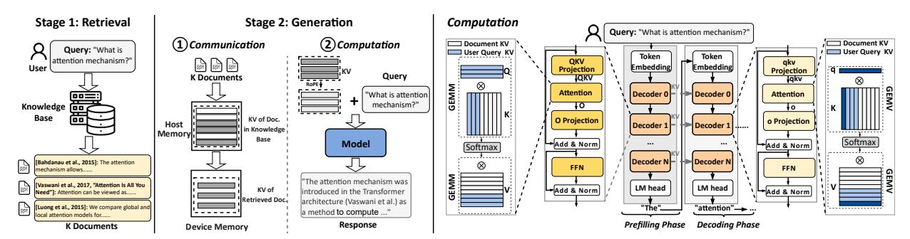

Fig. 1: RAG operates in two stages. In the retrieval stage, relevant documents are identified and added to the user query to form an augmented context. This augmented context is then processed in the generation stage to produce the final response.

#### II. BACKGROUND

This section outlines the necessary background on RAG inference and PIM architectures.

#### A. RAG Preliminaries

RAG systems augment LLM inference with external knowledge to improve factuality and temporal relevance. As shown in Figure 1, a typical RAG pipeline consists of two stages:

- Retrieval Stage. In offline preprocessing, an embedding model encodes each knowledge item into a high-dimensional vector and builds an index storing both embeddings and original content. At serving time, the user query is encoded in the same space and used to retrieve semantically similar documents. To support low-latency retrieval at scale, most systems adopt *Approximate Nearest Neighbor Search* (ANNS) [37], achieving high throughput while preserving retrieval quality.
- **Generation Stage.** After retrieval, the query and selected documents are concatenated into a single input sequence and processed by a decoder-only transformer [67]. Each layer contains a self-attention module and a positionwise *Feed-Forward Network* (FFN), both with residual connections and layer normalization.

Compared to vanilla LLM inference, RAG introduces a key structural difference: the input sequence becomes much longer due to appended retrieved documents, often reaching several thousand tokens per request. To avoid repeatedly computing attention over this static content, several systems [44], [46] employ document Key-Value (KV) precomputation, where each document's KVs are computed offline and stored for reuse at serving time. This optimization removes redundant computation over long document sequences and can reduce Time-to-First-Token (TTFT) by up to 98% [46], requiring only light fine-tuning to maintain generation quality. As shown in Figure 1, RAG with document KV precomputation comprises two steps: (i) Communication: due to limited ondevice memory, precomputed KVs reside in host DRAM and are transferred to device memory over bandwidth-constrained interconnects such as PCIe; and (ii) Computation: user query KVs are generated on-the-fly and fused with the transferred document KVs to produce contextual representations.

Computation proceeds in two phases. In the prefilling phase, only the user query tokens require new projections. Their

KVs are computed at runtime and concatenated with the precomputed document KVs before entering the attention and FFN layers. This phase is dominated by *General Matrix-Matrix Multiplications* (GEMMs) with token-level parallelism. In the decoding phase, tokens are generated autoregressively. Each step computes a new KV pair for the generated token and appends it to the KV cache. Both attention and FFN layers are then dominated by *General Matrix-Vector Multiplications* (GEMVs). While FFN layers can exploit batching across requests and thus reformulate their operations as GEMMs through weight reuse, attention remains GEMV-dominated because it depends on the query-specific KV cache.

While both retrieval and generation contribute to end-to-end RAG latency, the generation stage often dominates overall execution time. We therefore focus on accelerating this stage, referred to as "RAG inference." Prior efforts to optimize retrieval [38], [51], [52], [69] are orthogonal and can be integrated as complementary enhancements. Retrieval mechanisms (e.g., vector search using FAISS [13] or keyword-based retrieval such as BM25 [54]) operate independently of generation and introduce no additional storage or system overhead beyond standard RAG deployments.

## B. PIM Basics

*Processing-in-Memory* (PIM) minimizes data movement by placing computation near or within the memory subsystem. By easing bandwidth pressure, PIM delivers substantial performance and energy efficiency benefits, particularly for memory-bound workloads such as large-scale graph processing [20], [21] and LLM inference [17], [31].

Among commercially representative designs, three approaches have gained broad attention. HBM-PIM [33] integrates compute logic into the base die of 3D-stacked HBM, providing high internal bandwidth and fine-grained parallelism, but requires specialized packaging and offers limited memory capacity, restricting scalability. DIMM-based PIM architectures [22], such as AxDIMM [27], attach compute logic to commodity DDR modules, improving compatibility with existing systems but facing bandwidth and arbitration constraints inherited from DDR protocols. To address these limitations, recent work leverages *Compute Express Link* (CXL) memory expansion [14], [28] as a modular, scalable PIM substrate. CXL provides disaggregated memory over stan-

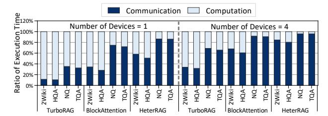

Fig. 2: Execution time breakdown of RAG inference into "Computation" and "Communication" across datasets (Section VI) and device counts, highlighting that off-device KV transfers ("Communication") dominate total execution time

dard PCIe infrastructure, enabling high capacity and strong interoperability, with LPDDR5X-backed prototypes [50] demonstrating both high bandwidth and large memory footprints.

#### III. MOTIVATION

This section analyzes the limitations of existing RAG accelerators and motivates our decentralized execution model.

#### A. System-Level Limitations in Prior Approaches

Although document KV precomputation eliminates redundant encoding of retrieved documents, existing RAG systems remain constrained by two dominant bottlenecks inherent to their centralized design. First, document KVs are far larger than on-device memory capacity and must therefore be fetched from host memory at query time, creating substantial off-chip data movement. Second, because only short query sequences require fresh encoding, prefilling devolves into low-intensity skinny GEMMs, while decoding is dominated by memory-bound GEMVs, leading to poor compute utilization.

To examine these bottlenecks, we analyze three representative RAG systems: two state-of-the-art CPU-GPU solutions, TurboRAG [46] and BlockAttention [44], and HeterRAG [40], a PIM-based accelerator for end-to-end RAG. The experimental setup and datasets are described in  $\S$ VI-A.

Bottleneck 1: Off-Device Communication Overhead. Document KV stores can reach ~10 TB, far exceeding on-device capacity, so existing systems [44], [46] keep them in host DRAM and transfer them to the device at inference time. This creates a severe and persistent bandwidth imbalance: an NVIDIA H100 offers up to ~2 TB/s of on-package HBM bandwidth, whereas PCIe Gen5 x16 provides only ~128 GB/s, a  $> 15 \times$  gap. The problem is further amplified in multi-device servers, where the PCIe fabric is shared and does not scale with the number of devices.

We quantify this effect across four widely used datasets. As shown in Figure 2, document KV transfers account for 48.60% of inference time on average and up to 86.45% in the worst case. When scaling from one to four H100s per host, this fraction rises from 48.60% to 72.72% due to mounting contention on the fixed-bandwidth PCIe link, ultimately limiting multi-device scaling efficiency.

TABLE I: Average token lengths per request for retrieved documents (Doc.), user queries (Q.), and responses (Resp.) in four widely used RAG datasets (Section VI)

| Dataset | Doc.     | Q.    | Resp. |
|---------|----------|-------|-------|
| 2Wiki   | 856.76   | 17.60 | 3.03  |
| HQA     | 1341.04  | 20.41 | 3.97  |
| NQ      | 14630.04 | 10.28 | 4.36  |
| TOA     | 14748.69 | 18.57 | 4.59  |

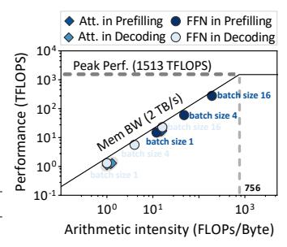

Fig. 3: Roofline analysis of RAG inference with Tulu3-Block-FT on H100

**Bottleneck 2: On-Device Computation Inefficiency.** This bottleneck is inherent to centralized RAG inference and applies broadly to all RAG systems such as TurboRAG [46], BlockAttention [44], and HeterRAG [40], as it arises from fundamental workload properties rather than system-specific design choices.

RAG inference intensifies on-device memory pressure for two reasons. First, because document KVs are precomputed and reused, the prefilling phase needs to process only the user query, which is short and averages around 16 tokens across widely used datasets, as revealed in Table I. Consequently, GEMMs in this phase collapse into skinny GEMMs with low arithmetic intensity and limited weight reuse. Second, RAG deployments frequently operate in user-specific or privacy-sensitive settings [32], [61], where query concurrency and batch sizes are small; even at scale, strict latency requirements [66], [68] limit batching opportunities. This further reduces weight reuse, causing FFN layers during decoding to devolve into additional skinny GEMMs or GEMVs.

We quantify this computational inefficiency using a roofline analysis. As shown in Figure 3, both attention and FFN layers remain firmly memory-bound across prefilling and decoding. In the prefilling stage, the arithmetic intensity of these operators still falls short of the level required for compute-efficient execution. Decoding is even more constrained, as both attention and FFN layers exhibit even lower arithmetic intensity across batch sizes. For comparison, modern accelerators such as the NVIDIA H100 [48] require substantially higher arithmetic intensity to sustain peak throughput. This large disparity leads to persistently low compute utilization in all phases of RAG inference.

#### B. Key Opportunity: Decentralized Attention Execution

To overcome the two bottlenecks identified in existing RAG systems, we present MERIDIAN, a decentralized execution system enabled by document attention decomposition. To address Bottleneck 1: Off-Device Communication Overhead, we shard the document-side K and V matrices across PIMenabled memory modules, allowing each device to compute document attention directly where its KV shard resides. Each device produces a compact partial summary, which is merged through a lightweight global aggregation step using standard

numerically stable softmax techniques [10], sharply reducing off-chip KV movement. To the best of our knowledge, this is the first approach to isolate and decentralize the document-attention branch specifically for RAG.

However, addressing **Bottleneck 2: On-Device Computation Inefficiency** requires more than decentralizing attention alone. Decentralization changes both where computation occurs and how it must be orchestrated across devices, which introduces two key architectural challenges:

- Intra-Device Microarchitecture. Most PIM architectures for LLM inference [14], [16], [17], [49], [55] follow a hybrid model: GEMV operations run in memory, while GEMM, activation, and normalization are offloaded to external engines, incurring extra data movement. In decentralized RAG inference, however, attention must operate directly on document-resident KV shards to avoid prohibitive transfers. This requires supporting skinny GEMMs and nonlinear functions inside the DRAM stack, despite tight area and power limits, which makes efficient in-memory support for these operations a key microarchitectural challenge.
- Inter-Device Coordination. Decentralization eliminates a centralized compute point but introduces dependencies across devices. Each device produces only a partial attention result, while downstream layers (e.g., FFNs) depend on globally aggregated outputs. Without careful scheduling, these dependencies cause stalls and leave devices idle, limiting parallel efficiency. Resolving such coordination bottlenecks is essential to fully exploit decentralized execution.

## IV. MERIDIAN'S DECENTRALIZED DOCUMENT ATTENTION FOR RAG

In this section, we introduce document attention decomposition, a simple yet novel mechanism that, to our knowledge, is the first to explicitly isolate and decentralize document-side attention in the RAG setting. By sharding the document-side K and V matrices, and performing attention directly on PIM-resident shards, this mechanism eliminates the need for centralized processing and enables a fully decentralized execution model. Despite its conceptual simplicity, the resulting execution path is new to RAG systems and yields substantial reductions in off-device KV movement. We describe the procedure and quantify its impact below.

#### A. Document Attention Decomposition Mechanism

Algorithm 1 summarizes MERIDIAN's document attention decomposition. Rather than computing attention over all KV pairs on the compute device, the attention module is split into two independent branches: a *DocumentAttention* branch (line 3), executed locally on each PIM device over its KV shard, and a *QueryResponseAttention* branch (line 5), which processes the user query and previously generated tokens. Each branch produces a compact partial summary, and the two outputs are merged via a numerically stable softmax aggregation (line

Algorithm 1 In-Layer Document Attention Decomposition

Input:  $x \in \mathbb{R}^d$ > current token representation Input: statedoc **Input:** statectx Output:  $y \in \mathbb{R}^d$ 1:  $(q, k, v) \leftarrow \text{QKVProjection}(x)$ 2: /\* Document Branch \*/ 3:  $(o_d, m_d, l_d) \leftarrow \text{DocumentAttention}(q, \text{state}_{\text{doc}})$ 4: /\* Query-Response Branch \*/ 5:  $(o_c, m_c, l_c) \leftarrow \text{QueryResponseAttention}(q, k, v, \text{state}_{\text{ctx}})$ 6:  $o \leftarrow \text{Fusion}(o_d, m_d, l_d, o_c, m_c, l_c)$ 7:  $x \leftarrow \text{LayerNormalization}_1(x + o)$ 8:  $f \leftarrow \text{FFN}(x)$ 9:  $y \leftarrow \text{LayerNormalization}_2(x+f)$ 10: return y

[10]. All downstream transformer computations (lines 7–9) remain unchanged.

For simplicity, we illustrate the mechanism assuming a single device holds the document KVs  $(K_d, V_d)$  and another holds the context KVs  $(K_c, V_c)$ . Given a query vector q, the two branches operate independently:

• Local Attention. Each branch computes attention logits:

$$s_d = qK_d^{\top}$$
$$s_c = qK_c^{\top}$$

 Local Normalization. To stabilize exponentiation, each branch computes its own score baseline:

$$m_d = \max(s_d)$$
  
 $m_c = \max(s_c)$ 

Local Unnormalized Outputs. Each branch forms an unnormalized output and its normalization factor:

$$o_d = \sum_{j} e^{s_d^{(j)} - m_d} V_d^{(j)}, \quad l_d = \sum_{j} e^{s_d^{(j)} - m_d}$$
$$o_c = \sum_{j} e^{s_c^{(j)} - m_c} V_c^{(j)}, \quad l_c = \sum_{j} e^{s_c^{(j)} - m_c}$$

• Global Fusion. Using the shared baseline  $m = \max(m_d, m_c)$ , the partial results are fused into the final output:

$$l = e^{m_d - m} l_d + e^{m_c - m} l_c$$

$$o = \frac{1}{l} (e^{m_d - m} o_d + e^{m_c - m} o_c)$$

This decomposition allows document-attention workloads to be executed *entirely in memory*, with only compact summaries communicated across devices, while preserving the exact numerical semantics of standard softmax attention.

#### B. Quantifying Communication Reduction

MERIDIAN's decentralized execution greatly reduces communication relative to the centralized model. For simplicity, consider the case where a single PIM device holds all document KVs. With *document attention decomposition*, document

TABLE II: Comparison of centralized and decentralized execution models for RAG inference, highlighting data flow, transmitted objects, and transmission volume

| Execution Model              | Centralized Execution [44], [46]                                               | Decentralized Execution (This Paper)                                                                                                                                                                                                                                                                                                                                                                                                                                                                                                                                                                                                                                                                                                                                                                                                                                                                                                                                                                                                                                                                                                                                                                                                                                                                                                                                                                                                                                                                                                                                                                                                                                                                                                                                                                                                                                                                                                                                                                                                                                                                                        |  |
|---------------------------------|-----------------------------------------------------------------------------------|--------------------------------------------------------------------------------------------------------------------------------------------------------------------------------------------------------------------------------------------------------------------------------------------------------------------------------------------------------------------------------------------------------------------------------------------------------------------------------------------------------------------------------------------------------------------------------------------------------------------------------------------------------------------------------------------------------------------------------------------------------------------------------------------------------------------------------------------------------------------------------------------------------------------------------------------------------------------------------------------------------------------------------------------------------------------------------------------------------------------------------------------------------------------------------------------------------------------------------------------------------------------------------------------------------------------------------------------------------------------------------------------------------------------------------------------------------------------------------------------------------------------------------------------------------------------------------------------------------------------------------------------------------------------------------------------------------------------------------------------------------------------------------------------------------------------------------------------------------------------------------------------------------------------------------------------------------------------------------------------------------------------------------------------------------------------------------------------------------------------------------|--|
| Illustration of Data Flow | Large-capacity Compute Memory Devices                                             | Attention number of the computer of the computer of the computer of the computer of the computer of the computer of the computer of the computer of the computer of the computer of the computer of the computer of the computer of the computer of the computer of the computer of the computer of the computer of the computer of the computer of the computer of the computer of the computer of the computer of the computer of the computer of the computer of the computer of the computer of the computer of the computer of the computer of the computer of the computer of the computer of the computer of the computer of the computer of the computer of the computer of the computer of the computer of the computer of the computer of the computer of the computer of the computer of the computer of the computer of the computer of the computer of the computer of the computer of the computer of the computer of the computer of the computer of the computer of the computer of the computer of the computer of the computer of the computer of the computer of the computer of the computer of the computer of the computer of the computer of the computer of the computer of the computer of the computer of the computer of the computer of the computer of the computer of the computer of the computer of the computer of the computer of the computer of the computer of the computer of the computer of the computer of the computer of the computer of the computer of the computer of the computer of the computer of the computer of the computer of the computer of the computer of the computer of the computer of the computer of the computer of the computer of the computer of the computer of the computer of the computer of the computer of the computer of the computer of the computer of the computer of the computer of the computer of the computer of the computer of the computer of the computer of the computer of the computer of the computer of the computer of the computer of the computer of the computer of the computer of the computer of the computer of the comput |  |
| Transmitted Object           | KV of Retrieved Document                                                          |                                                                                                                                                                                                                                                                                                                                                                                                                                                                                                                                                                                                                                                                                                                                                                                                                                                                                                                                                                                                                                                                                                                                                                                                                                                                                                                                                                                                                                                                                                                                                                                                                                                                                                                                                                                                                                                                                                                                                                                                                                                                                                                                |  |
| Transmission Volume          | $= \# \text{Document Tokens} \ \times 2 \times d_{\text{model}} \times 2$ (bytes) | $\approx (\#\text{Query Tokens} + \\ \#\text{Response Tokens}) \\ \times 2 \times d_{\text{model}} \times 2 \text{ (bytes)}$                                                                                                                                                                                                                                                                                                                                                                                                                                                                                                                                                                                                                                                                                                                                                                                                                                                                                                                                                                                                                                                                                                                                                                                                                                                                                                                                                                                                                                                                                                                                                                                                                                                                                                                                                                                                                                                                                                                                                                                                   |  |

attention is performed entirely in memory: each decoding step sends only the current query vector q to memory and receives a compact tuple consisting of the attention output  $o_d$ , the local maximum  $m_d$ , and the normalization factor  $l_d$ . During prefilling, the same process applies to a batch of query vectors, while the document KVs remain fully stationary. Let Q denote all transmitted query vectors across prefilling and decoding, and  $O_d$  their corresponding outputs.

Table II summarizes the communication cost comparison. Assuming negligible scalar metadata overhead, the total communication volume (in bytes) under MERIDIAN's decentralized execution is:

$$V_{\rm de} \approx (\# \text{Query tokens} + \# \text{Response tokens}) \times 2 \times d_{\rm model} \times 2$$

where the first factor of 2 accounts for sending query vectors Q and receiving their corresponding outputs  $O_d$ , and the second factor of 2 reflects FP16 precision (2 bytes per value). Here  $d_{\rm model}$  denotes the hidden dimension.

In contrast, centralized execution must transfer the full document-side KV pairs:

$$V_{\rm ce} = \# {\rm Document\ tokens} \times 2 \times d_{\rm model} \times 2$$

where the first factor of 2 accounts for both K and V, the second factor of 2 reflects FP16 precision (2 bytes per value).

Across four RAG datasets, as shown in Table I, retrieved documents are on average  $\sim 380\times$  longer than the combined query and response tokens, resulting in more than two orders of magnitude lower communication under MERIDIAN's decentralized execution. In practical deployments, document KVs are sharded across N PIM devices along the attentionhead dimension, so that each device holds a disjoint subset of heads and returns only its corresponding output slice of size  $d_{\rm model}/N$ . Although aggregation collects partial summaries from all N devices, the communication per device scales inversely with N, keeping the total cross-device traffic essentially constant and preserving this large reduction in data movement even at multi-device scale.

#### V. MERIDIAN'S PIM-BASED ACCELERATOR

To fully exploit decentralized execution, MERIDIAN incorporates a PIM-enabled accelerator designed for efficient

RAG inference. As shown in Figure 4(a), the architecture is built on the CXL 3.0 protocol [9], where multiple PIM devices are attached to the host through a CXL switch. This organization provides scalable memory and compute capacity for large RAG workloads. The host receives user queries and coordinates distributed execution, while the CXL switch offers both host-device connectivity and direct device-to-device communication, reducing latency by bypassing the host for inter-device data exchange.

All PIM devices share a unified hardware design but are logically divided into two clusters: the *Document Attention Cluster* (DAC), which performs document-attention computation (Steps 1-3 in §IV-A), and the *Context Execution Cluster* (CEC), which handles query-response attention (Steps 1-3 in §IV-A), fuses final outputs (Step 4 in §IV-A), and executes all remaining model operations, including user-input QKV projections, FFNs, and other layers. This architectural homogeneity allows dynamic resource reallocation between clusters for flexible, efficient utilization. We next describe the two core components of the PIM-enabled accelerator, namely the PIM devices and the scheduler, and then summarize the overall system workflow.

- PIM Devices. MERIDIAN'S PIM devices are implemented as CXL Type-3 modules accessed via the CXL.mem interface using standard load/store operations. As shown in Figure 4(b), each device includes a CXL controller and multiple LPDDR-PIM packages connected through dedicated PIM controllers. The CXL controller integrates PCIe physical, link, and transaction layers for protocol handling and host communication. A device supports up to eight LPDDR-PIM packages, each managed by an eight-channel PIM controller (128-bit total width), with each channel containing four 16-bit DRAM dies. We adopt LPDDR5X for its favorable balance of bandwidth, capacity, cost, and power [50], though the design generalizes to HBM, GDDR, or DDR. Figure 4(c) shows the internal DRAM organization: each die has 16 banks across four bank groups (4 banks per group), providing 16 Gb per die and up to 512 GB per device. Each device integrates two compute types: (i) PIM Units (PUs) placed next to LPDDR banks for in-memory inference operations, and (ii) Controller-Side Units (CUs) within the PIM or CXL controller that aggregate results within and across devices (§V-A). The high per-device capacity is enabled by LPDDR5X-based PIM devices with favorable cost-capacity characteristics [50]. Combined with modular CXL-based disaggregation [9], aggregate memory scales linearly with device count. In our evaluated configuration (§VI), 32 PIM devices provide 16 TB of capacity. Such capacity requirements are inherent to KV-precomputed RAG deployments, which MERIDIAN supports through elastic, server-class memory scaling.
- Scheduler. MERIDIAN employs a unified host-side scheduler to coordinate resources and control execution. It has two key roles: (i) during initialization, it statically assigns model layers to PIM devices using a chosen parallelism

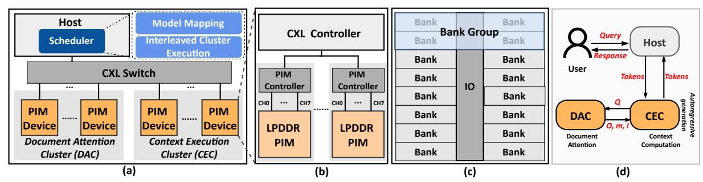

Fig. 4: Overview of MERIDIAN's decentralized PIM-based architecture: (a) System-level design with PIM devices organized into Document Attention and Context Execution clusters, (b) PIM device architecture built on LPDDR-based compute-in-memory modules, (c) Internal organization of an LPDDR DRAM die, and (d) End-to-end RAG inference workflow illustrating document-attention decomposition and interleaved cluster execution

strategy, supporting tensor, pipeline, or a hybrid approach that combines both; and (ii) at runtime, it dynamically issues inference tasks based on device load and availability. This hybrid scheduling approach improves load balance, mitigates underutilization, and maximizes throughput for large-scale RAG workloads (§V-B).

Figure 4(d) outlines MERIDIAN's runtime workflow. Given a user query and retrieved document IDs, the host tokenizes the input and sends the query tokens to the CEC to begin inference. Following the document attention decomposition paradigm, the DAC computes document attention, while the CEC performs all remaining model operations. Document IDs are resolved through a host-side metadata index to locate the corresponding precomputed KVs in the DAC. Inference proceeds through prefilling and then autoregressive decoding. After generation completes, the output token IDs are returned to the host and detokenized into natural-language text.

#### A. MERIDIAN PIM Devices

This section describes the architecture of MERIDIAN, beginning with its resource-efficient in-memory execution of key RAG inference primitives and then detailing the microarchitectural design that enables decentralized document attention and efficient model execution.

1) Resource-Efficient PIM Substrate Designs: Supporting in-memory RAG inference requires the PIM substrate to handle GEMV, skinny GEMM, and nonlinear operations within tight area and energy budgets. In MERIDIAN, GEMV is performed by bank-level compute units consisting of multipliers and adder trees, following a design pattern widely used in prior PIM architectures [15], [49].

Implementation of Skinny GEMM. Skinny GEMM reuses the same weight matrix across multiple input vectors. A naïve sequential execution using a single GEMV unit repeatedly reloads identical weights, wasting near-memory bandwidth and energy. PAPI [16], built on an HBM-based PIM substrate, addresses this by duplicating full GEMV datapaths to enable true parallelism, but this incurs substantial area and power overhead. Such full-unit replication is impractical for LPDDR-based PIM architectures, which operate under lower power

budgets and narrower channel widths than HBM, making aggressive datapath duplication infeasible.

MERIDIAN adopts a design tailored to power- and bandwidth-constrained LPDDR-based PIM architectures. Instead of replicating full compute datapaths, it replicates only buffer structures, which account for about 14% of a GEMV unit's area [49], while sharing arithmetic units across inputs. This buffer-level replication enables effective weight reuse without the area and power overhead of duplicating multipliers and reduction trees. Because DRAM access dominates energy consumption, accounting for over 96% of the total cost [16], larger buffers can further enhance energy efficiency by improving row locality and reducing row-switching overheads. Thus, MERIDIAN's skinny-GEMM support enables efficient weight reuse through buffer-level replication while maintaining tight area and power budgets.

Implementation of Nonlinear Functions. Nonlinear operators are challenging for PIM architectures due to complex data paths and control logic [17], [49]. Instead of offloading these operations to external engines, MERIDIAN integrates nonlinear evaluation into the memory-side pipeline using a lightweight piecewise-linear approximation co-designed with its in-memory GEMV substrate. As shown in Figure 5(a), each nonlinear function is approximated by linear segments y = ax + b over small input intervals, typically requiring only a few tens of segments. Evaluation reduces to a breakpoint lookup followed by a single multiply-add, reusing the GEMV arithmetic units.

The input range is partitioned into sub-intervals, each storing precomputed coefficients (a,b) in a compact LUT, with finer granularity in high-curvature regions to preserve accuracy. During inference, the PIM unit identifies the interval using simple comparators, fetches the coefficients, and computes y=ax+b using its native arithmetic pipeline. This design introduces minimal hardware overhead while enabling in-situ execution of nonlinear functions such as GeLU and Swish. Unlike prior LUT-based accelerators [36], [42], [65], this design tightly couples approximation logic with memory-resident compute units, aligning nonlinear execution with the decentralized attention dataflow.

For the numerically sensitive softmax operator, however,

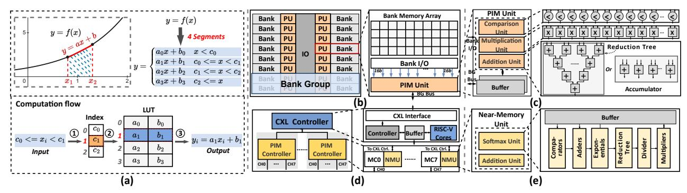

Fig. 5: Overview of MERIDIAN's PIM compute substrate: (a) LUT-based nonlinear approximation, (b) PU integration in a DRAM bank, (c) PU microarchitecture, (d) CU organization with NMUs in the PIM controller and RISC-V cores in the CXL controller, and (e) NMU microarchitecture

MERIDIAN employs dedicated-precision hardware to ensure model fidelity.

2) PIM Microarchitecture: Building on the substrate-level design, we detail MERIDIAN's microarchitecture, which comprises two key compute modules: (i) PIM Units (PUs) colocated with each LPDDR bank for near-memory execution, and (ii) Controller-Side Units (CUs) integrated within the PIM or CXL controller for cross-bank aggregation and control.

**PIM Units** (**PUs**). Each PU is placed adjacent to a DRAM bank (Figure 5(b)). MERIDIAN adopts an All-Bank-Modestyle design [33], where each DRAM command is broadcast to the same address position across all banks, thereby exploiting bank-level parallelism and maximizing internal bandwidth. In this mode, the issue rate of consecutive column commands is bounded by  $t_{CCD_L}$ , the minimum delay between successive column commands to the same bank group.

As shown in Figure 5(c), each PU consumes 256-bit input data (16 FP16 values) from its DRAM bank and integrates: (i) 16 FP16 comparators for interval selection in nonlinear approximation, (ii) 16 FP16 multipliers, and (iii) 16 FP16 adders in a reconfigurable reduction/elementwise-add structure. Each PU also contains four double-buffered 4 KB buffers for inputs and intermediate results. Breakpoints and precomputed nonlinear-function parameters are stored in the DRAM array to minimize hardware overhead.

Controller-Side Units (CUs). While PUs execute bank-local computation, RAG inference also requires cross-bank aggregation, inter-device coordination, and support for operations (such as softmax) that are impractical to realize inside memory. To meet these needs, MERIDIAN integrates two classes of CUs within each PIM device (Figure 5(d)).

Each PIM controller contains a *Near-Memory Unit* (NMU) per channel (Figure 5(e)), composed of: (i) an addition unit for efficient intra-channel reduction and element-wise accumulation of PU outputs, and (ii) a dedicated softmax unit implementing the full softmax pipeline with high throughput and numerical stability.

The CXL controller hosts eight BOOMv2 RISC-V cores [7], which aggregate results across channels and devices and execute lightweight control or computation tasks unsuited to

fixed-function hardware. This general-purpose compute layer enhances flexibility while maintaining a compact design.

#### B. MERIDIAN Scheduler

This section describes MERIDIAN's scheduling framework. We first present its static operator mapping strategies under different parallelization schemes, followed by a dynamic interleaving technique that overlaps document attention with context computation to improve overall resource utilization.

1) Model Mapping: MERIDIAN supports multiple parallelization strategies, including tensor parallelism, pipeline parallelism, and a hybrid scheme combining both. This flexibility allows MERIDIAN to adapt to different model sizes, cluster configurations, and workload characteristics, ensuring scalable and efficient execution across diverse RAG deployments.

**Tensor Parallelism.** Under tensor parallelism, all hardware resources collaborate on the current batch, with the CEC and DAC mapped independently to match their workloads.

For the CEC (Figure 6(a)), fully connected layers are partitioned across PIM devices, each storing partial weights and producing partial outputs that are later aggregated. Lightweight operations (e.g., attention, activation) are consolidated on a primary device to reduce communication overhead; this device also maintains the KV cache for queries and generated tokens.

For the DAC (Figure 6(b)), document KVs are partitioned by attention head, assigning each head to the minimum number of devices to avoid broadcast and enable head-level parallel execution. Within each device, KV tensors are evenly distributed across DRAM banks to maintain balanced resource utilization. **Pipeline Parallelism.** MERIDIAN supports pipeline parallelism by partitioning the decoder into multiple stages, with both the DAC and CEC hierarchically divided to match this structure. The input batch is split into micro-batches that traverse the pipeline sequentially, allowing different stages to process different micro-batches concurrently and improving hardware utilization. As shown in Figure 7, a two-stage setup enables two micro-batches to run in parallel.

**Hybrid Parallelism.** When a stage spans multiple PIM devices, MERIDIAN applies intra-stage tensor parallelism to exploit data-level concurrency, forming a unified hybrid parallelism scheme. A configurable interface lets users tune the

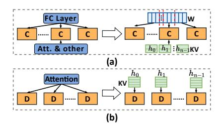

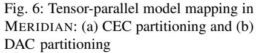

based on workload and system resources.

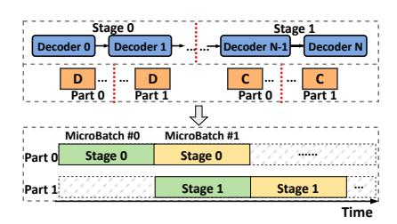

Fig. 7: Pipeline-parallel model mapping in MERIDIAN, showing stage partitioning and micro-batch flow

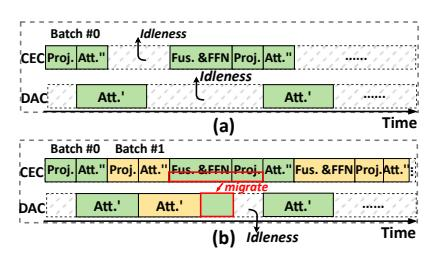

Fig. 8: Cluster execution in MERIDIAN: (a) Imbalance under sequential execution and (b) Gains from interleaved execution

TABLE III: System configurations

|             | 32 PIM devices (default: 16 DAC + 16 CEC),                           |  |
|-------------|----------------------------------------------------------------------|--|
| Hardware    | each with 512 GB capacity and 32 TFLOPS throughput,                  |  |
|             | CXL 3.0 over PCIe Gen5 ×16 (128 GB/s per link)                       |  |
| Memory      | LPDDR5X, 64 GB per package, 8.5 Gb/s per pin,                        |  |
|             | $\times$ 128 channels, $t_{RC}$ = 60, $t_{RAS}$ = 40, $t_{CL}$ = 23, |  |
|             | $t_{RP} = 20, t_{RCDRD} = 17, t_{RCDWR} = 8$                         |  |
| Bandwidth   | 1.1 TB/s external bandwidth,                                         |  |
|             | 16 TB/s internal bandwidth                                           |  |
| PIM Unit    | 16 FP16 comparators, 16 FP16 multipliers,                            |  |
|             | 16 FP16 adders, 4 KB buffers                                         |  |
| Controller- | 1 addition unit (16 FP16 adders),                                    |  |
| Side Units  | Units 1 softmax unit, 8 BOOMv2 RISC-V cores                          |  |

2) Interleaved Cluster Execution: Because transformer decoder layers execute sequentially, MERIDIAN's decentralized partitioning across the DAC and CEC can create temporal imbalance between clusters, which does not arise in centralized attention designs. As shown in Figure 8(a), during attention the CEC handles only a small number of query or generated-token KVs, while the DAC processes much larger document KV volumes, causing the CEC to finish early and remain idle. Conversely, in FFN and other context-heavy stages, the DAC becomes underutilized while the CEC continues processing. This imbalance stems from the decentralized attention dataflow introduced by document attention decomposition rather than conventional pipeline partitioning. Directly applying scheduling strategies [17], [40] for centralized attention would there-

granularity and composition of pipeline and tensor parallelism

fore cause cluster underutilization and lower throughput.

To mitigate the resource imbalance inherent in decentralized execution, MERIDIAN employs an *Interleaved Cluster Execution* (ICE) mechanism, shown in Figure 8(b). ICE dynamically initiates subsequent inference batches on clusters that would otherwise be idle, improving overall hardware utilization. Under tensor parallelism, ICE alternates batches between the DAC and CEC so both clusters make progress concurrently. Under pipeline parallelism, ICE enables intra-stage overlap by allowing the DAC and CEC to process different micro-batches within the same pipeline stage, reducing idle time.

While ICE substantially narrows utilization gaps, residual imbalance can occur when the DAC finishes document attention before the CEC completes its remaining work. To address this, MERIDIAN supports dynamic load migration: a subset of CEC-resident model parameters is statically replicated to the DAC at initialization, enabling the DAC to assist with context computation when idle. This incurs negligible runtime overhead because (i) DAC and CEC share an identical microarchitecture, allowing seamless task transfer, and (ii) parameter replication is performed once and amortized across all inference requests.

#### C. Programming Interface

MERIDIAN adopts a heterogeneous programming model similar to CUDA and PIM-SYCL [29]. The host manages global control and task orchestration, while high-level APIs expose key RAG operations (e.g., GEMV, GeLU) and system

configuration (e.g., device initialization, parallel strategy selection). These APIs are compiled into low-level instructions and dispatched to device controllers.

Each device controller decodes incoming instructions and coordinates execution across on-device components. When PU computation is required, the controller broadcasts PIM instructions to the relevant channels and PUs. MERIDIAN supports two classes of PIM commands: (i) compute commands, which include PIM\_MAC (multiply-accumulate), PIM\_CMP (comparison), PIM\_EW\_MULT (element-wise multiply), and PIM\_EW\_ADD (element-wise add) for composing nonlinear functions; (ii) data-movement commands, which include PIM\_ACT (activate a row across all banks), PIM\_WR\_PB (write to PU buffers), and PIM\_RD\_PB (read from PU buffers). Standard loads and stores are supported through the CXL.mem interface, enabling direct placement and updates of precomputed document KVs in their head-sharded PIM locations. Consequently, document updates and corpus expansion follow the standard offline KV-precomputation workflow, writing new or modified KVs to the appropriate shard without system-wide data reshuffling or reindexing.

#### VI. EVALUATION

We evaluate MERIDIAN to quantify the benefits of decentralized document attention and its PIM-enabled accelerator. Our experiments measure end-to-end RAG inference performance across multiple models and datasets, compare against state-of-the-art baselines, and analyze the contributions of individual design components. We also report breakdowns for communication and compute efficiency to illuminate where MERIDIAN delivers its gains.

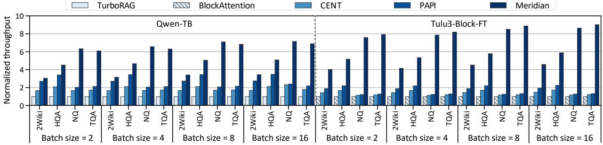

Fig. 9: Throughput comparison of MERIDIAN and state-of-the-art RAG inference systems across batch sizes 2, 4, 8, and 16. Each label above a bar reports the corresponding actual throughput (tokens/s).

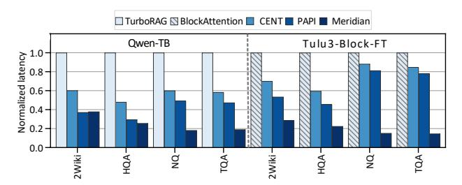

Fig. 10: Normalized per-request latency of MERIDIAN against baselines

#### A. Experimental Setup

**Simulation.** We extend Ramulator 2.0 [45] to develop a cycle-accurate simulator for evaluating MERIDIAN. All arithmetic units are implemented in Verilog and synthesized using Synopsys Design Compiler [58] at a 28 nm process node. For PIM logic integrated within DRAM dies, we scale the synthesized area and power estimates to a 10 nm-class (1z-nm) DRAM process and apply a conservative  $10 \times$  inflation factor to account for the efficiency gap between logic and DRAM processes [12]. Controller-side units are modeled at 7 nm. SRAM buffer area and power are estimated following AttAcc [49]. DRAM energy is computed by combining Micron LPDDR5/LPDDR5X datasheet parameters with DRAM-Power [8] integrated into Ramulator.

Configuration. MERIDIAN consists of 32 PIM devices evenly split between the DAC and CEC. Each device integrates eight LPDDR-PIM packages, providing 512 GB capacity, 1.1 TB/s external bandwidth, and 16 TB/s internal bandwidth. Devices connect via CXL 3.0 over PCIe Gen5 ×16, modeled with a peak bandwidth of 128 GB/s per link. We assume an end-to-end CXL memory access latency of 165 ns, including 25 ns port round-trip latency, 10 ns retimer delay, 70 ns switch latency, and 60 ns memory-controller plus DRAM access latency, consistent with the CXL 3.0 specification [9]. Contention is modeled at the switch by sharing link bandwidth among active devices, with transfers exceeding link capacity serialized. Each DRAM bank is equipped with a 16-lane PU operating at 1 GHz, yielding an aggregate peak throughput of 32 TFLOPS per device. Detailed system configurations are summarized in Table III.

Baselines. We compare MERIDIAN against five represen-

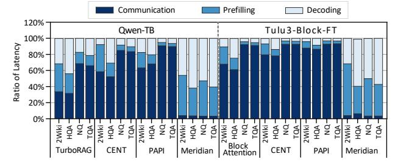

Fig. 11: Per-request latency breakdown of MERIDIAN and baselines across communication, prefilling, and decoding

tative RAG systems across two categories. (i) *CPU–GPU Systems:* TurboRAG [44] and BlockAttention [46], both of which store precomputed document KVs in CPU memory and offload all computation to the GPU. (ii) *PIM-Based Systems:* CENT [14], a GDDR6-based design that supports only GEMV and lightweight activations, requiring GEMMs to be decomposed into multiple GEMVs; PAPI [16], an HBM-based heterogeneous system integrating Attn-PIM, FC-PIM, and GPU processing units, with the original 2:1 Attn-PIM/FC-PIM device ratio; and HeterRAG [40], an HBM-DIMM PIM architecture for end-to-end RAG acceleration.

All CPU-GPU evaluations run on an Intel Xeon Gold 6454S system equipped with 1 TB of DDR5 memory and four NVIDIA H100 GPUs, each providing 80 GB of HBM2e. GPU energy is measured using nvprof. For fairness, all PIM accelerators are configured with identical device counts and the same number of memory packages per device.

**Models.** We evaluate two distinct fine-tuned RAG models: (i) <code>Qwen-TB</code>, based on <code>Qwen2-7B</code> [53] and fine-tuned with TurboRAG [44], with 28 layers, 28 heads, and a 3584-dimensional hidden size; and (ii) <code>Tulu3-Block-FT</code>, derived from Llama-3.1-Tulu-3-8B-SFT [3] and fine-tuned with BlockAttention [46], containing 32 layers, 32 heads, and a model dimension of 4096. For scalability experiments, we additionally evaluate <code>OPT-66B</code> [67] (64 layers, 72 heads, hidden size 9216). Unless otherwise specified, all experiments use a default batch size of 8.

**Datasets.** We assess performance on four representative RAG datasets: 2WikiMultiHopQA (2Wiki) [18], HotpotQA (HQA) [63], Natural Questions (NQ) [30], and TriviaQA (TQA) [26].

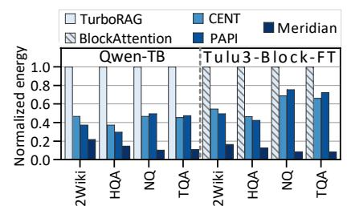

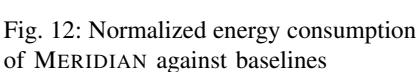

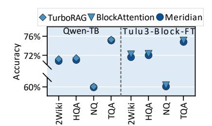

Fig. 13: Accuracy comparison between MERIDIAN and CPU-GPU baselines

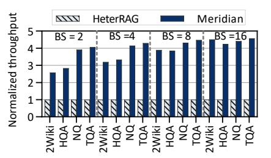

Fig. 14: End-to-end throughput between MERIDIAN and HeterRAG

## B. End-to-End RAG Inference Performance

Throughput. Figure 9 reports the throughput of MERIDIAN and all baselines for batch sizes 2, 4, 8, and 16 on two fine-tuned RAG models: (i) <code>Qwen-TB</code>, normalized to TurboRAG, and (ii) <code>Tulu3-Block-FT</code>, normalized to BlockAttention. MERIDIAN achieves average throughput gains of 5.36× over TurboRAG and 6.64× over BlockAttention, largely due to its decentralized execution that avoids centralized GPU bottlenecks. Against PIM-based accelerators, MERIDIAN surpasses CENT and PAPI by 3.98× and 3.32×, respectively. These improvements stem from (i) document attention decomposition, which localizes KV access entirely within PIM and minimizes off-chip transfers, and (ii) efficient in-memory execution of RAG primitives enabled by MERIDIAN's PIM substrate.

Latency. Figure 10 reports per-request latency across datasets, normalized to the CPU–GPU baselines. MERIDIAN reduces latency by an average of 4.30×, 5.34×, 3.31×, and 2.73× over TurboRAG, BlockAttention, CENT, and PAPI, respectively, driven by its minimized data-movement paths and efficient in-memory execution. While CENT performs well in long-output LLM workloads dominated by decoding, its reliance on GEMV decomposition becomes a bottleneck under RAG's short-context patterns. PAPI alleviates this via GEMV-unit replication but incurs high DRAM-access overhead. In contrast, MERIDIAN replicates only buffers, reducing memory traffic while sustaining compute throughput. Moreover, neither CENT nor PAPI eliminates off-device KV transfers, giving MERIDIAN a persistent latency advantage in RAG inference.

To better understand the latency reduction, Figure 11 shows a phase-level breakdown into communication, prefilling, and decoding. For the CPU–GPU and prior PIM baselines, communication mainly arises from document KV transfers between host memory and accelerators, accounting for up to 93.40% of end-to-end latency. In contrast, MERIDIAN eliminates centralized KV gathering and requires only query broadcasts and lightweight global reductions across PIM devices. As a result, communication accounts for at most 6.34% of total latency in MERIDIAN.

**Energy Efficiency.** Figure 12 reports energy consumption normalized to the CPU–GPU baselines. On average, MERIDIAN delivers  $7.48\times$  and  $9.24\times$  higher energy efficiency than TurboRAG and BlockAttention, respectively, owing to its decentralized architecture that minimizes host-device communication and its in-memory execution that shortens data-

movement paths. Compared to CENT and PAPI, MERIDIAN achieves  $4.48\times$  and  $4.54\times$  higher efficiency, respectively, enabled by a resource-conscious PIM substrate that performs skinny GEMMs and nonlinear functions in situ with minimal hardware overhead.

Accuracy. Figure 13 compares MERIDIAN with two CPU–GPU baselines in answer quality. Accuracy is defined as the proportion of correctly answered questions, where a prediction is considered correct if the generated response contains the ground-truth answer string. Across all datasets, MERIDIAN remains within 0.4 percentage points of baseline accuracy. This small gap is mainly due to the selective use of LUT-based piecewise-linear approximations for numerically tolerant operators, while dedicated-precision softmax hardware preserves stability in numerically sensitive computations. Task-specific fine-tuning could further reduce this difference.

**Area Overhead.** MERIDIAN introduces only modest area overhead. In a 10 nm DRAM process, each PIM unit occupies 0.15 mm², comprising arithmetic units (50.5%), buffers (34.9%), and control logic (14.6%). With 16 PIM units integrated per DRAM die, the total overhead is 2.41 mm², or just 5.07% of a 47.53 mm² LPDDR5X die [1]. Controllerside logic is similarly lightweight. In a 7 nm logic process, a 16-lane FP16 Addition Unit occupies 0.02 mm², and a full softmax unit requires 1.38 mm², both well within the PIM controller's budget. Each BOOMv2 RISC-V core in the CXL controller adds 2.94 mm² [14], providing general-purpose programmability at modest cost.

### C. Comparative Analysis with HeterRAG

We further compare MERIDIAN with HeterRAG, a state-of-the-art PIM-based RAG accelerator. For fairness, we adapt HeterRAG to operate on precomputed document KVs while preserving its execution pipeline. MERIDIAN adopts HeterRAG's retrieval pipeline, including the AccelDIMM accelerator and HNSW [47] indexing over the full Wikipedia corpus, ensuring a consistent end-to-end evaluation setup. All experiments use the Tulu3-Block-FT model.

As shown in Figure 14, MERIDIAN delivers a 3.91× average throughput gain over HeterRAG, driven by reduced data movement and efficient in-memory execution. Figure 15 gives the per-request latency breakdown: HeterRAG spends over 88.84% of its end-to-end latency in the generation stage, which dominates its critical path. In contrast, MERIDIAN's hardware—

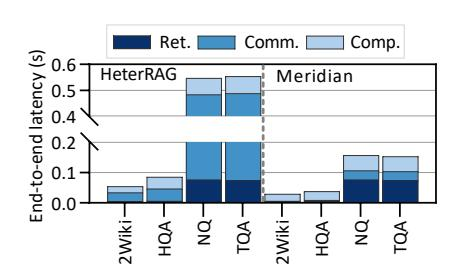

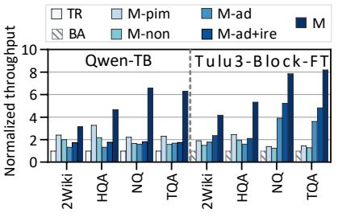

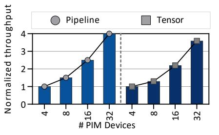

of MERIDIAN and HeterRAG

variants and CPU-GPU baselines

Fig. 15: End-to-end latency breakdown Fig. 16: Throughput between MERIDIAN Fig. 17: MERIDIAN throughput scaling under pipeline and tensor parallelism

software co-optimization shortens this stage by 69.38%, resulting in substantially lower overall response time.

#### D. Breakdown of Benefits

To isolate the contribution of each design component, we evaluate four MERIDIAN variants against CPU-GPU baselines TurboRAG (TR) and BlockAttention (BA).

Meridian-pim (M-pim) replaces the GPU with PIM devices under centralized execution, transferring document KVs from CPU memory for attention. Meridian-ad (M-ad) builds on CPU-GPU by introducing document attention decomposition while still executing attention on the GPU. Host-device KV transfer latency is excluded to isolate the effect of decomposition from PIM acceleration. Meridian-ad+ire (M-ad+ire) further adds interleaved cluster execution to improve utilization. Meridian (M) integrates all design components. Meridiannon (M-non) is an auxiliary configuration that offloads only GEMM/GEMV operations to PIM while keeping nonlinear functions (e.g., softmax) on the GPU, isolating the impact of in-PIM nonlinear execution.

Figure 16 reports throughput normalized to the CPU-GPU baseline. M-pim achieves a 2.19× speedup but remains limited by KV transfer overhead. By contrast, M-non delivers only a 1.69× improvement because nonlinear aggregation (e.g., softmax) remains centralized on the GPU, requiring full attention logits to be gathered. This communication scales with document length, whereas MERIDIAN transmits only compact partial statistics, substantially reducing cross-device overhead. M-ad reaches 2.12× by applying attention decomposition to improve execution efficiency, reducing synchronization overhead and eliminating centralized attention aggregation. Mad+ire provides an additional 1.27× gain through improved device utilization.

#### E. Scalability Analysis

To evaluate scalability under growing model and knowledge-base sizes, we test MERIDIAN using the larger OPT-66B model and scale the number of PIM devices from 4 to 32 under different parallelization strategies. As shown in Figure 17, throughput increases consistently with device count: with 32 devices, pipeline parallelism achieves a 4.19× speedup over a 4-device setup, while tensor parallelism attains only a 3.68× gain. This gap stems from communication behavior: pipeline parallelism transfers

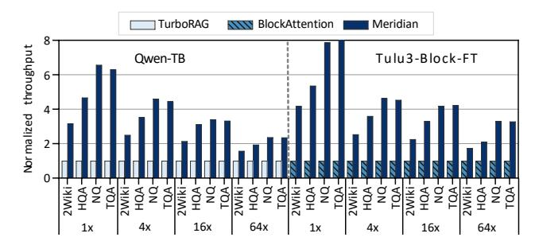

Fig. 18: Normalized throughput of MERIDIAN against CPU-GPU systems with increasing query length

only lightweight activations, whereas tensor parallelism requires synchronization of partial results. Overall, the results highlight MERIDIAN's strong scalability, particularly under pipeline-parallel execution.

#### F. Generality Analysis

Beyond typical RAG workloads, MERIDIAN also applies to long-response generation, where GEMV dominates computation. In extreme cases where response length greatly exceeds document length, MERIDIAN can revert to centralized execution while retaining efficient in-memory processing, preserving both efficiency and compatibility. To evaluate generality under long queries, we scale the query length to  $4\times$ ,  $16\times$ , and 64× the original and measure throughput relative to CPU-GPU systems. As shown in Figure 18, MERIDIAN maintains a clear throughput advantage as query length grows, benefiting from reduced inter-device data movement and efficient inmemory execution. This demonstrates robustness on longquery workloads.

#### VII. RELATED WORK

PIM for LLM Inference. Prior work has explored augmenting DRAM with lightweight compute units to support inmemory operations such as addition and multiplication. Industrial prototypes include SK Hynix AiM [31] and Samsung HBM-PIM [33], while academic efforts span Newton [15], AttAcc [49], IANUS [55], NeuPIMs [17], and CENT [14]. These systems accelerate GEMV or selected attention subcomponents but still rely on off-memory accelerators, such as GPUs and NPUs, for full-model execution, which is effective for large-batch LLM inference but less suited to RAG

workloads with limited batch sizes. In contrast, MERIDIAN offloads most inference computation directly into memory, substantially reducing data movement. PAPI [16] expands GEMM support by fully replicating GEMV units, which works well for standard LLMs but becomes over-provisioned for RAG workloads dominated by skinny GEMMs. MERIDIAN instead selectively replicates only the buffer components of GEMV units, improving overall efficiency while keeping area and power low.

PIM for Retrieval. RAG retrieval commonly relies on vector search, and prior PIM-based designs have made significant advances in this domain. Exact nearest neighbor accelerators such as IKS [51] and DReX [52] reduce latency by performing precise matching near memory. Approximate nearest neighbor systems such as Pyramid [69] and ANSMET [38] improve efficiency by trading off limited accuracy. While these retrieval accelerators are highly effective, MERIDIAN focuses on the generation stage, which dominates end-to-end RAG latency and energy consumption.

PIM for End-to-End RAG. HeterRAG [40] is the first PIMbased architecture for end-to-end RAG, leveraging heterogeneous DRAM to accelerate both retrieval and generation. However, it targets a runtime-KV formulation that retains centralized attention and its associated inter-device communication. In contrast, MERIDIAN targets the increasingly deployed KV-precomputed setting and adopts a different architectural organization. Rather than distributing pipeline stages while keeping attention centralized, MERIDIAN restructures attention across devices: document KVs remain stationary in memory modules, devices operate on local shards, and only compact sufficient statistics are exchanged for global normalization. This reorganization of inter-device data movement enables the communication and scalability improvements of MERIDIAN.

Distributed Attention and Context Parallelism. Recent LLM serving systems scale long-context inference through distributed attention across multiple GPUs via head-, layer-, and sequence-wise partitioning. Head-wise partitioning shards attention heads across GPUs, as in Megatron-LM [56] and DeepSpeed-Ulysses [23], and is also used by PIM accelerators such as AttAcc [49] and PAPI [16]. Layer-wise partitioning distributes transformer layers across devices, as in SlimPipe [39] and CENT [14]. Sequence-wise approaches shard tokens and exchange KVs across devices, including RingAttention [41], Tree Attention [57], and LoongServe [62]. These systems improve inter-GPU scalability assuming KV caches reside in accelerator memory and focus on balancing computation across devices. In contrast, MERIDIAN targets KV-precomputed RAG workloads where document KVs exceed accelerator capacity. By decomposing document and context attention and rearchitecting KV residency on disaggregated PIM hardware, MERIDIAN keeps document KVs stationary in memory and exchanges only compact summaries, eliminating centralized KV aggregation and host–device transfers rather than merely parallelizing attention.

Document KV Reuse. KV-reuse techniques for RAG infer-

ence fall into two categories. The first directly reuses precomputed document KVs at serving time, often combined with model fine-tuning (e.g., TurboRAG [44], BlockAttention [46]). The second preserves accuracy through selective token-level recomputation and stitching. CacheBlend [64] identifies highdeviation tokens for recomputation, while EPIC [19] recomputes the initial tokens of each chunk. MERIDIAN adopts the KV-precomputed reuse paradigm and re-architects KV residency and execution for scalable serving. Selective recomputation is orthogonal to our design: since document KVs are headsharded and localized in PIM memory via *document attention decomposition*, most remain in place within each shard without centralized KV aggregation or host–device transfers.

Grouped and Batched Attention Mechanisms. Recent LLM architectures adopt variants such as *Grouped Query Attention* (GQA) [2], *Multi Query Attention* (MQA) [4], *Multi Latent Attention* (MLA) [11], and speculative decoding [34] to improve inference efficiency. GQA and MQA share K/V projections across query heads to reduce the number of distinct KV heads, while MLA compresses KV representations via shared latent factors. These mechanisms increase KV reuse and reshape per-token GEMV-style attention into batched skinny GEMMs. Speculative decoding similarly improves throughput by validating multiple draft tokens per step, effectively batching decoding iterations. MERIDIAN supports grouped-attention variants such as GQA and MQA, a capability reflected by the inclusion of GQA-based models in the evaluation. Its head-sharded and stationary document-KV organization in PIM memory naturally aligns with such execution. MLA and speculative decoding are orthogonal optimizations that can be integrated with MERIDIAN as well.

## VIII. CONCLUSION

This work identifies off-chip data movement as the dominant bottleneck in modern RAG inference and addresses it through a decentralized document attention decomposition mechanism that localizes computation and minimizes KV transfers. To fully leverage this design, we develop a PIMbased accelerator that couples a resource-efficient in-memory compute substrate with a coordination-aware scheduler for high utilization. Extensive evaluations show that our RAG framework achieves substantial gains in throughput, latency, and energy efficiency over state-of-the-art RAG systems, offering a scalable architectural path forward for RAG inference.

#### ACKNOWLEDGMENT

We would like to thank the anonymous reviewers of ISCA (2026) for their insightful comments. This work is supported by the National Key Research and Development Program of China (No.2023YFB4502300), Fundamental and Interdisciplinary Disciplines Breakthrough Plan of the Ministry of Education of China (No.JYB2025XDXM118), and the National Natural Science Foundation of China (No. 62502172, 62322205, and U25B2023). Correspondence of this paper should be addressed to Yu Huang.

#### REFERENCES

- [1] H. Ahn, Y. Sung, Y. Kim, J. Kim, K. Kim, D. Lee, Y. Go, J. Lee, J. Jung, Y. Kim, G. Choi, J. Park, B. Lee, J. Baek, D. Moon, J. Lim, D. Lim, S. Bae, and T. Oh, "A 1.01-v 8.5-gb/s/pin 16-gb lpddr5x SDRAM with advanced I/O circuitry for high-speed and low-power applications," *IEEE Journal of Solid-State Circuits*, vol. 59, no. 10, pp. 3479–3487, 2024.
- [2] J. Ainslie, J. Lee-Thorp, M. de Jong, Y. Zemlyanskiy, F. Lebron, and ´ S. Sanghai, "GQA: training generalized multi-query transformer models from multi-head checkpoints," in *Proceedings of the Conference on Empirical Methods in Natural Language Processing (EMNLP)*, 2023, pp. 4895–4901.
- [3] Allenai, "Llama-3.1-tulu-3-8b-sft," 2024. [Online]. Available: https: //huggingface.co/allenai/Llama-3.1-Tulu-3-8B-SFT
- [4] E. Almazrouei, H. Alobeidli, A. Alshamsi, A. Cappelli, R. Cojocaru, M. Debbah, E. Goffinet, D. Hesslow, J. Launay, Q. Malartic, D. Maz- ´ zotta, B. Noune, B. Pannier, and G. Penedo, "The falcon series of open language models," *arXiv preprint arXiv:2311.16867*, 2023.
- [5] Amazon Web Services, "Retrieve data and generate ai responses with amazon bedrock knowledge bases," 2026. [Online]. Available: https://aws.amazon.com/bedrock/knowledge-bases/
- [6] T. B. Brown, B. Mann, N. Ryder, M. Subbiah, J. Kaplan, P. Dhariwal, A. Neelakantan, P. Shyam, G. Sastry, A. Askell, S. Agarwal, A. Herbert-Voss, G. Krueger, T. Henighan, R. Child, A. Ramesh, D. M. Ziegler, J. Wu, C. Winter, C. Hesse, M. Chen, E. Sigler, M. Litwin, S. Gray, B. Chess, J. Clark, C. Berner, S. McCandlish, A. Radford, I. Sutskever, and D. Amodei, "Language models are few-shot learners," in *Proceedings of the Advances in Neural Information Processing Systems (NeurIPS)*, 2020, pp. 1877–1901.
- [7] C. Celio, P.-F. Chiu, B. Nikolic, D. A. Patterson, and K. Asanovic, "Boomv2: an open-source out-of-order risc-v core," *Technical Report*, 2017.
- [8] K. Chandrasekar, C. Weis, Y. Li, S. Goossens, M. Jung, O. Naji, B. Akesson, N. Wehn, and K. Goossens, "Drampower: Open-source dram power & energy estimation tool," 2012. [Online]. Available: http://www.drampower.info
- [9] CXL Consortium, "Compute express link (cxl) specification 3.0," 2022. [Online]. Available: https://computeexpresslink.org/wp-content/uploads/ 2024/02/CXL-3.0-Specification.pdf
- [10] T. Dao, D. Y. Fu, S. Ermon, A. Rudra, and C. Re, "Flashattention: Fast ´ and memory-efficient exact attention with io-awareness," in *Proceedings of the Advances in Neural Information Processing Systems (NeurIPS)*, 2022, pp. 16 344–16 359.
- [11] DeepSeek-AI, "Deepseek-v2: A strong, economical, and efficient mixture-of-experts language model," *arXiv preprint arXiv:2405.04434*, 2024.
- [12] F. Devaux, "The true processing in memory accelerator," in *Proceedings of the IEEE Hot Chips Symposium (HCS)*, 2019, pp. 1–24.
- [13] M. Douze, A. Guzhva, C. Deng, J. Johnson, G. Szilvasy, P. Mazare,´ M. Lomeli, L. Hosseini, and H. Jegou, "The faiss library," ´ *arXiv preprint arXiv:2401.08281*, 2024.
- [14] Y. Gu, A. Khadem, S. Umesh, N. Liang, X. Servot, O. Mutlu, R. R. Iyer, and R. Das, "PIM is all you need: A cxl-enabled gpu-free system for large language model inference," in *Proceedings of the International Conference on Architectural Support for Programming Languages and Operating Systems (ASPLOS)*, 2025, pp. 862–881.
- [15] M. He, C. Song, I. Kim, C. Jeong, S. Kim, I. Park, M. Thottethodi, and T. N. Vijaykumar, "Newton: A dram-maker's accelerator-in-memory (aim) architecture for machine learning," in *Proceedings of the Annual International Symposium on Microarchitecture (MICRO)*, 2020, pp. 372– 385.
- [16] Y. He, H. Mao, C. Giannoula, M. Sadrosadati, J. Gomez-Luna, H. Li, ´ X. Li, Y. Wang, and O. Mutlu, "PAPI: exploiting dynamic parallelism in large language model decoding with a processing-in-memory-enabled computing system," in *Proceedings of the International Conference on Architectural Support for Programming Languages and Operating Systems (ASPLOS)*, 2025, pp. 766–782.
- [17] G. Heo, S. Lee, J. Cho, H. Choi, S. Lee, H. Ham, G. Kim, D. Mahajan, and J. Park, "Neupims: NPU-PIM heterogeneous acceleration for batched LLM inferencing," in *Proceedings of the International Conference on Architectural Support for Programming Languages and Operating Systems (ASPLOS)*, 2024, pp. 722–737.

- [18] X. Ho, A. D. Nguyen, S. Sugawara, and A. Aizawa, "Constructing A multi-hop QA dataset for comprehensive evaluation of reasoning steps," in *Proceedings of the International Conference on Computational Linguistics (COLING)*, 2020, pp. 6609–6625.
- [19] J. Hu, W. Huang, W. Wang, H. Wang, T. Hu, Q. Zhang, H. Feng, X. Chen, Y. Shan, and T. Xie, "EPIC: efficient position-independent caching for serving large language models," in *Proceedings of the International Conference on Machine Learning (ICML)*, vol. 267, 2025, pp. 24 391–24 402.
- [20] Y. Huang, L. Zheng, P. Yao, Q. Wang, X. Liao, H. Jin, and J. Xue, "Accelerating graph convolutional networks using crossbar-based processing-in-memory architectures," in *Proceedings of the International Symposium on High-Performance Computer Architecture (HPCA)*, 2022, pp. 1029–1042.
- [21] Y. Huang, L. Zheng, P. Yao, J. Zhao, X. Liao, H. Jin, and J. Xue, "A heterogeneous PIM hardware-software co-design for energy-efficient graph processing," in *Proceedings of the International Parallel and Distributed Processing Symposium (IPDPS)*, 2020, pp. 684–695.
- [22] B. Hyun, T. Kim, D. Lee, and M. Rhu, "Pathfinding future PIM architectures by demystifying a commercial PIM technology," in *Proceedings of the International Symposium on High-Performance Computer Architecture (HPCA)*, 2024, pp. 263–279.
- [23] S. A. Jacobs, M. Tanaka, C. Zhang, M. Zhang, S. L. Song, S. Rajbhandari, and Y. He, "Deepspeed ulysses: System optimizations for enabling training of extreme long sequence transformer models," *arXiv preprint arXiv:2309.14509*, 2023.
- [24] Z. Ji, N. Lee, R. Frieske, T. Yu, D. Su, Y. Xu, E. Ishii, Y. Bang, A. Madotto, and P. Fung, "Survey of hallucination in natural language generation," *ACM Computing Surveys*, vol. 55, no. 12, pp. 248:1–248:38, 2023.
- [25] C. Jin, Z. Zhang, X. Jiang, F. Liu, X. Liu, X. Liu, and X. Jin, "Ragcache: Efficient knowledge caching for retrieval-augmented generation," *arXiv preprint arXiv:2404.12457*, 2024.
- [26] M. Joshi, E. Choi, D. S. Weld, and L. Zettlemoyer, "Triviaqa: A large scale distantly supervised challenge dataset for reading comprehension," in *Proceedings of the Annual Meeting of the Association for Computational Linguistics (ACL)*, 2017, pp. 1601–1611.
- [27] L. Ke, X. Zhang, J. So, J. Lee, S. Kang, S. Lee, S. Han, Y. Cho, J. H. Kim, Y. Kwon, K. Kim, J. Jung, I. Yun, S. J. Park, H. Park, J. Song, J. Cho, K. Sohn, N. S. Kim, and H. S. Lee, "Near-memory processing in action: Accelerating personalized recommendation with axdimm," *IEEE Micro*, vol. 42, no. 1, pp. 116–127, 2022.
- [28] B. Kim, S. Cha, S. Park, J. Lee, S. Lee, S. Kang, J. So, K. Kim, J. Jung, J. Lee, S. Lee, Y. Paik, H. Kim, J. Kim, W. Lee, Y. Ro, Y. Cho, J. H. Kim, J. Song, J. Yu, S. Lee, J. Cho, and K. Sohn, "The breakthrough memory solutions for improved performance on LLM inference," *IEEE Micro*, vol. 44, no. 3, pp. 40–48, 2024.
- [29] J. H. Kim, Y. Ro, J. So, S. Lee, S. Kang, Y. Cho, H. Kim, B. Kim, K. Kim, S. Park, J. Kim, S. Cha, W. Lee, J. Jung, J. Lee, J. Lee, J. Song, S. Lee, J. Cho, J. Yu, and K. Sohn, "Samsung PIM/PNM for transfmer based AI : Energy efficiency on PIM/PNM cluster," in *Proceedings of the IEEE Hot Chips Symposium (HCS)*, 2023, pp. 1–31.
- [30] T. Kwiatkowski, J. Palomaki, O. Redfield, M. Collins, A. P. Parikh, C. Alberti, D. Epstein, I. Polosukhin, J. Devlin, K. Lee, K. Toutanova, L. Jones, M. Kelcey, M. Chang, A. M. Dai, J. Uszkoreit, Q. Le, and S. Petrov, "Natural questions: a benchmark for question answering research," *Transactions of the Association for Computational Linguistics*, vol. 7, pp. 452–466, 2019.
- [31] Y. Kwon, G. Kim, N. Kim, W. Shin, J. Won, H. Joo, H. Choi, B. An, G. Shin, D. Yun, J. Kim, C. Kim, I. Kim, J. Park, C. Park, Y. Song, B. Yang, H. Lee, S. Park, W. Lee, S. Lee, K. Kim, D. Kwon, C. Jeong, J. Kim, E. Lim, and J. Chun, "Memory-centric computing with SK hynix's domain-specific memory," in *Proceedings of the IEEE Hot Chips Symposium (HCS)*, 2023, pp. 1–26.
- [32] M. Lam, J. Johnson, W. Xiong, K. Maeng, U. Gupta, Y. Li, L. Lai, I. Leontiadis, M. Rhu, H. S. Lee, V. J. Reddi, G. Wei, D. Brooks, and G. E. Suh, "Gpu-based private information retrieval for on-device machine learning inference," in *Proceedings of the International Conference on Architectural Support for Programming Languages and Operating Systems (ASPLOS)*, 2024, pp. 197–214.
- [33] S. H. Lee, S. Kang, J. Lee, H. Kim, E. Lee, S. Seo, H. Yoon, S. Lee, K. Lim, H. Shin, J. Kim, S. O, A. Iyer, D. Wang, K. Sohn, and N. S. Kim, "Hardware architecture and software stack for PIM based on commercial DRAM technology : Industrial product," in *Proceedings of the Annual*

- *International Symposium on Computer Architecture (ISCA)*, 2021, pp. 43–56.
- [34] Y. Leviathan, M. Kalman, and Y. Matias, "Fast inference from transformers via speculative decoding," in *Proceedings of the International Conference on Machine Learning (ICML)*, vol. 202, 2023, pp. 19 274– 19 286.
- [35] P. Lewis, E. Perez, A. Piktus, F. Petroni, V. Karpukhin, N. Goyal, H. Kuttler, M. Lewis, W. Yih, T. Rockt ¨ aschel, S. Riedel, and D. Kiela, ¨ "Retrieval-augmented generation for knowledge-intensive NLP tasks," in *Proceedings of the Advances in Neural Information Processing Systems (NeurIPS)*, 2020, pp. 9459–9474.
- [36] G. Li, S. Ye, C. Chen, Y. Wang, F. Yang, T. Cao, C. Liu, M. M. S. Aly, and M. Yang, "LUT-DLA: lookup table as efficient extreme low-bit deep learning accelerator," in *Proceedings of the International Symposium on High-Performance Computer Architecture (HPCA)*, 2025, pp. 671–684.
- [37] W. Li, Y. Zhang, Y. Sun, W. Wang, M. Li, W. Zhang, and X. Lin, "Approximate nearest neighbor search on high dimensional data - experiments, analyses, and improvement," *IEEE Transactions on Knowledge and Data Engineering*, vol. 32, pp. 1475–1488, 2020.
- [38] Y. Li, Y. Jin, B. Tian, H. Zhang, and M. Gao, "ANSMET: approximate nearest neighbor search with near-memory processing and hybrid early termination," in *Proceedings of the Annual International Symposium on Computer Architecture (ISCA)*, 2025, pp. 1093–1107.
- [39] Z. Li, Y. Liu, W. Zhang, T. Yuan, B. Chen, and C. Song, "Slimpipe: Memory-thrifty and efficient pipeline parallelism for long-context LLM training," in *Proceedings of the International Conference for High Performance Computing, Networking, Storage and Analysis (SC)*, 2025, pp. 1409–1428.
- [40] C. Liu, H. Liu, D. Chen, Y. Huang, Y. Zhang, W. Xiao, X. Liao, and H. Jin, "Heterrag: Heterogeneous processing-in-memory acceleration for retrieval-augmented generation," in *Proceedings of the Annual International Symposium on Computer Architecture (ISCA)*, 2025, pp. 884–898.
- [41] H. Liu, M. Zaharia, and P. Abbeel, "Ring attention with blockwise transformers for near-infinite context," *arXiv preprint arXiv:2310.01889*, 2023.
- [42] Y. Liu, S. Li, Y. Li, R. Chen, S. Li, J. Yu, and K. Wang, "DIF-LUT pro: An automated tool for simple yet scalable approximation of nonlinear activation on FPGA," *IEEE Transactions on Computer-Aided Design of Integrated Circuits and Systems*, vol. 45, no. 1, pp. 295–308, 2026.
- [43] LlamaIndex, "Llamaindex documentation," 2024. [Online]. Available: https://developers.llamaindex.ai
- [44] S. Lu, H. Wang, Y. Rong, Z. Chen, and Y. Tang, "Turborag: Accelerating retrieval-augmented generation with precomputed KV caches for chunked text," *arXiv preprint arXiv:2410.07590*, 2024.
- [45] H. Luo, Y. C. Tugrul, F. N. Bostanci, A. Olgun, A. G. Yaglikc¸i, and O. Mutlu, "Ramulator 2.0: A modern, modular, and extensible DRAM simulator," *IEEE Computer Architecture Letters*, vol. 23, no. 1, pp. 112– 116, 2024.
- [46] D. Ma, Y. Wang, and T. Lan, "Block-attention for efficient prefilling," in *Proceedings of the International Conference on Learning Representations (ICLR)*, 2025.
- [47] Y. A. Malkov and D. A. Yashunin, "Efficient and robust approximate nearest neighbor search using hierarchical navigable small world graphs," *IEEE Transactions on Pattern Analysis and Machine Intelligence*, vol. 42, no. 4, pp. 824–836, 2020.
- [48] NVIDIA, "Nvidia h100 tensor core gpu architecture," 2022. [Online]. Available: https://www.nvidia.com/en-us/data-center/h100/
- [49] J. Park, J. Choi, K. Kyung, M. J. Kim, Y. Kwon, N. S. Kim, and J. H. Ahn, "Attacc! unleashing the power of PIM for batched transformerbased generative model inference," in *Proceedings of the International Conference on Architectural Support for Programming Languages and Operating Systems (ASPLOS)*, 2024, pp. 103–119.
- [50] S. Park, K. Kim, J. So, J. Jung, J. Lee, K. Woo, N. Kim, Y. Lee, H. Kim, Y. Kwon, J. Kim, J. Lee, Y. Cho, Y. Tai, J. Cho, H. Song, J. H. Ahn, and N. S. Kim, "An lpddr-based CXL-PNM platform for tco-efficient inference of transformer-based large language models," in *Proceedings of the International Symposium on High-Performance Computer Architecture (HPCA)*, 2024, pp. 970–982.
- [51] D. Quinn, M. Nouri, N. Patel, J. Salihu, A. Salemi, S. Lee, H. Zamani, and M. Alian, "Accelerating retrieval-augmented generation," in *Proceedings of the International Conference on Architectural Support for Programming Languages and Operating Systems (ASPLOS)*, 2025, pp. 15–32.

- [52] D. Quinn, E. E. Yucel, M. Prammer, Z. Fan, K. Skadron, J. M. Patel, J. F. ¨ Mart´ınez, and M. Alian, "Drex: Accurate and scalable dense retrieval acceleration via algorithmic-hardware codesign," in *Proceedings of the Annual International Symposium on Computer Architecture (ISCA)*, 2025, pp. 1108–1124.
- [53] Qwen Team, "Qwen2-7b," 2024. [Online]. Available: https: //huggingface.co/Qwen/Qwen2-7B
- [54] S. E. Robertson and H. Zaragoza, "The probabilistic relevance framework: BM25 and beyond," *Foundations and Trends in Information Retrieval*, vol. 3, no. 4, pp. 333–389, 2009.
- [55] M. Seo, X. T. Nguyen, S. J. Hwang, Y. Kwon, G. Kim, C. Park, I. Kim, J. Park, J. Kim, W. Shin, J. Won, H. Choi, K. Kim, D. Kwon, C. Jeong, S. Lee, Y. Choi, W. Byun, S. Baek, H. Lee, and J. Kim, "IANUS: integrated accelerator based on NPU-PIM unified memory system," in *Proceedings of the International Conference on Architectural Support for Programming Languages and Operating Systems (ASPLOS)*, 2024, pp. 545–560.
- [56] M. Shoeybi, M. Patwary, R. Puri, P. LeGresley, J. Casper, and B. Catanzaro, "Megatron-lm: Training multi-billion parameter language models using model parallelism," *arXiv preprint arXiv:1909.08053*, 2019.
- [57] V. Shyam, J. Pilault, E. Shepperd, Q. Anthony, and B. Millidge, "Tree attention: Topology-aware decoding for long-context attention on GPU clusters," *arXiv preprint arXiv:2408.04093*, 2024.
- [58] Synopsys, "Concurrent timing, area, power, and test optimization," 2026. [Online]. Available: https://www.synopsys.com/implementationand-signoff/rtl-synthesis-test/dc-ultra.html
- [59] A. Vaswani, N. Shazeer, N. Parmar, J. Uszkoreit, L. Jones, A. N. Gomez, L. Kaiser, and I. Polosukhin, "Attention is all you need," in *Proceedings of the Advances in Neural Information Processing Systems (NeurIPS)*, 2017, pp. 5998–6008.
- [60] B. Wang, W. Ping, L. McAfee, P. Xu, B. Li, M. Shoeybi, and B. Catanzaro, "Instructretro: Instruction tuning post retrieval-augmented pretraining," in *Proceedings of the International Conference on Machine Learning (ICML)*, vol. 235, 2024, pp. 51 255–51 272.
- [61] Z. J. Wang and D. H. Chau, "Mememo: On-device retrieval augmentation for private and personalized text generation," in *Proceedings of the International ACM SIGIR Conference on Research and Development in Information Retrieval (SIGIR)*, 2024, pp. 2765–2770.
- [62] B. Wu, S. Liu, Y. Zhong, P. Sun, X. Liu, and X. Jin, "Loongserve: Efficiently serving long-context large language models with elastic sequence parallelism," in *Proceedings of the ACM Symposium on Operating Systems Principles (SOSP)*, 2024, pp. 640–654.
- [63] Z. Yang, P. Qi, S. Zhang, Y. Bengio, W. W. Cohen, R. Salakhutdinov, and C. D. Manning, "Hotpotqa: A dataset for diverse, explainable multihop question answering," in *Proceedings of the Conference on Empirical Methods in Natural Language Processing (EMNLP)*, 2018, pp. 2369– 2380.
- [64] J. Yao, H. Li, Y. Liu, S. Ray, Y. Cheng, Q. Zhang, K. Du, S. Lu, and J. Jiang, "Cacheblend: Fast large language model serving for RAG with cached knowledge fusion," in *Proceedings of the European Conference on Computer Systems (EuroSys)*, 2025, pp. 94–109.
- [65] J. Yu, J. Park, S. Park, M. Kim, S. Lee, D. H. Lee, and J. Choi, "NN-LUT: neural approximation of non-linear operations for efficient transformer inference," in *Proceedings of the Design Automation Conference (DAC)*, 2022, pp. 577–582.
- [66] H. Zhang, A. Ning, R. B. Prabhakar, and D. Wentzlaff, "Llmcompass: Enabling efficient hardware design for large language model inference," in *Proceedings of the Annual International Symposium on Computer Architecture (ISCA)*, 2024, pp. 1080–1096.
- [67] S. Zhang, S. Roller, N. Goyal, M. Artetxe, M. Chen, S. Chen, C. Dewan, M. T. Diab, X. Li, X. V. Lin, T. Mihaylov, M. Ott, S. Shleifer, K. Shuster, D. Simig, P. S. Koura, A. Sridhar, T. Wang, and L. Zettlemoyer, "OPT: open pre-trained transformer language models," *arXiv preprint arXiv:2205.01068*, 2022.
- [68] K. Zhu, Y. Gao, Y. Zhao, L. Zhao, G. Zuo, Y. Gu, D. Xie, Z. Ye, K. Kamahori, C. Lin, Z. Wang, S. Wang, A. Krishnamurthy, and B. Kasikci, "Nanoflow: Towards optimal large language model serving throughput," in *Proceedings of the USENIX Symposium on Operating Systems Design and Implementation (OSDI)*, 2025, pp. 749–765.
- [69] Z. Zhu, J. Liu, G. Dai, S. Zeng, B. Li, H. Yang, and Y. Wang, "Processing-in-hierarchical-memory architecture for billion-scale approximate nearest neighbor search," in *Proceedings of the Design Automation Conference (DAC)*, 2023, pp. 1–6.