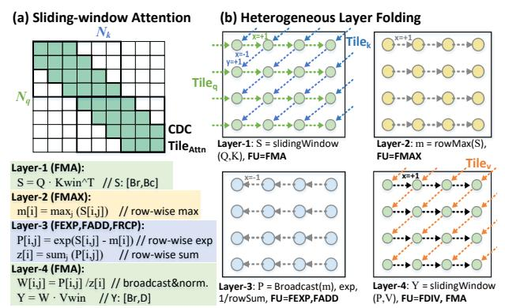
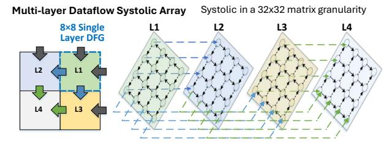

# B. Generalizing MLX from Closed-Set Locality

A key insight from *closed-set locality* is that many structured operators (e.g., FFT, BSMM, block MM, and structured attention) share a common execution form: their dataflow graphs follow a forward-only layered dependency structure over *repeatable* local components with *bounded* interfaces. MLX exploits this structure to (i) compile each component

Fig. 11: (a) Optimize data layout for SIMD-friendly packing; (b) Data footprint of BSMM; (c) Shuffling for a smaller-footprint closed set.

into a short tagged instruction block and (ii) execute layers as a deep pipeline on a fixed mesh with bounded in-flight state. Closed Dependency Components (CDCs). Given an operator dataflow graph G = (V, E), a CDC is a subgraph  $C \subseteq V$  that is closed to incoming dependencies:

$$\forall v \in C : (v) \subseteq C \cup \operatorname{In}(C),$$

where  $\operatorname{In}(C)$  denotes external inputs to C. A CDC forms a self-contained local update region with bounded locality. Unlike arbitrary tiling, a CDC is defined by the operator's closed dependency pattern rather than by a heuristic blocking choice. Each CDC has a fixed input/output interface: its exchanged values are determined only by the template parameters, such as butterfly width or MM/CONV block shape, and do not grow with the overall problem size. Thus, structured operators contain many recurring CDC instances with identical interfaces, allowing MLX to reuse the same tagged-block template across them.

**Forward-Only Layering.** Many structured operators can be expressed as CDC layers  $\{C_0, \ldots, C_K\}$  where each edge is intra-layer or to the next layer:

$$(u \rightarrow v) \in E \Rightarrow \ell(v) = \ell(u) \text{ or } \ell(v) = \ell(u) + 1,$$
 (3)

with layer index  $\ell(\cdot)$ . CDCs within a layer are parallel and inter-layer dependencies are strictly forward-only, forming a pipeline without long-range or cyclic dependencies. As depth increases, layers typically expand interaction scope from local to more global while preserving the adjacent-layer constraint. **Encoding of Layered Routing.** MLX assigns each CDC a lightweight index  $\ell$  for its pipeline class. According to Eq. 3, a CDC communicates only within  $\ell$  or to  $\ell+1$ , so  $\ell$  directly selects the next-stage routing class, while the endpoint PEs are determined by a static placement of CDC-to-PE. For structured operators, transfers often belong to a small set of affine offsets, so routing can be compactly parameterized by  $(\Delta x, \Delta y)$ , but the key property is the *finite routing class* induced between

Fig. 12: Folded MLX dataflow for sliding-window attention: overlapping FMA/FMAX/FEXP stages on the same 2D array.

layers. Each CDC is executed by a loop-driven tagged block and is triggered by a tag-based dependency:

$$C_i \mapsto loop(k) tagged\_kernel_i(k),$$

where a PE replays a short tagged instruction block across CDC instances, amortizing decode and operation scheduling. **Principle and Implications.** Any structured operator that can be expressed as CDC layers  $(C_0,\ldots,C_K)$  over closed working sets  $S_0\subseteq\cdots\subseteq S_K$  with strictly forward dependencies (Eq. 3) is MLX-executable. The inter-layer edges of CDC form a deterministic forward pipeline, eliminating global scheduling. This structure also enables *spatial folding*, which overlays many logical CDC layers onto a fixed mesh and decouples logical depth from physical array size. In practice, folding need not keep all logical layers active. A small in-flight window is sufficient to sustain FU utilization while bounding on-chip buffering. The same principle also extends to other layered structured operators beyond butterfly kernels.

## C. Structured Kernels Beyond Butterfly Operators

To demonstrate that MLX is not limited to FFT/butterfly-style homogeneous kernels, we include a second structured workload example from transformer inference: a sliding-window attention (SWA) tile. Although its computation mixes different primitives (matrix accumulation, reductions, exponentiation, and normalization), its dataflow can still be expressed as a small sequence of CDC layers with strictly staged dependencies, which directly maps to MLX folding on the same 2D array, as shown in Fig. 12: (i) windowed score accumulation ( $QK^{\top}$ , FMA-dominant), (ii) row-wise max reduction, (iii) exponentiation and normalization statistics (FEXP + sum/broadcast), and (iv) weighted accumulation and normalization (SV, FDIV, FMA).

These CDC layers form an adjacent dependency chain where each layer consumes only the immediately preceding layer's CDC-boundary outputs (plus tile-local state). By *folding* the logical layers onto a compact on-chip matrix pipeline on the same PE array, CDC batches from different layers can be partially in-flight, while all inter-layer communication occurs only through explicit CDC-boundary xfer operations, making transfers checkable and bounded. Since different lay-

Fig. 13: Mapping a dense MM to MLX in multi-layer dataflow.

ers stress different FU primitives (FMA, FMAX and FEXP), tagged-block execution can easily exploits this heterogeneity. With sufficient latency-window coverage at layer granularity, MLX achieves steady-state overlap while keeping the number of concurrently active layers bounded.

MM kernels also fit MLX. In Fig. 13, each PE computes an  $8\times 8$  SIMD-aligned tile and accumulates psums under propagation of forward-only operands across the  $4\times 4$  mesh. We then fold a sequence of tiles onto this compact mesh and issue them as MLX layers, using a fixed load-comp-xfer template to stagger phases and overlap work. This is beneficial when the per-tile compute is short (e.g., small K) or tiles are partial (common in attention), where folding amortizes fill/drain and boundary overheads to improve utilization.

### VI. METHODOLOGY

