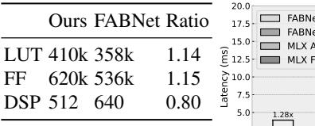
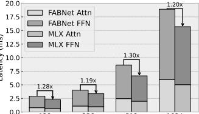

# B. MLX Performance

Prior Sparse Accelerators: Fig. 18 compares MLX with five representative sparse accelerators, using technologynormalized energy numbers quoted from the original papers [26, 29, 37, 38, 39, 40] and scaled with the process factors in Table IV. SpAtten is the baseline ("1.0"). Under two settings of s=0.75/0.5, MLX achieves  $2.93-4.10\times$  and 4.14-5.8× speedups over the first three accelerators under dynamic sparsity, benefiting from a unified butterfly acceleration in both attention and projection. Compared to ViTALiTy, which targets low-rank vision transformers, MLX delivers 1.28× and 1.81× speedups at comparable FLOP reductions. MLX also outperforms BitVert by 2.3×; BitVert reports higher energy savings (2×) mainly due to its INT8 precision, whereas MLX operates in FP16. Fig. 18(c) further reports hardware–software affinity (speedup normalized by FLOP savings). MLX attains consistently high affinity because BSMM/FFT are strongly FMA-dominant: most cycles are spent on regular MAC operations in the PEs, with only modest control and bookkeeping overhead, in contrast to irregular sparse kernels that require data-dependent indexing or selection. This also underscores the practical ease of deploying butterfly sparsity.

Fig. 18: Comparison with prior sparse accelerators on a single transformer block (N=1024, D=512).

TABLE V: FPGA Resource Usage Comparison.

Fig. 19: Speedup o/ FABNet-Large.

Real-world Butterfly Accelerator: FABNet [29] is the closest prior design, proposing an FPGA-based butterfly-accelerator co-design that uses 2D-FFT for attention and global BSMM for FFNs, excluding exponentiation operators. We re-implement the same model and parameter settings on MLX. Fig. 19 shows that MLX delivers  $1.19 \times -1.30 \times$  end-toend speedup across context lengths, with 1.14× LUT overhead (Table V) under this workload setting; LUTs are the limiting FPGA resource in FABNet-style deployments [52]. Breaking down the gains, 2D-FFT attention improves by  $1.11 \times -1.23 \times$ , while BSMM-FFN improves by  $1.21 \times -1.31 \times$ . The smaller FFT-side gain is consistent with FABNet's stronger specialization for complex-valued butterfly operations, which narrows MLX's FFT headroom. The peak speedup at 512 occurs when the workload fits MLX's largest single-stage BSMM footprint, avoiding stage transitions and associated SPM round-trips.

**NVIDIA Xavier GPU:** Fig. 20 compares eight kernels of Llama2-7B's for short (256) and long (8K) token inputs, on Jetson Xavier and MLX. In Fig. 20(a), MLX 's butterfly-sparse kernels achieve 3.1× speedup and 3.2× energy savings compared with Xavier's dense TensorCore kernels. Fig. 20(b)

Fig. 20: Full design's speedup over NVIDIA Jetson Xavier.

Fig. 21: (a) End-to-end speedup of Llama2-7B over Jetson Xavier on different context length. (b) Memory usage (GB).

further shows  $3.2\times$  speedup and  $3.1\times$  energy savings on average over sparsified CUDA execution. On GPUs, dense kernels often use Tensor Cores, whereas butterfly and structured-sparse kernels typically run on CUDA cores. This compresses the relative gain from sparsity while highlighting the value of MLX 's specialization in structured acceleration.

Fig. 21 presents an end-to-end comparison between a sparsified Llama2-7B on MLX 's and a dense model on Xavier. All inference operators, including RMSNorm and positional embeddings, are supported by MLX via instruction-driven programmability and the required compute units (vector shuffle and transcendental supports) in our full design. Due to its 16 GB memory capacity, Xavier cannot sustain over a 512token context, while MLX processes sequences up to 2048. Although speedup diminishes when dense linear layers dominate, MLX maintains robust advantages across long-context settings enabled by BSMM and FFT-CMP sparsification.

