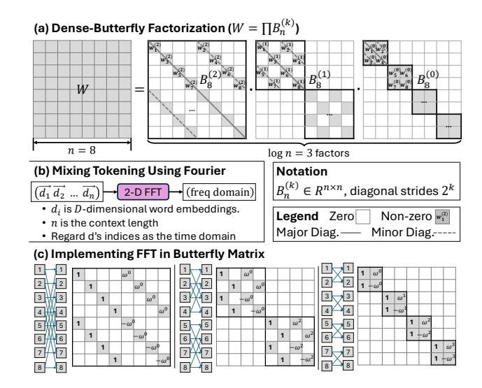
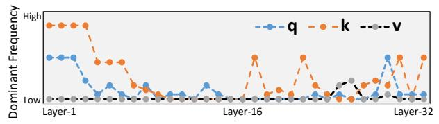
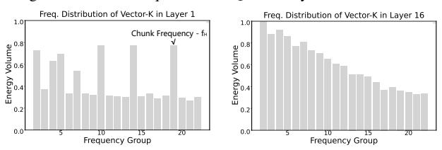

# B. Structural Execution Mismatch on GPUs

Fig. 3 shows that butterfly kernels in the attention phase have lower OI and thus are bandwidth-dominated, yet their achieved performance still fall below the CUDA bandwidth roofline. This indicates a gap beyond memory-boundedness, rooted in the mismatch between butterfly dataflow and GPU execution. In particular, FFT pipelines involve multi-stage strided and shuffling accesses that break locality and hinder bandwidth utilization, consistent with the high cache-miss rates in Fig. 2. Unlike dense baselines that map efficiently to TCUs, butterfly stages are mostly executed as CUDA's vector primitives with frequent memory accesses and data reordering, limiting end-to-end speedup despite reduced FLOPs.

At a deeper level, this mismatch stems from the *stage-wise* dependency structure of BSMM and FFT (Fig. 8). As working sets expand across stages, they require ordered data exchanges that conflict with GPUs' bulk-synchronous, tile-regular execution, unlike 2:4 structured sparsity on TCUs, which preserves tile-local, dense-like access. Realizing butterfly permutations within tiles therefore incurs costly data shuffling. Although recent TCU-based FFT designs [19, 23] improve

Fig. 4: Improve transformer blocks using structured sparsity.

over CUDA cores, they still leave utilization headroom due to block decompositions that add extra work beyond the ideal  $O(N\log N)$  cost and only partially fill TCU pipelines.

Overall, these limitations motivate a closer look at butterfly sparsity in LLM workloads. We next characterize its structure and identify opportunities for our co-design.

**Challenge: Operator Heterogeneity.** Butterfly-based acceleration spans BSMM, FFT, and dense projections, which exhibit distinct dataflow patterns. This heterogeneity complicates specialization, seemingly requiring disparate hardware support.

**Opportunity 1: Unified Dependency Structure.** Despite their differences, FFT and BSMM share fixed, hierarchical butterfly stages (Fig. 4(c)), and dense projections also can be expressed as blocked producer—consumer streams. Together, they follow a shared stage-wise dependency representation, enabling a unified execution pipeline across these kernels.

Challenge: Limited Fine-Grained Parallelism on GPUs. BSMM introduces long-range stride mixing and load—sync cycles that prevent GPUs from exploiting fine-grained reuse within a single matrix—vector transformation.

**Opportunity 2: Predictable Cross-Layer Dataflow.** At the same time, BSMM retains an explicit staged structure. Each stage produces outputs that feed a small, predetermined set of consumers in the next stage, as shown in Fig. 8. This structured dependency enables partial results to be routed directly to subsequent stages, forming a fine-grained *multi-layer* dataflow pipeline without global-memory round-trips.

**Opportunity 3: Orthogonal Dimension Parallelism.** FFT-based sequence compression and BSMM projections expose abundant hidden- and token-level parallelism orthogonal to the multi-layer pipeline. It can be exploited through vectorization or temporal multi-iteration execution on spatial dataflow, ensuring throughput while preserving the staged schedule.

Takeaway: Both BSMM and FFT reduce to the same behavior: continuously stage-wise structured linear transforms that yield predictable producer-consumer dependencies.

Fig. 5: Dominant frequencies of QKV in layers of Llama2-7B.

Fig. 6: Freq. energy of token sequences in Layer-1/16 of Llama2.

#### C. Spatial Dataflow: The Base Design

Structured operators expose predictable cross-stage dependencies, but GPUs often execute them as separated stages with frequent synchronization, strided/permuted exchanges, and poor locality. In contrast, spatial dataflow architectures [11, 24, 25] can realize such ordered dependencies through explicit operand routing and deterministic mesh flow, sustaining parallelism through pipelined temporal execution. Prior work [10, 26] has exploited similar dataflow properties for sparse computation. Butterfly operators provide an even stronger structure: their dependencies are sparse, fixed, bounded, and strictly forward across stages. This not only reduces routing complexity, but also allows partial results to remain in flight across successive stages, forming a deeply pipelined dataflow instead of isolated stage-by-stage executions.

These properties motivate Multi-Layer Execution, which folds ordered cross-stage dependencies onto a compact spatial array to maximize data reuse, overlap communication with computation window, and sustain high PE/FU utilization.

