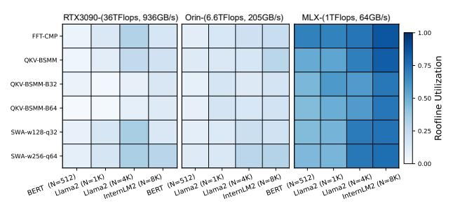

# C. Resource Utilization and Scalability

Fig. 22 summarizes PE utilization on BSMM and FFT-CMP kernels. For small sizes, kernel-launch overhead is around 17%, but it drops below 12% as kernel sizes grow. We group load/store/transfer units as a unified data-supply pipeline, which exhibits consistent latency behavior. BSMM and FFT show similar utilization trends since both map to multi-stage butterfly operators, with minor differences caused by real versus complex arithmetic. Overall compute utilization reaches about 90%, showing that our instruction scheduling effectively hides data-movement latency and pipeline idleness.

We evaluate scalability using transformer blocks of sizes  $N=\{512,1K,2K,4K,8K\}$  with D=512, batched by 8 to provide sufficient parallelism for all designs. Four configurations are tested by combining 8- vs. 32-way SIMD with  $4\times4$  vs.  $8\times8$  meshes, each offering  $4\times$  peak compute scaling. As shown in Fig. 23, both dimensions scale nearly linearly, yielding mean speedups of  $3.9\times$  (SIMD) and  $3.6\times$  (mesh), and up to  $14\times$ 

Fig. 22: PE resource utilization breakdown.

Fig. 23: The scalability over SIMD degree and mesh size.

when scaled jointly. SIMD benefits directly from token-level parallelism, but cannot grow indefinitely due to multi-ported *registerFile* cost and limited per-layer parallelism.

Mesh scaling offers a more sustainable path by exploiting inter-layer pipelining. A lightweight skip-hop interconnect reduces multi-hop latency and enables near-linear scaling for the  $8\times8$  mesh, with almost 6.2% area overhead and modest timing overhead even at 1 GHz in 12 nm.

#### D. Sensitivity on Structured LLM Workloads

Fig. 24 compares MLX against stronger AGX Orin and RTX-3090 across our structured-workload suite, spanning multiple models and sequence settings at batch size 32. Despite substantially lower peak compute and bandwidth, MLX still outperforms Orin on a subset of butterfly-style operators. On several small FFT/BSMM cases, the gap to RTX also narrows, which is partly attributable to MLX's compact fabric and lower launch overheads. Across operators from FFT-CMP to BSMM with increasing block sizes and SWA, the computation pattern becomes progressively coarser and more tile-regular. This increased regularity exposes more bulk parallelism and maps more naturally to GPUs' dense execution, so MLX's speed advantage correspondingly diminishes. Even so, MLX retains an average normalized speedup of  $3.6 \times$  and  $2.3 \times$  on the two SWA cases (W: window width, Q: block size).

To factor out peak-resource differences, Fig. 25 reports roofline utilization, i.e., achieved performance normalized to the roofline limit under compute and bandwidth constraints. Butterfly structured operators achieve 52%–84% utilization on MLX, compared to 12%–29% on Orin and 8.2%–31% on RTX, indicating more efficient execution of deep stagewise dependencies on MLX. For SWA, MLX's overlapped pipeline sustains 43%–75% FMA utilization. The remaining gap is primarily due to bandwidth loss from windowed KV traffic, yet MLX still exceeds the GPU baselines (10.8%–31% and 8.9%–28%). Overall, these results indicate that MLX generalizes beyond butterfly sparsity to efficiently support a broader range of structured operators.

Fig. 24: Structured-operator sweep on Orin and RTX-3090.

Fig. 25: Utilization  $(P_{\rm achieve}/\min(P_{\rm peak}, OI \cdot BW))$  of FMA operation on four representative model and sequence cases.

