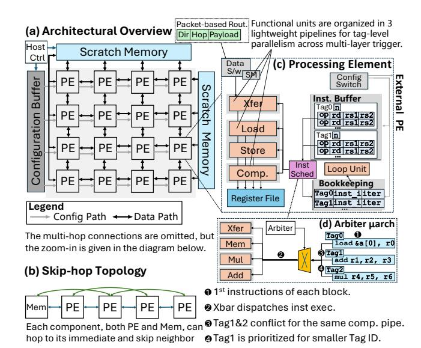

# C. Spatial PE: Enabling Layer-Folded Execution

μ-Architecture. MLX's folded-layer execution requires each PE to advance multiple layers concurrently: loading inputs for future layers, computing the current layer, and forwarding outputs from previous layers. Rather than tracking these interactions with fine-grained instruction-level hazards, MLX decouples each PE into four independent pipelines for memory movement, dataflow transfer, and heterogeneous arithmetic, as shown in Fig. 9(c). This decoupling is critical for MLX's hybrid operators, which mix real/complex arithmetic with activation and normalization functions, as shown in Fig. 9(d). Managing these heterogeneous units with a single instruction-level scheduler would involve substantial area and control complexity. MLX instead separates them into parallel pipelines, allowing each PE to schedule at *layer* granularity while naturally overlapping the phases of layers. As a result, multiple layers effectively time-share the same PE resources, sustaining high utilization over an active-layer window while keeping PE control lightweight.

Layer-encoded Instruction Store. Executing many MLX layers would require a large instruction buffer to hold all per-layer operations ( $\Theta(K \cdot I_{\text{layer}})$ ). Instead, MLX exploits a key structural property: each layer forms a *fixed reusable* instruction template whose internal order never changes. We therefore encode each logical layer as a compact *tagged block*, a short static instruction sequence plus a loop trip count, that captures the exact computation footprint of that layer. These tagged blocks are revisited repeatedly as the folded execution window slides forward, decoupling the instruction-store size from the total number of layers. Only a small set of active blocks must reside in the PE at any time, allowing a constant-footprint instruction hierarchy regardless of operator depth.

(1) Layer-aligned scheduling. Tagged blocks align the hardware scheduling unit with MLX layer boundaries. Each block carries a tag, a buffered instruction sequence, and a loop tripcount n, allowing the PE to track readiness, progress, and

Fig. 9: The spatial accelerator design of MLX architecture.

completion at *layer* granularity. This avoids per-instruction bookkeeping, large dependency tables, and fine-grained hazard metadata, while preserving the semantic boundaries required by folded-layer execution.

(2) Active-window pipeline overlap. Tagged blocks act as schedulable entries in the active-layer window across decoupled PE pipelines. Within this window, different folded layers can occupy different pipeline phases simultaneously—one loading inputs, another computing, and a third forwarding results. The tag identifies which active layer each block belongs to, allowing the PE to advance multiple layers as a structured pipeline. This exposes cross-layer parallelism while keeping control coarse, predictable, and low-cost.

**Hybridized Scheduling.** MLX exposes a scheduling regime that is neither fully dynamic nor fully static. A fully dynamic scheduler [12] must track fine-grained dependencies across operations within FFT/BSMM layers, whereas a fully static schedule would require the compiler to jointly reason about routing, cycle timing, and resource conflicts across all folded layers. MLX instead separates intra-layer determinism from cross-layer elasticity. Within each folded layer, dependencies are local and ordered, allowing the compiler to emit a static instruction sequence. Across layers, communication is reduced to a small set of topology-aligned tag events, such as transfers and forwardings, which hardware arbitrates elastically [33, 34]. Thus, software fixes the deterministic local schedule, while hardware only manages tag-level cross-layer coordination, reducing scheduling state without relying on fine-grained dynamic wakeup or global cycle-level planning.

In Fig. 9(c), each folded layer is a coarse execution window identified by a tag. The arbiter sees only the layer's *frontier* instruction inst\_i and resolves contention across decoupled pipelines. Tag IDs encode the valid *partial order* among layers. Prioritizing smaller tags preserves dependency correctness while allowing layers to overlap and hide latency. When a

layer's LD completes, it sets a ready bit in the tag entry to enable the next stage(s) (compute and/or xfer); each pipeline selects among ready tags subject to resource availability. If multiple layers are ready, the arbiter can round-robin, using Tag ID as a tie-breaker. Fig. 9(d) shows how this coarse arbitration works. When tag1's add and tag2's mul contend for the compute pipeline, the arbiter grants the lower tag and stalls the other block, making decision at block/tag granularity.

### D. Design Parameters

The design parameters are determined by the characteristics of MLX operators and the hybrid network model:

**Principle 1 – SIMD Width.** For GEMM, the compute block of a layer operates on a  $n \times n$  dense tile. A tile performs  $n^3$  MACs while reading  $2n^2$  input operands, giving a baseline compute—traffic ratio of n/2 and a necessary condition  $n \ge 4$  to sustain non-trivial reuse. BSMM tiles impose an orthogonal constraint: butterfly sparsity must be meaningful. For a full n-point butterfly with  $k = \log_2 n$  stages, the nonzero density is  $\frac{2\log_2 n}{n}$ , which suggests a minimum power-of-two width of  $n \ge 8$  for sparsity to be effective. Therefore, 8-way SIMD is a necessary *lower bound* that our reduced design adheres to, while our full design adopts 32-way SIMD to better exploit parallelism and sustain higher throughput under MLX.

Principle 2 - Mesh Size and Instruction Storage Co-Scale. As the meshscales out, MLX's dependency radius grows, increasing physical hop distances for inter-layer loads and butterfly exchanges. This increases the communication latency in cycles, including  $T_{\rm load}$  and  $T_{\rm xfer}$ . To sustain utilization, each active layer block must provide sufficient compute to hide the dominant communication latency:

$$T_{\text{compute}}(\text{block}) \ge \max(T_{\text{load}}, T_{\text{xfer}}).$$

As a result, larger meshes require a larger active-layer window and proportionally more on-chip instruction storage to keep the pipelines full. Because MLX schedules execution at the granularity of tagged blocks, each block can exploit structured intra-block reuse (e.g., arithmetic reuse in butterfly primitives or intra-tile reuse in MM), thereby raising its effective compute intensity in contrast to instruction-level dataflow where operands are often consumed once within a node. This higher block-level intensity helps hide the stride-inflated communication latency,  $T_{\rm load}$  and  $T_{\rm xfer}$ , as the mesh scales. Coverage can therefore be maintained by enlarging the block's compute budget C or the number of concurrently active tags  $B_T$ :

$$B_T \cdot C \geq T_{\text{load}} + T_{\text{xfer}}.$$

Consequently, instruction-store capacity is governed not by per-kernel instruction count, but by the *coverage window* needed to amortize load/transfer latencies at scale. Based on this trade-off between scale and latency, we choose a compact design point: a  $4\times 4$  mesh with 32 instructions per PE, which is sufficient to satisfy the coverage condition.

**Principle 3 - Precision Support and Non-linearity.** Our attention model supports full-sequence FFTs up to 8192 points, requiring 4096 distinct twiddle factors. Since sub-FP16

Fig. 10: Allocating computing resources for BSMMs. (For clarity, batch-based SIMD and vertical hops for stride =4,8 are omitted.)

precision destabilizes butterfly accumulation, MLX uses FP16 as the minimum stable precision. Transcendental units are integrated into each PE to support nonlinear operations, but they operate at only a quarter of the SIMD width.

**Host Controller:** In Fig. 9(a), the accelerator is orchestrated by a small RISC-V host core, which handles outer-loop control while issuing compact commands to the spatial array. Only minimal ISA extensions are required to load MLX configurations and coordinate memory movement, keeping the control plane compatible with existing RISC-V software.

