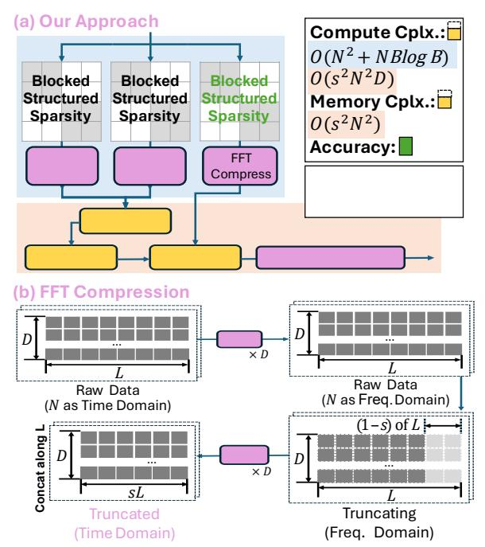

# III. ALGORITHMIC INNOVATIONS

We first motivate our algorithmic innovation, the hybridized transformer block, which combines compression and sparsity techniques to speedup LLMs at modern scales.

### A. Semantic-Aware Fourier Compression

In this section, we explain how FFT compression is applied to context sequences. Transformer layers exhibit distinct semantic behaviors: shallow layers tend to focus on local, fine-grained token details, whereas deeper layers encode broader contextual information. From a signal-processing perspective, this manifests as different frequency profiles over the sequence-length N: fine-grained patterns map to higher-frequency components, while contextual abstractions shift energy toward lower frequencies. We confirm this by applying FFT to the Q, K, V vectors of Llama2-7B [27] across transformer layers (Fig. 5). The K spectrum in Fig. 6 shows that layer 1 is dominated by the high-frequency content on the right side, while layer 16 is smoother with low frequency dominated. Although Q/K/V are intermediate representations, their frequency profiles reflect how each layer aggregates

Fig. 7: Our approach: hybridizing structured sparsity and FFT (Decompression is symmetric and omitted).

semantic information along the sequence dimension. Motivated by the observed spectral features, we define a per-layer chunk length  $L_l$  as the sequence interval that matches the shortest prominent variation scale of layer l. Let  $\tilde{f}_H$  denote the highest-frequency spectral peak whose energy exceeds a relative threshold (e.g., a fixed fraction of the peak energy). We define the nominal scale  $\tilde{L}=N/\tilde{f}_H$  and quantize it to a power-of-two for hardware-friendly alignment:

$$\tilde{L} = N / \tilde{f}_H, \qquad L = \text{Pow2Round}(\tilde{L}).$$
 (1)

**High-level Idea**: Chunking from N fixes the FFT length to L and localizes token mixing in semantic-aware intervals, while enabling efficient, streaming-friendly Fourier compression that removes less-dominant high-frequency components with minor loss of informative content (Fig. 7(b)). Specifically, for each matrix of  $Q, K, V \in \mathbb{R}^{N \times D}$  after projection: (1) reshape into N/L chunks and perform N/L independent L-point FFTs per feature dimension to obtain chunk-wise spectra; (2) truncate the last (1-s) fraction of high-frequency coefficients along each L-dimension, keep leading informative sL components [28]; (3) apply an sL-point iFFT to the retained coefficients per chunk, re-generating a shorten token representation in a low-frequency subspace.

This process discards low-energy high-frequency components and yields a tunable compute–accuracy trade-off via s. We evaluate representative operating points (e.g., s=0.5, 0.75) in Sec. VII. The shortened sequence reduces prefill cost to  $O(s^2N^2D)$ , while also shrinking the attention matrix and easing buffering pressure and memory traffic. Because this quadratic term still dominates the attention pipeline, the additional chunked-FFT overhead of  $O(ND \log L)$  is comparatively minor, making FFT-based compression cost-effective.

TABLE I: Comparison of Butterfly-based Kernels in LLMs.

| Butterfly Kernel              | Prefill                       | Decode                    | Accutunable |                                       |       |
|-------------------------------|-------------------------------|---------------------------|-------------|---------------------------------------|-------|
| 2D-FFT BSMM                | Attn. QKV / FFN            | \ \frac{\lambda}{\lambda} | ×           | ×                                     | Prior |
| FFT Compress Hierarc. BSMM | Attn. / KV Cache QKV / FFN | \ \frac{1}{4}             | √ ✓      | $\checkmark$ $(s)$ $\checkmark$ $(B)$ | Ours  |

In prefill, semantic-FFT is applied to the prompt in fixedsize L-token chunks. In decode, although N grows, we keep L fixed and avoid re-transforming the full prefix. Completed chunks reuse cached compressed blocks, while new tokens accumulate in a local buffer. Once the buffer reaches L, we trigger FFT compression and append a new block. This yields an append-only, chunk-granular cache and amortizes FFT overhead over L tokens, remaining compatible with KVcache decoding process.

