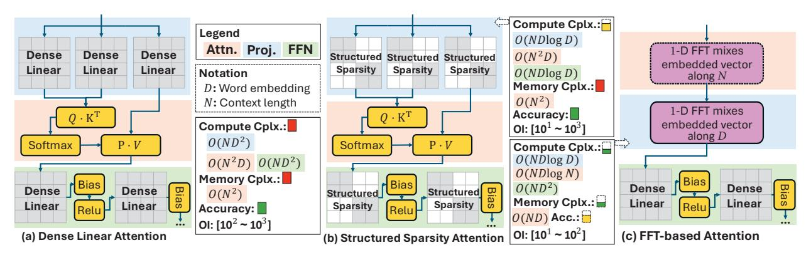
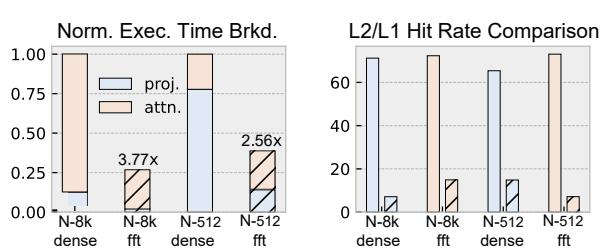

# MLX: <u>Multi-Layer Execution for Structured LLM</u> Workload Acceleration on Spatial Architectures

Haibin Wu1,2, Wenming Li1,2,\*, Zhihua Fan1,2, Zirui Ma1,2, Yuqun Liu1,2, Tengfei Xia1,2, Yanhuan Liu1,2,3, Kunming Zhang1,2,3, Xiaochun Ye1,2, Dongrui Fan1,2, Jian Weng4

1State Key Lab of Processors, Institute of Computing Technology, Chinese Academy of Sciences, Beijing, China

2University of Chinese Academy of Sciences, Beijing, China

3Ricore IC Technologies Ltd., China

4King Abdullah University of Science and Technology, Thuwal, Saudi Arabia

{wuhaibin, liwenming, yexiaochun, fandr}@ict.ac.cn, {liuyanhuan, zhangkunming}@ri-core.cn, jian.weng@kaust.edu.sa

Abstract—Structured sparsity is a promising approach to scaling large-language-model (LLM) inference, but existing forms such as butterfly-structured sparse projections and transformations often map inefficiently to GPUs due to deep stage dependencies and limited bulk parallelism. This paper presents MLX, an algorithm-architecture co-design for structured LLM inference. MLX couples semantic-aware FFT compression and hierarchical sparse projections with spatial dataflow execution, enabling staged structured operators to run efficiently on compact arrays. MLX defines Closed Dependency Components (CDCs) to capture deterministic forward-only dataflow regions that can be folded across layers and pipelined on compact arrays. It then realizes CDCs through a multi-layer execution architecture with bounded-hop skip-hop routing, tag-based scheduling, and decoupled compute/transfer pipelines to overlap communication and computation across deep operators. We prototype MLX in 12 nm and show that it achieves 3.2× hardware speedup and 3.1× energy savings over Jetson Xavier. A transformer-specialized reduced design further delivers up to 5.7× speedup over prior sparse accelerators. MLX also scales nearly linearly to 8×8 meshes and remains effective for long sequences from 1K to 4K, demonstrating that structured operator semantics can be translated into efficient spatial execution for sparse LLMs.

Index Terms—Dataflow Architecture, Spatial Accelerators, Structured Sparsity, Large Language Models

#### I. INTRODUCTION

Transformer models have become a dominant foundation for modern AI across natural language processing (NLP) [1], computer vision (CV) [2], and multimodal tasks. Despite their strong reasonability, these models heavily rely on matrix multiplications (shown in Fig 1(a)), which turns out to have scaling cost: (i) self-attention incurs  $O(n^2d)$  compute and substantial data traffic, and (ii) linear projections incur  $O(nd^2)$  compute with  $O(d^2)$  parameter storage. As n grows, the quadratic attention term and the associated memory movement increasingly dominate end-to-end latency and energy.

Prior work reduces this cost through *structured* approximations that preserve regularity while lowering computation. One direction applies butterfly factorizations to *linear projections* [3, 4, 5, 6], replacing dense weights (Fig. 1(b)) with structured matrices and reducing computation to butterfly-sparse matrix multiplication (BSMM). This reduces the cost of the projection layers, but Q, K, and V are still dense, so

subsequent attention process remains the dominant bottleneck for long contexts. A second direction (Fig. 1(c)) modifies or replaces *token mixing* by sparse attention [7, 8] or Fourier transform [9], thereby reducing the cost of quadratic attention. Aggressive Fourier-style mixing greatly lowers token-interaction complexity, resulting in a great reduction in FLOPs.

Although promising, scaling these approaches to modern LLMs exposes two practical challenges. First, existing factorizations of butterfly sparsity are applied to the full projection matrix; at large d, the decomposition problem grows in complexity, becomes harder to convergence, and can incur larger approximation error. Second, fully replacing contentdependent attention with FFT-style token mixing removes explicit token-to-token interactions, which can hurt accuracy and is not readily applicable to standard LLM pipelines. Our key observation is twofold: LLM layers exhibit semantic frequency locality along the sequence dimension, which we exploit to selectively retain informative frequency components for FFTbased token mixing, while block structure localizes butterfly sparsity to smaller submatrices, making decomposition easier to converge with smaller accuracy loss. Together, these two insights unify Fourier operations and factorization under a single structured butterfly sparsity. However, turning these arithmetic savings into effective speedups remains difficult on bulk-parallel architectures, motivating a co-designed approach that better exploits structured and predictable data reuse.

Our profiling results in Fig. 2 reveal this disconnection. Although FFT attention can reduce the arithmetic count by more than  $10\times$  in theory, the realized end-to-end speedup is often far smaller. For example, on an NVIDIA AGX Orin with batch size 64, FFT-based structured transformer blocks achieve only  $3.77\times$  and  $2.56\times$  speedups over dense baselines at sequence lengths of 8K and 512, respectively. To explain why FLOP reductions are under-realized on GPUs, we use a roofline analysis to separate compute- and bandwidthbound regimes. Orin exposes the edge-case symptom, while H100 provides a modern reference envelope. Fig. 3 plots the H100 roofline using optimized *cuFFT*. Both FFT and butterfly running on CUDA cores have much lower operational intensity (OI) than dense GEMM on TensorCore Units (TCUs), placing them in a bandwidth-dominated regime. Yet they still fall far below the CUDA bandwidth roofline, indicating inefficiencies

\* Wenming Li is the corresponding author.

Fig. 1: Tradeoffs among different implementations of transformer blocks. Operational intensity (OI) is measured as effective FLOPs per byte of off-chip DRAM traffic, accounting only for the projection and attention phases.

Fig. 2: Profiling results on NVIDIA AGX Orin. Hatched are FFTbased kernels applying FFT and BSMM on attention and projection.

beyond memory-boundedness. We attribute this gap primarily to multi-stage data reordering that disrupts locality and to execution-unit mismatch, as detailed in Sec. II-B.

To address both limits of existing butterfly-based methods and their hardware misalignment, we present MLX, a structured LLM co-design. As shown in Fig. 7, MLX combines semantic-aware compression along the sequence dimension with hierarchical butterfly sparsity along the hidden dimension. Together, these operators decompose computation into bounded closed sets with strictly forward layer-aligned dependencies, which are inefficient under bulk-synchronous execution but map naturally to spatial dataflow [10, 11, 12, 13, 14]. This insight leads to Multi-Layer Execution (MLX), a folded abstraction that enables ordered data reuse and cross-layer pipelining on a compact dataflow array. Our contributions are:

- Butterfly Dataflow for LLM Acceleration: We combine layer-aware spectral truncation to shorten token sequences with hierarchical butterfly decomposition to reduce projection complexity. Together, they lower compute and memory costs in mainstream LLMs while preserving structured sparsity for efficient dataflow execution.
- Multi-Layer Execution: A general multi-layer execution model that folds cross-layer dependencies into locality-preserving pipelines, enabling efficient execution of deeply stacked structured operators on spatial arrays.
- Layer-Folded Spatial Substrate: We build a spatial substrate that enables inter-layer dataflow routing, decoupled compute-transfer pipelines, and flexible array mapping. This design allows dense and sparse operators to be folded and deeply overlapped on a compact array,

Fig. 3: Roofline model and CUDA utilization of LLaMA2-7B (FP16) during the prefill phase (N = 512, 8K) on NVIDIA H100 GPU.

sustaining high utilization across LLM workloads.

• Taped Out Chip: This work benefits from prior real hardware development, and the proposed accelerator is a simplified and reduced variant derived from a general-purpose dataflow design. A real-world tape-out brings higher confidence in the design feasibility and rationale.

The evaluation shows that our improved Transformer block reduces FLOPs to 30% of a shape-matched dense Transformer block, with <1.8% accuracy degradation. Relative to previous FFT-based Transformers, it improves accuracy by 1.9% while using fewer FLOPs. Our proposed accelerator achieves up to 5.8x speedup and  $2.6\times$  energy saving over prior SOTA sparse accelerators. The taped-out design, in the same technology node and with similar peak FLOP/s as the NVIDIA Jetson Xavier, achieves  $3.2\times$  speedup and  $3.1\times$  energy savings on the proposed sparsified Transformer models.

