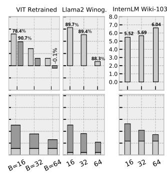
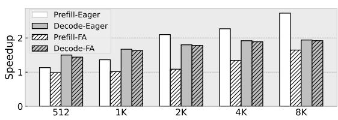

# VII. EVALUATION

### A. Validating Algorithmic Improvements

As shown in Fig. 15, we evaluate both FFT-CMP and hierarchical BSMM on multiple models to confirm that the proposed structured operators provide predictable accuracy-compute tradeoffs across typical Transformers.

The ViT model [2, 42] is included because its modest size allows full training from scratch, enabling a clean, theory-oriented validation of our butterfly sparsity methods. Replacing dense projections with block-based decomposition ("bd.\*") reduces FLOPs by 45–55% but only with slight accuracy loss. Using 2D-FFT token mixing as in FNet ("fnet.fft") [9] yields a similar compute reduction but suffers a 2–3% accuracy degradation. In contrast, our FFT-CMP at s=0.5 achieves a 65% FLOP reduction with only a 1.6% accuracy drop relative to the dense baseline, outperforming existing FFT-based transformers [9] in both efficiency and accuracy.

TABLE III: Single-layer Transformer (T) & 5 Models (V, F, B, I, L).

| Bench. | Trans. ( <b>T</b> ) [41] | VIT (V) [42] | FABNet ( <b>F</b> )[29] | BERT ( <b>B</b> ) [1] | BERT ( <b>B0</b> )[43] | InternLM2 -7B ( <b>I</b> ) [44] | Llama2-7B (L) [27] |
|--------|--------------------------|-----------------|----------------------------|--------------------------|---------------------------|------------------------------------|-----------------------|
| D      | 1K                       | 196             | 128                        | 8K                       | 512                       | 1K to 4K                           | 128 to 2K             |
|        | 512                      | 1K              | 768                        | 1K                       | 1K                        | 4K                                 | 4K                    |

TABLE IV: Baseline Accelerators and Target Workloads.

| Hardware      | Freq. (GHz) | Peak Perf (Op/s)                           | Tech. Node (Norm. Ratio 6 ) | Power (W)                                  | Bench. | Algo. FLOP Saving on T                     |
|---------------|----------------|-----------------------------------------------|-------------------------------------------|-----------------------------------------------|--------|-----------------------------------------------|
| MLX           | 1.0            | 1 T 1 (FP16) 256 G 2 | 12 nm                                     | $5.85^{1} + 0.6^{3}$ $0.41^{2} + 0.11^{3}$ | All    | 4.1 ( <i>s</i> =0.75) 6.1 ( <i>s</i> =0.5) |
| Jetson Xavier | 1.0            | $1.7T^4(6T^5)$                                | 12 nm                                     | 15                                            | L      | 1                                             |
| FABNet[29]    | 0.2            |                                               | 16nm (FPGA)                               | 11.35                                         | T, F   | 13.5                                          |
| SpAtten[37]   | 1.0            |                                               | $40\mathrm{nm}~(5\times)$                 | 1.06                                          | T      | 3.0                                           |
| DOTA[26]      | 1.0            |                                               | $22 \mathrm{nm} (2\times)$                | 0.86                                          | T      | 5.0                                           |
| Sanger[38]    | 1.0            | 256 G                                         | $55 \mathrm{nm} (7\times)$                | 0.80                                          | T      | 5.9                                           |
| ViTALity[39]  | 0.5            |                                               | $28  \text{nm}  (3 \times)$               | 1.46                                          | T      | 5.9                                           |
| BitVert[40]   | 0.8            |                                               | 28 nm                                     | 0.17 (int8)                                   | T      | 4.0                                           |

 $^1$  Full design;  $^2$  Reduced design;  $^3$  Mem. power;  $^4$  CUDA peak perf.;  $^5$  TCU peak perf.;  $^6$  Normalized to 12 nm node using the  $P \propto C \cdot V_{dd}^2 \cdot f$  model.

BERT [1] is also small enough for retraining, allowing us to apply layer-wise FFT compression using the semantic interval length L (Eq. 1) together with hierarchical BSMM sparsity (( $\overline{3}2$ )). Fig. 15(b) shows five cases applying our hybrid method to the last k layers with (s=0.5). As k increases, the computation drops predictably, while accuracy degrades modestly. Replacing all 12 layers achieves 69% FLOP reduction with only 1.75% EM and 1.3% F1 loss.

Fig. 15(c,d) evaluates FFT compression in the attention phase and block-based BSMM in QKV projection for LLMs, with LoRA fine-tuning [45] to refine the compressed layers. We tested on Winogrande-xl [46] (N=512), Wikitext-2/103 [47] (1K/2K), and Ada-LEval [48] (1K/2K/4K). We progressively apply structured operators to more than 60% of transformer layers. With respective uniform settings of s=0.75 and s=0.5, we reduce 57%-64% and 67%-72% of the QKV+Attention computation within the modified layers, with an overall accuracy drop below 1.45% across all variants. Although some layers tolerate even more aggressive compression, we use a uniform s to clearly show sensitivity to compression strength and avoid per-layer tuning. (e.g., ada-2k/4k and wiki-103), InternLM2-7B with GQA [49] yields greater savings at s=0.5 due to its reduced cost of KV projection. In auto-regressive text generation, we observe that the compressed models can converge in fewer epochs and yield slightly lower perplexity. In Fig. 16, we also evaluate the sensitivity of hierarchical BSMM to block size  $B \in \{16, 32, 64\}$ . Larger B achieves greater linear-layer FLOP reduction but generally incurs larger accuracy loss. Across our evaluated long-context settings, B = 32 provides the best tradeoff, while B can be further co-tuned with FFT compression s to reach different accuracy-efficiency points.

**Performance on H100:** To assess how well modern GPUs handle butterfly sparsity, we deploy our hybrid compressed Llama2-7B on H100 under two benchmarks: eager attention and FlashAttention2 (FA) [50, 51], using a conservative sparsity setting - (s=0.5, B=32). Fig. 17 shows the speedup over

Fig. 15: Accuracy and efficiency sensitivity under FFT cmp. and BSMM (Compute reduction measured over QKV proj. and attn. in representative sparsified layers (>60%) of Llama2 and InternLM2).

Fig. 16: Accuracy and perplexity sensitivity to block size B under fixed s=0.75 on three models.

Fig. 17: H100 Speedup on Llama2-7B (s=0.5, B=32).

the original model. In the compute-heavy prefill phase, FFT-CMP achieves up to  $2.72\times$  speedup over eager and  $1.64\times$  over FA for long sequences, while showing little benefit for short ones. The gains on H100 are modest because FFT-CMP runs at the *PyTorch* level without fusing with FA, and TensorCores provide limited support for butterfly sparsity, causing execution to fall back to CUDA cores. In the decode phase, FFT-CMP reduces KV-cache traffic, and together with block-BSMM yields a 1.4– $1.9\times$  end-to-end speedup.

