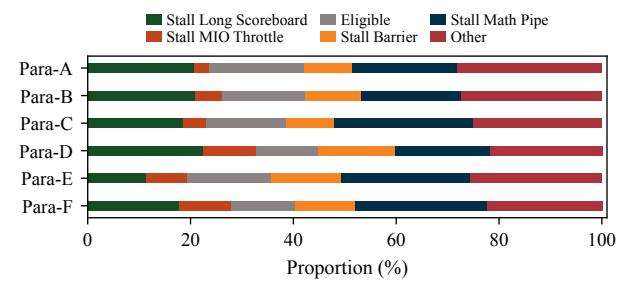
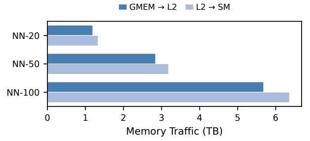
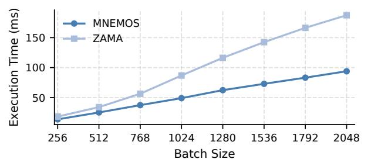
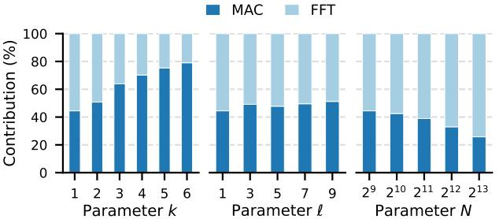

# *B. Ablation Study*

For the MAC component, we implement BSK reuse, which significantly reduces the largest source of memory access within the PBS operation. In a naive implementation, the same BSK must be repeatedly read for each PBS. The memory access volume of the BSK itself is (k + 1) times that of the GLWE data, consuming substantial memory bandwidth, particularly when the parameter k is large. Our reuse strategy, however, renders the memory access overhead of the BSK insignificant relative to that of the GLWE data.

For our fused FFT kernel, we employ multiple optimization techniques. We utilized Tensor Cores to accelerate the FFT operations and fused multiple FFT/IFFT passes into a single kernel to enhance data reuse. Furthermore, the Fourier matrix, which typically consumes significant shared memory bandwidth and is highly prone to bank conflicts, was generated on-the-fly instead. We also adopt a swizzling technique to mitigate severe bank conflicts during the transposition process. Moreover, by leveraging the layout of Tensor Core fragments within a warp, we successfully eliminate one explicit transpose operation when performing 64-point FFTs.

To illustrate the impact of our individual design components on the final performance, we conduct an ablation study for

Fig. 12: PBS stall breakdown of MNEMOS.

Fig. 13: FFT normalized execution time and stall breakdown. The 'Base' denotes the implementations using CUDA Cores, and 'TCU' denotes the MNEMOS implementation.

these parameter sets. Fig. 11 illustrates the effect of each design component on PBS throughput under different parameters. We present normalized results: ZAMA's implementation serves as our baseline, "+MAC" includes only our MAC kernel optimizations, and "+FFT" represents our final, fully-optimized implementation. The MAC optimization alone provides  $1.10\times$  to  $1.77\times$  speedup over the baseline, with the most pronounced gains on configurations where k is large. Conversely, when N is relatively large while k and  $\ell$  are small, the FFT optimizations provide a greater performance contribution.

#### C. Stall Breakdown

As demonstrated in Fig. 12, as a result of our optimizations, the latency from the stall\_long\_scoreboard has been significantly reduced, now accounting for only about 20% of the total execution time (and dropping below 15% for Para-E). Consequently, Stall Math Pipe has emerged as a more prominent contributor to the overall stall distribution. This shift indicates that our optimizations have effectively alleviated memory-related bottlenecks, causing compute-unit stalls to account for a larger fraction of the total execution time. Additionally, we compare the normalized execution time of the FFT, with the results presented in Fig. 13. This comparison highlights the effectiveness of our optimizations on the FFT's global and shared memory access patterns. The normalized execution time of our FFT kernel demonstrates a significant reduction in latency caused by shared memory operations, specifically stall\_MIO\_Throttle. Quantitatively, we reduced this latency by a factor of 3.2× for a problem size

Fig. 14: Memory traffic in MNEMOS DeepCNN application.

Fig. 15: Impact of batch size on the execution time of PBS on A100. The chart compares our implementation with the baseline using the Para-B parameter set.

of  $\bar{N}=256$ . This improvement factor is  $2.9\times$  and  $1.8\times$  for  $\bar{N}=512$  and  $\bar{N}=1024$ , respectively.

Our data reuse strategy significantly reduces memory traffic, as shown in Fig. 14. It brings the GMEM-to-L2 and L2-to-SM transfer volumes into a much better balance, with both substantially lower than those of the baseline. Compared to the baseline, the optimized design reduces GMEM-to-L2 traffic by average of 15.7% and L2-to-SM traffic by an average of 69.4%.

#### D. Sensitivity Study to Batch Size

The scalability with respect to batch size is a crucial determinant of the practical throughput of PBS. We present a sensitivity analysis, using the Para-B parameter set, to empirically validate the performance characteristics of our proposed method against a baseline implementation. The results are depicted in Fig. 15. The architectural limitation of the baseline lies in its memory access pattern: each thread block independently fetches the entire BSK. At small batch sizes, this pattern can still benefit from L2 cache locality — for instance, on an NVIDIA A100 GPU with a 40 MB L2 cache, a batch size of 256 yields a working set of approximately 10 MB, which fits comfortably within the L2 and enables effective BSK reuse. However, as the batch size grows beyond 1024, the aggregate working set surpasses the L2 cache capacity, and the baseline suffers from significant performance degradation due to memory bandwidth saturation and cache thrashing. As shown in Fig. 15, our method maintains robust and consistent performance across a wide range of batch sizes, in stark contrast to the steep performance decline observed in the baseline.

Fig. 16: Sensitivity analysis of parameters. Starting from a baseline configuration of  $(N=512,\,K=1,\,\ell=1)$ , we individually vary the parameters  $N,\,K$ , and  $\ell$  to demonstrate their respective impacts on how the contributions of the MAC optimization and the Fused FFT kernel to the total speedup change as each parameter is adjusted.

#### E. Sensitivity Study to Parameters

Figure 16 breaks down the performance gains from our MAC and FFT optimizations under different parameter settings, starting from the baseline configuration  $(N=512,k=1,\ell=1)$ .

We first study the effect of increasing k. As shown in Fig. 16(a), the contribution of the MAC optimization grows steadily with k. This trend follows directly from its design: when k increases, the memory footprint of the BSK becomes more dominant, and our reuse strategy, which reduces this memory overhead, becomes increasingly effective. This result is also practically important. As reported in [1], the security level depends on kN, and parameter sets with larger k are commonly used in libraries such as Concrete to achieve higher security. Therefore, our MAC optimization is especially beneficial for secure and widely used parameter configurations.

Fig. 16(b) shows the impact of varying  $\ell$ . Unlike the case of increasing k, the relative contributions of the two optimizations remain largely unchanged. This is because a larger  $\ell$  benefits both components simultaneously. On the one hand, our fused-kernel design enables the FFT optimization to exploit greater data reuse as  $\ell$  increases. On the other hand, the MAC kernel also achieves higher speedup because a larger  $\ell$  increases its workload and improves memory access efficiency. Fig. 16(c) presents the results for varying N. As N increases, FFT computation accounts for a larger fraction of the total execution time, making the FFT optimization an increasingly dominant source of the overall speedup.

#### VII. DISCUSSION

