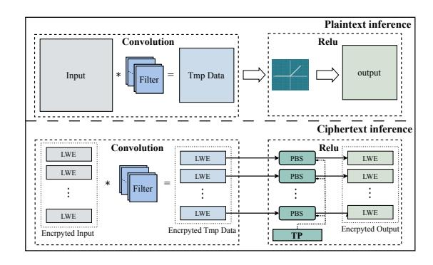

# B. GPU Architecture

Modern GPGPUs integrate many parallel streaming multiprocessors (SMs), each containing multiple streaming processors (SPs), also known as CUDA cores. As shown in Fig. 1, all SPs, including CUDA cores and Tensor Cores, access data through the L1 cache and scratchpad memory (SPM), also called shared memory. All SMs communicate through a unified L2 cache, where each memory request corresponds to a 128-byte cache line. For example, the NVIDIA A100 has 108 SMs, each with 192 KB of combined L1 cache and SPM, and all SMs share a 40 MB unified L2 cache [22].

This hierarchical memory organization largely determines GPU performance, as many workloads are bound by memory bandwidth and latency rather than compute capability. On a cache miss, data is fetched from global memory through the L2 and L1 caches before reaching the SPs, introducing significant latency. Therefore, efficient memory access patterns, including locality, cache reuse, and coalescing, are essential for high throughput.

As shown in Fig. 1, GPU workloads are expressed as multiple kernels for execution. Each kernel contains multiple thread blocks (CTAs), which are scheduled onto SMs and share on-chip resources within the same CTA. Each CTA is further divided into warps, usually with 32 threads executing in SIMT fashion. Since pipeline efficiency depends strongly on warp scheduling and stall handling, warp behavior is a key factor in overall performance. During execution, a warp may stall because of long-latency operations such as memory accesses. The scheduler hides this delay by switching to another ready warp, but when many warps wait for memory at the same time, the stall cannot be fully masked, reducing streaming processor utilization. Therefore, minimizing warp stalls and improving memory efficiency are essential for high GPU throughput. In this paper, we analyze warp behavior in TFHE execution, identify key bottlenecks, and propose optimizations to improve TFHE kernel throughput on modern

In NVIDIA CUDA, a warp is the basic scheduling unit and consists of 32 parallel threads. These threads follow the SIMT model and execute the same instruction in lockstep. Although efficient, performance can drop when warp divergence occurs, that is, when threads take different controlflow paths and must execute serially. Therefore, efficient GPU algorithm design aims to keep execution paths within a warp as coherent as possible. Warp-Matrix Multiply-Accumulate (WMMA) is a CUDA API that exposes the Tensor Cores on modern NVIDIA GPUs. Tensor Cores accelerate matrix multiply-accumulate operations of the form  $D = A \times B + C$ . A WMMA instruction is executed cooperatively by an entire warp, with 32 threads processing a small matrix tile together. The tile dimensions, denoted by (M, N, K) for  $D_{M \times N} =$  $A_{M\times K}\times B_{K\times N}+C_{M\times N}$ , depend on the data precision. For example, half-precision supports  $16 \times 16 \times 16$  tiles, while double-precision is limited to smaller  $8 \times 8 \times 4$  tiles.

#### C. Tangent FFT Algorithm for Negacyclic Convolution

Polynomial multiplication in the ring  $\mathcal{R}_q = \mathbb{Z}_q[X]/(X^N+1)$  is a core and expensive operation in lattice-based FHE. This multiplication corresponds to a **negacyclic convolution**, which can be accelerated from  $O(N^2)$  to  $O(N\log N)$  using FFT-based techniques. However, a standard FFT computes cyclic convolution (modulo  $X^N-1$ ), so a specialized transform is required.

We adopt the Tangent FFT [2, 3, 21], which reduces the negacyclic convolution to a standard complex FFT of size N/2 with lightweight pre- and post-processing. Compared to other approaches (e.g., doubling the polynomial length to 2N), the Tangent FFT yields simpler and fully parallelizable auxiliary operations, making it well suited for GPU execution.

**Forward transform.** Given the coefficient vector  $\mathbf{a}$  of length N, the forward Tangent FFT is defined as

$$\mathbf{c} = \text{TFFT}[\mathbf{a}] = \text{FFT}_{N/2}[\mathbf{b}],$$

where b is a complex vector of length N/2 constructed by

$$b_j = (a_j - i \cdot a_{j+N/2}) \cdot \omega^j, \quad j \in [0, N/2),$$

and  $\omega = e^{-i\pi/N}$  is a primitive 2N-th root of unity.

**Inverse transform.** The inverse Tangent FFT recovers the coefficients from the transformed representation **c**:

$$\mathbf{b} = (IFFT_{N/2}[\mathbf{c}])^*,$$

$$a_j = \operatorname{Re}(b_j \cdot \omega^j), \quad a_{j+N/2} = \operatorname{Im}(b_j \cdot \omega^j), \quad j \in [0, N/2).$$

**Negacyclic convolution.** Using this transform pair, the negacyclic product of two polynomials with coefficient vectors  ${\bf u}$  and  ${\bf v}$  is computed as

$$\mathbf{c} = \mathrm{ITFFT}\big[\mathrm{TFFT}[\mathbf{u}] \circ \mathrm{TFFT}[\mathbf{v}]\big],$$

where o denotes element-wise multiplication.

## D. The Four-Step FFT Algorithm

The four-step FFT¹ is a cache-friendly variant of the Cooley–Tukey algorithm that restructures a large 1D DFT into smaller, independent sub-transforms on a 2D data layout, enabling efficient parallelization.

**Overview.** Let the DFT size be  $N=n_1\times n_2$ . The input sequence is arranged into an  $n_1\times n_2$  matrix, and the algorithm proceeds in four stages: (1)  $n_2$  column-wise FFTs of size  $n_1$ ; (2) element-wise twiddle factor multiplication; (3) matrix transposition; and (4)  $n_1$  row-wise FFTs of size  $n_2$ .

**Derivation.** The standard DFT is defined as

$$X[k] = \sum_{j=0}^{N-1} x[j] W_N^{jk}, \quad W_N = e^{-2\pi i/N}.$$
 (3)

Using the index mappings  $j = j_1n_2 + j_2$  and  $k = k_1 + k_2n_1$ , the DFT decomposes as

$$X[k_1 + k_2 n_1] = \sum_{j_2=0}^{n_2-1} \left[ \left( \sum_{j_1=0}^{n_1-1} x[j_1 n_2 + j_2] W_{n_1}^{j_1 k_1} \right) W_N^{j_2 k_1} \right] W_{n_2}^{j_2 k_2}$$
(4

where the inner sum corresponds to the column-wise FFTs (step 1),  $W_N^{j_2k_1}$  is the twiddle factor (step 2), and the outer sum corresponds to the row-wise FFTs (step 4). The transposition (step 3) reorders the data between the two stages of subtransforms to maintain memory locality.

Tensor Core affinity and recursive decomposition. A key property of the four-step FFT is that the column-wise and row-wise sub-transforms are batched DFTs, each expressible as a matrix-matrix multiplication. This matrix formulation maps naturally onto GPU Tensor Cores. Furthermore, the decomposition is inherently recursive: each sub-DFT of size  $n_1$  or  $n_2$  can itself be decomposed via the four-step procedure with a chosen radix, enabling a hierarchical breakdown.

&lt;sup>1In this context, we refer to the decomposition base in the 4-step FFT as the radix. For instance, a decomposition with a base of 8 is referred to as radix-8

Fig. 2: TFHE-encrypted neural network.2

