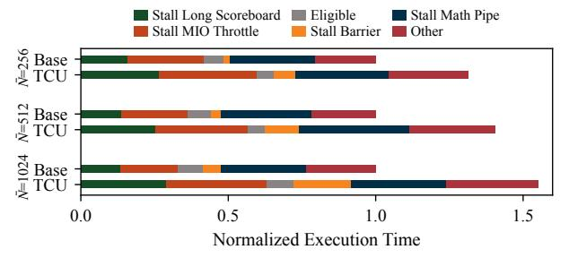
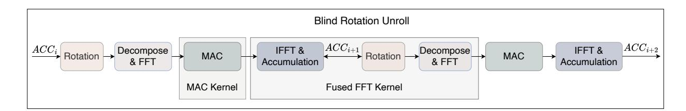

# III. MOTIVATION

#### A. Pipeline Stalls from Excessive Off-SM Memory Access

As discussed in the previous section, warp-level execution behavior critically affects overall application performance. Fig. 3 presents a statistical breakdown of pipeline stalls in the PBS kernel—the most time-consuming component—under various parameter configurations. Our analysis reveals that stall\_long\_scoreboard dominates the execution, accounting for over 50% of total runtime across most settings. This stall type primarily arises from frequent memory dependencies resulting from intensive bootstrapping key

2For clarity, this figure illustrates only the direct mapping between plaintext and ciphertext operations, omitting auxiliary techniques such as bit-width management (e.g., bit-removal rounding).

Fig. 3: PBS stall breakdown.

accesses. When combined with stall\_MIO\_throttle, memory-dependency stalls exceed 60% of the total execution time, confirming that PBS is predominantly memory-bound. Although the Para-E and Para-F configurations partially mitigate these stalls, they introduce a higher proportion of stall\_MIO\_Throttle events, which are triggered by contention on shared memory and L1 cache operations. Overall, these results indicate that memory access latency remains the primary performance bottleneck of the PBS kernel, even under optimized configurations.

To alleviate stalls induced by memory access latency, prior research has explored batching techniques to enhance computational efficiency through data reuse [8, 10]. In TFHE-based applications, batching naturally arises since ciphertexts within the same convolutional layer share identical parameters and can thus execute PBS operations concurrently. However, our findings reveal that even with batching enabled in existing implementations [42], data reuse remains insufficient, resulting in frequent pipeline stalls. To understand this inefficiency, we analyzed the GPU's internal data movement during the execution of a representative CNN layer. As illustrated in Fig. 4, the data transferred from the L2 cache to the L1 cache far exceeds that from global memory to the L2 cache. This observation indicates that data—primarily the PBS key—loaded from global memory is repeatedly fetched from the L2 cache but not effectively retained within the SM's storage (i.e., L1 cache or shared memory). Such redundant L2 accesses incur additional latency, further reinforcing the memory-bound bottleneck that constrains PBS performance.

These observations indicate that, although batched ciphertexts execute PBS operations with identical parameter configurations during encrypted inference, data reuse is far from fully exploited. The large bootstrapping key—shared across all ciphertexts—becomes "hot data" simultaneously accessed by multiple SMs, turning the L2 cache bandwidth and latency into the dominant system bottleneck. In practice, current batching mechanisms provide only L2-level reuse, failing to promote SM-level data locality, where high-throughput reuse would yield the most benefit. This insight motivates the need for a memory-locality-aware PBS design that explicitly coordinates data reuse across SMs, minimizes redundant key movement, and ultimately enhances the throughput of encrypted neural network inference.

Fig. 4: Memory traffic in DeepCNN application.

Fig. 5: Normalized FFT execution time and stall breakdown. The 'Base' and 'TCU' labels denote the implementations using CUDA Cores and Tensor Cores, respectively. The FFT length is denoted by  $\bar{N}$ , which is set to half of the PBS parameter ( $\bar{N}=N/2$ ). All results are normalized to the 'Base' performance for each respective  $\bar{N}$ .

#### B. Inefficient Tensor Core Utilization

Tensor Cores are the most powerful compute units on modern GPUs and also occupy the largest portion of the chip area [44]. However, their potential remains largely underexplored for accelerating TFHE workloads. Prior studies have begun to map the Number Theoretic Transform (NTT) onto Tensor Cores [8, 10]. In contrast, the FFT computation in TFHE requires higher numerical precision (FP64), making a direct mapping onto Tensor Cores more challenging.

Our findings highlight an important optimization opportunity: improving memory locality and enhancing SM-level data reuse to fully unleash the computational capability of Tensor Cores for FFT acceleration.

#### IV. DESIGN

#### A. Framework Overview

We present *MNEMOS*, a novel design for the TFHE PBS procedure. The proposed kernel structure is depicted in Fig. 6. To clearly illustrate our cross-iteration kernel design, the Blind Rotation loop is unrolled for two iterations. Fig. 7 details the tiling method for the MAC kernel. For clarity, the Tiled Bootstrapping Key is abbreviated as TBSK, and the tiled GLWE is abbreviated as TGLWE.

#### B. Memory-aware Algorithm Optimization

MAC operation constitutes a significant memory-intensive bottleneck in our pipeline. This is primarily attributed to two factors. First, the BSK is pre-computed and reused across PBS

operations within a batch, rather than being generated on-thefly. Second, performing the MAC operation for a single set of GLWE requires fetching a volume of BSK data that is (k+1) times larger than the GLWE data itself. We observed a critical opportunity for optimization: within the same iteration, different PBS instances all access an identical portion of the BSK. This observation inspired our core design principle—to compute a single BSK against multiple GLWEs concurrently. However, a naive approach of caching the entire BSK in shared memory to facilitate this reuse is impractical. Such a strategy would lead to excessive shared memory consumption, drastically reducing GPU occupancy. Furthermore, on architectures like the NVIDIA A100, where the L1 cache and shared memory share the same physical hardware, heavily favoring shared memory allocation can cannibalize the L1 cache capacity, resulting in diminished L1 hit rates. For certain cryptographic parameter sets, the required BSK size even exceeds the maximum available shared memory, rendering this approach infeasible.

To circumvent the aforementioned memory constraints, we propose a tiling methodology. We leverage the fact that the multiplication between the BSK and the Fourier Coefficients is an element-wise Hadamard product. This property obviates the need for a single thread block to hold the entire BSK; instead, it only needs to process a corresponding tile of the BSK against a tile of the GLWE. This decomposition reduces the perthread-block memory footprint, thereby enabling numerous GLWE MAC operations to be processed concurrently within a single kernel launch and substantially improving BSK data reuse (Fig. 7). A further critical consideration for this memorybound kernel is ensuring coalesced access to global memory to maximize bandwidth utilization. However, the output data layout from the preceding FFT stage is not naturally contiguous for our tiling scheme, and performing an explicit data reorganization would introduce prohibitive overhead. Our solution is to strategically define the tile geometry rather than altering the data layout. Specifically, by defining a tile to consist of a small number of contiguous elements from the original data—for instance, two consecutive complex FP64 elements (16 bytes each)—we can ensure that each memory access naturally forms a 32-byte segment. This aligns with the GPU's memory transaction granularity, thus guaranteeing fully coalesced memory access.

The selection of the tile size presents a trade-off between memory access efficiency and data reuse. On one hand, to maximize global memory bandwidth, the access pattern should align with the GPU's memory transaction granularity. For modern NVIDIA architectures, memory transactions are optimally serviced in 128-byte segments. Tile sizes corresponding to 32, 64, or 128 bytes (equivalent to 2, 4, or 8 complex FP64 elements, respectively) are viable candidates for achieving coalesced access. On the other hand, the tile size inversely affects the degree of BSK reuse. A smaller tile size allows for a larger number of thread blocks to collaboratively process a single BSK tile, thereby increasing its reuse factor. However, our analysis indicates that the bandwidth for BSK access, after

Fig. 6: Kernel design overview. The blind rotation loop is shown with two unrolled iterations, highlighting cross-iteration kernel fusion. The fused kernel improves locality by reusing IFFT outputs and precomputed constants across several consecutive FFT computations.

Fig. 7: BSK reuse design. Colors are used to indicate the memory region where the data is stored. TBSK and TGLWE represent the **tiled** Bootstrapping Key and the **tiled** GLWE ciphertext, respectively. A single thread block reads the same tile from a batch of GLWE. The total number of tiles is denoted by t, and the symbol ⊙ represents the Hadamard product.

initial reuse optimizations, is no longer the primary bottleneck compared to the access of the Fourier Coefficients. Therefore, we prioritize a larger tile size to improve instruction-level parallelism and reduce loop overhead within each thread. Based on this trade-off analysis, we determined that a tile size of 8 (128 bytes) yields the optimal performance, and it is adopted in our final design.

