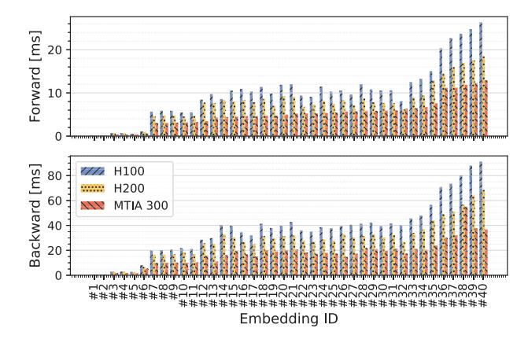
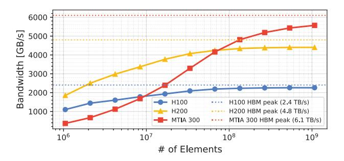

# *A. Compute Operations*

To begin, we assess compute performance using several microbenchmarks.

Embedding performance: Embedding operators, particularly table-batched embedding [36], are important computational components in the sparse portions of DLRMs. As shown in Figure 12, our evaluation of embedding operator performance across various shapes and input distributions from production workloads demonstrates MTIA 300's strong performance: MTIA 300 achieves 2.0× and 1.6× speedups for forward operations and 2.1× and 1.6× speedups for backward operations (geometric mean) compared with H100 and H200, respectively. This high performance is enabled by MTIA 300's high memory and cache bandwidth, as well as its specialized functional units, such as radix sort, which accelerate embedding operators. We note that embedding performance does not scale linearly with HBM bandwidth and therefore does not

Fig. 12: Performance of forward and backward table-batched embedding operations.

Fig. 13: Memory bandwidth achieved by a kernel performing BF16 additions.

reach a 2.5× speedup compared with H100. Skewed input data, where most indices reference the same feature, often causes embedding operators to become cache-bound or instructionbound rather than memory-bandwidth-bound.

Memory bandwidth: Figure 13 illustrates the memory bandwidth for element-wise addition on MTIA 300, H100, and H200 using a simple BF16-add kernel across various tensor sizes. The results show that MTIA 300 reaches up to 5.57 TB/s for large data sizes (91% of its peak HBM bandwidth), surpassing the H100's 2.26 TB/s (94%) and H200's 4.40 TB/s (92%). While MTIA 300 shows comparable HBM efficiency and higher bandwidth for large memory operations, it shows lower performance for fine-grained kernels. We discuss this per-kernel latency in Section VI.

GEMM performance: GEMMs are a major component of the dense layers in DLRMs. Figure 14 shows BF16-GEMM performance across various sizes encountered in production. The results indicate that MTIA 300 performs well on smaller, memory-bound GEMMs due to its high memory bandwidth. However, for larger matrices, MTIA 300 shows lower performance, limited by its peak FLOPS. When the arithmetic intensity exceeds 400 bytes/FLOPS, H100 achieves 63% efficiency, compared with MTIA 300's 59% for the tested shapes,

Fig. 14: GEMM performance versus roofline for MTIA 300, H100, and H200.

though MTIA 300's is higher than H200's 54% efficiency. Since MTIA 300 reaches over 90% efficiency on favorable shapes in our microbenchmarks, this lower efficiency is due to our GEMM library, which still needs further optimization. We discuss further kernel optimizations in Section VI.

## *B. Collective Operations*

This section compares the performance of three widely used collectives in production training models: AllGather, AllReduce, and AllToAll. Figure 15 shows their normalized latencies on MTIA 300 and H100 across varying numbers of accelerators. MTIA 300 generally demonstrates superior performance for all three collective operations within the message size ranges used by our models (denoted by the "*Time %*" in Figure 15). This speedup is particularly notable when using 16 or more accelerators or message sizes over 16 MB, which we attribute to MTIA 300's larger scale-up domain size and 2.2× higher scale-up bandwidth. For small message sizes, H100 with NCCL currently tends to outperform MTIA 300 with HCCL. We have not yet fully optimized the software stack for small messages, as they currently account for only a small percentage of the wall-clock time in the training workloads we actively run on MTIA 300.

