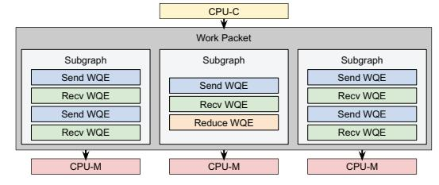
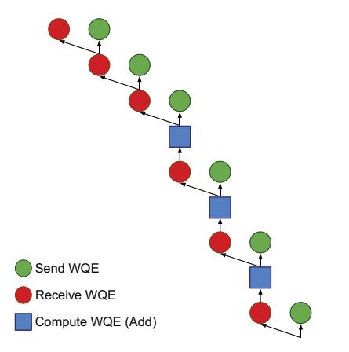

# A. Rack System

As models evolve rapidly, we aim to provide a flexible system architecture that accommodates last-minute changes, compensating for the slower silicon development process where decisions are made well in advance. To this end, we designed the MTIA training system with separate compute and network blades. Each MTIA training chassis contains 16 compute blade slots and six network blade slots, all connected via a pair of cable backplanes. Not all network blades need to be installed. The compute blades are placed vertically to minimize the size of the cable backplane, a historically sensitive component in terms of machining precision.

We design two types of network blades for scale-up and scale-out. The scale-up blade uses an ASIC chosen for its lower latency and power consumption, and multiple racks can be combined to form larger scale-up domains. The scale-out blade supports a disaggregated scheduled fabric that avoids hot links by using packet spray, while ensuring in-order packet delivery as well as providing reliability via a fabric-level, end-to-end credit mechanism. Each blade delivers 200 GB/s of I/O per compute blade, and the number of blades used can be configured according to the chosen scale-up or scale-out setup. Both blades are liquid-cooled.

The compute blade consists of a single CPU with 512 GB of RAM and one MTIA 300 accelerator. The 1:1 mapping keeps nodes simple, accommodating unpredictable CPU demands and avoiding PCIe contention. Both the CPU and accelerator are liquid-cooled.

Fig. 7: Network architecture.

#### B. Network Design

MTIA 300's network architecture is shown in Figure 7. The scale-out network provides 200 GB/s of bandwidth, while the scale-up network currently offers 800 GB/s per accelerator, with the option to reach 1 TB/s. This approach optimizes power consumption and cost based on the requirements. We use a scale-up domain of 16 nodes (one rack) and a first-level scale-out domain of 4,096 nodes, with the option to add a second-level switch network to expand the scale-out domain to 16K nodes or more if needed.

#### IV. SOFTWARE STACK

Figure 8 shows MTIA 300's software stack, which delivers a PyTorch-native experience. It supports a broad range of PyTorch libraries such as FSDP2, DTensor, TorchRec, and XFormers for rapid development of training and inference solutions. It uses the latest PyTorch stack with TorchDynamo for graph capture and TorchInductor for Triton code generation. It supports both eager and graph modes, offers a CUDA-compatible runtime API, and allows kernel authoring in C++ or Triton. We also leverage coding agents for automated kernel generation [13], [21].

The MTIA compiler, built as a custom PyTorch backend, traces forward graphs with TorchDynamo and generates backward graphs via AOTAutograd. It applies MTIA-optimized operator decompositions and supports both handwritten pattern-based fusion and compiler-driven fusion through TorchInductor. It implements a suite of memory optimizations tailored for training workloads. For example, its graph scheduler uses heuristics (e.g., integer linear programming) to reduce peak memory pressure in each training iteration. In addition, the compiler performs activation rematerialization to enable larger effective batch sizes and improve HBM utilization.

A notable distinction from GPUs is MTIA's ability to capture compute and collective operations in a single graph. Collectives traced via torch.export or torch.compile are compiled into one monolithic graph along with compute operators. This lowers sub-graph launch overhead, improving efficiency and determinism. Dependencies between compute and communication are managed via semaphores. Currently,

Fig. 8: MTIA 300 software stack.

Fig. 9: An example of mapping work from CPU-C to CPU-Ms.

statically shaped collectives are fully supported, with ongoing work for dynamically shaped collectives and device-resident AllToAll with dynamic send/recv counts.

Compared with GPUs, MTIA 300 features Message Engines (MEs) for communication offloading and network chiplets for integrated NICs, enabling efficient communication without PCIe traffic or host/PE involvement. To leverage these hardware features, our collective communications library, called HCCL (Section IV-B), uses the MTIA streaming interface to submit all communication operations. Internally, HCCL uses RDMA verbs to drive the network chiplets.

To manage stream order, the control core (CPU-C) was extended from MTIA-2i to dispatch work for both the PE grid and the MEs. Work arrives at the control core in packets containing compute and/or communication tasks; the core ensures dependencies are met before dispatch. Work packets for communication may include multiple subgraphs, which HCCL maps to MEs for parallel execution. Each ME can run multiple subgraphs concurrently; thus, the 16 MEs can handle many subgraphs in parallel. Upon completion, the MEs report status back to the control core to unblock subsequent work.

## A. Collective Graph Processing

Figure 9 shows an example of dispatching subgraphs to the CPU-Ms. Subgraphs are represented as arrays of work queue entries (WQEs), each describing an operation of one of several types, examples include: SEND, RECV, WRITE, WAIT, SET, REDUCE. Some map directly to RDMA work requests (i.e., SEND, RECV, and WRITE) with similar fields and semantics (e.g., queue pair ID, local and target address, length, lkey, rkey, etc.). The SET WQE writes a value to local memory (HBM or cache), while the WAIT WQE stalls until a comparator on a memory location is satisfied (e.g., wait for address  $0 \times abcdef > 10$ ). The REDUCE WQE performs a sum operation,  $S = A + 10 \times 10^{-1}$ 

Fig. 10: Example of an AllReduce ring algorithm with 4 nodes.

B, where S can overlap with A or B, or optionally performs a memory copy, acting like a DMA engine.

WQEs also include internal fields to aid processing. Flow control fields define ordering between WQEs, enabling common communication patterns such as rings, recursive doubling, and ordered trees. These are the fields that can be defined to specify ordering:

- wqe\_sync: Do not issue this WQE until the specified previous WQE (counting backward from the current one) has completed.
- fence: Do not issue any additional WQEs until this one completes.
- rx\_sync: Wait for all outstanding receive WQEs to complete before issuing this one.
- sync: Wait for all previous WQEs to complete before issuing this one.

The near-memory compute (NMC) engine (Section II-D) efficiently performs reductions. Its proximity to cache and HBM enables it to execute the essential operations for AllReduce or ReduceScatter without using the PE grid, minimizing resource sharing between communication and compute operations.

Putting it all together, Figure 10 illustrates a simplified AllReduce ring algorithm [29] which takes place in a ReduceScatter phase and AllGather phase translated into WQEs with dependencies. Reading from bottom to top, the first receive and send have no dependencies and can be posted in parallel. The subsequent add operation depends on the preceding receive, which then unblocks the next receive and send. This repeats until all data is locally reduced (the ReduceScatter phase). The final three steps depict the AllGather phase, where each step depends on the previous for data movement.

