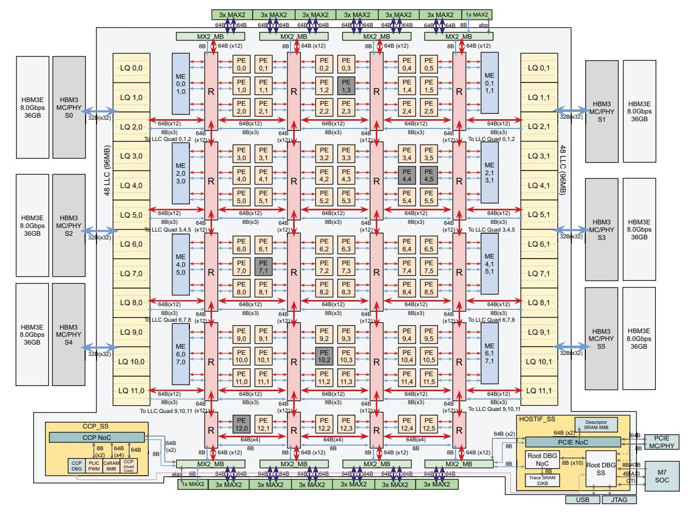

# B. MTIA 300 Compute Chiplet

Figure 2 shows the MTIA 300 compute chiplet architecture. It consists of a 12×6 grid of Processing Elements (PEs) for computation and 16 Message Engines (MEs) for collective operations. On the east and west sides, SRAM banks can be used as last-level cache (LLC) or last-level scratch (LLS). Each side connects to 3 twelve-high HBM3E stacks. The PEs are connected to each other and to on- and off-chip memory through a mesh interconnect.

**Network-on-Chip (NoC):** The NoC is a 2D mesh of routers that connects PEs and MEs within the main grid. It also links the compute chiplet to control and host interface blocks, as well as to the chiplet interface IP blocks on the north and south edges, which attach to the network chiplets. The NoC provides channels for data, control, utility (e.g., register access and debug), synchronization, and reductions. To improve performance and scalability, we introduce cluster routers that connect six PEs locally, reducing total hop latency. Unlike MTIA-2i, the compute chiplet does not use a memory crossbar; instead, the NoC handles bank selection routing. It implements L-routing—first traveling along one dimension (e.g., X) and then along the other (Y)—to distribute traffic evenly across the grid, and it uses virtual lanes to avoid deadlocks.

Fig. 2: Architecture of the MTIA 300 compute chiplet.

**Host Interface:** MTIA 300 provides a high-performance host interface with PCIe, DMA, and a secure boot processor. It includes interfaces for host management of the compute and network chiplets, as well as a debug interface.

**Control Core:** This is a RISC-V quad SMP core coordinating execution across the PEs and MEs. It includes the associated context RAM, mailbox registers, and MSI-X interrupts.

**Redundancy:** To improve yield for a reticle-limited die, the compute chiplet includes a redundant row of PEs. Because PEs consume the most area and distributed memory, and given the east-west organization of memory and the NoC routing paths, adding a redundant row is the simplest solution. Each PE column can tolerate one faulty PE by replacing it with the corresponding PE in the redundant row. This is configured at boot, remains transparent to software, and does not impact NoC performance.

