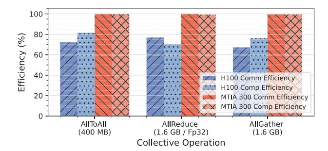

# *C. Overlapping Compute and Collective Operations*

MTIA 300 features a hardware architecture that offloads collective operations, effectively minimizing the performance impact on compute kernels during concurrent execution. To evaluate the interaction between compute kernels and collectives, we developed a microbenchmark that runs 1,000 TF32 GEMMs of size 4K × 4K × 4K while simultaneously executing various collective operations with representative message sizes across 16 accelerators. Figure 16 shows the efficiency of computation and communication when performed in parallel; 100% efficiency indicates that the platform achieves the same performance as when running only computation or only communication operations. MTIA 300 sustains high efficiency for both, demonstrating minimal interference between the two. This is enabled by dedicated message engines and nearmemory compute units, which process collective operations independently from the main compute engines. In contrast, H100 experiences contention for streaming multiprocessors

Fig. 15: Performance of collective operations. "*Time%*" represents the ratio of execution time for collectives with different message sizes in our workloads.

Fig. 16: Performance degradation due to concurrent execution of collectives and computation.

when collectives and computation are executed concurrently, resulting in notable performance degradation. MTIA 300's ability to decouple collectives from computation is particularly beneficial for DLRMs, which rely on frequent collective operations for distributed training.

