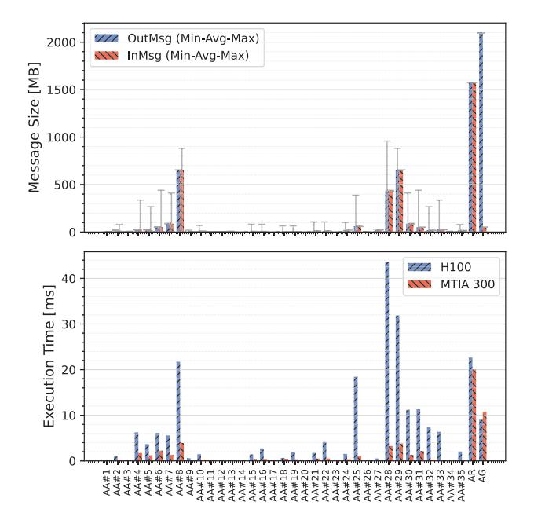

# *D. Production Training Workload*

MTIA 300 has demonstrated promising results on production training workloads. This section examines MTIA 300's performance when training a DLRM model [26], which contains approximately 150 billion parameters (with 99% in the

Fig. 17: Message sizes and latencies of collective operations across the 40 accelerators used in training. AA, AR, and AG denote AllToAllv, AllReduce, and AllGather, respectively.

sparse component). Training a single sample requires roughly 3 billion floating-point operations. We implemented the model using TorchRec [14] and fully compiled it with PyTorch's graph compiler, TorchInductor [2], on both MTIA 300 and H100 to maximize performance. The model uses the distributed Shampoo [32] optimizer and is parallelized via a distributed data-parallel scheme.

*1) Collectives:* To compare collective execution times, we configured the model using 40 accelerators with a local batch size of 6,144. Figure 17 illustrates the message statistics and latencies for each training iteration. As shown in the first chart, AllReduce and AllGather operations handle substantial data, with incoming messages of 1.6 GB and 2.1 GB, respectively. However, the 35 AllToAllv operations present a unique performance challenge; they involve sparse-data distributions with highly variable message sizes ranging from 1 KB to 1 GB. The second chart demonstrates MTIA 300's superior performance over H100 for large-scale AllToAll and AllReduce operations. Overall, MTIA 300's communication performance exceeds that of H100 by 3.9×.

*2) End-to-end training performance:* While models implemented for GPUs can run directly on MTIA 300, performance is maximized when models are co-designed with its architecture. Below, we highlight three co-design strategies that collectively enable MTIA 300 to achieve a 1.42× higher Perf/TCO than H100 for the DLRM model.

CPU offloading for Shampoo. The matrix eigendecomposition operator is a compute-intensive component of the Shampoo optimizer's preconditioning step. While

TABLE IV: Perf/TCO with different local batch sizes.

| Local batch size | Accelerators  | Normalized Perf/TCO (higher is better) |
|------------------|---------------|-------------------------------------------|
| 6144             | 40 × H100     | 1.00                                      |
| 6144             | 40 × MTIA 300 | 1.39                                      |
| 10240            | 24 × MTIA 300 | 1.42                                      |

H100 utilizes the cuSOLVER library for this operation, implementing a numerically accurate and efficient version on MTIA 300 is difficult due to performance-accuracy trade-offs. However, MTIA 300's 1:1 host-to-accelerator ratio enables offloading these computations to the host CPU, ensuring sufficient numerical precision. In contrast, using a 1:8 ratio (typical of H100 systems) would incur a 7.8% performance loss, underscoring the advantages of MTIA 300's balanced architecture.

Disable quantized communication. Since this model was originally optimized for H100, it enables row-wise FP8 quantized communication by default to reduce data volume. However, on MTIA 300, this process relies on inefficient RISC-V operations rather than native support. By disabling FP8 quantization and leveraging MTIA 300's high network bandwidth, we avoid these resource-intensive operations and achieve a 4.4% performance improvement.

Large training batches. Increasing the local batch size on MTIA 300 optimizes distributed training performance. By enlarging the local batch size, we can reduce the number of trainers while maintaining a constant global batch size, thereby improving kernel granularity and minimizing communication overhead. Table IV compares Perf/TCO across different local batch sizes. MTIA 300's substantial HBM capacity supports larger batch sizes, such as 10,240, which increases Perf/TCO by 2% over the 6,144 baseline used for H100. Leveraging MTIA 300's memory to increase local batch size is thus an effective strategy for boosting training efficiency.

Future optimization opportunities. We aim to further enhance performance through several targeted optimizations. Beyond refining kernels for GEMM and small collective operations, we are developing strategies tailored to MTIA 300's unique hardware. This includes a TorchRec sharding strategy specialized for MTIA 300's performance profile, leveraging its distinct kernel, communication, and memory trade-offs to reduce load imbalance and iteration time. Additionally, we are exploring kernel co-location within the same grid—rather than sequential execution on a 12×6 grid—to increase PE utilization. Together, these optimizations are expected to improve MTIA 300's efficiency and throughput.

