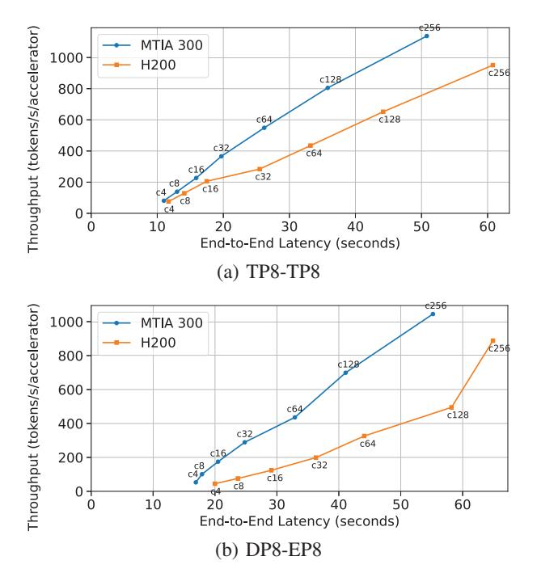

# *E. LLM Inference*

While MTIA 300 was originally optimized for training DL-RMs, it is also effective for serving Large Language Models (LLMs). For this study, we use H200 as the reference platform instead of H100, as H100's HBM capacity is insufficient to run the DeepSeek-R1 model [9] used in the evaluation. We use

Fig. 18: Performance of DeepSeek-R1 inference on MTIA 300 and H200. The "CL" values on the curves denote different concurrency levels L.

InferenceMax [5], an open-source LLM inference benchmark, running on the vLLM inference runtime [20]. Attention and KV-cache are stored and computed in BF16, while mixtureof-experts (MoE) computation uses FP8; these precisions are natively supported on both MTIA 300 and H200. We focus on an online short-prompt scenario: each request draws its input and output lengths independently and uniformly at random from [0.8×1024, 1024] tokens. These are tested across a sweep of batch sizes (concurrency levels from 4 to 256), measuring throughput (tokens/sec) and latency.

Because a single accelerator cannot host the full model, we evaluate 8-accelerator configurations on both platforms (8 × MTIA 300 and 8 × H200). We consider two sharding strategies: TP8-TP8 (tensor parallelism applied to both attention and MoE across 8 accelerators) and DP8-EP8 (data parallelism for attention components combined with expert parallelism for MoE). In TP8-TP8, each layer's weight matrices are sharded across all 8 devices; every device computes a slice of each operation and synchronizes via AllReduce after each parallel region. In DP8-EP8, the dense layers (attention and shared MLPs) are replicated across all 8 devices, with each device processing an independent batch of requests, while the MoE portions are partitioned so that each device owns 1/8th of the experts and tokens are routed between devices via AllToAll communication. For this evaluation, we configured the servers using mixed batching.

Figure 18 shows the performance on MTIA 300 and H200, where the x-axis denotes the client-side end-to-end latency of each request and the y-axis denotes the total token throughput per accelerator. The results demonstrate that MTIA 300 outperforms H200 overall on the InferenceMax benchmark. In this configuration, execution time is decode-dominant, allowing MTIA 300 to leverage its high HBM bandwidth and outperform H200 at high concurrency levels (over 64). However, the performance gap is not uniform across all operating points; the gap is smaller at low concurrency levels. This is due to MTIA 300's higher small-batch communication overhead compared with the fast intra-node communication on H200 via NVLink, as well as certain kernels not being fully parallelized beyond the batch/token dimension, which leads to the underutilization of PE cores on MTIA 300.

