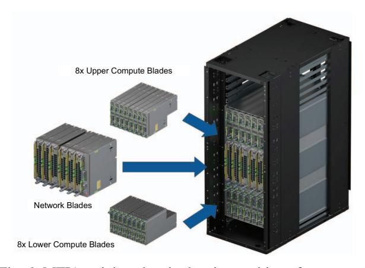

# E. MTIA 300 Network Chiplet

To avoid the PCIe overhead, we directly integrate RDMA NICs (based on third-party NIC IP) into the MTIA 300 package as network chiplets, as shown in Figure 4. Each of the two network chiplets contains six custom 800 Gbps (100 GB/s) RDMA IP blocks, providing 600 GB/s throughput per chiplet. We use a die-to-die interface and 112G SerDes to achieve high bandwidth density. The custom RDMA IP blocks are optimized as follows.

**Express Doorbells**: To minimize transaction-posting latency, we introduce "express doorbells," which use the work request (WR) itself as the doorbell write, avoiding an additional HBM ring-buffer read (800 ns per transaction). With express doorbells, each IP block supports up to 24,576 outstanding work requests divided among 1,024 Queue Pairs (QPs).

**Removal of QP caching:** We remove QP caching, as it consumes significant chip area. This limits each NIC chiplet to 1,100 active QPs, well beyond our workload requirements, which typically involve only a few hundred ranks.

Simplified packet processing pipeline: Typical NICs support many features, such as virtual switching and TC offloads (e.g.,

Fig. 6: MTIA training chassis showing position of compute & network blades.

cls\_flower), which we do not need. Removing them simplifies the packet processing pipeline.

**AXI steering tag:** By supporting custom steering tags, we can leverage features like separate cache partitions in the compute chiplet for different traffic types.

#### III. SYSTEM ARCHITECTURE: RACK AND NETWORK

