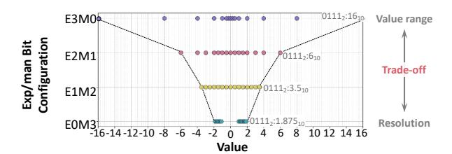
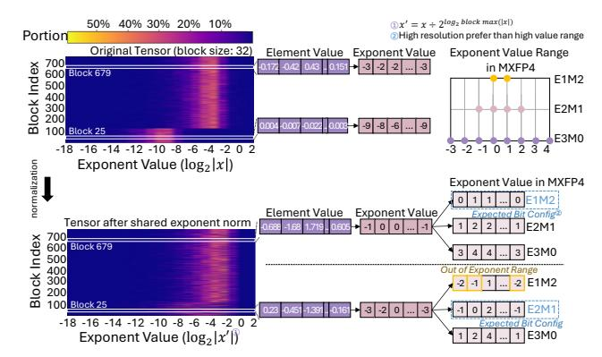
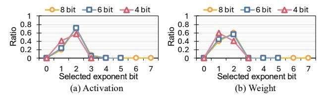
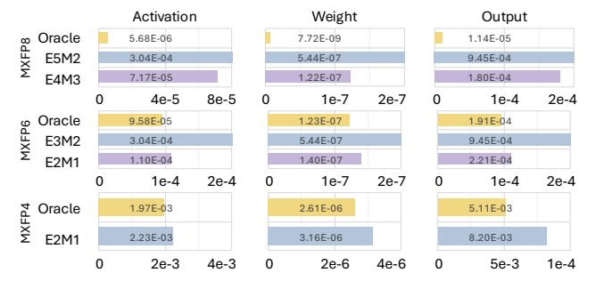
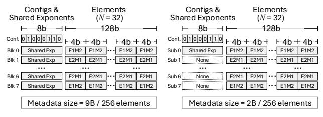

# MXFFP: Microscaling Flexible Floating Point Format for Large-Scale AI Model Acceleration

Sungwoo Kim\*†

Yonsei University
Seoul, Republic of Korea
sungwoo.kim@yonsei.ac.kr

Hyunwuk Lee Yonsei University Seoul, Republic of Korea hyunwuklee0519@gmail.com

Mingu Jung

Yonsei University
Seoul, Republic of Korea
mingu.jung@yonsei.ac.kr

Sungbin Kim\*

Yonsei University
Seoul, Republic of Korea sungbin.kim@yonsei.ac.kr

Junsung Kim Yonsei University Seoul, Republic of Korea junsung.kim@yonsei.ac.kr

Murali Annavaram
University of Southern California
Los Angeles, CA, USA
annavara@usc.edu

Dongho Ha§

Meta Platforms

Sunnyvale, CA, USA
dongho9601@gmail.com

Seunghyun Lee Yonsei University Seoul, Republic of Korea seunghyun.lee@yonsei.ac.kr

Won Woo Ro

Yonsei University
Seoul, Republic of Korea
wro@yonsei.ac.kr

Abstract—The rise of AI/ML applications has reignited interest in floating-point formats beyond the IEEE 754 standard, leading to innovations such as Microscaling Floating-Point (MXFP). MXFP groups values into blocks that share a common exponent, allowing them to be represented as scaled FP values. This enables a reduced memory footprint and efficient hardware execution. However, due to the trend of shrinking bit-widths and increasing block sizes, MXFP faces growing inter-block and intra-block value diversity. The limited number of exponent and mantissa bits forces a tradeoff between range and precision across blocks, while packing more values into a block amplifies the variation within each block. As a result, fewer bits with larger blocks often lead to precision loss and degraded model accuracy.

In this paper, we observe that these limitations can be addressed by flexibly assigning exponent and mantissa bits to match the value distribution of each block or element within a block, rather than relying on a single fixed MXFP configuration. Based on this observation, we propose MXFFP, a flexible numeric format that leverages diverse exponent-mantissa configurations at both the block and sub-block levels. This diversity allows MXFFP to better preserve the original value distribution, leading to higher inference accuracy for ML models even with larger block sizes. To support this format, we introduce efficient conversion mechanisms that transform FP16/BF16 values into MXFFP with a minimal runtime overhead and design a Tensor Core based hardware architecture that interprets and executes MXFFP using only a single configuration bit per block. Our evaluation shows that MXFFP significantly improves numerical accuracy, reducing perplexity by 2–5 $\times$  in 4-bit settings across multiple LLMs, while maintaining hardware performance comparable to MXFP.

## I. Introduction

Recent machine learning (ML) models have achieved remarkable success by attaining high accuracy through large

Fig. 1: Comparison of MXFP and MXFFP in various block sizes. MXFFP achieves the highest accuracy with low overhead by utilizing inter- and intra-block optimization. The shared exponent is represented in 8-bit.

model sizes [1], [4], [16], [39]. However, such models, particularly large language models (LLMs), have a large memory footprint which limits their inference performance [12], [19], [37], [50]. To reduce the memory footprint of these models, quantization has been extensively studied [3], [32], [38], [52], [63], [67]. By representing data with a low bit-width, it reduces memory capacity requirements and improves efficiency in DRAM, SRAM, and interconnect accesses, leading to higher throughput and energy efficiency.

\*Both authors contributed equally to this work.

&lt;sup>†This paper is done when the author was a visiting scholar at University of Southern California.

§ This research was done in the author's personal capacity and that the views in the paper do not represent those of Meta.

Among various quantization techniques, floating-point quantization [32], [40], [41], [52], [58], [70] has received significant attention. Floating-point formats can maintain higher accuracy even at extremely low bit-widths (e.g, 4-bit) compared to integer formats, thereby achieving high effectiveness in low-bit quantization [7], [41], [64]. Furthermore, modern accelerators (e.g., NVIDIA Blackwell GPU Tensor Cores [22], [46]) natively support extremely low-bit floating-point formats such as FP4, while integer formats such as INT4 are not supported. This architectural trend has made floating-point quantization increasingly favorable in recent designs.

One of the most notable floating point formats is the Microscaling Floating Point (MXFP) format [47], [53], developed under the Open Compute Project by AMD, Intel, Microsoft, NVIDIA, and Qualcomm. MXFP mitigates the limitations of conventional low-bit floating point formats [60], [62] (e.g, FP4) method. MXFP takes a number of FP values, called a block, and employs an 8-bit shared exponent per block. The values in the block are then represented using fewer bits of mantissa and exponent. The block is typically selected to be a collection of values that are operated on together, such as a tile of weight matrix values. By using a shared exponent across a block, MXFP expands the representable dynamic range, achieving higher inference accuracy compared to other quantization based schemes. Combined with hardware accelerators that operate efficiently on block-structured data, MXFP also enables higher inference throughput.

Recent trends in MXFP design are moving toward extremely low bit-widths (e.g., 4-bit) to reduce the memory footprint of large models. However, while the shared exponent alleviates inter-block range mismatch, extremely low bit-width formats inherently reduce both value range and resolution. As a result, different blocks require different range–resolution characteristics, leading to *inter-block value diversity* that an existing low bit-width format cannot accommodate. In addition, while larger block sizes reduce metadata overhead and improve hardware efficiency, they also increase the number of elements within each block, which in turn introduces greater variation of value distributions within each block and leads to higher *intra-block value diversity*. Consequently, these recent trends degrade model accuracy, thereby imposing inherent limitations on the MXFP format.

To address these issues, we revisit the representation of floating-point data. Floating point data can be represented using various exponent and mantissa configurations within the same bit-width, such as E3M0 (3-bit exponent, 0-bit mantissa), E2M1, E1M2, or E0M3 for a 4-bit data. We show later (Fig. 3) that such diverse representations can lead to a distinct tradeoff between value range and resolution. Thus we observe an opportunity to use different configurations across blocks, or even elements within the same block, which may provide more accurate numerical representation than a single fixed configuration as in MXFP (e.g., E2M1 in MXFP4).

We performed a detailed characterization of data format preferences for various data blocks in Llama3-8B. Our analysis reveals that the optimal configuration (exponent and mantissa bit-widths) varies significantly across different blocks of weights and activations. We demonstrate that when each block or element within each block adopts the configuration that best matches its value distribution characteristics, we can achieve higher accuracy than MXFP. (More details of this analysis are shown in Section III and in Fig. 5, Fig. 7 and Fig. 8.) This analysis provides strong motivation that such flexibility can effectively overcome the inherent limitations caused by extremely low bit-widths and large block sizes.

Motivated by this observation, we propose a new data format, Microscaling Flexible Floating-Point (MXFFP), an extension of the MXFP format that supports multiple exponent–mantissa configurations within a single bit-width, effectively addressing both inter- and intra-block diversity. Fig. 1 shows the key concept of the MXFFP. First, MXFFP resolves inter-block diversity by introducing a lightweight configuration field that allows each block to independently select its bit configuration. Second, MXFFP mitigates intra-block diversity through a sub-block structure, where large blocks are partitioned into smaller sub-blocks that share the same exponent but are allowed to use different bit configurations. By combining these two techniques our results show that MXFFP achieves higher accuracy than MXFP under the same block size.

Furthermore, since ML computations requires run-time data (e.g., input activations) and MXFFP supports multiple bit configurations, supporting MXFFP may introduce conversion overhead. To address this, we also propose an efficient conversion mechanism that uses the diversity of values within a block to select the best exponent and mantissa bit width configuration with negligible run-time overhead while preserving high accuracy.

To fully exploit the benefits of MXFFP, we also propose an MXFFP Tensor Core that extends the conventional Tensor Core design with minimal hardware modifications. Since MXFFP supports multiple exponent-mantissa configurations, we introduce a bit mapper that decodes these configurations into a unified format, enabling execution on a single-format arithmetic unit and preserving high hardware utilization. Also, we further extend the dot-product unit to operate on this unified format with only minor modifications. Through this design, MXFFP preserves the benefits of extremely low bitwidth and large block size while maintaining numerical accuracy, providing an efficient and flexible floating point format on modern accelerators.

In summary, our main contributions are as follows:

- We propose MXFFP, an MXFP-based design that enables both inter- and intra-block optimizations, achieving higher hardware efficiency and accuracy.
- We design the MXFFP Tensor Core, which efficiently integrates MXFFP into existing accelerator architectures with minimal hardware modification.
- Our evaluation shows that MXFFP significantly improves numerical accuracy, reducing perplexity by 2–5× in 4-bit settings across multiple LLMs compared to MXFP while

Fig. 2: Examples of floating point low bit-width formats. (a) Conventional 4-bit (FP4) format. (b) Scaled-numeric 4-bit (MXFP4) format.

sustaining accuracy at large block sizes with  $4 \times$  low meta-data overhead.

#### II. LOW BIT-WIDTH FLOATING-POINT FORMATS

## A. Conventional Low Bit-width Floating-point Formats

Conventional low-bit floating point formats can be processed as shown in Fig. 2(a). It quantizes the entire tensor using a single precision level (e.g., 4-bit), as depicted in Eq. 1:

$$X_{fp4}^{q} = Quant\left(\frac{X^{fp16}}{S_{fp4}^{X}}\right), \quad S_{fp4}^{X} = \frac{\max(\left|X^{fp16}\right|)}{\text{MAX}^{fp4}} \quad (1)$$

As shown in the equation, the scaling factor  $(S_{fp4}^X)$  is obtained by dividing the absolute maximum value of the original 16-bit floating-point tensor by the maximum representable value of FP4 (MAXfp4). Using this scaling factor, the tensor is quantized into the FP4 format  $(X_{fp4}^q)$ . The conventional lowbit floating point represents all elements using a uniform 4-bit which is lower than baseline 16-bit floating-point tensor, achieving high hardware efficiency. However, outliers increase the scaling factor of the tensor, causing normal elements to lose representation and resulting in low accuracy [18], [28], [66], [71].

## B. Emerging Low Bit-width Floating-point Formats

Recently, scaled numeric formats such as MXFP [13], [14], [17], [53] have emerged to address the limitations of conventional formats as shown in Fig. 2(b). It quantizes the tensor in single precision while applying quantization in a block-wise manner. In this scheme, the entire tensor is partitioned into multiple blocks, and each block utilizes an independent 8-bit shared exponent  $(E_b^{\rm shared})$ , as depicted in Eq. 2.

$$\begin{split} X_{b,fp4}^q &= Quant \left( \frac{X_b^{fp16}}{2^{E_b^{\text{shared}}}} \right) \\ E_b^{\text{shared}} &= \left| \log_2 \left( \max_b (|X_b^{fp16}|) \right) \right| - E_{element}^{\text{MAX}} \end{split} \tag{2}$$

Fig. 3: Value distribution for different 4-bit floating-point bit configurations.

In this equation,  $E_{element}^{\rm MAX}$  represents the maximum exponent value of the FP4 format used for each element in the 4-bit MXFP configuration. For the default S1E2M1 configuration (1-bit sign, 2-bit exponent, and 1-bit mantissa),  $E_{element}^{\rm MAX}$  can be derived as shown in Eq. 3.

$$Bias = 2^{2-1} - 1 = 1,$$
  
 $E_{element}^{MAX} = 11_2 - Bias = 3 - 1 = 2.$  (3)

By using block-specific shared exponents, the scaled numeric format effectively expands the representable dynamic range [32], [47], [53]. As a result, it mitigates the impact of outliers and achieves higher accuracy than the conventional low-bit floating point format [32].

#### III. MOTIVATION

A. Potential Limitations of Emerging Low Bit-width Floatingpoint Formats

Recent trends in MXFP move toward using extremely low bit-widths (e.g., 4-bit) and large block sizes (e.g., block size 256) to maximize hardware efficiency. While MXFP improves accuracy by exploiting inter-block value distribution through a shared exponent, extremely low-bit quantization reduces the available value range and resolution, which can incur interblock value diversity. In addition, although large block sizes reduce metadata overhead (e.g., an 8-bit shared exponent) and improve hardware efficiency, they increase the number of elements within each block, thereby increase intra-block value diversity.

MXFP assigns a single fixed bit configuration to all blocks (e.g., S1E2M1 in MXFP4). Such a fixed configuration may not effectively handle the inter and intra block diversity. As illustrated in Fig. 2(b), when using block size 4, all blocks adopt the S1E2M1 configuration. However, due to inter-block diversity, two of the blocks are better matched by different configurations, and exploiting these could yield higher accuracy. Moreover, with block size 8, although all elements within the block use the same S1E2M1 bit configuration, certain elements would be better represented by different bit configurations due to intra-block diversity. Consequently, the fixed bit configuration scheme of MXFP is unable to address the inter and intra block diversity, resulting in inherent limitations that prevent MXFP from achieving the highest accuracy and hardware efficiency.

Fig. 4: Example of exponent values and expected bit configuration of blocks. We use input activations of the layer 9 query projection in Llama3-8B.

#### B. Trade-offs in Low Bit-width Floating-Point Configurations

To address the limitations of low bit-width floating point formats, especially scaled numeric formats, we revisit the floating point representation. Fig. 3 illustrates an example of four possible bit configurations for 4-bit floating-point data. Each configuration defines a distinct allocation of exponent and mantissa bits. As shown in the figure, each configuration exhibits a clear trade-off between the representable value range and resolution. Formats with more exponent bits can represent a wider dynamic range, but at the cost of lower resolution, whereas formats with more mantissa bits achieve higher resolution but a narrower range. The choice of exponent-mantissa allocation fundamentally determines how effectively low-precision formats can represent the original data, directly influencing numerical accuracy. Given these trade-offs, it is important to examine whether actual tensors exhibit diverse numerical characteristics across blocks, which may render a single fixed configuration suboptimal.

## C. Inter-block Value Diversity

In the scaled numeric format (e.g., MXFP), the block-shared exponent is introduced to mitigate value range discrepancies across tensors by adjusting the value for each block. However, even after normalization with a shared exponent, inter-block differences in value distribution can still remain.

To verify this assumption, we conduct an initial experiment, as shown in Fig. 4. The heatmap in the figure illustrates the required exponent values of elements both before and after normalization with the shared exponent, as well as the distribution of required exponent values within each block. As observed, even after normalization, the lower region (e.g., Block 25) still demands larger exponent values, while the upper region (e.g., Block 679) reveals that most elements require smaller exponent values.

Consequently, when quantized into MXFP4, blocks in the lower region must configure their elements using the default E2M1 format to preserve representability across the wider value range. In contrast, blocks in the upper region can configure their elements using the E1M2 format, allocating fewer bits to the exponent and more bits to the mantissa,

Fig. 5: Ratio of exponent bits selected by the oracle format in Llama3-8B.

Fig. 6: MSE comparison of MXFP and Oracle format in 8, 6, and, 4-bit setting. We use Llama3-8b for evaluation.

thereby improving resolution and better representing values within the fixed bit-width.

Building on this observation, we define an oracle format that allows each block to adopt the configuration best suited to its numerical characteristics to obtain the minimum error in the final representation, thereby estimating the potential benefit of dynamic configurability. The oracle format follows the MXFP structure, where each block consists of 32 elements with an 8-bit shared exponent. The key difference is that each block can be represented using any possible exponent—mantissa configuration within a given bit-width. For example, in the 4-bit case, the elements in each block can be represented as E0M3, E1M2, E2M1, or E3M0. The oracle format selects the configuration that minimizes the mean squared error (MSE) compared to the BF16 baseline format.

To analyze the effectiveness of dynamic formats under a fixed bit-width, we first examine the ratio of configurations selected by the oracle format, focusing on the exponent bit-width chosen for each element in both activations and weights, as shown in Fig. 5. We use three bit-widths, 8-, 6-, and 4-bits, on the Llama3-8B model for this analysis. As shown in the figure, activations and weights exhibit different tendencies in configuration selection. Although the oracle predominantly selects one or two exponent-bit choices in all cases, the exact preference differs between activations and weights and across bit-widths. These variations indicate that relying on a single fixed configuration is inadequate, motivating the use of multiple configurable bit formats.

To quantify the degree of error reduction, we measure the MSE of the oracle and MXFP formats against the baseline BF16 values, as shown in Fig. 6. Our analysis reveals that the oracle format consistently achieves lower MSE than MXFP across all bit-widths. This improvement stems from the oracle format's ability to adapt the exponent-mantissa allocation to

Fig. 7: Perplexity comparison of MXFP and Oracle format in 8, 6, and 4-bit setting. All results use a block size of 32.

the value characteristics of each block. As shown in Fig. 5, most blocks favor one or two exponent bits, while configurations with larger exponent bits (e.g., four or five bits) are rarely selected. Consequently, fixed MXFP8 formats such as E5M2 and E4M3 become misaligned with the observed characteristics and incur a higher MSE. The oracle format, in contrast, achieves lower MSE than the fixed MXFP formats not only at 8 bit but also at 6 bit and 4 bit precision by utilizing dynamic bit configuration selection.

Moreover, to examine how these MSE differences translate into actual model accuracy, we measure the perplexity of two language models, Llama3-8B and OPT-6.7B, on the WikiText2 dataset. As shown in Fig. 7, the oracle format consistently achieves lower perplexity than the MXFP formats across all bit-widths. The difference becomes especially prominent in the 4-bit setting, where MXFP4 suffers from severe degradation in both models. In contrast, the oracle format in 4-bit setting achieves 8.3 and 15.1 perplexity for Llama3 and OPT, respectively, comparable to perplexity of higher bit-width setting. The consistent results across both models indicate that the benefit of dynamic configuration is broadly effective.

#### D. Intra-block Value Diversity

While MXFP mitigates inter-block value diversity through a block-shared exponent, the 8-bit shared exponent still introduces nontrivial storage and computation overhead per block. One straightforward way to amortize this overhead is to increase the block size, since fewer shared exponents are required. For example, in Llama3-405B, increasing the block size from 32 to 256 reduces the metadata footprint from 11.7GB to 1.46GB, potentially improving overall efficiency. However, larger blocks also force more elements to share the same exponent and bit configuration (in the oracle format), which reduces the ability to capture fine-grained value variations within a block and can degrade numerical accuracy.

To examine this effect, we measure the perplexity across different block sizes, as shown in Fig. 8. As observed, the perplexity of MXFP4 (E2M1) increases as the block size grows, and the same trend appears even in the oracle format that employs dynamic per-block configuration. This is because, while the oracle format allows different bit configurations across blocks, all elements within a single block still share the same bit configuration. Hence, as the block size grows, certain elements within the block may require different configurations to maintain representation.

To address this limitation, we propose an initial idea referred to as sub-blocking. The key idea of sub-blocking is to divide

Fig. 8: Perplexity of various 4-bit quantization method across different block size. We use Llama3-8b model for evaluation. Oracle-SB refers to oracle format with the sub-blocking technique (sub-block size: 32).

a block into smaller sub-blocks, allowing each sub-block to use a different exponent and mantissa configuration even within the same block. We integrate this technique with the oracle format, which we refer to as oracle-SB format. As shown in Fig. 8, oracle-SB format achieves lower perplexity compared to oracle format in all block sizes and almost same perplexity compared to oracle format in smaller block size. Furthermore, the oracle-SB format almost does not incur perplexity degradation even as the block size increases. For example, while the oracle format records a perplexity of 15.2 and 44.2 at a block size of 64 and 256, oracle-SB format achieves 8.5 and 9.0 at a block size of 64 and 256. As a result, sub-blocking effectively handles intra-block diversity using efficient exponent and mantissa configurations, thereby enabling large block sizes and improving hardware efficiency.

#### IV. MXFFP FORMAT

To realize the oracle format in practical systems, three key requirements must be satisfied: (1) a new data type capable of supporting multiple exponent—mantissa configurations under a fixed bit-width, (2) an efficient mechanism to select the optimal configuration for each block and sub-block, and (3) hardware support to enable such dynamic configurability. This section introduces the proposed format and configuration selection method, and we will present the corresponding hardware implementation in Section V.

## A. Data Format and Memory Layout

Following the design of the MX format, MXFFP divides tensors into blocks of N elements, each normalized by a shared exponent. To provide representational flexibility without increasing total bit-width, MXFFP introduces a 1-bit configuration field per block. Since the E1Mx and E2Mx configurations dominate across all bit-widths (4, 6, and 8 bits) as shown in Fig. 5, we select these two configurations to provide hardware simplicity and best numerical representation.

Based on these selections, the 4-bit MXFFP format can be illustrated, as shown in Fig. 9. Each block consists of a shared exponent, a configuration bit, and N quantized elements. While the shared exponent normalizes the values of each block following the MX format's approach, the configuration bit encodes the bit configuration that applies to all elements in that block. This lightweight addition enables each block to adapt range-resolution trade-offs based on its numerical distribution,

Fig. 9: Example of 4-bit MXFFP format with a shared exponent and a configuration bit selecting E1M2 or E2M1 (ExMy: 1 sign bit, x exponent bits, y mantissa bits).

(a) Block set (8 blocks, block size 32) (b) Large block (1 block, block size 256)

Fig. 10: Memory layout of MXFFP format. (a) and (b) shows the layout of block size 32 and 256.

rather than relying on a fixed configuration. This composition generalizes directly to the 6- and 8-bit MXFFP variants.

A 1-bit configuration field is not byte addressable, which can reduce hardware efficiency. To address this issue, we utilize a block-set structure, as illustrated in Fig. 10(a). Each block set groups eight 1-bit configuration fields from eight blocks into a single one-byte configuration set, thereby maintaining byte addressability in memory and enabling a more practical hardware design. Consequently, each set requires 9B of metadata, 1B for configuration bits, and 8B for shared exponents to manage 8 blocks (256 elements in total).

As demonstrated in Fig. 8, using a large block reduces the overhead of the 8-bit shared exponent, thereby improving hardware efficiency, but unfortunately leads to accuracy degradation. To mitigate this limitation, we employ a *sub-blocking* mechanism for large block sizes (e.g., 256 block size), as illustrated in Fig. 10(b). Each sub-block consists of 32 elements and utilizes its own 1-bit configuration field. The configuration bits from eight sub-blocks are grouped into a single configuration set, enabling byte-addressable access. In addition, a single shared exponent is used across all sub-blocks. This unified layout design supports a wide range of block sizes without structural modification and maintains a byte-aligned organization with a small metadata footprint.

#### B. Efficient Conversion Mechanism

To convert high-precision data into the MXFFP format, the bit configuration of each block or sub-block (for large block sizes) must be determined. Since the weights of ML moduels are known in advance, we perform static offline conversion of weights into the MXFFP format. Each block (or sub-block) is quantized under both E1Mx and E2Mx configurations, and the one that yields a smaller quantization error (e.g., lower MSE) is selected as the oracle format, as described in Section III-C, without incurring any runtime overhead. In

TABLE I: Comparison of value representation between E1M2 and E2M1 configurations in MXFFP4

| Relative exponent | E1M2 representation                   | E2M1 representation         | Configuration comparison |
|-------------------|---------------------------------------|-----------------------------|--------------------------|
| 0                 | $2^1 \times 1.\mathbf{x}\mathbf{x}_2$ | $2^2 \times 1.x_2$          | E1M2 > E2M1              |
| -1                | $2^1 \times 0.1x_2$                   | $2^1 \times 1.x_2$          | E1M2 = E2M1              |
| -2                | $2^1 \times 0.01_2$                   | $2^0 \times 1.\mathbf{x}_2$ | E1M2 < E2M1              |
| -3                | $2^1 \times 0.00_2$                   | $2^0 \times 0.1_2$          | E1M2 < E2M1              |
| -4                | $2^1 \times 0.00_2$                   | $2^{0} \times 0.0_{2}$      | E1M2 = E2M1              |

contrast, input activations in ML computations are runtime data and thus unknown prior to execution. Applying the same comparison process for activations in runtime would incur significant conversion overhead. To address this, we propose an efficient conversion mechanism that exploits the exponent distribution of elements within a block (or sub-block) to select the most suitable bit configuration for runtime data conversion with negligible overhead.

In runtime conversion, MXFFP follows a conversion flow similar to MXFP: each block is normalized using a shared exponent and then quantized into a low-bit format. However, unlike MXFP, the shared exponent in MXFFP depends on the bit configuration (E1Mx or E2Mx), because each configuration uses a different exponent bias and maximum exponent value( $E_{element}^{\rm MAX}$ ). Therefore, MXFFP must select the configuration before computing the shared exponent.

To efficiently determine the configuration, we exploit the value distribution within each block. Specifically, we examine the exponent of each element and compute their relative magnitude. Let  $E_i$  denote the exponent of the element i. We first find the maximum exponent in the block  $E_b^{\rm MAX}$ , and subtract it from all element exponents to obtain a *relative exponent*:

$$E_i^r = E_i - E_b^{\text{MAX}}. (4)$$

The resulting  $E_i^r$  values are always 0 or negative, reflecting how small each element is relative to the block maximum.

These relative exponents reveal which configuration provides better representational fidelity. As shown in Table I, in MXFFP4, E1M2 provides finer resolution when  $E_i^r=0$  due to its larger number of mantissa bits, whereas E2M1 yields a more expressive representation for  $E_i^r \in \{-2, -3\}$  because of its additional exponent bit. For intermediate or very small relative exponents, both configurations offer comparable representational capability. Importantly, while the exact thresholds differ for MXFFP6 and MXFFP8, the overall trend remains the same across all precisions: E1Mx favors larger relative exponents, whereas E2Mx favors smaller ones.

Based on this observation, we design a lightweight configuration-selection rule. In MXFFP4, we count the number of elements with  $E_i^r=0$  (favoring E1M2), denoted  $count_{E1}$ , and the number of elements with  $E_i^r\in\{-2,-3\}$  (favoring E2M1), denoted  $count_{E2}$ . Because  $E_i^r=0$  elements carry larger magnitudes and dominate numerical fidelity, we apply quadratic weighting. The configuration decision rule is:

