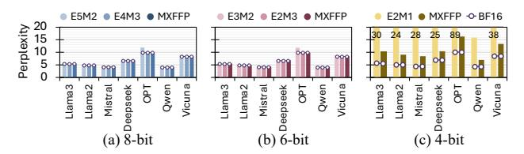
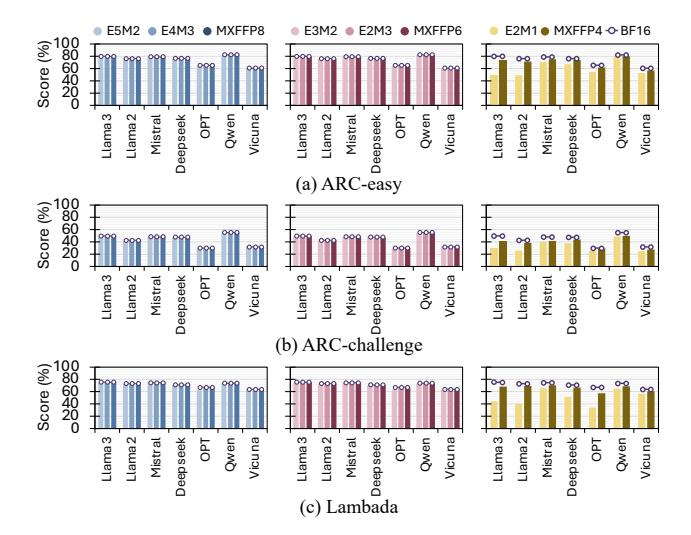
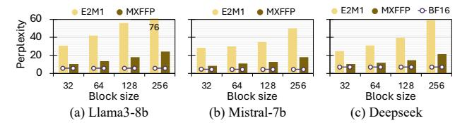
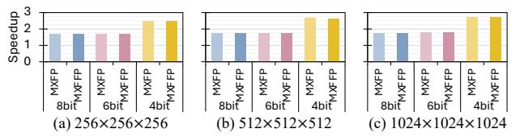
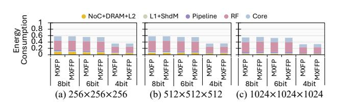
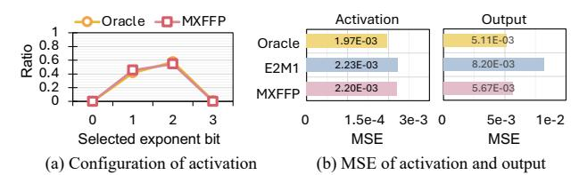
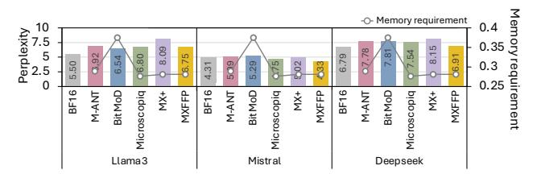
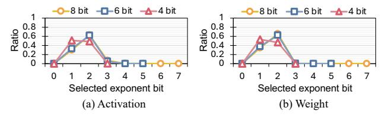

# VI. EVALUATION

## A. Evaluation Methodology

We evaluate MXFFP across four axes: numerical accuracy, block scalability, hardware efficiency, and dynamic conversion sensitivity. We evaluate accuracy using perplexity on WikiText-2 [43] and three zero-shot tasks: ARC-easy [11], ARC-challenge [11], and Lambada [48] we use seven representative LLMs, Llama3-8B [16], Llama2-7B [57], Mistral-7B-v0.3 [23], Deepseek-llm-7b-chat [5], OPT-6.7B [69], Qwen2.5-14B [56], and Vicuna-13B [10]. We compare perplexity BF16 baseline with MXFP and MXFFP quantized to 8-bit, 6-bit, and 4-bit, using post-training quantization. MXFP values are converted following the OCP-compliant

Fig. 13: Perplexity of MXFP and MXFFP across seven models at 8-, 6-, and 4-bit precisions.

conversion rule [47], and MXFFP builds on this pipeline with block- and sub-block-level bit configuration selection. All tensors involved in MMA operations during LLM inference are converted to MX formats.

For hardware performance evaluation, we extend Accel-Sim [25] using a configuration derived from the NVIDIA RTX 5090 GPU [46]. We use the CUTLASS library [45] to generate GEMM kernels and extract their instruction traces for simulation. We also model the additional memory accesses required to fetch the shared exponent (for both MXFP and MXFFP) and the configuration bits (for MXFFP only), ensuring that the performance impact of metadata traffic is accurately captured. For hardware cost evaluation, we implement both the baseline MXFP Tensor Core and our MXFFP-enhanced design in RTL and synthesize them using Synopsys Design Compiler with the FreePDK 45nm technology library.

#### B. Numerical Accuracy

Fig. 13 presents the numerical accuracy results across all models and bit-width settings. Across both 8-bit and 6-bit configurations, MXFFP consistently achieves slightly lower perplexity compared to MXFP. In the 8-bit setting, the perplexity of Llama3-8B decreases from 5.55 with MXFP (E4M3) to 5.50 with MXFFP, and the perplexity of OPT-6.7B decreases from 10.12 to 9.89. A similar trend is observed in the 6-bit configuration. The gain is relatively small at these bit widths since MXFP already approaches BF16 level accuracy, leaving limited room for further gains.

By contrast, the advantage of MXFFP becomes much more significant in the ultra-low 4-bit setting. MXFP significantly raises perplexity across all models, mainly due to the fixed E2M1 bit configuration, whose limited resolution and dynamic range under 4-bit quantization make it unable to represent the diverse value distributions across blocks. For example, the perplexity of Llama3-8B increases to 30.98 with MXFP4, whereas MXFFP reduces it to 10.23. The difference is even larger for OPT-6.7B: MXFP yields a perplexity of 88.81, while MXFFP reduces it to 16.32. MXFFP also provides substantial perplexity reduction on larger models. For instance, on Owen2.5-14B, perplexity decreases from 15.90 to 6.93, and on Vicuna-13B, from 38.13 to 13.31. This significant improvement arises from the ability of MXFFP to dynamically select the exponent-mantissa configuration that best matches the value distributions across blocks, enabling more accurate representation even under a strict 4-bit budget.

Fig. 14 reports the accuracy on three zero-shot tasks, ARC-easy, ARC-challenge, and Lambada, across seven models. At

Fig. 14: Accuracy results of zero-shot tasks using MXFP and MXFFP across seven models at 8-, 6-, and 4-bit precisions.

8- and 6-bit, both MXFP and MXFFP closely match BF16, with negligible average drop (within ~0.5%). In contrast, MXFP4 exhibits substantial accuracy degradation, with average drops of 18.9%, 24.9%, and 28.6% on ARC-easy, ARC-challenge, and Lambada, respectively, indicating that naive 4-bit quantization is unreliable across models and tasks. MXFFP significantly mitigates this issue in the 4-bit setting. Compared to MXFP4, MXFFP4 improves the average score by 16–29% and reduces the gap to BF16 to 5–12% depending on the task. A similar trend is observed in larger models. For Qwen2.5-14B and Vicuna-13B, MXFP4 incurs average score drops of 5.4%, 3.5%, and 10.7% on ARC-easy, ARC-challenge, and Lambada, respectively, while MXFFP4 reduces them to 3.5%, 3.3%, and 7.0%, further demonstrating the effectiveness of MXFFP in extremely low-bit settings.

## C. Block Scalability

We also examine how changes in block size affect numerical accuracy, particularly in the 4-bit configuration where representational limits are most restrictive. As block size increases, more elements are forced to share the same exponent, which increases intra-block value diversity and leads to accuracy degradation. MXFFP mitigates this accuracy degradation by leveraging sub-block level optimization, which reduces variation among values within each block and keeps accuracy stable as block size increases. As shown in Fig. 15, MXFFP maintains stable perplexity across block sizes up to 256. For instance, in Llama3-8B, MXFFP records perplexities of 10.2, 13.5, 16.81, and 24.3 for block sizes 32, 64, 128, and 256, respectively, values that remain significantly lower than MXFP at every block size. Notably, MXFFP at block size 256 still outperforms MXFP at its default block size of 32, highlighting the effectiveness of sub-block adaptation.

Fig. 15: Perplexity of MXFP and MXFFP across different block sizes for three models under 4-bit configurations.

Fig. 16: GEMM speedup of MXFP and MXFFP (normalized to BF16) across different matrix sizes and bit-widths.

#### D. Hardware Efficiency

**Performance.** Since MXFFP introduces an additional 1-bit configuration field per block or sub-block, we evaluate how much this extra metadata affects memory traffic and overall latency. We measure GEMM latency for MXFP and MXFFP across matrix sizes of 256, 512, and 1024, and report speedup over a BF16 baseline using Accel-Sim in Fig. 16. Across all precision settings, MXFFP achieves nearly identical speedup to MXFP, indicating that the additional bit configuration bits introduces no measurable latency overhead.

As shown in Fig. 13, MXFP4 suffers from significant accuracy degradation, making 4-bit quantization unreliable for large-scale models. Due to this accuracy limitation, the substantial performance benefit of 4-bit Tensor Core operations, providing up to a  $2.7\times$  speedup in  $1024\times1024\times1024$  GEMM evaluation, compared to  $1.8\times$  for 8- and 6-bit settings, cannot be effectively leveraged in practice. In contrast, MXFFP preserves numerical accuracy in the 4-bit setting by applying both inter-block and intra-block optimization. This enables practical exploitation of the performance advantages of 4-bit execution while maintaining model accuracy, allowing models to benefit from the speedups that MXFP4 cannot utilize.

In Fig. 16, the 8- and 6-bit settings show nearly identical speedups for both MXFP and MXFFP because 6-bit operands are packed into an 8-bit container in the Tensor Core datapath. As a result, 6-bit execution largely reuses the 8-bit compute pipeline and incurs similar operand traffic, leading to comparable throughput. In contrast, 4-bit execution uses a narrower datapath with higher throughput and lower operand traffic, resulting in higher speedup.

To validate the performance benefit of MXFFP in real applications, we further evaluate end-to-end inference latency across seven language models. As shown in Fig.17, during the prefill stage with 1024 input tokens, both MXFP and MXFFP achieve 1.55× speedup over BF16 in the 8- and 6-bit settings, and 2.08× in the 4-bit setting on average. Consistent with Fig.16, MXFP and MXFFP show nearly identical latency, indicating negligible overhead from the additional MXFFP metadata. Although the end-to-end speedup is smaller than

Fig. 17: Speedup of MXFP and MXFFP normalized to BF16 across seven language models.

Fig. 18: Speedup of MXFP and MXFFP normalized to BF16 across batch sizes on Llama3-8b.

the isolated GEMM speedup because non-GEMM operations remain on the baseline path, MXFP/MXFFP still provides substantial latency reduction. Note that larger models show a similar trend, also achieving an average speedup of  $2.18\times$  in the 4-bit setting.

We also measure end-to-end latency on Llama3-8B in the prefill stage with a sequence length of 1024, using batch sizes of 1, 2, 4, and 8 to evaluate the sensitivity of MXFFP to batch size. Fig. 18 shows that the speedup of MXFFP over BF16 is largely insensitive to batch size. In MXFFP, the 8-bit and 6-bit settings remain in the range of  $1.47\times-1.60\times$ , while the 4-bit setting achieves  $1.86\times-2.18\times$  across all batch sizes. Overall, these results suggest that MXFFP maintains consistent end-to-end acceleration across different batch sizes.

Area and Power Overhead. Supporting MXFFP requires only minor hardware changes. Since NVIDIA Tensor Core microarchitecture details are not publicly available, we model a representative 4-bit low-bit datapath and compare it with an MXFFP-extended version to estimate relative overhead. This methodology likely overestimates the overhead of a full Tensor Core, as it excludes other hardware components (e.g., pipeline registers, operand buffers, and multi-precision units) that would enlarge the baseline area and power.

To support MXFFP, the dot-product unit is slightly widened, the converter is extended, and a lightweight bit mapper is added. The dot-product unit contributes the largest area increase (26.4%), while the converter adds 4.3% and the bit mapper incurs negligible cost. Aggregated over four dot-product units, one converter, and sixteen bit mappers in a threadgroup, the total area overhead is 22.26%. Scaled to a GPU with 192 Tensor Cores, this corresponds to only 0.038% of a 750 mm² die, indicating negligible system-level overhead.

Power overhead follows a similar trend. The power of the dot-product unit increases by about 24.4%, the converter by roughly 9.6%, and the bit mapper adds only a negligible amount, resulting in an overall threadgroup power increase of approximately 21.4%. However, since the extended datapath is not always fully active and most of the power in the dot-product unit is dynamic (over 86% in our synthesis results), applying per-configuration power gating to disable inactive datapath segments reduces the effective power overhead to

Fig. 19: Energy consumption breakdown of MXFP and MXFFP normalized to BF16 in GEMM operations.

Fig. 20: Comparison of oracle and MXFFP configuration selection in a 4-bit setting and resulting numerical error.

around 12%. As a result, MXFFP can be easily integrated into real designs due to its small area and power cost, making it a highly efficient choice given its substantial accuracy benefits and block size scalability at 4 bits.

**Energy Consumption.** To evaluate the energy consumption of MXFFP, we use AccelWattch [24] with synthesis-derived power numbers for our hardware model. Fig. 19 reports the energy breakdown of MXFP and MXFFP for GEMM, normalized to BF16. Overall, MXFFP exhibits nearly identical energy consumption to MXFP across all matrix sizes and precisions, indicating that the additional MXFFP metadata and lightweight mapping/conversion logic introduce negligible energy overhead.

In terms of breakdown, register-file (RF) and core execution dominate the overall energy, and the added MXFFP logic (accounted in core execution) contributes negligibly to the total. We also observe that 6-bit and 8-bit configurations consume similar energy, consistent with our performance results: 6-bit operands use the same compute pipeline and incur similar operand traffic as 8-bit. In contrast, in the  $1024\times1024\times1024$  case, 4-bit execution substantially reduces total energy to  $0.35\times$  of BF16, mainly due to reduced operand traffic and faster execution enabled by the 4-bit datapath.

## E. Ablation Study: Effectiveness of Runtime Conversion

To validate the effectiveness of runtime conversion, we conduct an ablation study. We examine whether MXFFP selects activation configurations similarly to the oracle and whether this leads to measurable numerical benefits. Runtime conversion is applied only to activations. Since weights are static and can be converted offline, MXFFP uses the same oracle-guided conversion as in Section IV-B, yielding identical per-block exponent configuration choices and the same weight configuration-ratio distribution as in Fig. 5. As shown in Fig. 20(a), MXFFP closely matches the oracle's exponent—mantissa configuration choices across all exponent-bit options, indicating that its lightweight heuristic effectively captures

Fig. 21: Perplexity and memory requirement of MXFP and MXFFP across various bit and sub-block size compared to BF16. We use 32 block size for the MXFFP.

the block-level characteristics exploited by the oracle with negligible runtime cost.

Next, we evaluate the numerical impact of this alignment. Fig. 20(b) reports the MSE of activations and final outputs for the oracle, fixed E2M1, and MXFFP. For activations, MXFFP achieves MSE between E2M1 and the oracle, while for final outputs it attains MSE nearly identical to the oracle. Since output error is more directly related to model accuracy, this result suggests that MXFFP effectively approximates oracle behavior using only low-cost exponent statistics, making runtime conversion both effective and practical.

#### VII. DISCUSSION

## A. Ablation Study of Various Block and Sub-block Size

MXFFP might improve accuracy by using a fine granularity of sub-block by simply modifying the memory layout, which allows it to better capture intra-block value diversity. To examine the impact of this granularity, we conduct a detailed evaluation of perplexity and memory requirement across different sub-block sizes as shown in Fig 21. As the sub-block size decreases, MXFFP achieves perplexity closer to that of BF16. In particular, with a sub-block size of 4, the average perplexity degradation is only 0.98, whereas MXFP4 exhibits significant accuracy degradation. In addition, although reducing the sub-block size introduces additional metadata, the overhead remains modest because MXFFP requires only one extra bit for bit configuration per sub-block. Consequently, MXFFP with a sub-block size of 4 still achieves 47.8% and 29.1% lower memory requirement than MXFP8 and MXFP6, respectively. This reduction is particularly important for memory-intensive applications, where memory footprint and bandwidth can significantly affect performance.

#### B. Comparison with Prior Work

To verify the effectiveness of MXFFP compared with prior work, we evaluate MXFFP against four existing low bit methods, including M-ANT [20], BitMoD [8], Microscopiq [52], and MX+ [32], using perplexity and memory requirement. For a fair comparison, we fix the block size of all methods to 32. Following the study in Section VII-A, MXFFP is evaluated with a sub-block size of 4. M-ANT, Microscopiq, MX+, and MXFFP use the W4A4 setting, whereas BitMoD uses W4A8, following its original configuration.

As shown in Fig. 22, MXFFP achieves the lowest perplexity among these methods on Mistral-7B and DeepSeek, while

Fig. 22: Perplexity and memory requirement, normalized to BF16, for several 4-bit schemes including MXFFP. MXFFP uses a sub-block size of 4.

remaining close to BF16. Although BitMoD shows lower perplexity on Llama3-8B, this is partly because it uses 8-bit activations, which also increase its memory requirement. Accordingly, MXFFP still requires 9.38% less memory than BitMoD. While MXFFP use 0.5% higher memory than that of Microscopiq, MXFFP achieves 0.36 lower perplexity on average, suggesting that it is a more effective low-bit design in practice. Overall, MXFFP achieves the best accuracy-memory trade-off among the evaluated methods by addressing both inter-block and intra-block value diversity with lightweight metadata overhead, further demonstrating the effectiveness of our design.

## C. Generality beyond Language Models

Since models beyond LLMs may also exhibit value diversity, we analyze the oracle-selected exponent-bit distribution in ViT-base [61] to examine whether similar behavior is also observed in non-LLM workloads. As shown in Fig. 23, the oracle predominantly selects intermediate exponent-bit settings (E1 and E2) for both activations and weights across 8-, 6-, and 4-bit precisions, while other configurations are rarely chosen. This observation is consistent with our LLM analysis, suggesting that similar exponent-selection behavior also arises in non-LLM models.

We further evaluate ViT [61] to examine whether MXFFP generalizes to non-LLM workloads. Fig. 24 reports Top-1 accuracy for ViT-base and ViT-large under 8-, 6-, and 4-bit settings. At 8- and 6-bit, both MXFP and MXFFP closely match BF16 accuracy. At 4-bit, MXFP suffers noticeable degradation, whereas MXFFP substantially recovers accuracy, improving from 76.46% to 79.36% on ViT-base and from 79.54% to 81.36% on ViT-large.

Furthermore, Fig. 24(c) shows that MXFFP's runtime selection method for activation exponent-bit configurations closely matches an oracle policy, indicating that it can robustly adapt to varying activation characteristics and generalize effectively beyond LLM workloads. These results indicate that the challenge addressed by MXFFP is not limited to language models. MXFFP improves accuracy through flexible exponent-bit allocation and retains the speedup benefits of low-bit execution through efficient runtime conversion.

#### D. Discussion of Bit Configuration Selection

To further verify the robustness of our two-configuration scheme, we evaluated the bit configuration that achieves the lowest MSE across multiple models and layers, as shown

Fig. 23: Ratio of exponent bits selected by the oracle format for activation (a) and weight (b) in ViT-base.

Fig. 24: Top-1 accuracy of ViT-base (a) and ViT-large (b), and selected configuration from activation of ViT-base in a 4-bit setting (c).

in Fig. 25. We found that the two dominant configurations, E1Mx and E2Mx, account for 97.2% of the lowest MSE selections across all models and layers, while the remaining bit configurations are selected in only 2.8% of cases. These results demonstrate the robustness of our two-configuration scheme.

If a target model requires greater flexibility in bit-configuration selection, MXFFP can support it in two ways. First, MXFFP can adopt an alternative pair of presets, such as E0/E2 or E2/E3, when the model favors a different range-precision tradeoff. Our runtime selection logic, which is based on relative exponents (Table I), directly generalizes to any preset pair by selecting the better-matching option for each block. Second, MXFFP can be extended to support more than two configurations by widening the selector and enabling the conversion/compute units to handle additional formats, at the cost of higher area/power and design complexity. In this paper, however, we focus on the minimal 1-bit design, which captures most of the accuracy benefit with negligible overhead.

