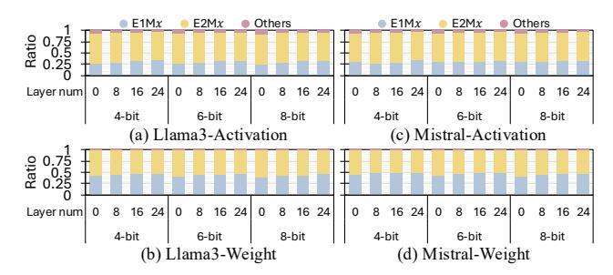

# VIII. RELATED WORK

To accelerate ML models, various techniques such as sparsity [27], [34], [49], [59], [65] and quantization [6], [9], [26], [30], [44] have been extensively studied. Among these, quantization has emerged as a particularly effective approach for reducing model size and computational cost [8], [18], [20], [31]. In particular, floating point quantization has gained significant attention since modern accelerators natively support low-bit floating point formats while maintaining high accuracy [40], [41], [58], [70]. Among these approaches, block-scaled low-precision formats are especially promising since they achieve higher accuracy than conventional low-bit floating point formats while also providing high performance by amortizing scaling metadata across groups [15], [21], [32], [35], [36], [52].

Fig. 25: Layerwise exponent-mantissa bit distribution in Llama3-8B and Mistral-7B.

More recently, microscaling formats with shared microexponents, such as SMX and MX, introduce an additional finegrained scaling level to improve low-bit fidelity while preserving the underlying block structure [14], [53]. Subsequent work has extended this line of research in three main directions. First, some methods refine scaling granularity to better match value distributions across blocks [14]. Second, other methods introduce more flexible numerical representations within a fixed block structure to better capture variation inside a block [32], [52], [68]. Lastly, recent works combine both ideas to further exploit the value distribution [33], [42].

However, these approaches still manage scale assignment and representation selection within the same structural unit. Consequently, they cannot independently tune scaling granularity and bit configuration granularity, which limits their ability to simultaneously handle inter-block and intra-block value diversity in a lightweight manner. MXFFP overcomes this limitation by decoupling the two granularities. This design allows MXFFP to preserve coarse-grained scaling for low metadata overhead while applying finer-grained bit configuration control where additional flexibility is needed. As a result, MXFFP expands the design space of block-scaled low-precision formats and provides a more effective and practical way to balance accuracy and metadata cost.

#### IX. CONCLUSION

In this work, we introduce MXFFP, a flexible microscaling floating-point format that adapts exponent–mantissa configurations at both the block and sub-block levels, addressing the inter- and intra-block value diversity that limits existing MXFP designs. We further develop the MXFFP Tensor Core, which integrates this format into existing accelerator pipelines through lightweight mapping and dynamic conversion with minimal hardware modification. Our evaluation shows that MXFFP reduces LLM perplexity by  $2–5\times$  under 4-bit quantization and maintains high accuracy even at large block sizes, while reducing metadata overhead by up to  $4\times$ .

## X. ACKNOWLEDGEMENT

This work was supported by the National Research Foundation of Korea(NRF) grant funded by the Korea government(MSIT)(RS-2024-00357037), and by the Samsung Electronics, under Grant IO250214-11969-01. Won Woo Ro is the corresponding author.

## REFERENCES

- [1] S. Agarwal, L. Ahmad, J. Ai, S. Altman, A. Applebaum, E. Arbus, R. K. Arora, Y. Bai, B. Baker, H. Bao *et al.*, "gpt-oss-120b & gpt-oss-20b model card," *arXiv preprint arXiv:2508.10925*, 2025.
- [2] E. Alvarez, O. Almog, E. Chung, S. Layton, D. Stosic, R. Krashinsky, and K. Aubrey. (2025, June) Introducing nvfp4 for efficient and accurate low-precision inference. Accessed: 2025-11- 14. [Online]. Available: https://developer.nvidia.com/blog/introducingnvfp4-for-efficient-and-accurate-low-precision-inference/
- [3] S. Ashkboos, A. Mohtashami, M. L. Croci, B. Li, P. Cameron, M. Jaggi, D. Alistarh, T. Hoefler, and J. Hensman, "Quarot: Outlier-free 4-bit inference in rotated llms," *Advances in Neural Information Processing Systems*, vol. 37, pp. 100 213–100 240, 2024.
- [4] J. Bai, S. Bai, Y. Chu, Z. Cui, K. Dang, X. Deng, Y. Fan, W. Ge, Y. Han, F. Huang *et al.*, "Qwen technical report," *arXiv preprint arXiv:2309.16609*, 2023.
- [5] X. Bi, D. Chen, G. Chen, S. Chen, D. Dai, C. Deng, H. Ding, K. Dong, Q. Du, Z. Fu *et al.*, "Deepseek llm: Scaling open-source language models with longtermism," *arXiv preprint arXiv:2401.02954*, 2024.
- [6] H. Chen, Y. Hao, Y. Zou, and X. Chen, "Oa-lama: An outlier-adaptive llm inference accelerator with memory-aligned mixed-precision group quantization," in *2025 IEEE/ACM International Conference On Computer Aided Design (ICCAD)*. IEEE, 2025, pp. 1–9.
- [7] M. Chen, M. Wu, H. Jin, Z. Yuan, J. Liu, C. Zhang, Y. Li, J. Huang, J. Ma, Z. Xue *et al.*, "Int vs fp: A comprehensive study of fine-grained low-bit quantization formats," *arXiv preprint arXiv:2510.25602*, 2025.
- [8] Y. Chen, A. F. AbouElhamayed, X. Dai, Y. Wang, M. Andronic, G. A. Constantinides, and M. S. Abdelfattah, "Bitmod: Bit-serial mixture-ofdatatype llm acceleration," in *2025 IEEE International Symposium on High Performance Computer Architecture (HPCA)*. IEEE, 2025, pp. 1082–1097.
- [9] F. Cheng, C. Guo, C. Wei, J. Zhang, C. Zhou, E. Hanson, J. Zhang, X. Liu, H. Li, and Y. Chen, "Ecco: Improving memory bandwidth and capacity for llms via entropy-aware cache compression," in *Proceedings of the 52nd Annual International Symposium on Computer Architecture*, 2025, pp. 793–807.
- [10] W.-L. Chiang, Z. Li, Z. Lin, Y. Sheng, Z. Wu, H. Zhang, L. Zheng, S. Zhuang, Y. Zhuang, J. E. Gonzalez, I. Stoica, and E. P. Xing, "Vicuna: An open-source chatbot impressing gpt-4 with 90%\* chatgpt quality," March 2023. [Online]. Available: https://lmsys.org/blog/2023-03-30-vicuna/
- [11] P. Clark, I. Cowhey, O. Etzioni, T. Khot, A. Sabharwal, C. Schoenick, and O. Tafjord, "Think you have solved question answering? try arc, the ai2 reasoning challenge," *arXiv preprint arXiv:1803.05457*, 2018.
- [12] T. Dao, "Flashattention-2: Faster attention with better parallelism and work partitioning," *arXiv preprint arXiv:2307.08691*, 2023.
- [13] B. Darvish Rouhani, D. Lo, R. Zhao, M. Liu, J. Fowers, K. Ovtcharov, A. Vinogradsky, S. Massengill, L. Yang, R. Bittner *et al.*, "Pushing the limits of narrow precision inferencing at cloud scale with microsoft floating point," *Advances in neural information processing systems*, vol. 33, pp. 10 271–10 281, 2020.
- [14] B. Darvish Rouhani, R. Zhao, V. Elango, R. Shafipour, M. Hall, M. Mesmakhosroshahi, A. More, L. Melnick, M. Golub, G. Varatkar *et al.*, "With shared microexponents, a little shifting goes a long way," in *Proceedings of the 50th Annual International Symposium on Computer Architecture*, 2023, pp. 1–13.
- [15] M. Drumond, T. Lin, M. Jaggi, and B. Falsafi, "Training dnns with hybrid block floating point," *Advances in Neural Information Processing Systems*, vol. 31, 2018.
- [16] A. Dubey, A. Jauhri, A. Pandey, A. Kadian, A. Al-Dahle, A. Letman, A. Mathur, A. Schelten, A. Yang, A. Fan *et al.*, "The llama 3 herd of models," *arXiv e-prints*, pp. arXiv–2407, 2024.
- [17] M. Gil, D. Ha, S. B. Harma, M. K. Yoon, B. Falsafi, W. W. Ro, and Y. Oh, "Avant-garde: Empowering gpus with scaled numeric formats," in *Proceedings of the 52nd Annual International Symposium on Computer Architecture*, 2025, pp. 153–165.
- [18] C. Guo, J. Tang, W. Hu, J. Leng, C. Zhang, F. Yang, Y. Liu, M. Guo, and Y. Zhu, "Olive: Accelerating large language models via hardwarefriendly outlier-victim pair quantization," in *Proceedings of the 50th Annual International Symposium on Computer Architecture*, 2023, pp. 1–15.
- [19] Y. He, H. Mao, C. Giannoula, M. Sadrosadati, J. Gomez-Luna, H. Li, ´ X. Li, Y. Wang, and O. Mutlu, "Papi: Exploiting dynamic parallelism in

- large language model decoding with a processing-in-memory-enabled computing system," in *Proceedings of the 30th ACM International Conference on Architectural Support for Programming Languages and Operating Systems, Volume 2*, 2025, pp. 766–782.
- [20] W. Hu, H. Zhang, C. Guo, Y. Feng, R. Guan, Z. Hua, Z. Liu, Y. Guan, M. Guo, and J. Leng, "M-ant: Efficient low-bit group quantization for llms via mathematically adaptive numerical type," in *2025 IEEE International Symposium on High Performance Computer Architecture (HPCA)*. IEEE, 2025, pp. 1112–1126.
- [21] W. Hu, Z. Zhang, H. Zhang, C. Zhang, C. Guo, Y. Feng, T. Hu, G. Li, G. Hu, J. Wang *et al.*, "M2xfp: A metadata-augmented microscaling data format for efficient low-bit quantization," in *Proceedings of the 31st ACM International Conference on Architectural Support for Programming Languages and Operating Systems, Volume 2*, 2026, pp. 1151– 1167.
- [22] A. Jarmusch, N. Graddon, and S. Chandrasekaran, "Dissecting the nvidia blackwell architecture with microbenchmarks," *arXiv preprint arXiv:2507.10789*, 2025.
- [23] A. Q. Jiang, A. Sablayrolles, A. Mensch, C. Bamford, D. S. Chaplot, D. de las Casas, F. Bressand, G. Lengyel, G. Lample, L. Saulnier, L. R. Lavaud, M.-A. Lachaux, P. Stock, T. L. Scao, T. Lavril, T. Wang, T. Lacroix, and W. E. Sayed, "Mistral 7b," 2023. [Online]. Available: https://arxiv.org/abs/2310.06825
- [24] V. Kandiah, S. Peverelle, M. Khairy, J. Pan, A. Manjunath, T. G. Rogers, T. M. Aamodt, and N. Hardavellas, "Accelwattch: A power modeling framework for modern gpus," in *MICRO-54: 54th Annual IEEE/ACM International symposium on microarchitecture*, 2021, pp. 738–753.
- [25] M. Khairy, Z. Shen, T. M. Aamodt, and T. G. Rogers, "Accel-sim: An extensible simulation framework for validated gpu modeling," in *2020 ACM/IEEE 47th Annual International Symposium on Computer Architecture (ISCA)*. IEEE, 2020, pp. 473–486.
- [26] S. Kim, Y. Chou, B. Kim, J. Oh, and H.-J. Yoo, "Gyrot: Leveraging hidden synergy between rotation and fine-grained group quantization for low-bit llm inference," in *2026 IEEE International Symposium on High Performance Computer Architecture (HPCA)*. IEEE, 2026, pp. 1–15.
- [27] S. Kim, H. Lee, W. Cho, M. Park, and W. W. Ro, "Ditto: Accelerating diffusion model via temporal value similarity," in *2025 IEEE International Symposium on High Performance Computer Architecture (HPCA)*. IEEE, 2025, pp. 338–352.
- [28] S. Kim, H. Lee, S. Kim, C. Kim, and W. W. Ro, "Airgun: Adaptive granularity quantization for accelerating large language models," in *2024 IEEE 42nd International Conference on Computer Design (ICCD)*. IEEE, 2024, pp. 645–652.
- [29] S. Kim, D. Ha, S. Sung, and W. W. Ro, "Maximoff: Designing matrix multiplication accelerator for effective multiply-add operations offloading," *IEEE Transactions on Emerging Topics in Computing*, 2025.
- [30] H. Lee, H. Jang, S. Kim, S. Kim, W. Cho, and W. W. Ro, "Exploiting inherent properties of complex numbers for accelerating complex valued neural networks," in *Proceedings of the 56th Annual IEEE/ACM International Symposium on Microarchitecture*, 2023, pp. 1121–1134.
- [31] H. Lee, S. Kim, S. Kim, and W. W. Ro, "Cvmax: Accelerator architecture with polar form multiplication for complex-valued neural networks," in *2025 62nd ACM/IEEE Design Automation Conference (DAC)*. IEEE, 2025, pp. 1–7.
- [32] J. Lee, J. Park, S. Cha, J. Cho, and J. Sim, "Mx+: Pushing the limits of microscaling formats for efficient large language model serving," in *Proceedings of the 58th IEEE/ACM International Symposium on Microarchitecture®*, 2025, pp. 869–883.
- [33] S. Lee, J. Choi, S. Noh, J. Koo, and J. Kung, "Dbps: Dynamic block size and precision scaling for efficient dnn training supported by risc-v isa extensions," in *2023 60th ACM/IEEE Design Automation Conference (DAC)*. IEEE, 2023, pp. 1–6.
- [34] S. Lee, D. Ha, S. Kim, S. Kim, H. Lee, and W. W. Ro, "Bitl: A hybrid bit-serial and parallel deep learning accelerator for critical path reduction," in *Proceedings of the 58th IEEE/ACM International Symposium on Microarchitecture*, 2025, pp. 1565–1578.
- [35] H. Li, S. Tian, C. Lin, Z. Zhao, and K. Zhan, "Faar: Format-aware adaptive rounding for nvfp4," *arXiv preprint arXiv:2603.22370*, 2026.
- [36] J.-F. Li, M. Zhang, X. Xia, H. Bao, H. Bai, Z. Dong, and X. Yu, "Batquant: Outlier-resilient mxfp4 quantization via learnable block-wise optimization," *arXiv preprint arXiv:2603.16590*, 2026.
- [37] S. Li, Y. Chen, C. Li, Y. Fu, Z. Wang, Z. Yu, H. You, Z. Ye, W. Zhou, Y. Zhang *et al.*, "Orches: Orchestrated test-time-compute-

- based llm reasoning on collaborative gpu-pim heterogeneous system," in *Proceedings of the 58th IEEE/ACM International Symposium on Microarchitecture®*, 2025, pp. 476–489.
- [38] J. Lin, J. Tang, H. Tang, S. Yang, W.-M. Chen, W.-C. Wang, G. Xiao, X. Dang, C. Gan, and S. Han, "Awq: Activation-aware weight quantization for on-device llm compression and acceleration," *Proceedings of machine learning and systems*, vol. 6, pp. 87–100, 2024.
- [39] A. Liu, B. Feng, B. Xue, B. Wang, B. Wu, C. Lu, C. Zhao, C. Deng, C. Zhang, C. Ruan *et al.*, "Deepseek-v3 technical report," *arXiv preprint arXiv:2412.19437*, 2024.
- [40] F. Liu, W. Zhao, Z. He, Y. Wang, Z. Wang, C. Dai, X. Liang, and L. Jiang, "Improving neural network efficiency via post-training quantization with adaptive floating-point," in *Proceedings of the IEEE/CVF international conference on computer vision*, 2021, pp. 5281–5290.
- [41] S.-y. Liu, Z. Liu, X. Huang, P. Dong, and K.-T. Cheng, "Llm-fp4: 4-bit floating-point quantized transformers," *arXiv preprint arXiv:2310.16836*, 2023.
- [42] Y.-C. Lo, G.-Y. Wei, and D. Brooks, "Nanoscaling floating-point (nxfp): Nanomantissa, adaptive microexponents, and code recycling for direct-cast compression of large language models," *arXiv preprint arXiv:2412.19821*, 2024.
- [43] S. Merity, C. Xiong, J. Bradbury, and R. Socher, "Pointer sentinel mixture models," *arXiv preprint arXiv:1609.07843*, 2016.
- [44] Z. Mo, L. Wang, J. Wei, Z. Zeng, S. Cao, L. Ma, N. Jing, T. Cao, J. Xue, F. Yang *et al.*, "Lut tensor core: A software-hardware co-design for lut-based low-bit llm inference," in *Proceedings of the 52nd Annual International Symposium on Computer Architecture*, 2025, pp. 514–528.
- [45] NVIDIA, "Cutlass," https://github.com/NVIDIA/cutlass, 2025.
- [46] NVIDIA Corporation, "Nvidia rtx blackwell gpu architecture," https://images.nvidia.com/aem-dam/Solutions/geforce/blackwell/nvidiartx-blackwell-gpu-architecture.pdf, 2025, white Paper.
- [47] Open Compute Project Foundation, "Ocp microscaling formats (mx) specification version 1.0," https://www.opencompute.org/documents/ ocp-microscaling-formats-mx-v1-0-spec-final-pdf, Open Compute Project, Tech. Rep. v1.0, Sep. 2023, specification.
- [48] D. Paperno, G. Kruszewski, A. Lazaridou, Q. N. Pham, R. Bernardi, S. Pezzelle, M. Baroni, G. Boleda, and R. Fernandez, "The lambada ´ dataset: Word prediction requiring a broad discourse context," *arXiv preprint arXiv:1606.06031*, 2016.
- [49] A. Parashar, M. Rhu, A. Mukkara, A. Puglielli, R. Venkatesan, B. Khailany, J. Emer, S. W. Keckler, and W. J. Dally, "Scnn: An accelerator for compressed-sparse convolutional neural networks," *ACM SIGARCH computer architecture news*, vol. 45, no. 2, pp. 27–40, 2017.
- [50] J. Park, J. Choi, K. Kyung, M. J. Kim, Y. Kwon, N. S. Kim, and J. H. Ahn, "Attacc! unleashing the power of pim for batched transformerbased generative model inference," in *Proceedings of the 29th ACM International Conference on Architectural Support for Programming Languages and Operating Systems, Volume 2*, 2024, pp. 103–119.
- [51] M. A. Raihan, N. Goli, and T. M. Aamodt, "Modeling deep learning accelerator enabled gpus," in *2019 IEEE International Symposium on Performance Analysis of Systems and Software (ISPASS)*. IEEE, 2019, pp. 79–92.
- [52] A. Ramachandran, S. Kundu, and T. Krishna, "Microscopiq: Accelerating foundational models through outlier-aware microscaling quantization," in *Proceedings of the 52nd Annual International Symposium on Computer Architecture*, 2025, pp. 1193–1209.
- [53] B. D. Rouhani, R. Zhao, A. More, M. Hall, A. Khodamoradi, S. Deng, D. Choudhary, M. Cornea, E. Dellinger, K. Denolf *et al.*, "Microscaling data formats for deep learning," *arXiv preprint arXiv:2310.10537*, 2023.
- [54] K. Sevegnani, U. Uppal, R. Oberman, and Z. Zhu. (2025, July) Per-tensor and per-block scaling strategies for effective fp8 training. Accessed: 2025-11-14. [Online]. Available: https://developer.nvidia.com/blog/per-tensor-and-per-blockscaling-strategies-for-effective-fp8-training/
- [55] S. Sung, S. Hur, S. Kim, D. Ha, Y. Oh, and W. W. Ro, "Mad macce: Supporting multiply-add operations for democratizing matrix-multiplication accelerators," in *Proceedings of the 56th Annual IEEE/ACM International Symposium on Microarchitecture*, 2023, pp. 367–379.
- [56] Q. Team, "Qwen2.5: A party of foundation models," September 2024. [Online]. Available: https://qwenlm.github.io/blog/qwen2.5/
- [57] H. Touvron, L. Martin, K. Stone, P. Albert, A. Almahairi, Y. Babaei, N. Bashlykov, S. Batra, P. Bhargava, S. Bhosale *et al.*, "Llama 2: Open foundation and fine-tuned chat models," *arXiv preprint arXiv:2307.09288*, 2023.

- [58] A. Tseng, T. Yu, and Y. Park, "Training llms with mxfp4," *arXiv preprint arXiv:2502.20586*, 2025.
- [59] H. Wang, Z. Zhang, and S. Han, "Spatten: Efficient sparse attention architecture with cascade token and head pruning," in *2021 IEEE international symposium on high-performance computer architecture (HPCA)*. IEEE, 2021, pp. 97–110.
- [60] J. Wang, H. Liu, D. Feng, J. Ding, and B. Ding, "Fp4-quantization: Lossless 4bit quantization for large language models," in *2024 IEEE International Conference on Joint Cloud Computing (JCC)*. IEEE, 2024, pp. 61–67.
- [61] B. Wu, C. Xu, X. Dai, A. Wan, P. Zhang, Z. Yan, M. Tomizuka, J. Gonzalez, K. Keutzer, and P. Vajda, "Visual transformers: Tokenbased image representation and processing for computer vision," 2020.
- [62] X. Wu, H. Xia, S. Youn, Z. Zheng, S. Chen, A. Bakhtiari, M. Wyatt, R. Y. Aminabadi, Y. He, O. Ruwase *et al.*, "Zeroquant (4+ 2): Redefining llms quantization with a new fp6-centric strategy for diverse generative tasks," *arXiv preprint arXiv:2312.08583*, 2023.
- [63] G. Xiao, J. Lin, M. Seznec, H. Wu, J. Demouth, and S. Han, "Smoothquant: Accurate and efficient post-training quantization for large language models," in *International conference on machine learning*. PMLR, 2023, pp. 38 087–38 099.
- [64] H. Yang, S. Deng, A. Nagpal, M. Naumov, M. Janani, T. Liu, and H. Guan, "An empirical study of microscaling formats for low-precision llm training," in *2025 IEEE 32nd Symposium on Computer Arithmetic (ARITH)*. IEEE Computer Society, 2025, pp. 1–8.
- [65] H. You, Z. Sun, H. Shi, Z. Yu, Y. Zhao, Y. Zhang, C. Li, B. Li, and Y. Lin, "Vitcod: Vision transformer acceleration via dedicated algorithm and accelerator co-design," in *2023 IEEE International Symposium on High-Performance Computer Architecture (HPCA)*. IEEE, 2023, pp. 273–286.
- [66] A. H. Zadeh, I. Edo, O. M. Awad, and A. Moshovos, "Gobo: Quantizing attention-based nlp models for low latency and energy efficient inference," in *2020 53rd Annual IEEE/ACM International Symposium on Microarchitecture (MICRO)*. IEEE, 2020, pp. 811–824.
- [67] J. Zhang, J. Wei, H. Huang, P. Zhang, J. Zhu, and J. Chen, "Sageattention: Accurate 8-bit attention for plug-and-play inference acceleration," *arXiv preprint arXiv:2410.02367*, 2024.
- [68] S. Q. Zhang, B. McDanel, and H. Kung, "Fast: Dnn training under variable precision block floating point with stochastic rounding," in *2022 IEEE International Symposium on High-Performance Computer Architecture (HPCA)*. IEEE, 2022, pp. 846–860.
- [69] S. Zhang, S. Roller, N. Goyal, M. Artetxe, M. Chen, S. Chen, C. Dewan, M. Diab, X. Li, X. V. Lin *et al.*, "Opt: Open pre-trained transformer language models," *arXiv preprint arXiv:2205.01068*, 2022.
- [70] Y. Zhang, S. Zhang, S. Cao, D. Du, J. Wei, T. Cao, and N. Xu, "Afpq: Asymmetric floating point quantization for llms," *arXiv preprint arXiv:2311.01792*, 2023.
- [71] Y. Zhao, C.-Y. Lin, K. Zhu, Z. Ye, L. Chen, S. Zheng, L. Ceze, A. Krishnamurthy, T. Chen, and B. Kasikci, "Atom: Low-bit quantization for efficient and accurate llm serving," *Proceedings of Machine Learning and Systems*, vol. 6, pp. 196–209, 2024.