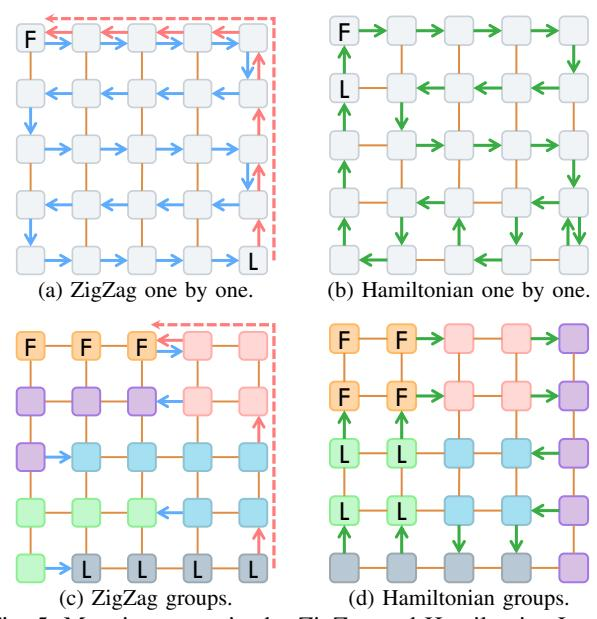

# A. Inter-die Mapping

A common inter-die mapping strategy is to assign several transformer blocks to die groups using a ZigZag allocation [19] like Fig. 5a. For multi-die groups, a folding mechanism is shown in Fig. 5c: regions that do not fit within the remaining space of a given row continue from the beginning of the next row. ZigZag improves computation resource utilization with low communication distance in conventional DNN scenarios because its straightforward layout matches the dataflow of DNNs. However, the autoregressive nature of LLMs requires each iteration to wait for the previous output as the current input, and ZigZag mapping can incur near-diameter communication paths with long communication latency.

To better fit the autoregressive mechanism, we propose a Hamiltonian Loop strategy that reduces the distance between the last die group and the first. The Hamiltonian Loop is shown in Fig. 5b for a single die group and in Fig. 5d for multiple die groups. Compared to ZigZag, a Hamiltonian Loop minimizes the distance between each pair of neighboring

die groups, especially for the last and the first group. The Hamiltonian Loop is therefore more suitable for autoregressive LLMs, keeping each pipeline stage as close as possible to its neighbors and avoiding long communication paths.

Fig. 5: Mapping strategies by ZigZag and Hamiltonian Loop. The solid lines indicate the physical bidirectional links between two dies. The solid arrows indicate the directional pipeline communication between two die-groups. The dashed arrows indicate the long-distance communication between the last and the first die-groups in ZigZag mapping.

To address the challenges of constructing Hamiltonian loops under topological constraints [28], hardware faults, and layer-to-die count mismatches, we employ a simulated annealing (SA) algorithm. The algorithm explores Hamiltonian and near-Hamiltonian mappings by treating each die group as a node in the loop. SA iteratively swaps the positions of two nodes to minimize the total communication distance, defined as the

sum of distances between each pair of neighboring nodes in the loop weighted by topology constraints and per-link bandwidth. The algorithm continues until it reaches a local minimum or a predefined number of iterations. In this way, our inter-die mapping optimizes the pipeline communication among die groups in a manner well suited to autoregressive LLMs.

#### B. Intra-die Mapping

Given the constraints of the inter-die mapping, the layer operators are mapped onto the assigned dies. The tensorand vector-type computation operators are allocated to the corresponding execution units, whose locations determine the communication cost. Our intra-die mapping is optimized using a second SA iterator that adopts the movement strategies from Gemini [10], including operator-pair swapping, operator reallocation, and HBM data reallocation. Although originally designed for the layer-pipeline scenario [10], which assigns at most two operators per core, these strategies remain effective in our spatiotemporal setting. In particular, operator swapping adjusts communication distance, while operator reallocation improves workload balance across cores. In addition, HBM data placement is jointly optimized to manage weight loading and result storage efficiently.

However, most existing work [10], [73] considers only the communication distance (hops between two cores) as the optimization objective, which is insufficient for intra-die mapping. As an example, consider the attention block in Fig. 6a mapped onto 2×2 cores. As shown in Fig. 6b, when data dependencies are ignored, the tensor matrix-multiplication operators are not balanced across the four cores, causing Computation K to be blocked by Q on Core 1 (Fig. 6c). On the communication side, the unbalanced mapping places Softmax on Core 0, causing redundant communication from Core 2. Furthermore, the placement of K and  $K^T$  incurs a long communication distance. As Fig. 6d shows, placing K on Core 1 avoids this long path, with the resulting timeline shown in Fig. 6e. A better mapping enables more parallel computation and additional communication overlap, which together reduce latency significantly. Consequently, the workloads of multiple on-die components-tensor cores, vector units, and communication links—must all be incorporated into the optimization objective to ensure efficient resource utilization.

- 1) Hybrid Loss Function: Our intra-die SA loss function comprises four components:
  - 1) Total communication distance: the sum of distances over all communication events, as a function of latency and communication volume from profiling in Sec. V.
  - Max link load: the maximum load across all communication links, measured as the number of communication events traversing each link.
  - Max tensor workload: the maximum workload across all tensor cores, measured as the number of tensor operations on each core.
  - Max vector workload: the maximum workload across all vector units, measured as the number of vector operations on each unit.

Fig. 6: An example of attention operators mapping. The yellow blocks with "C" means communication events and the yellow arrow indicates the dependencies between operators.

To compute these losses, we traverse all events and evaluate the workload demand on each device after mapping. This allows us to obtain the loss values required by the SA algorithm in linear time, without resorting to cycle-level event-driven backend simulation. As a result, each iteration is significantly accelerated, enabling many more optimization rounds within the same time budget.

