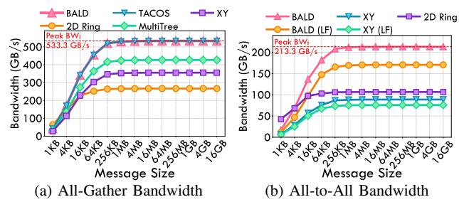

# Algorithm 3 Heuristic Backtracking

```
Require: Link allocation A.
Require: iterations I, tabu probability \rho, preset length m
 1: Initialize tabuCandidates \leftarrow \emptyset
    Initialize tabuForbiddens \leftarrow \emptyset
    for iter = 1 to I do
 3.
       Find link l^* with maximum load
 4:
       overloadedLinks \leftarrow \{l^*\}
 5:
       overloadedTasks \leftarrow \{ tasks \ using \ l^* \}
 6:
       Backup current state of A as A_{backup}
 7:
       Initialize backtrackedTasks \leftarrow deque(m)
 8:
       while |backtrackedTasks| < m do
          Draw u \sim \text{Uniform}(0,1)
10:
11:
          if u < \rho then
12:
             Select random t such that t \in overloadedTasks and
             t \not\in tabuForbiddens
          else
13:
             Select random t \in tabuCandidates
14:
15:
          end if
16:
          Append t to backtrackedTasks
17:
       end while
18.
       Path Scheduling for backtrackedTasks with A
19:
       if total load of overloaded links decreased then
          tabuCandidates \cup= overloadedTasks
20:
21:
22.
          A \leftarrow A_{backup}
23:
          tabuForbiddens \cup = overloadedTasks
24.
       end if
25: end for
26: return Updated allocation A
```

#### C. Implementation and Fault Tolerance

The optimized communication schemes are implemented as Look-Up Tables (LUTs) on hardware platforms such as TPUv4 [83]. The host loads the routing configuration into the router LUTs before each inference task and updates the entries as needed during execution. The LUTs guide each data packet to the next hop according to the precomputed routing paths.

Our BALD algorithm is based on breadth-first search (BFS) and depth-first search (DFS), which makes it topology-agnostic and applicable to any topology. It schedules paths through the available links of each branch node, tolerating arbitrary fault patterns of links or nodes as long as the surviving graph remains connected. Because the LUTs are reconfigurable, BusyBarn can adapt to both manufacturing defects and runtime faults. The algorithm consistently produces

high-quality, well-balanced link allocations for point-to-point, multicast, and general communication patterns.

#### VI. EVALUATION

#### A. Evaluation Methodology

We develop an event-driven backend simulator implemented in over 10K lines of Python that uses the as-soon-as-possible (ASAP) strategy [6] as the backend scheduling logic to evaluate both computation events and communication events, including off-die DRAM accesses. The event-driven backend dispatches each event to its target device (a computation unit or link) as soon as the device is idle and all dependencies of the event are satisfied. The simulator therefore overlaps computation and communication events automatically through its natural dependency-check mechanism. Computation units honor the input data shape, and links are modeled with an alpha-beta cost model [67].

TABLE I: System Configurations

| Categories                          | Value                                                                                                                                                                                                                                                                                                             |
|-------------------------------------|-------------------------------------------------------------------------------------------------------------------------------------------------------------------------------------------------------------------------------------------------------------------------------------------------------------------|
| On-chip link                        | 1 ns, 256 GB/s                                                                                                                                                                                                                                                                                                    |
| Die-to-Die link                     | 20 ns, 256 GB/s                                                                                                                                                                                                                                                                                                   |
| Baseline workload (for sensitivity) | one OPT-30B Transformer Block                                                                                                                                                                                                                                                                                     |
| Baseline in-die fabric              | 4×4 2D mesh of cores                                                                                                                                                                                                                                                                                              |
| Baseline peak compute               | 16 TFLOPs per core for BF16                                                                                                                                                                                                                                                                                       |
| Baseline die topology               | 1×1 die                                                                                                                                                                                                                                                                                                           |
| Synthetic Study                     | 5×5 mesh; Failed Link (12, 13)                                                                                                                                                                                                                                                                                    |
| Fault Sensitivity                   | 6×6 mesh; 1 / 2 Nodes, 1 / 2 Links                                                                                                                                                                                                                                                                                |
| Die Number Sensitivity              | Die-group shapes: $1 \times 1$ , $1 \times 2$ , $1 \times 3$ ,                                                                                                                                                                                                                                                    |
|                                     | $1 \times 4$ , $2 \times 2$ , $2 \times 3$ , $2 \times 4$ , $3 \times 3$                                                                                                                                                                                                                                          |
| Core Shape Sensitivity              | Core shapes: $5 \times 5$ , $4 \times 8$ , $6 \times 6$ , $6 \times 8$ ,                                                                                                                                                                                                                                          |
| Mapping                             | 7×7, 8×8, 9×9, 10×10                                                                                                                                                                                                                                                                                              |
| Computation Power Sensitivity       | 8 / 16 / 32 TFLOPs / core; Failed<br>Core 5                                                                                                                                                                                                                                                                       |
|                                     | 20×20 cores; 10% / 15% / 20%;                                                                                                                                                                                                                                                                                     |
| Defect Rate Sensitivity             | cluster / random                                                                                                                                                                                                                                                                                                  |
|                                     | GPT-NeoX-20B [7], OPT-30B                                                                                                                                                                                                                                                                                         |
| E2E Workloads                       | [79], Qwen3-32B [74], Llama-3-                                                                                                                                                                                                                                                                                    |
|                                     | 70B [21], Qwen3-MoE-30B [74],                                                                                                                                                                                                                                                                                     |
|                                     | Qwen2-MoE-57B [75]                                                                                                                                                                                                                                                                                                |
| 1 01                                | HW1 5×5, HW2 7×12, HW3 8×8                                                                                                                                                                                                                                                                                        |
|                                     | 2×2 mesh; 32 TFLOPs/core; 256                                                                                                                                                                                                                                                                                     |
| Companson                           | GB/s D2D; Qwen2.5-7B                                                                                                                                                                                                                                                                                              |
| Ablation Ablation Study             | 6×8 dies, 16×16 cores/die; 1.02<br>TFLOPs/core; 1.5 TB/s D2D per                                                                                                                                                                                                                                                  |
|                                     | edge; Qwen2.5-32B, seq 4096                                                                                                                                                                                                                                                                                       |
|                                     | On-chip link Die-to-Die link Baseline workload (for sensitivity) Baseline in-die fabric Baseline peak compute Baseline die topology Synthetic Study Fault Sensitivity Die Number Sensitivity  Core Shape Sensitivity  Computation Power Sensitivity  Workloads  Die topology Convergence & Performance Comparison |

To validate the accuracy of our simulator, we build a cluster with 2×2 TPUv5e [20] chips and run the Qwen2.5-7B [57] prefill workload with a batch size of 1 and a sequence length of 512. We then model the same TPUv5e configuration in our simulator, capturing four systolic arrays operating at 1.5 GHz [43], 16 GB of HBM with 819 GB/s bandwidth, and an inter-chip interconnect bandwidth of 800 GB/s. On the physical cluster, we use the vllm-tpu v0.13 Docker image with tensor parallelism TP=4 and measure an average latency of 17.22 ms. Under the same execution strategy, our simulator reports a latency of 16.6 ms (a 3.6% discrepancy). These results show that our simulator accurately models the computation, communication, and memory-access behavior of a real TPUv5e system. The remaining discrepancy is primarily because our simulator assumes a more idealized



Fig. 8: Synthetic experiments: effective bandwidth is calculated as the total communication size divided by finished time. The red dashed line indicates the theoretical peak bandwidth of the collective communication.

execution environment and does not account for software-stack overheads or system-level noise.

The off-chip memory for all experiments is configured with 100 ns latency and 256 GB/s bandwidth per HBM die, each with 8 GB capacity. Both the computation logic (one tensor core and one vector unit, with 16 MB of SRAM per core) and the communication links operate at 1 GHz. We use an XY-YX routing scheme supporting backtracking [3] as the XY-YX-FT baseline. The XY-YX-FT algorithm enhances the original XY-YX routing with additional rules that support backtracking and thereby cover more fault cases. We compare BALD with XY-YX-FT in the following sections.

To evaluate the BALD algorithm and our mapping optimization for wafer-scale LLM inference, we organize experiments as in Table I, including communication performance, mapping sensitivity, end-to-end LLM inference performance, convergence analysis, and an ablation study.

