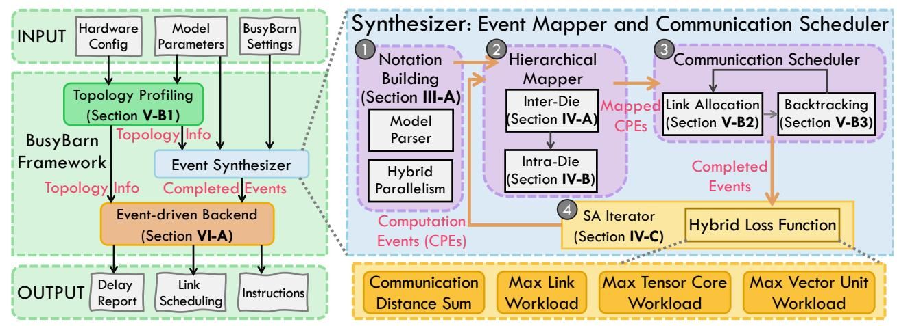

# *B. BusyBarn Overview*

Building on LR notation as the description method, we develop the BusyBarn framework to perform optimized mapping and communication scheduling for LLM inference on waferscale systems. Its overview is shown in Fig. 4.

BusyBarn takes a hardware configuration, model parameters, and framework settings as input. The model parameters are typically specified in a JSON file describing the LLM scale; the hardware configuration describes the topology of the wafer-scale system, including the parameters of each chip and each die together with their computation, communication, and memory resources. The third input consists of userdefined framework settings, including optimization strategies and various hyperparameters.

Following input parsing, the Topology Profiling phase begins by generating an initial computation graph for the inference task based on the LLM scale and the hardware configuration. It then selects a general communication strategy to identify the shortest pairwise paths between all nodes. As detailed in Section V-B1, this profiling data guides the subsequent mapping and communication scheduling step.

The Event Synthesizer then turns notations into mapped, scheduled events, generating a fully scheduled event set for an LLM on the target platform. First, Notation Building (Section III-A) employs LR notation to construct the unallocated computation events for the target LLM inference task. This process derives the required data slices from the hybrid parallelism configuration and establishes the mapping from modellayer functions to executable hardware operators. Next, the Hierarchical Mapper (Section IV) assigns each computation event to a specific hardware execution unit at both the die level (Section IV-A) and the core level (Section IV-B) with lower search complexity. After mapping the computation events, the corresponding communication events are derived from the data relationships among operators. The Communication Scheduler (Section V) generates these communication events based on data dependencies and the topology profiling produced in the third step. The scheduler then allocates links for each communication task using the BALD algorithm with backtracking (Sections V-B2 and V-B3) to achieve balanced load distribution. These three components iteratively refine the results against a lightweight multi-loss function (Section IV-B1) until a high-quality solution is reached within the time budget.

Finally, the generated event set is passed to an event-driven backend (Section VI-A) with computation and communication

Fig. 4: BusyBarn Framework.

events, producing performance metrics such as latency and throughput. BusyBarn is designed to be topology-agnostic and fault-tolerant: its stages operate independently of any specific hardware topology, supporting diverse wafer-scale systems. Overall, BusyBarn offers a flexible and efficient solution for LLM inference with built-in fault tolerance.

#### IV. HIERARCHICAL MAPPING

Due to the massive number of operators in LLMs, mapping thousands of operators onto hundreds of cores in a wafer-scale system is an NP-hard problem that is extremely challenging to optimize. To address this, we propose a hierarchical mapping strategy that partitions dies into groups, applying PP across groups and other hybrid parallelism within each group. This split is inspired by the higher communication ratio of TP and CP relative to PP [41]. Within each die group, we jointly apply a hybrid parallelism strategy combining SP, CP, and TP, while across groups we perform PP mapping. This decomposition significantly reduces the optimization complexity.

