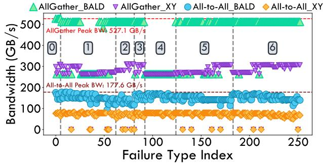
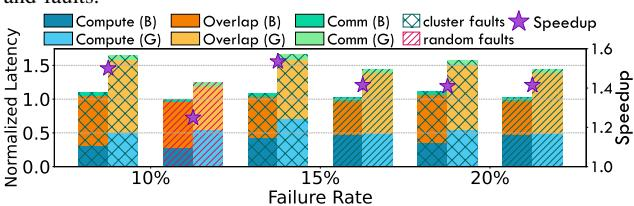
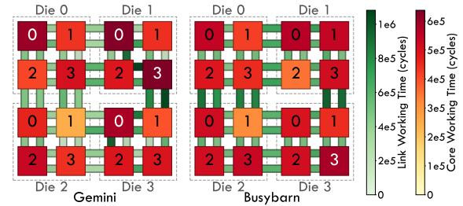
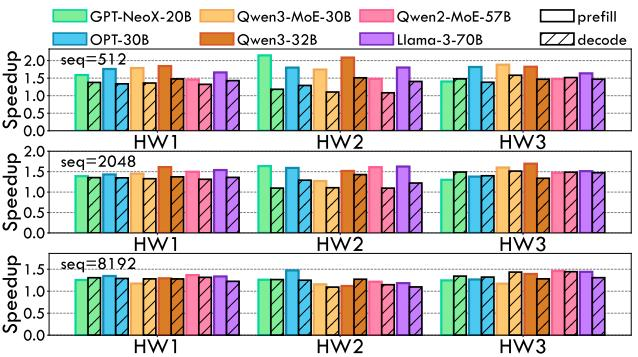

# B. Communication Experiments

Because the BALD algorithm targets point-to-point and concurrent multicast communication, it is natural to apply it to All-Gather and All-to-All collectives. These collectives are not only among the most commonly used in LLM parallelism, but they also exhibit the multiple point-to-point and multicast patterns that BALD is designed to handle. We therefore evaluate BALD on All-Gather and All-to-All communication under varying message sizes and fault scenarios.

1) Communication Synthetic Study: We evaluate the effective bandwidth of All-Gather and All-to-All on a  $5\times5$  mesh with no faults and with one failed link as Fig. 8. A failed link denotes a broken bidirectional link between two nodes; a failed node denotes a broken node together with all links incident to it. The link bandwidth is set to 256 GB/s and the message size is swept from 1 KB to 16 GB in  $4\times$  increments. Effective bandwidth is computed as the total data size divided by the total completion time.

For All-Gather, we adopt three representative and widely used baselines: Hierarchical Ring [34], [61], MultiTree [26], and TACOS [70]. For fairness, we extract the scheduled steps from MultiTree and TACOS and model the total time with an alpha-beta model [67]. As the message size increases, All-Gather bandwidth gradually saturates around a 256 KB mes-

Fig. 9: Comparison of BALD and Baseline XY Routing Algorithm. The grey numbers indicate the fault types of all one node, one link, two nodes, and two links scenarios.

sage size. BALD achieves the same peak effective bandwidth as TACOS (533.3 GB/s), outperforming MultiTree by  $1.25\times$ , the XY baseline by  $1.5\times$ , and Hierarchical Ring by nearly  $2\times$ .

For All-to-All, MultiTree is tailored for AllReduce and TACOS is not designed for the complexity of All-to-All; BALD instead demonstrates superior performance. It achieves up to 213.3 GB/s, which is  $2.4\times$  the converged effective bandwidth of the XY baseline under normal conditions, and maintains a  $1.84-2.25\times$  advantage under link faults.

- 2) Communication Fault Sensitivity: To validate the fault resiliency of the BALD algorithm, we conduct experiments on a  $6\times6$  mesh with multiple faults. As shown by the circled numbers in Fig. 9, we select seven fault scenarios spanning 1 failed node, 1 failed link, 2 failed nodes, and 2 failed links. Part  $\boxed{0}$  covers single-node faults at nodes 0, 1, 2, 7, 8, and 14, exhausting the inequivalent one-node fault classes (modulo mesh symmetry). Part | 1 | covers single-link faults at links (0,1), (1,2), (2,3), (7,8), (1,7), (2,8), (8,9), (8,14), and (14,15), again exhausting the inequivalent one-link fault classes. For two failed nodes, Part 2 includes at least one edge node, whereas Part |3| includes none. Part |4| loses one link of a corner node, whereas Part 5 loses one link of an edge node. The two failed links in Part 6 do not belong to any edge node. Together, these cases form a representative set covering the most common fault situations on wafer-scale chips. The effective bandwidth of All-Gather and All-to-All under these scenarios is shown in Fig. 9: BALD delivers 1–1.94× speedup for All-Gather and 1.56–2.55× speedup for All-to-All over XY routing. These results show that BALD effectively tolerates multiple faults while consistently outperforming XY routing.
- 3) Hyperparameters of BALD: In the BALD algorithm, we search different combinations of hyperparameters  $\alpha$ ,  $\beta$ , and  $\gamma$  to balance the load distribution, path length minimization, and fault tolerance. For the collective communication experiments, we set  $\alpha=100$ ,  $\beta=1$ , and  $\gamma=100$  for the first iteration of the BALD algorithm, ensuring the shortest path length is preferred. In the following iterations, we set  $\alpha=1$ ,  $\beta=100$ , and  $\gamma=1$  to balance the workload of each link.

#### C. Mapping Sensitivity

We map a transformer block from OPT-30B [79] onto different die groups to evaluate our proposed mapping method (B) against Gemini [10] (G). We consider two scenarios: mapping across varying die shapes, core shapes and core computation power with different fault configurations. Together, these scenarios demonstrate the effectiveness and flexibility of our mapping method.

For each task, we decompose the execution time into computation-only, communication-only, and computation-communication-overlap phases. Under the dataflow execution paradigm, sliced computation and communication tasks are dispatched as soon as their dependencies and resource availability allow, enabling substantial overlap. In addition, our mapping strategy explicitly balances both computation and communication workloads. Building on this mapping, we apply the BALD algorithm to further optimize communication, shortening the critical path of the computation graph and thereby improving overall inference performance.

- 1) Die Number Sensitivity: For die-group sensitivity, we evaluate eight die-group shapes for mapping a Transformer block to explore intra-group hybrid parallelism, using the configuration in Table I. The latency comparison in Fig. 10a shows that our method reduces end-to-end latency by 1.25-1.75× over Gemini across die-group shapes. Gemini achieves low pure communication time because its optimizer aggressively minimizes hop count, but it ignores compute imbalance, yielding much higher computation time when a few units become heavily loaded. In contrast, our method jointly balances communication distance and workload across units and links, preventing a small set of devices from becoming bottlenecks and achieving lower latency through higher hardware utilization. The die-shape sensitivity also informs the tradeoff between inter-die pipeline parallelism and intra-die hybrid parallelism, which can be further explored by systems such as Alpa [80]. For example, a  $3\times3$  die group achieves the best performance but saves only 21% in latency at  $2.25 \times$  die cost. Overall, BusyBarn delivers flexible, high-quality mappings that yield lower latency and higher utilization.
- 2) Core Shape Sensitivity: We evaluate different core shapes on a single die to test the scalability of our method. The results are shown in Fig. 10b. Across both square and rectangular core arrays with varying core counts, BusyBarn achieves 1.18–1.80× speedup over Gemini.
- 3) Computation Power Sensitivity: For computation-power sensitivity, we test three core compute configurations on a single die with a 4×4 mesh topology, considering one core fault. BusyBarn effectively adapts to different core power configurations and achieves lower latency than Gemini. The configuration is summarized in Table I and the results are shown in Fig. 10c. BusyBarn achieves 1.19–1.31× speedup without faults and 1.24–1.30× speedup with one failed core, both relative to Gemini. With a failed core, Gemini's exposed communication time is relatively larger than BusyBarn's because the XY algorithm cannot schedule a comparably balanced path. Overall, BusyBarn adapts effectively to a range of

(d) A Transformer Block mapping on one die at different defect rates. Fig. 10: Comparison of transformer block mappings under different die-group and power/fault setups. Green parts are exposed computation time, which means computation time without any communication. Blue parts are communication time, indicating time taken to complete the communication among cores while not doing any computation events. Purple parts are time of communication and computation overlapping.

core compute configurations, whereas Gemini is more suitable for high-compute scenarios in which communication latency dominates compute imbalance. These results confirm that our mapping adapts robustly to varying hardware configurations while preserving fault tolerance.

4) Defect Rate Sensitivity: To evaluate defect-rate sensitivity, we test three defect rates: 10%, 15% [23], and 20%—on a single die with a  $20\times20$  mesh topology under both clustered and random fault patterns. The configuration is summarized in Table I and the results are shown in Fig. 10d. BusyBarn achieves a 1.24– $1.53\times$  speedup over Gemini across the various defect rates and fault patterns, demonstrating that it adapts to high-defect, irregular topologies more effectively.

### D. Visualization of Mapping Results

To better illustrate the mapping produced by our method, we visualize the mapping of a transformer block on a  $2\times2$  die

Fig. 11: Workload distribution heatmap of Gemini and Busy-Barn with link fault between Core2 - Die1 and Core0 - Die3.

Fig. 12: End-to-End Latency Comparison Across Six Models.

group (4 cores per die) with a D2D link fault. As shown in Fig. 11, Die1–Core2 loses its connection to Die3–Core0. The heatmap shows that Gemini exhibits poor load balance across both cores and links, leaving a significant portion of time on the critical path of inference. In contrast, BusyBarn adapts effectively to the link failure, achieves better load balance across cores, and significantly reduces pure communication time, yielding much lower latency. This visualization further demonstrates the effectiveness of our method in handling faults and optimizing mapping to reduce latency.

